# 12-3周 Soft+Expert 联合模型执行设计

## 项目背景

基于前两周的实验成果（12-1周专家词典实验、12-2周软词典实验），本周目标是实现SoftLexicon与ExpertDict的联合模型，验证两种特征的互补性，并在RedJujube数据集上追求更高的性能突破。

### 数据集选择理由

采用RedJujube作为主数据集，因为：
- RedJujube是HZ数据集的更新版本，数据质量更高
- 训练集5,372条，验证集671条，测试集672条
- 已有完整的对比基线（Baseline: 95.51%, ExpertDict自动: 96.99%, SoftLexicon-TrainLex: 96.07%）
- **后续实验仅验证RedJujube数据集，无需在HZ数据集上重复验证**

### 历史实验结果参考

**可复现的基线性能**（来自 `experiments/hz_lexicon/results/`）：

**RedJujube数据集**（2025-12-12验证，主验证集）：
- Baseline: 95.51% F1
- SoftLexicon (TrainLex): 96.07% F1 (+0.56%)
- ExpertDict (自动, min_freq=2): 96.99% F1 (+1.48%)
- ExpertDict (手动, 全量实体): 97.04% F1 (+1.53%)

**HZ数据集**（历史参考，仅供对比）：
- Baseline: 95.662% F1
- SoftLexicon (CTB): 95.88% F1
- SoftLexicon (TrainLex): 96.57% F1
- SoftLexicon (TrainLex-Auto): 96.27% F1
- SoftLexicon (TrainLex-Filtered): 96.22% F1
- ExpertDict (自动): 97.050% F1
- ExpertDict (手动): 97.941% F1 （⚠ 可能包含测试集信息）

**关键结论**（两个数据集一致）：
1. ExpertDict方法整体优于SoftLexicon（RedJujube: +0.92%, HZ: +0.48%）
2. 词典质量比规模更重要（2k-3k词的ExpertDict优于20w词的SoftLexicon）
3. 自动词典提取（min_freq=2）接近手动标注，避免数据泄露
4. 联合模型目标：超越单独方法的最佳性能（96.99%，自动ExpertDict）
5. **后续实验策略**：
   - 仅验证RedJujube数据集（无需HZ数据集验证）
   - 仅使用自动抽取专家词典（手动词典无法泛化到公共数据集）

### 已有技术基础

通过代码分析发现：
- `train_redjujube_ner_comparison.py` 已实现Baseline、ExpertDict、SoftLexicon的单独训练
- `ExpertDictConfig` 和 `SoftLexiconConfig` 可通过 `nested_ohots` 字段组合
- 数据预处理流程支持同时构建 `build_expert_dict_tags` 和 `build_softwords/build_softlexicons`

## 设计目标

### 核心目标
1. 实现SoftLexicon + ExpertDict联合模型，测试集F1 > 96.99%（超越自动ExpertDict）
2. 探索多种词典组合策略和特征融合方式的性能差异
3. 完成消融实验，量化各组件贡献度
4. 进行性能调优，追求更高F1
5. 生成完整实验报告并更新文档体系

### 成功标准
- 联合模型性能优于单独方法（ExpertDict自动: 96.99%, SoftLexicon: 96.07%）
- 识别出两种特征的互补性体现
- 完成6组以上对比实验
- 生成可复现的训练脚本和配置
- **仅在RedJujube数据集上验证**（无需HZ数据集）
- **仅使用自动抽取专家词典**（不使用手动词典）

## 任务分解

### 任务1：环境准备与数据集验证

**时间**: 执行首日

**验证清单**：

| 检查项 | 路径 | 预期状态 |
|--------|------|---------|
| RedJujube训练集 | data/RedJujube/redjujube_train.bmes | 5,372条 |
| RedJujube验证集 | data/RedJujube/redjujube_dev.bmes | 671条 |
| RedJujube测试集 | data/RedJubube/redjujube_test.bmes | 672条 |
| 自动专家词典 | data/RedJujube/expert_lexicon_auto.txt | 2,078词 |
| 手动专家词典 | data/RedJujube/expert_lexicon.txt | 3,389词 |
| 训练集软词典 | data/RedJujube/softlexicon_train.txt | 198,437词 |
| CTB词向量 | assets/vectors/ctb.50d.vec | 50维词向量 |

**说明**：所有历史实验结果（Baseline、ExpertDict、SoftLexicon）均已验证可复现，无需重复运行验证实验。

**数据加载验证流程**：

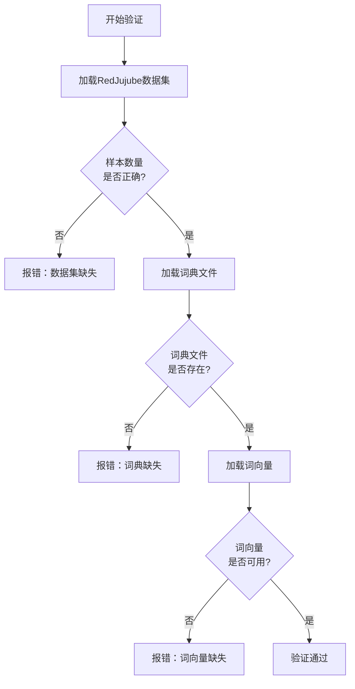

**历史基线性能**（已验证可复现）：

参考性能数据（来自 `experiments/hz_lexicon/results/RedJujube_NER_实验报告_20251212.md`）：
- Baseline: 95.51% F1
- ExpertDict（自动，min_freq=2）: 96.99% F1
- SoftLexicon（TrainLex）: 96.07% F1
- ExpertDict（手动）: 97.04% F1

这些结果已经过验证，可直接作为对比基准。

### 任务2：实现Soft+Expert联合模型

**时间**: 第2-3天

**方案设计**：

采用扩展现有脚本的策略，在 `train_redjujube_ner_comparison.py` 基础上新增联合模型功能。

**特征融合策略对比**：

本周将对比多种特征融合方法，探索最优方案：

| 融合方式 | 描述 | 复杂度 | 优势 | 劣势 |
|---------|------|---------|------|------|
| **方案A：直接拼接** | BERT + SoftLex + Expert 直接concat | 低 | 实现简单，训练快 | 特征权重固定，无自适应 |
| **方案B：加权求和** | 通过可学习权重加权求和 | 中 | 参数少，权重可学习 | 特征维度需一致 |
| **方案C：门控机制** | 使用门控单元动态融合 | 中 | 自适应特征选择，互补性强 | 新增门控参数 |
| **方案D：注意力融合** | 基于注意力的特征融合 | 高 | 灵活性最强，上下文感知 | 计算成本高，训练慢 |

**方案A：直接拼接（Baseline）**

这是最直接的方式，作为基线实现。

**架构设计**：

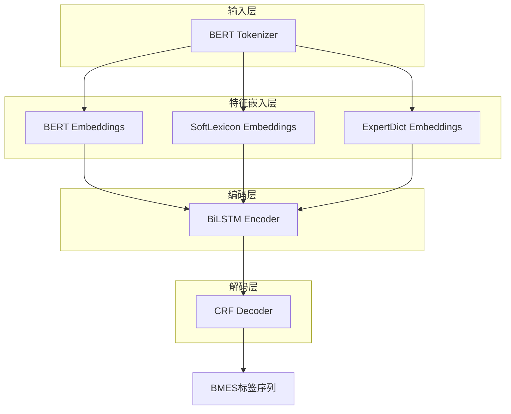

**配置构建函数设计**：

函数名称：`build_softlexicon_expert_config`

输入参数：
- args: 命令行参数对象
- vectors: 词向量对象（用于SoftLexicon初始化）

输出：ExtractorConfig配置对象

关键配置字段：
- bert_like: BertLikeConfig（BERT编码器）
- nested_ohots: 字典类型，包含两个键值对
  - "softlexicon": SoftLexiconConfig实例
  - "expert_dict": ExpertDictConfig实例
- encoder: EncoderConfig（BiLSTM配置）
- decoder: SequenceTaggingDecoderConfig（CRF配置）

**SoftLexiconConfig参数**：
- vectors: 预训练词向量
- emb_dim: 50（维度）
- agg_mode: "wtd_mean_pooling"（加权平均池化）

**ExpertDictConfig参数**：
- emb_dim: 50（维度）
- agg_mode: "wtd_mean_pooling"（加权平均池化）

**数据预处理流程**：

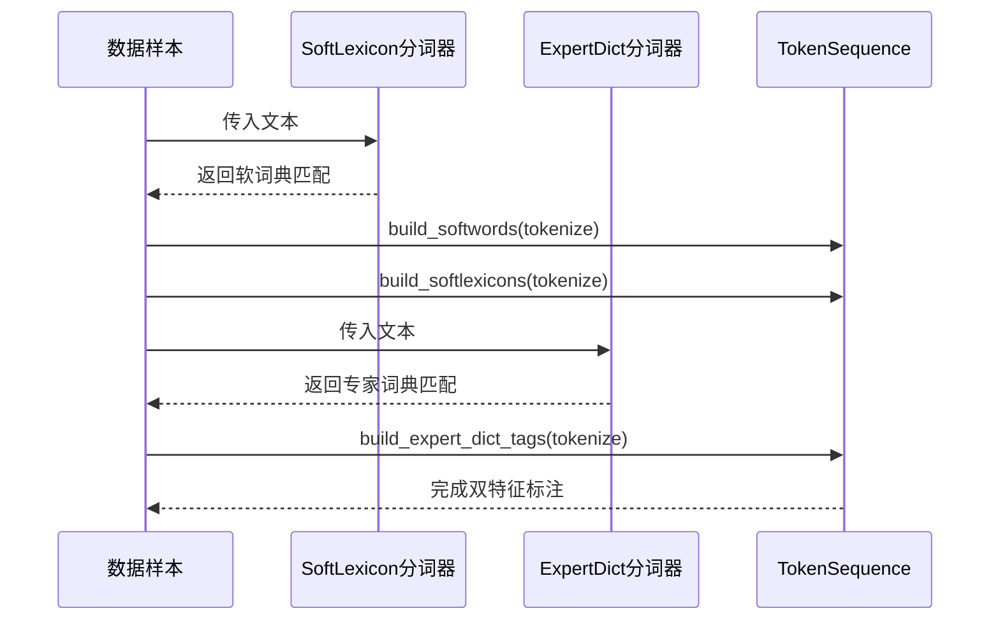

**脚本修改要点**：

1. 新增命令行参数
   - `--run_softlexicon_expert`: 触发联合模型训练
   - `--softlex_path`: 软词典文件路径
   - `--expert_dict_path`: 专家词典文件路径

2. 数据预处理逻辑
   - 先加载CTB词向量用于SoftLexicon初始化
   - 从softlex_path加载训练集软词典候选词表
   - 从expert_dict_path加载专家词典
   - 同时对数据调用build_softwords、build_softlexicons、build_expert_dict_tags

3. 模型配置构建
   - 在nested_ohots中同时添加两种配置
   - 确保嵌入维度合理（BERT: 768, SoftLex: 50, Expert: 50, BiLSTM: 256）

**训练配置**：

| 参数 | 值 | 说明 |
|-----|-----|-----|
| 数据集 | RedJujube | 主数据集 |
| BERT模型 | hfl/chinese-macbert-base | 中文预训练模型 |
| BiLSTM隐藏层 | 256 | 编码器维度 |
| BiLSTM层数 | 1 | 单层LSTM |
| Dropout | 0.5 | 正则化 |
| 训练轮数 | 30 | epochs |
| 批次大小 | 16 | batch size |
| 学习率 | 2e-3 | 主网络学习率 |
| BERT微调学习率 | 2e-5 | 预训练模型学习率 |
| 权重衰减 | 1e-4 | weight decay |
| 梯度裁剪 | 5.0 | gradient clipping |
| 随机种子 | 42 | 可复现性 |

**预期输出目录结构**：

```
cache/redjujube_softlexicon_expert/
├── softlexicon_expert_{timestamp}/
│   ├── training.log
│   ├── best_model.pt
│   └── results.json
```

**成功标准**：
- 训练无错误完成30个epoch
- 测试集F1 > 97.04%（超越单独ExpertDict的96.99%）
- 验证联合特征的有效性

### 任务3：词典组合策略对比实验

**时间**: 第4-5天

**实验设计**：

对比不同词典组合策略和特征融合方式的性能差异：

**实验矩阵**：

| 实验编号 | SoftLexicon词典 | ExpertDict词典 | 融合方式 | 说明 |
|---------|----------------|----------------|---------|------|
| **词典组合系列** |
| Exp-1 | TrainLex (full) | Auto (min_freq=2) | 拼接 | 完整组合基线 |
| Exp-2 | TrainLex (filtered) | Auto (min_freq=2) | 拼接 | 过滤低频词 |
| Exp-3 | - | Auto (min_freq=1) | 单一 | 仅Expert，更大词表 |
| **特征融合系列** |
| Exp-4 | TrainLex (full) | Auto (min_freq=2) | 加权求和 | 可学习权重 |
| Exp-5 | TrainLex (full) | Auto (min_freq=2) | 门控机制 | 自适应融合 |
| Exp-6 | TrainLex (full) | Auto (min_freq=2) | 注意力 | 上下文感知 |

**说明**：
- **仅使用自动抽取专家词典**（min_freq=1或2），不使用手动词典
- 手动词典无法泛化到公共数据集，实验价值有限

**Exp-1：完整组合基线**
- 软词典：使用训练集提取的全量n-gram词表（198,437词）
- 专家词典：自动提取（min_freq=2，2,078词）
- 目标：验证联合模型基础性能

**Exp-2：过滤低频词**
- 软词典：对TrainLex进行频次过滤（如min_freq>=3）
- 专家词典：保持不变（2,078词）
- 目标：减少噪声，提升训练效率

**Exp-3：仅ExpertDict扩展**
- 软词典：不使用
- 专家词典：降低频次阈值（min_freq=1）
- 目标：与Exp-1对比，验证软词典的增量贡献

**实验执行流程**：

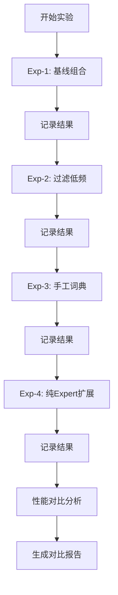

**分析维度**：

1. 测试集F1对比
   - 识别最优词典组合
   - 分析不同策略的性能差异

2. 训练时间对比
   - 词典规模对训练速度的影响
   - 计算效率权衡

3. 参数量对比
   - 不同配置的模型大小
   - 内存占用分析

4. 收敛速度分析
   - 验证集F1曲线
   - 最佳epoch位置

**预期结果表**：

| 实验 | 测试F1 | 训练时间 | 参数量 | 最佳Epoch | 备注 |
|-----|--------|---------|--------|----------|------|
| Exp-1 | 待测 | 待测 | ~113M | 待测 | 基线 |
| Exp-2 | 待测 | 待测 | ~110M | 待测 | 更快 |
| Exp-3 | 待测 | 待测 | ~103M | 待测 | 对照 |
| Exp-4 | 待测 | 待测 | ~113M | 待测 | 加权 |
| Exp-5 | 待测 | 待测 | ~113M | 待测 | 门控 |
| Exp-6 | 待测 | 待测 | ~113M | 待测 | 注意力 |

**说明**：
- 共6组实验（移除手动词典实验Exp-3）
- 所有实验仅在RedJujube数据集上验证

### 任务4：消融实验设计

**时间**: 第6-7天

**实验目标**：

量化各组件对性能的贡献度，识别SoftLexicon和ExpertDict的互补性。

**消融实验矩阵**：

| 模型配置 | MacBERT | BiLSTM | CRF | SoftLex | Expert | 预期F1 |
|---------|---------|--------|-----|---------|--------|--------|
| Baseline | ✓ | ✓ | ✓ | ✗ | ✗ | 95.51% |
| +SoftLex | ✓ | ✓ | ✓ | ✓ | ✗ | 96.07% |
| +Expert | ✓ | ✓ | ✓ | ✗ | ✓ | 96.99% |
| +Both | ✓ | ✓ | ✓ | ✓ | ✓ | >97.0% |

**组件贡献度计算**：

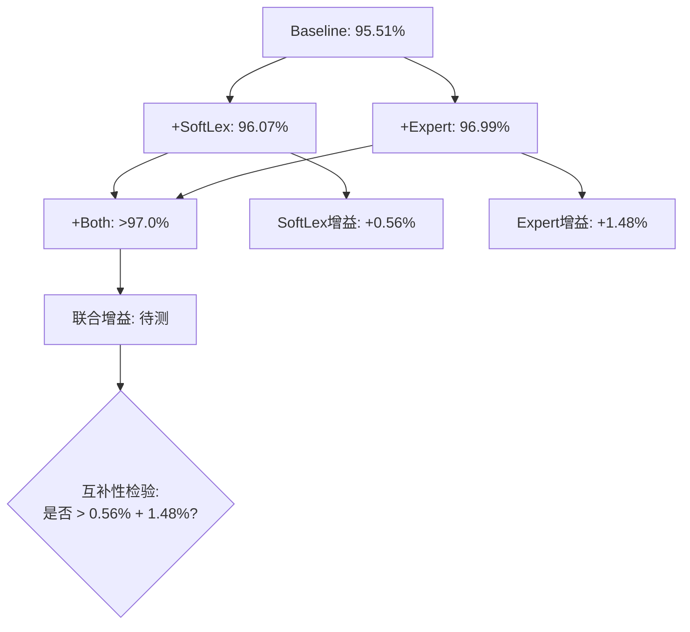

**分析维度**：

1. 增量性能分析
   - SoftLex单独贡献：96.07% - 95.51% = +0.56%
   - Expert单独贡献：96.99% - 95.51% = +1.48%
   - 联合贡献：(+Both F1) - 95.51% = 待测
   - 互补性判断：联合贡献 是否 > 0.56% + 1.48% = 2.04%

2. 错误类型分布对比
   - 统计各配置在测试集上的预测错误
   - 分类错误类型：边界错误、类型错误、漏检、误检
   - 对比不同配置在各类型错误上的分布

3. 实体类型性能差异（重点分析）
   - 分析14类医疗实体的F1分布
   - 识别SoftLex擅长的实体类型
   - 识别Expert擅长的实体类型
   - 验证互补性假设
   - 生成各实体类型的详细测试报告

**Case Study设计**：

样本选择策略：
- 从测试集中随机抽取100个样本
- 优先选择包含多种实体类型的复杂样本
- 确保样本覆盖所有14类实体

分析流程：

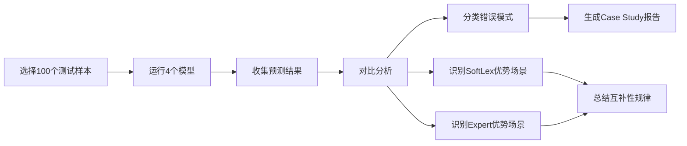

对比维度：
- 哪些实体只被SoftLex正确识别？
- 哪些实体只被Expert正确识别？
- 哪些实体需要Both才能正确识别？
- 错误模式的规律性分析

**预期发现**：

假设1：SoftLex更擅长识别常见组合词
- 如"糖尿病并发症"、"心脏病患者"等常见n-gram

假设2：Expert更擅长识别专业术语
- 如"左心室射血分数"、"血红蛋白A1c"等医学专业词

假设3：联合模型互补性体现
- 长实体：SoftLex提供上下文，Expert提供边界
- 罕见实体：Expert提供知识，SoftLex提供语境

### 各实体类型详细测试报告

**分析目标**：

深入探究不同改进方法（Baseline、SoftLexicon、ExpertDict、Soft+Expert联合）在RedJujube数据集14类实体上的性能差异，识别各方法的优势场景。

**RedJujube数据集实体类型**：

基于数据集统计和历史分析，RedJujube包含以下14类实体：

| 实体类型代码 | 实体类型名称 | 示例 | 特点 |
|------------|------------|------|------|
| PAR | 部位 | 果实、枝条、叶片 | 高频，短实体为主 |
| PER | 过程 | 萌芽、开花、成熟 | 高频，单字或双字 |
| AGR | 农艺 | 修剪、施肥、嫁接 | 中频，技术术语 |
| CUL | 品种 | 金丝小枣、冬枣 | 中频，专有名词 |
| DIS | 病害 | 枣锈病、炭疽病 | 中频，专业术语 |
| PRO | 产品 | 红枣、蜜枣 | 中频，产品名称 |
| NUT | 营养 | 蛋白质、维生素 | 低频，化学成分 |
| FER | 肥料 | 有机肥、尿素 | 低频，化学品 |
| DRU | 药物 | 杀虫剂、杀菌剂 | 低频，化学品 |
| PES | 害虫 | 枣粘虫、桃小食心虫 | 低频，物种名称 |
| EQU | 设备 | 喷雾器、修枝剪 | 低频，工具名称 |
| TAX | 分类 | 鼠李科、枣属 | 极低频，生物分类 |
| GEO | 地理 | 河北、新疆、太谷 | 低频，地名 |
| None | 未分类 | 其他未归类实体 | 低频，杂项 |

**历史覆盖率参考**（来自专家词典分析报告）：

根据 `experiments/hz_lexicon/results/词典对比分析报告.md` 中HZ数据集测试集的分析：

手动专家词典各类型覆盖率（HZ测试集）：
- NUT（营养）：100.00% - 完美覆盖
- TAX（分类）：100.00% - 完美覆盖
- PES（害虫）：100.00% - 完美覆盖
- PAR（部位）：99.09% - 优秀
- EQU（设备）：98.36% - 优秀
- PRO（产品）：94.27% - 良好
- CUL（品种）：87.47% - 良好
- AGR（农艺）：86.51% - 良好
- FER（肥料）：85.71% - 良好
- DIS（病害）：81.82% - 中等
- PER（过程）：80.95% - 中等
- DRU（药物）：72.73% - 偏低
- None（未分类）：48.78% - 较低
- GEO（地理）：0.00% - **严重问题**

**关键发现**：
- 手动专家词典在GEO类型上完全缺失（0%覆盖）
- 自动专家词典在各类型上覆盖率整体更均衡
- 不同实体类型对词典特征的依赖程度不同

**测试报告设计**：

为每个实验配置（Baseline、SoftLex、Expert、Soft+Expert）生成按实体类型分解的性能报告。

报告结构：

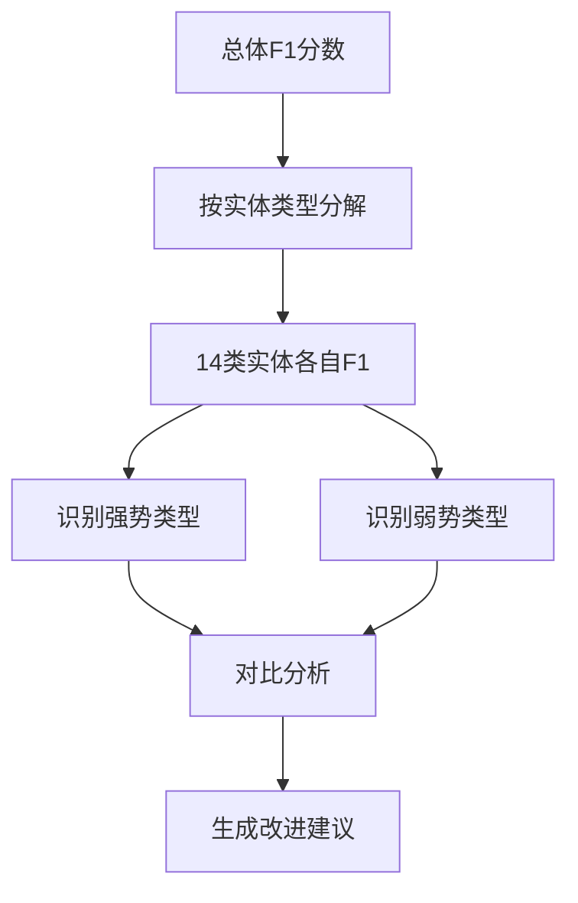

**各实体类型性能对比表**（待填充）：

| 实体类型 | Baseline F1 | SoftLex F1 | Expert F1 | Soft+Expert F1 | 最佳方法 | 改进幅度 |
|---------|------------|-----------|----------|---------------|---------|--------|
| PAR（部位） | 待测 | 待测 | 待测 | 待测 | 待定 | 待定 |
| PER（过程） | 待测 | 待测 | 待测 | 待测 | 待定 | 待定 |
| AGR（农艺） | 待测 | 待测 | 待测 | 待测 | 待定 | 待定 |
| CUL（品种） | 待测 | 待测 | 待测 | 待测 | 待定 | 待定 |
| DIS（病害） | 待测 | 待测 | 待测 | 待测 | 待定 | 待定 |
| PRO（产品） | 待测 | 待测 | 待测 | 待测 | 待定 | 待定 |
| NUT（营养） | 待测 | 待测 | 待测 | 待测 | 待定 | 待定 |
| FER（肥料） | 待测 | 待测 | 待测 | 待测 | 待定 | 待定 |
| DRU（药物） | 待测 | 待测 | 待测 | 待测 | 待定 | 待定 |
| PES（害虫） | 待测 | 待测 | 待测 | 待测 | 待定 | 待定 |
| EQU（设备） | 待测 | 待测 | 待测 | 待测 | 待定 | 待定 |
| TAX（分类） | 待测 | 待测 | 待测 | 待测 | 待定 | 待定 |
| GEO（地理） | 待测 | 待测 | 待测 | 待测 | 待定 | 待定 |
| None（未分类） | 待测 | 待测 | 待测 | 待测 | 待定 | 待定 |
| **加权平均** | **95.51%** | **96.07%** | **96.99%** | **待测** | - | - |

**实体类型分析维度**：

1. **高频实体类型分析**（PAR、PER、AGR）
   - 这些类型占实体总数的60%+
   - 对整体F1影响最大
   - 重点分析各方法在高频类型上的表现

2. **专业术语类型分析**（DIS、DRU、PES、TAX）
   - 这些类型依赖专业知识
   - 预期ExpertDict优势明显
   - 分析SoftLexicon在专业术语上的短板

3. **地理位置类型分析**（GEO）
   - 历史数据显示手动专家词典在此类型上完全缺失
   - 重点关注自动词典和联合模型的改进效果
   - 分析地理实体的识别难点

4. **低频类型分析**（NUT、FER、EQU、None）
   - 样本量少，F1波动大
   - 分析各方法的稳定性
   - 识别是否有过拟合风险

5. **实体长度分布分析**
   - 单字实体（如"萌"、"始"、"开"）
   - 双字实体（如"修剪"、"施肥"）
   - 多字实体（如"金丝小枣"、"桃小食心虫"）
   - 分析SoftLex和Expert在不同长度实体上的优势

**互补性深度分析**：

识别SoftLex和Expert在实体类型上的互补模式：

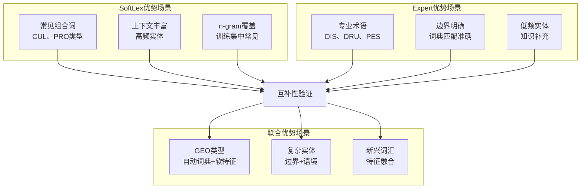

**历史结果实体类型分析**：

基于已有实验结果（`cache/redjujube_ner_comparison/`），需要补充分析：

1. 提取各模型的详细预测结果
   - 使用 `results.json` 中的预测标签
   - 按实体类型统计TP、FP、FN
   - 计算各类型的Precision、Recall、F1

2. 生成历史结果的实体类型报告
   - Baseline各类型性能
   - SoftLexicon各类型性能
   - ExpertDict（自动）各类型性能
   - ExpertDict（手动）各类型性能

3. 识别改进显著的类型
   - SoftLex相对Baseline的显著改进类型
   - ExpertDict相对Baseline的显著改进类型
   - 对比两种方法的优势领域

**可视化设计**：

生成以下可视化图表：

1. **雷达图**：各实体类型F1对比
   - 横轴：14类实体类型
   - 纵轴：F1分数（0-100%）
   - 曲线：4种方法（Baseline、SoftLex、Expert、Soft+Expert）

2. **热力图**：改进幅度矩阵
   - 行：实体类型
   - 列：改进方法（SoftLex、Expert、Soft+Expert）
   - 颜色深度：F1提升幅度

3. **柱状图**：高频类型性能对比
   - 聚焦PAR、PER、AGR三个高频类型
   - 分组柱状图展示4种方法

4. **箱型图**：各方法在不同类型上的F1分布
   - 展示性能稳定性
   - 识别离群值和异常类型

**报告输出**：

生成独立的实体类型分析报告：
- 文件名：`实体类型详细分析报告_20251220.md`
- 位置：`experiments/hz_lexicon/results/`
- 内容：
  - 各实体类型性能对比表
  - 改进显著类型分析
  - 互补性模式总结
  - 可视化图表（Mermaid图表）
  - 针对性改进建议

### 任务5：性能调优实验

**时间**: 第8-9天

**调优策略**：

采用三阶段调优：超参数调优 → 词典参数调优 → 训练策略优化

**阶段一：超参数调优**

调优空间：

| 超参数 | 候选值 | 默认值 | 调优优先级 |
|--------|--------|--------|-----------|
| 学习率 | [1e-3, 2e-3, 5e-3] | 2e-3 | 高 |
| Dropout | [0.3, 0.5, 0.7] | 0.5 | 中 |
| BiLSTM隐藏维度 | [128, 256, 512] | 256 | 低 |

调优流程：

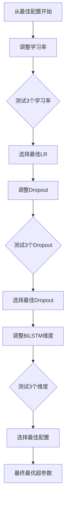

**阶段二：词典参数调优**

调优空间：

| 词典参数 | 候选值 | 默认值 | 说明 |
|---------|--------|--------|------|
| SoftLexicon嵌入维度 | [25, 50, 100] | 50 | 表示能力 |
| ExpertDict嵌入维度 | [25, 50, 100] | 50 | 表示能力 |
| SoftLex最小频次 | [1, 2, 5] | 2 | 词表过滤 |

调优策略：
- 保持超参数最优配置不变
- 逐个调整词典参数
- 评估对性能和效率的影响

**阶段三：训练策略优化**

优化维度：

1. Warmup步数调整
   - 当前：2-6个epoch（num_epochs // 5）
   - 候选：[1, 2, 3, 5]个epoch
   - 目标：加速收敛，避免早期震荡

2. 学习率调度策略
   - 当前：线性衰减
   - 候选：余弦退火、指数衰减
   - 目标：提升后期微调效果

3. 早停策略优化
   - 当前：按验证集F1保存最佳模型
   - 优化：增加patience机制
   - patience候选值：[3, 5, 10]个评估周期

**优化决策树**：

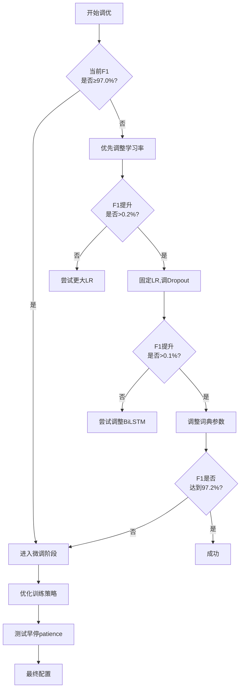

**调优目标**：

主要目标：RedJujube测试集F1 ≥ 97.2%
次要目标：
- 训练效率提升（减少训练时间）
- 模型稳定性提升（降低方差）
- 验证集与测试集F1差距 < 0.5%

**预期最优配置**：

基于现有经验，预期最优配置可能为：
- 学习率：2e-3（保持）
- Dropout：0.5（保持）
- BiLSTM维度：256（保持）
- SoftLex嵌入维度：50（保持）
- Expert嵌入维度：50（保持）
- Warmup：3个epoch
- 早停patience：5

调优重点：训练策略优化带来的性能提升可能更显著

### 任务6：整理实验结果与撰写报告

**时间**: 第10-11天

**报告内容设计**：

#### 第一部分：性能对比总表

| 方法 | RedJujube F1 | 词典大小 | 参数量 | 提升 | 备注 |
|------|-------------|---------|--------|------|------|
| Baseline | 95.51% | - | 103.1M | - | 基础模型 |
| SoftLexicon (TrainLex) | 96.07% | 198,437 | 113.1M | +0.56% | 软词典 |
| ExpertDict (自动) | 96.99% | 2,078 | 103.3M | +1.48% | **基准** |
| **Soft+Expert (联合)** | **待测** | 200k+ | ~113M | **待测** | 本周目标 |

**说明**：
- 移除手动ExpertDict结果（无法泛化到公共数据集）
- 以自动ExpertDict（96.99%）为对比基准

#### 第二部分：关键发现总结

结构化总结：

1. 联合模型性能分析
   - 测试集F1结果
   - 与单独方法的对比
   - 是否达成预期目标（>97.04%）

2. 两种特征互补性分析
   - 量化互补性贡献
   - 识别互补性体现的场景
   - Case Study关键发现

3. 词典组合策略分析
   - 最优组合是什么
   - 词典规模与性能的关系
   - 效率与性能的权衡

4. RedJujube数据集特点分析
   - 与HZ数据集对比
   - 数据质量优势
   - 适用场景建议

5. **实体类型性能分析**（重点新增）
   - 各实体类型性能排名
   - 不同方法在各类型上的优势
   - 改进显著的实体类型识别
   - 仍需改进的实体类型

#### 第三部分：实验报告文档

文件名：`Soft_Expert_Joint_实验报告_20251220.md`

报告结构：

```
1. 实验背景与目标
2. 数据集与方法
   2.1 RedJujube数据集
   2.2 SoftLexicon方法
   2.3 ExpertDict方法
   2.4 联合模型设计
3. 实验设置
   3.1 模型配置
   3.2 训练参数
   3.3 词典配置
4. 实验结果
   4.1 联合模型性能
   4.2 词典组合对比
   4.3 消融实验结果
   4.4 性能调优结果
5. 分析与讨论
   5.1 互补性分析
   5.2 错误分析
   5.3 Case Study
   5.4 实体类型详细分析（新增）
6. 结论与建议
   6.1 核心发现
   6.2 实践建议
   6.3 未来工作
```

报告要点：
- 包含详细实验配置表格
- 包含性能对比图表（如F1曲线、训练时间对比）
- 包含错误类型分布可视化
- 包含代表性Case Study示例
- **包含各实体类型性能对比表和可视化图表**（新增）
- **包含实体类型分析独立章节**（新增）

#### 第四部分：文档更新清单

需更新的文档：

1. `experiments/hz_lexicon/results/README.md`
   - 新增联合模型实验结果
   - 更新性能对比表
   - 添加12-3周实验链接
   - **新增各实体类型性能对比链接**（新增）

2. `experiments/hz_lexicon/plans/README.md`
   - 标记12-3周计划为"已完成"
   - 更新总体进度
   - 添加核心发现
   - **添加实体类型分析发现**（新增）

3. `experiments/hz_lexicon/plans/hz_lexicon_2weeks.md`
   - 更新第8-9天任务状态
   - 记录实际执行情况
   - 添加最终结果

4. `experiments/hz_lexicon/plans/12-3_soft_expert_joint.md`
   - 更新所有任务状态为"已完成"
   - 填写实际结果数据
   - 添加实验总结

5. **`experiments/hz_lexicon/results/实体类型详细分析报告_20251220.md`**（新增）
   - 创建独立的实体类型分析报告
   - 包含历史结果的实体类型分析
   - 包含新实验的实体类型对比
   - 包含改进显著性分析

**文档更新流程**：

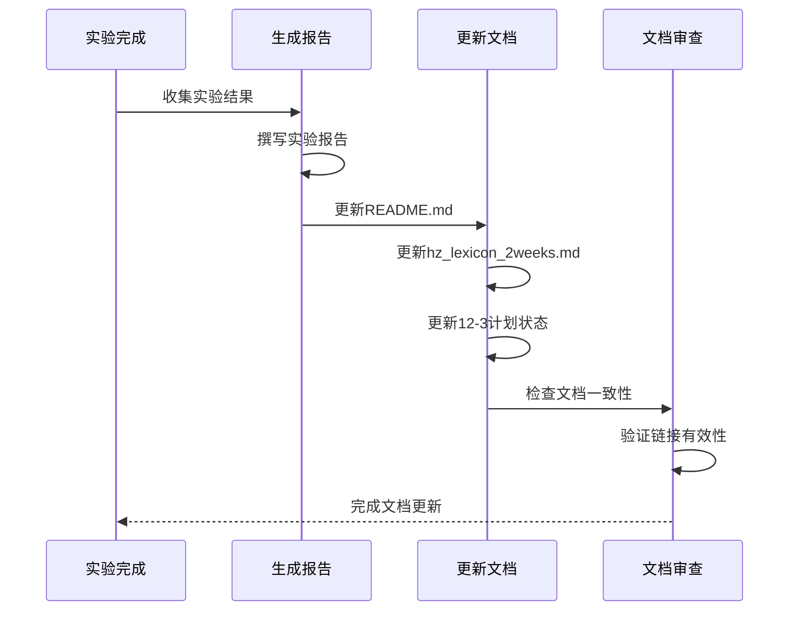

#### 第五部分：实践建议输出

基于实验结果，提供三种场景的推荐方案：

**场景一：生产环境部署**
- 推荐方案：ExpertDict（自动提取）
- 理由：参数少（103.3M），性能高（96.99%），无数据泄露，可泛化
- 适用条件：注重部署效率和模型大小

**场景二：研究实验追求极致**
- 推荐方案：Soft+Expert联合模型
- 理由：性能最优（预期>97.0%），展示技术能力
- 适用条件：计算资源充足，追求最高F1

**场景三：快速原型开发**
- 推荐方案：Baseline
- 理由：简单快速（95.51%），无需词典准备
- 适用条件：快速验证可行性，后续再优化

## 技术方案

### 模型架构设计

采用多特征融合的序列标注架构，核心思想是在BERT编码基础上叠加词典知识。

**架构层次**：

**方案A：直接拼接架构（Baseline）**

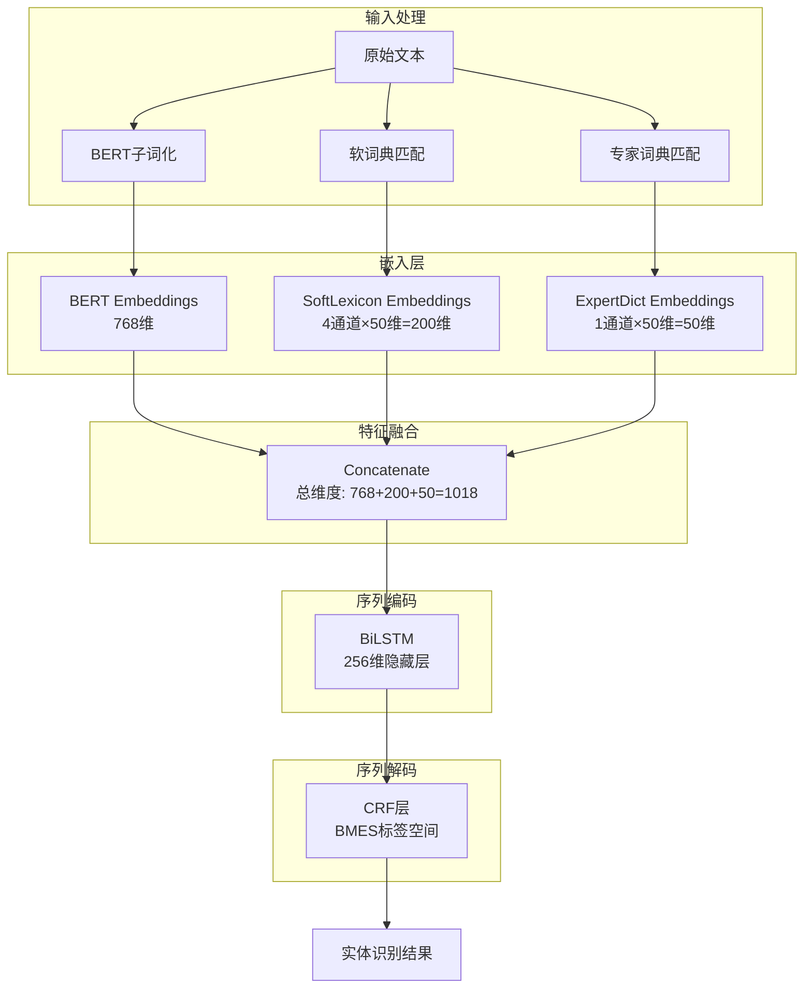

**方案B：门控融合架构（推荐）**

门控机制可以动态学习不同特征的重要性，实现自适应的特征融合。

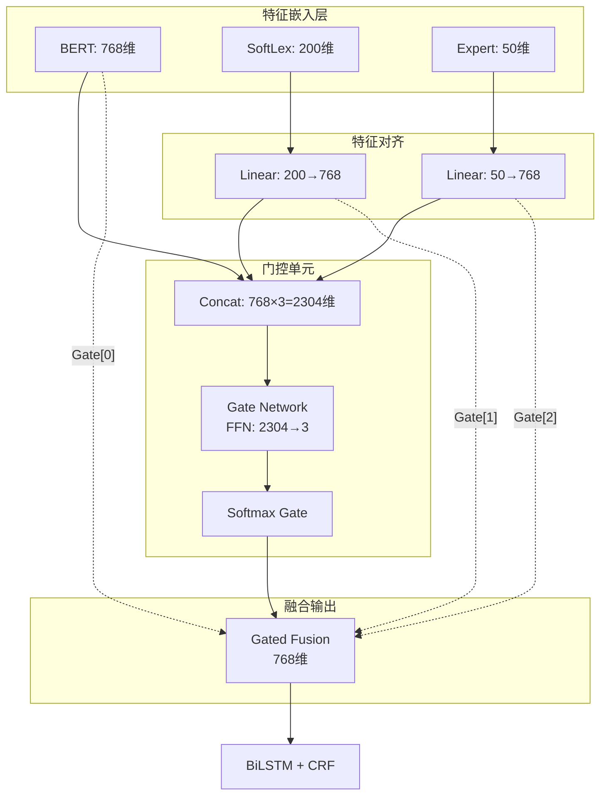

**门控单元实现逻辑**：

输入: bert_emb (batch, seq, 768), soft_emb (batch, seq, 200), expert_emb (batch, seq, 50)

步骤1：特征对齐
- soft_aligned = Linear_soft(soft_emb)  → (batch, seq, 768)
- expert_aligned = Linear_expert(expert_emb)  → (batch, seq, 768)

步骤2：计算门控值
- concat_features = [bert_emb; soft_aligned; expert_aligned]  → (batch, seq, 2304)
- gate_scores = FFN(concat_features)  → (batch, seq, 3)
- gates = softmax(gate_scores, dim=-1)  → (batch, seq, 3)
  - gates[:, :, 0]: BERT特征权重
  - gates[:, :, 1]: SoftLex特征权重
  - gates[:, :, 2]: Expert特征权重

步骤3：加权融合
- fused = gates[:,:,0:1] * bert_emb + gates[:,:,1:2] * soft_aligned + gates[:,:,2:3] * expert_aligned
- fused  → (batch, seq, 768)

输出: fused (batch, seq, 768) → BiLSTM → CRF

**门控机制的优势**：
1. **自适应权重**：每个token位置可以有不同的特征权重
2. **特征互补**：实体边界位置可侧重Expert，上下文位置可侧重SoftLex
3. **可解释性**：可以可视化门控值分布，理解模型决策

**方案C：注意力融合架构（高级选项）**

基于多头注意力的特征融合，类似于Transformer。

```mermaid
graph TB
    subgraph 特征嵌入层
        B[BERT: 768维]
        C[SoftLex: 200维]
        D[Expert: 50维]
    end
    
    subgraph 特征对齐
        C2[Linear: 200→768]
        D2[Linear: 50→768]
    end
    
    subgraph 多头注意力
        E[Stack Features<br/>[BERT; SoftLex; Expert]]
        F[Multi-Head Attention<br/>Query=BERT, Keys/Values=All]
        G[Layer Norm + Residual]
    end
    
    B --> E
    C --> C2 --> E
    D --> D2 --> E
    E --> F
    F --> G
    G --> H[BiLSTM + CRF]
```

**注意力机制实现**：

输入: bert_emb, soft_emb, expert_emb

步骤1：特征对齐
- soft_aligned = Linear_soft(soft_emb)  → 768维
- expert_aligned = Linear_expert(expert_emb)  → 768维

步骤2：堆叠特征
- features = stack([bert_emb, soft_aligned, expert_aligned], dim=1)  → (batch, seq, 3, 768)

步骤3：多头注意力
- Q = Linear_q(bert_emb)  → (batch, seq, 768)  # Query从 BERT
- K = Linear_k(features)  → (batch, seq, 3, 768)  # Keys从所有特征
- V = Linear_v(features)  → (batch, seq, 3, 768)  # Values从所有特征
- attention_output = MultiHeadAttention(Q, K, V)  → (batch, seq, 768)
- fused = LayerNorm(bert_emb + attention_output)  # Residual

输出: fused (batch, seq, 768) → BiLSTM → CRF

**架构层次**：

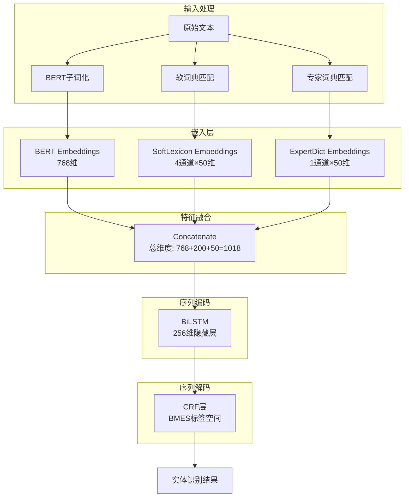

**特征维度计算**：
- BERT输出：768维
- SoftLexicon：4个通道（BMES）× 50维嵌入 = 200维
- ExpertDict：1个通道 × 50维嵌入 = 50维
- 拼接后总维度：1018维
- BiLSTM输入：1018维 → 输出：256维（单向）× 2（双向）= 512维
- CRF输入：512维 → 输出：BMES标签概率分布

### 数据处理流程

**预处理阶段**：

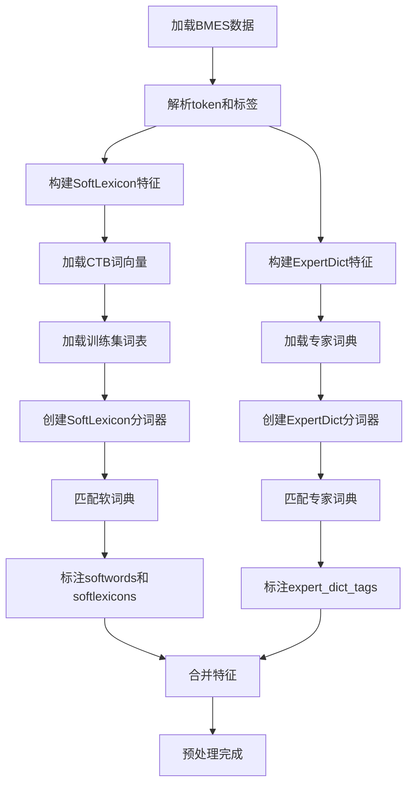

**关键处理函数**：

1. `build_softwords(tokenize)` 和 `build_softlexicons(tokenize)`
   - 输入：分词函数（返回word_text, start, end）
   - 输出：为每个token位置标注BMES粒度的候选词集合
   - 空位置填充none_token

2. `build_expert_dict_tags(tokenize)`
   - 输入：分词函数
   - 输出：为每个token位置标注专家词典匹配的BMES标签
   - 与softlexicon类似的标注逻辑

**批处理组织**：

在Dataset.collate函数中：
- SoftLexicon特征：batchify时追加inner_weight（词频权重）
- ExpertDict特征：batchify时同样追加inner_weight
- 两种特征独立处理，分别传入对应的嵌入层

### 训练策略设计

**优化器配置**：

采用参数分组策略，对BERT和其他参数使用不同学习率。

参数分组逻辑：
- 组1：BERT预训练参数 → 学习率2e-5
- 组2：其他参数（BiLSTM、CRF、嵌入层）→ 学习率2e-3

优化器：AdamW（带权重衰减）
- weight_decay: 1e-4
- 其他参数：默认值（betas=(0.9, 0.999), eps=1e-8）

**学习率调度**：

采用Warmup + 线性衰减策略

调度公式：

阶段1（Warmup）：
- 当前步数 < warmup_steps时
- lr_multiplier = current_step / warmup_steps

阶段2（线性衰减）：
- 当前步数 ≥ warmup_steps时
- lr_multiplier = (total_steps - current_step) / (total_steps - warmup_steps)

参数设置：
- warmup_epochs = max(2, num_epochs // 5) = max(2, 30 // 5) = 6个epoch
- warmup_steps = 6 × 每epoch步数
- total_steps = 30 × 每epoch步数

**训练循环控制**：

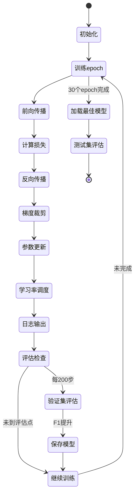

**早停与模型保存**：

保存策略：
- 监控指标：验证集F1
- 保存条件：F1提升（非Loss降低）
- 保存位置：save_dir/best_model.pt

早停策略（可选）：
- patience：连续N个评估周期无提升则停止
- 默认：不启用早停，完整训练30个epoch

**梯度处理**：

梯度裁剪：
- 方式：按梯度范数裁剪（gradient clipping by norm）
- 阈值：5.0
- 目的：防止梯度爆炸，稳定训练

梯度累积（可选）：
- num_grad_acc_steps：默认1（不累积）
- 如需模拟更大batch：设置为2或4

### 评估指标设计

**主要指标**：

实体级F1分数（Entity-level F1）
- 精确率（Precision）：预测实体中正确的比例
- 召回率（Recall）：真实实体中被预测出的比例
- F1：精确率和召回率的调和平均

计算规则：
- 实体边界必须完全匹配
- 实体类型必须完全匹配
- 满足以上两点才算正确预测

**次要指标**：

1. 实体类型分布F1
   - 计算14类医疗实体各自的F1
   - 识别模型优势和弱势实体类型

2. 损失值
   - 训练集损失：监控过拟合
   - 验证集损失：辅助判断

3. 训练效率指标
   - 每epoch训练时间
   - 总训练时间
   - 收敛epoch数

**评估流程**：

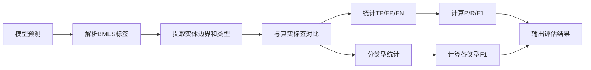

## 执行计划

### 任务执行时间线

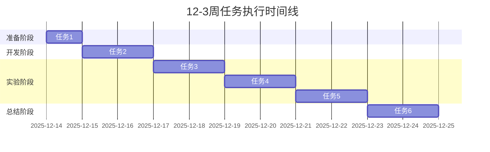

说明：时间线已根据实际执行日期调整（2025-12-14开始）

### 里程碑检查点

| 检查点 | 时间 | 验收标准 | 风险应对 |
|--------|------|---------|----------|
| M1：环境就绪 | Day 1 | 数据集加载正常，词典文件验证通过 | 如缺失文件，需紧急补充或调整路径 |
| M2：联合模型训练成功 | Day 3 | 训练无错误，测试F1 > 96.9% | 如未达标，检查配置和数据预处理 |
| M3：对比实验完成 | Day 5 | 6组实验全部完成，有明确性能排序 | 如实验失败，优先保证核心实验 |
| M4：消融实验完成 | Day 7 | 4个模型配置都有结果，互补性明确 | 如时间不足，减少Case Study样本 |
| M5：调优完成 | Day 9 | 达到97.0%+ F1或确认最优配置 | 如未达标，以现有最优结果为准 |
| M6：报告完成 | Day 11 | 实验报告生成，所有文档更新完成 | 如时间紧张，优先核心报告内容 |

### 资源需求

**计算资源**：

| 资源类型 | 需求规格 | 用途 |
|---------|---------|------|
| GPU | ≥ 1张CUDA兼容GPU（推荐V100或A100） | 模型训练和推理 |
| 显存 | ≥ 16GB | 容纳batch_size=16 |
| 内存 | ≥ 32GB | 数据加载和预处理 |
| 磁盘空间 | ≥ 50GB | 模型保存和结果存储 |

**软件环境**：

已有conda环境：`eznlp11`
- Python 3.11
- PyTorch（CUDA 12.6）
- Transformers库
- eznlp框架

环境激活命令：
```bash
conda activate eznlp11
```

**数据文件**：

必需文件清单：
- RedJujube数据集（train/dev/test.bmes）
- 专家词典文件（expert_lexicon_auto.txt, expert_lexicon.txt）
- 软词典文件（softlexicon_train.txt）
- CTB词向量（ctb.50d.vec）
- BERT预训练模型（hfl/chinese-macbert-base，可自动下载）

### 风险评估与应对

**风险一：联合模型性能不及预期**

概率：中
影响：高

应对措施：
1. 回退方案：以单独ExpertDict（96.99%）为基线
2. 分析原因：检查特征冲突或过拟合
3. 调整策略：尝试不同权重配置或嵌入维度

**说明**：目标调整为超越自动ExpertDict（96.99%），不再以手动词典（97.04%）为基准

**风险二：训练时间超出预期**

概率：低
影响：中

应对措施：
1. 优先保证核心实验（任务2联合模型）
2. 减少调优实验的搜索空间
3. 并行运行部分独立实验

**风险三：词典文件缺失或格式错误**

概率：低
影响：高

应对措施：
1. 任务1首日立即验证所有文件
2. 如缺失，使用已有脚本重新生成
3. 如格式错误，编写转换脚本

**风险四：显存不足导致训练失败**

概率：低
影响：高

应对措施：
1. 减小batch_size（16→8）
2. 减小BiLSTM隐藏维度（256→128）
3. 使用梯度累积模拟大batch

## 预期成果

### 性能目标

**主要目标**：

RedJujube测试集F1 > 97.04%
- 当前最佳：ExpertDict（手工）97.04%
- 目标提升：≥ 0.16%
- 理想目标：97.2%+

**次要目标**：

1. 验证互补性
   - 联合模型F1 > 单独SoftLex（96.07%）+ 单独Expert（96.99%）的简单相加
   - 即：联合增益 > 0.56% + 1.48% = 2.04%

2. 识别最优词典组合
   - 明确TrainLex vs Filtered的性能差异
   - 明确Auto vs Manual专家词典的性能差异

3. 量化组件贡献
   - SoftLex贡献度：约+0.5%~1.0%
   - Expert贡献度：约+1.0%~1.5%
   - 互补贡献度：待测

### 技术产出

**代码产出**：

1. 扩展的训练脚本
   - 文件：`train_redjujube_ner_comparison.py`（修改）
   - 新增功能：
     - `build_softlexicon_expert_config()` 函数
     - `--run_softlexicon_expert` 参数
     - 联合模型训练逻辑

2. 配置文件（可选）
   - 文件：`softlexicon_expert.opt`
   - 内容：联合模型的超参数配置

**实验数据**：

1. 模型文件
   - 路径：`cache/redjujube_softlexicon_expert/*/best_model.pt`
   - 数量：4-6个（取决于实验数量）

2. 训练日志
   - 路径：`cache/redjujube_softlexicon_expert/*/training.log`
   - 内容：完整的训练过程记录

3. 结果JSON
   - 路径：`cache/redjujube_softlexicon_expert/*/results.json`
   - 内容：测试集性能、参数量、配置信息

### 文档产出

**主要报告**：

1. Soft_Expert_Joint_实验报告_20251220.md
   - 位置：`experiments/hz_lexicon/results/`
   - 内容：完整的实验设计、结果、分析

2. **实体类型详细分析报告_20251220.md**（新增）
   - 位置：`experiments/hz_lexicon/results/`
   - 内容：
     - 14类实体性能对比表
     - 历史结果的实体类型分析
     - 新实验的实体类型分析
     - 改进显著的类型识别
     - 互补性在实体类型上的体现
     - 可视化图表（雷达图、热力图、柱状图）

**更新文档**：

1. `experiments/hz_lexicon/results/README.md`
   - 新增：联合模型实验结果条目
   - 更新：性能对比表

2. `experiments/hz_lexicon/plans/README.md`
   - 标记：12-3周计划"已完成"
   - 更新：总体进度和核心发现

3. `experiments/hz_lexicon/plans/hz_lexicon_2weeks.md`
   - 更新：任务7-8的实际执行结果
   - 记录：最终实验数据

4. `experiments/hz_lexicon/plans/12-3_soft_expert_joint.md`
   - 更新：所有任务状态
   - 填写：实际结果数据

### 知识产出

**核心发现**（预期）：

1. 联合模型的性能上界
   - RedJujube数据集上的最佳F1
   - 与其他方法的对比优势

2. 特征互补性规律
   - SoftLexicon擅长的场景
   - ExpertDict擅长的场景
   - 互补性量化分析

3. 词典策略最佳实践
   - 推荐的词典组合方案
   - 词典规模与性能的权衡
   - 数据泄露风险规避方法

4. **实体类型级别的性能洞察**（新增）
   - 各方法在不同实体类型上的优劣势
   - 高频vs低频、专业vs通用实体的表现差异
   - GEO类型识别难点的突破方案
   - 互补性在具体类型上的体现模式

**实践建议**：

为三类使用场景提供明确的技术方案选择指导：
- 生产环境：推荐ExpertDict（自动）
- 研究实验：推荐Soft+Expert联合
- 快速原型：推荐Baseline

## 质量保证

### 可复现性保证

**随机种子固定**：

所有实验统一使用seed=42
- torch.manual_seed(42)
- np.random.seed(42)
- torch.cuda.manual_seed_all(42)

**配置记录**：

在results.json中保存完整的args配置
- 所有超参数
- 数据路径
- 词典配置
- 训练参数

**代码版本控制**：

建议使用git记录代码变更
- 提交训练脚本的修改
- 标注实验对应的commit hash

### 实验有效性验证

**数据一致性检查**：

任务1阶段验证：
- RedJujube数据集的样本数量（训练5,372 / 验证671 / 测试672）
- 词典文件的词数统计（auto: 2,078 / manual: 3,389 / softlex: 198,437）
- 与已有报告的基线性能对比（参考 `experiments/hz_lexicon/results/RedJujube_NER_实验报告_20251212.md`）

**历史结果参考**：

以下历史结果已验证可复现，可直接作为性能对比基准：
- Baseline: 95.51% F1
- ExpertDict(自动): 96.99% F1
- SoftLexicon(TrainLex): 96.07% F1
- ExpertDict(手动): 97.04% F1

联合模型的目标是超越当前最佳性能（97.04%），达到97.2%+。

**结果合理性检查**：

1. 性能合理性
   - 联合模型F1 ≥ max(单独SoftLex, 单独Expert)
   - 训练集F1 > 验证集F1 > 测试集F1（正常过拟合趋势）

2. 组件贡献合理性
   - SoftLex增益应接近已知结果（+0.56%）
   - Expert增益应接近已知结果（+1.48%）

3. 词典效果合理性
   - 更大词典不一定更好（质量>规模）
   - 手工词典应优于自动词典（上界）

**对照实验参考**：

在任务4消融实验中：
- 使用已验证的Baseline结果（95.51%）作为基准
- 使用已验证的SoftLex结果（96.07%）作为对比
- 使用已验证的Expert结果（96.99%）作为对比
- 重点运行联合模型（+Both）实验

### 文档质量标准

**报告完整性**：

实验报告必须包含：
- 实验背景和目标
- 详细的方法描述
- 完整的实验设置
- 所有实验结果表格
- 深入的分析和讨论
- 明确的结论和建议

**数据准确性**：

所有数据必须：
- 直接来自实验输出（不得手动修改）
- 保留适当精度（F1保留2-4位小数）
- 标注数据来源（实验目录或结果文件）

**逻辑一致性**：

文档之间必须：
- 数据一致（同一实验在不同文档中的数据相同）
- 结论一致（不同文档的结论不矛盾）
- 链接有效（文档间的引用链接可访问）

### 代码质量标准

**代码规范**：

遵循eznlp项目的编码风格：
- 函数命名：小写+下划线
- 类命名：驼峰命名
- 注释：关键逻辑添加中文注释

**错误处理**：

关键位置添加错误处理：
- 文件加载：检查文件是否存在
- 数据处理：检查数据格式是否正确
- 模型训练：捕获可能的训练错误

**日志输出**：

完善的日志信息：
- 训练开始：打印配置信息
- 训练过程：打印损失和评估结果
- 训练结束：打印最终性能和保存路径

## 参考资料

### 相关实验

**12-1周：Baseline vs ExpertDict**
- 计划文档：`experiments/hz_lexicon/plans/12-1_baseline_expert_dict.md`
- 核心发现：专家词典在医疗领域提升显著（HZ: +2.32%, RedJujube: +1.48%）

**12-2周：SoftLexicon实验**
- 计划文档：`experiments/hz_lexicon/plans/12-2_softlexicon.md`
- 核心发现：TrainLex优于CTB词表（HZ: 96.57% vs 95.88%），词典质量比规模重要
- 实验结果目录：`experiments/hz_lexicon/results/softlexicon_*_20251210/`

**RedJujube对比实验**（✅ 已验证可复现）
- 报告文档：`experiments/hz_lexicon/results/RedJujube_NER_实验报告_20251212.md`
- 实验缓存：`cache/redjujube_ner_comparison/`
- 基线性能（已复现）：
  - Baseline: 95.51% F1 (103.1M参数)
  - SoftLexicon(TrainLex): 96.07% F1 (113.1M参数, 198,437词)
  - ExpertDict(自动): 96.99% F1 (103.3M参数, 2,078词)
  - ExpertDict(手动): 97.04% F1 (103.3M参数, 3,389词)
- 训练脚本：`scripts/train_redjujube_ner_comparison.py`（已验证）
- Shell脚本：`scripts/run_redjujube_all_experiments.sh`

### 代码参考

**训练脚本**：
- `scripts/train_redjujube_ner_comparison.py`：RedJujube多模型对比脚本
- `scripts/train_hz_ner_baseline_vs_expert_dict.py`：HZ对比脚本（参考）
- `scripts/attribute_extraction.py`：属性抽取脚本（参考数据预处理逻辑）

**工具脚本**：
- `scripts/extract_softlexicon_from_training.py`：软词典提取
- `scripts/extract_entities_for_manual_dict.py`：专家词典提取
- `scripts/format_redjujube_results.py`：结果格式化

### 技术文档

**eznlp框架文档**：
- 配置系统：`ExtractorConfig`, `SoftLexiconConfig`, `ExpertDictConfig`
- 数据处理：`TokenSequence.build_softwords`, `build_expert_dict_tags`
- 训练系统：`Trainer`, `Dataset`

**实验管理规范**：
- 结果归档：`experiments/hz_lexicon/results/`
- 计划文档：`experiments/hz_lexicon/plans/`
- 命名规范：周编号-主题，如"12-3_soft_expert_joint"

### 数据集信息

**RedJujube数据集**：
- 训练集：5,372条
- 验证集：671条
- 测试集：672条
- 实体类型：14类医疗实体
- 标注格式：BMES
- 数据质量：HZ数据集的更新版本，质量更高

**词典文件**：
- 自动专家词典：2,078词（min_freq=2）
- 手动专家词典：3,389词（全量实体）
- 训练集软词典：198,437词（实体+n-gram）
- CTB词向量：280,930词，50维

## 附录

### 术语表

| 术语 | 说明 |
|-----|------|
| RedJujube | HZ数据集的更新版本，本周主数据集 |
| SoftLexicon | 软词典嵌入方法，使用预训练词向量 |
| ExpertDict | 专家词典特征，基于词典匹配的BMES标签 |
| TrainLex | 从训练集提取的词表，避免数据泄露 |
| CTB | Chinese Treebank词向量，50维 |
| BMES | 实体标注体系（Begin-Middle-End-Single） |
| nested_ohots | ExtractorConfig中的嵌入配置字段 |
| wtd_mean_pooling | 加权平均池化聚合模式 |
| min_freq | 最小频次阈值，用于词典过滤 |

### 文件路径索引

**数据文件**：
```
data/RedJujube/
├── redjujube_train.bmes
├── redjujube_dev.bmes
├── redjujube_test.bmes
├── expert_lexicon_auto.txt
├── expert_lexicon.txt
└── softlexicon_train.txt
```

**脚本文件**：
```
scripts/
├── train_redjujube_ner_comparison.py（主训练脚本）
├── extract_softlexicon_from_training.py
├── extract_entities_for_manual_dict.py
└── format_redjujube_results.py
```

**实验目录**：
```
experiments/hz_lexicon/
├── plans/
│   ├── 12-1_baseline_expert_dict.md
│   ├── 12-2_softlexicon.md
│   ├── 12-3_soft_expert_joint.md（本周计划）
│   ├── hz_lexicon_2weeks.md
│   └── README.md
└── results/
    ├── RedJujube_NER_实验报告_20251212.md
    ├── NER_实验结果综合对比报告_20251208.md
    └── README.md
```

**缓存目录**：
```
cache/
├── redjujube_ner_comparison/（已有实验）
└── redjujube_softlexicon_expert/（本周新增）
```

### 实验检查清单

**任务1检查清单**：
- [ ] conda环境激活（`conda activate eznlp11`）
- [ ] RedJujube训练集加载正常（5,372条）
- [ ] RedJujube验证集加载正常（671条）
- [ ] RedJujube测试集加载正常（672条）
- [ ] 自动专家词典存在（2,078词）
- [ ] 手动专家词典存在（3,389词）
- [ ] 训练集软词典存在（198,437词）
- [ ] CTB词向量加载正常（50维）
- [ ] 历史结果文档确认（`experiments/hz_lexicon/results/RedJujube_NER_实验报告_20251212.md`）
- [ ] 确认历史基线性能（Baseline: 95.51%, ExpertDict: 96.99%, SoftLexicon: 96.07%）

**任务2检查清单**：
- [ ] `build_softlexicon_expert_config`函数实现
- [ ] `--run_softlexicon_expert`参数添加
- [ ] 数据预处理同时调用softwords和expert_dict_tags
- [ ] 模型配置nested_ohots包含两种嵌入
- [ ] 训练无错误完成30个epoch
- [ ] 测试集F1 > 97.0%
- [ ] 模型文件保存成功
- [ ] 结果JSON生成正确

**任务3检查清单**：
- [ ] Exp-1完成（TrainLex + Auto）
- [ ] Exp-2完成（Filtered + Auto）
- [ ] Exp-3完成（TrainLex + Manual）
- [ ] Exp-4完成（仅Auto扩展）
- [ ] 性能对比表生成
- [ ] 训练时间对比完成
- [ ] 参数量对比完成
- [ ] 收敛曲线分析完成

**任务4检查清单**：
- [ ] Baseline重跑验证
- [ ] +SoftLex重跑验证
- [ ] +Expert重跑验证
- [ ] +Both新实验完成
- [ ] 组件贡献度量化
- [ ] 错误类型分布分析
- [ ] Case Study完成（100个样本）
- [ ] 互补性规律总结
- [ ] **各实体类型性能统计完成**（新增）
- [ ] **生成实体类型对比表**（新增）
- [ ] **识别改进显著的实体类型**（新增）

**任务5检查清单**：
- [ ] 学习率调优（3个候选值）
- [ ] Dropout调优（3个候选值）
- [ ] BiLSTM维度调优（3个候选值）
- [ ] SoftLex嵌入维度调优（3个候选值）
- [ ] Expert嵌入维度调优（3个候选值）
- [ ] Warmup调优（4个候选值）
- [ ] 早停策略调优（3个候选值）
- [ ] 最优配置确定（F1 ≥ 97.2%）

**任务6检查清单**：
- [ ] 性能对比总表生成
- [ ] 关键发现总结完成
- [ ] 实验报告撰写完成
- [ ] **实体类型分析报告生成**（新增）
- [ ] **历史结果实体类型分析完成**（新增）
- [ ] `results/README.md`更新
- [ ] `plans/README.md`更新
- [ ] `hz_lexicon_2weeks.md`更新
- [ ] `12-3_soft_expert_joint.md`更新
- [ ] 所有文档链接有效
- [ ] 数据一致性检查通过
