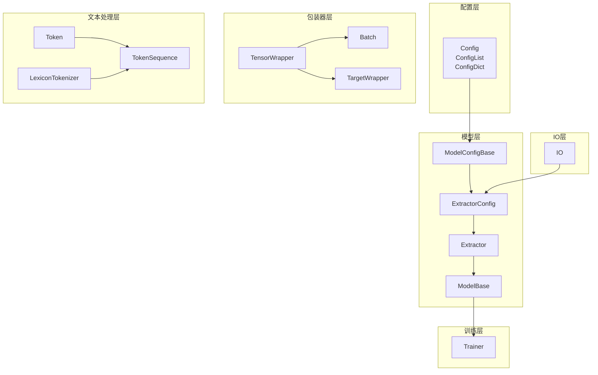
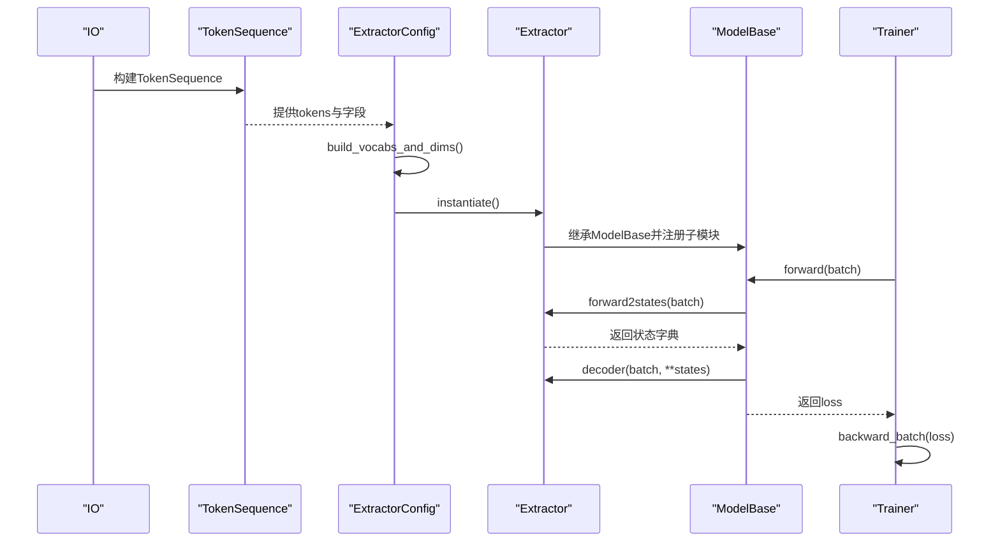
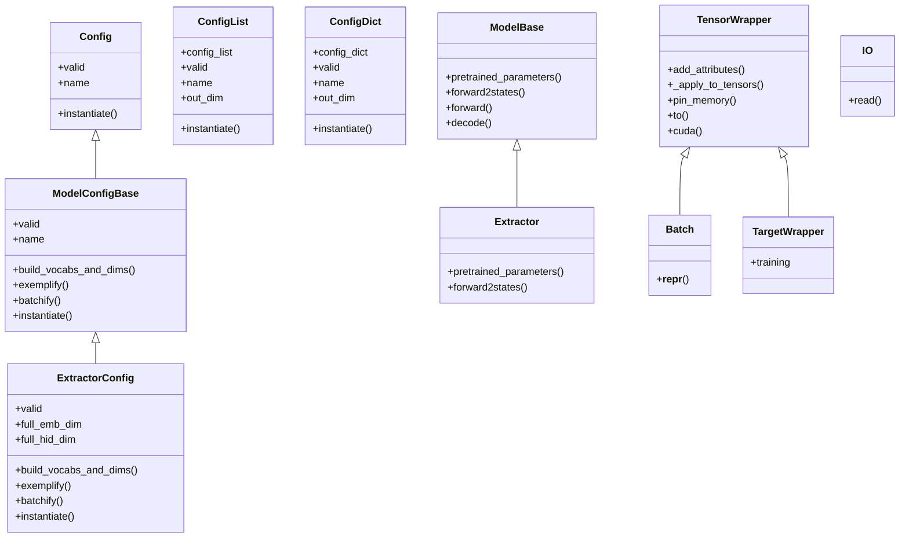

# API参考

<cite>
**本文引用的文件**
- [eznlp/config.py](file://eznlp/config.py)
- [eznlp/wrapper.py](file://eznlp/wrapper.py)
- [eznlp/io/base.py](file://eznlp/io/base.py)
- [eznlp/model/model/extractor.py](file://eznlp/model/model/extractor.py)
- [eznlp/model/model/base.py](file://eznlp/model/model/base.py)
- [eznlp/training/trainer.py](file://eznlp/training/trainer.py)
- [eznlp/token.py](file://eznlp/token.py)
</cite>

## 目录
1. [简介](#简介)
2. [项目结构](#项目结构)
3. [核心组件](#核心组件)
4. [架构总览](#架构总览)
5. [详细组件分析](#详细组件分析)
6. [依赖分析](#依赖分析)
7. [性能考虑](#性能考虑)
8. [故障排查指南](#故障排查指南)
9. [结论](#结论)

## 简介
本文件为eznlp项目的API参考文档，覆盖以下模块的公共接口：
- 配置类：config.py中的Config、ConfigList、ConfigDict
- 包装器：wrapper.py中的TensorWrapper、Batch、TargetWrapper
- 数据处理器：io/base.py中的IO接口
- 模型构建器：model/model/extractor.py中的ExtractorConfig与Extractor
- 训练器：training/trainer.py中的Trainer
- 文本分词与序列：token.py中的Token、TokenSequence、LexiconTokenizer等

文档遵循Google风格的文档字符串规范，对每个API条目给出用途说明、参数、返回值、异常类型与使用示例（以路径形式展示），并与代码注释保持一致。

## 项目结构
下图展示了与本次API参考相关的关键模块与文件之间的关系。

图表来源
- [eznlp/config.py](file://eznlp/config.py#L20-L173)
- [eznlp/model/model/base.py](file://eznlp/model/model/base.py#L10-L99)
- [eznlp/model/model/extractor.py](file://eznlp/model/model/extractor.py#L23-L274)
- [eznlp/wrapper.py](file://eznlp/wrapper.py#L33-L122)
- [eznlp/io/base.py](file://eznlp/io/base.py#L7-L38)
- [eznlp/training/trainer.py](file://eznlp/training/trainer.py#L15-L418)
- [eznlp/token.py](file://eznlp/token.py#L365-L920)

章节来源
- [eznlp/config.py](file://eznlp/config.py#L20-L173)
- [eznlp/model/model/base.py](file://eznlp/model/model/base.py#L10-L99)
- [eznlp/model/model/extractor.py](file://eznlp/model/model/extractor.py#L23-L274)
- [eznlp/wrapper.py](file://eznlp/wrapper.py#L33-L122)
- [eznlp/io/base.py](file://eznlp/io/base.py#L7-L38)
- [eznlp/training/trainer.py](file://eznlp/training/trainer.py#L15-L418)
- [eznlp/token.py](file://eznlp/token.py#L365-L920)

## 核心组件
本节概述各模块的职责与公共接口要点：
- 配置类：统一管理模型与装配的配置，支持列表与字典组合，提供校验、实例化与维度推导能力。
- 包装器：对张量与批数据进行统一封装，提供设备迁移、内存固定等通用操作。
- 数据处理器：抽象IO接口，负责从原始文本到TokenSequence的构建。
- 模型构建器：将嵌入、编码器、解码器等组件按配置组装成可训练的Extractor。
- 训练器：封装训练/验证循环、梯度累积、学习率调度、混合精度与评估指标输出。
- 文本处理：提供Token与TokenSequence的构造、特征提取与软词标注等工具。

章节来源
- [eznlp/config.py](file://eznlp/config.py#L20-L173)
- [eznlp/wrapper.py](file://eznlp/wrapper.py#L33-L122)
- [eznlp/io/base.py](file://eznlp/io/base.py#L7-L38)
- [eznlp/model/model/extractor.py](file://eznlp/model/model/extractor.py#L23-L274)
- [eznlp/training/trainer.py](file://eznlp/training/trainer.py#L15-L418)
- [eznlp/token.py](file://eznlp/token.py#L365-L920)

## 架构总览
下图展示从数据IO到模型训练的整体调用链路。

图表来源
- [eznlp/io/base.py](file://eznlp/io/base.py#L26-L38)
- [eznlp/token.py](file://eznlp/token.py#L737-L848)
- [eznlp/model/model/extractor.py](file://eznlp/model/model/extractor.py#L122-L209)
- [eznlp/model/model/base.py](file://eznlp/model/model/base.py#L64-L99)
- [eznlp/training/trainer.py](file://eznlp/training/trainer.py#L64-L124)

## 详细组件分析

### 配置类 API 参考

- 类：Config
  - 用途：存储并校验模型或装配的配置；提供统一的实例化入口。
  - 关键属性
    - valid：bool，检查所有字段是否有效。
    - name：str，返回配置名（需子类实现）。
  - 关键方法
    - __init__(**kwargs)：接收未检查的配置项并记录警告。
    - instantiate()：实例化入口（需子类实现）。
  - 异常：当未实现name/instantiate时抛出未实现错误。
  - 使用示例：参见 [示例路径](file://eznlp/model/model/extractor.py#L205-L209)

- 类：ConfigList
  - 用途：将多个Config按列表组合，支持长度、迭代、索引与拼接维度计算。
  - 关键属性
    - config_list：List[Config]
    - valid：bool，至少一个且全部有效。
    - name：str，连接各子配置名。
    - out_dim：int，各子配置输出维度之和。
  - 关键方法
    - __init__(config_list: List[Config] = None)
    - append(c: Config)
    - __getitem__/__setitem__
    - instantiate() -> torch.nn.ModuleList
  - 异常：传入非Config元素时断言失败。
  - 使用示例：参见 [示例路径](file://eznlp/config.py#L74-L119)

- 类：ConfigDict
  - 用途：将多个Config按有序字典组合，支持键值访问与拼接维度计算。
  - 关键属性
    - config_dict：OrderedMapping[str, Config]
    - valid：bool，至少一项且全部有效。
    - name：str，连接各子配置名。
    - out_dim：int，各子配置输出维度之和。
  - 关键方法
    - __init__(config_dict: Mapping[str, Config] = None)
    - keys()/values()/items()
    - __getitem__/__setitem__
    - instantiate() -> torch.nn.ModuleDict
  - 异常：传入非Config元素时断言失败。
  - 使用示例：参见 [示例路径](file://eznlp/config.py#L121-L173)

章节来源
- [eznlp/config.py](file://eznlp/config.py#L20-L173)

### 包装器 API 参考

- 类：TensorWrapper
  - 用途：对张量与批数据进行统一封装，支持递归应用函数（如to/cuda/pin_memory）。
  - 关键方法
    - add_attributes(**kwargs)：注册张量或字符串属性，拒绝None与非法类型。
    - _apply_to_tensors(func)：对所有注册的张量递归应用函数，返回self。
    - pin_memory()：对所有张量执行pin_memory。
    - to(*args, **kwargs)：对所有张量执行to。
    - cuda(*args, **kwargs)：对所有张量执行cuda。
  - 异常：向add_attributes传入非法类型时抛TypeError。
  - 使用示例：参见 [示例路径](file://eznlp/wrapper.py#L39-L122)

- 类：Batch
  - 用途：批数据封装，继承自TensorWrapper。
  - 关键方法
    - __init__(**kwargs)
    - __repr__()
  - 使用示例：参见 [示例路径](file://eznlp/wrapper.py#L97-L106)

- 类：TargetWrapper
  - 用途：目标封装（如标签、块、关系），支持训练/推理模式下的不同行为。
  - 关键属性
    - training：bool，默认True。
  - 使用示例：参见 [示例路径](file://eznlp/wrapper.py#L107-L122)

章节来源
- [eznlp/wrapper.py](file://eznlp/wrapper.py#L33-L122)

### 数据处理器 API 参考

- 类：IO
  - 用途：抽象IO接口，负责将原始文本转换为TokenSequence。
  - 关键参数
    - is_tokenized：bool，输入是否已分词。
    - tokenize_callback：可选回调，用于自定义分词策略。
    - encoding：可选编码。
    - verbose：bool，是否打印详细信息。
    - **token_kwargs：传递给TokenSequence的额外关键字参数。
  - 关键方法
    - __init__(is_tokenized, tokenize_callback=None, encoding=None, verbose=True, **token_kwargs)
    - _build_tokens(text, **kwargs)：根据is_tokenized选择TokenSequence.from_tokenized_text或from_raw_text。
    - read(file_path)：需子类实现。
  - 异常：当is_tokenized为True但未提供tokenize_callback时断言失败。
  - 使用示例：参见 [示例路径](file://eznlp/io/base.py#L7-L38)

章节来源
- [eznlp/io/base.py](file://eznlp/io/base.py#L7-L38)

### 模型构建器 API 参考

- 类：ExtractorConfig
  - 用途：Extractor的配置，组织嵌入、编码器、预训练模型与解码器。
  - 关键参数
    - decoder：SingleDecoderConfigBase/JointExtractionDecoderConfig/str，支持多种解码器类型。
    - **kwargs：可选嵌入与编码器配置（如ohots、mhots、nested_ohots、intermediate1、elmo、bert_like、flair_fw、flair_bw、intermediate2）。
  - 关键属性
    - valid：bool，校验bert_like的from_tokenized约束。
    - full_emb_dim：int，ohots/mhots/nested_ohots的嵌入维度之和。
    - full_hid_dim：int，中间隐藏层维度之和（含预训练模型）。
  - 关键方法
    - build_vocabs_and_dims(*partitions)：构建词汇表与维度，设置in_dim/out_dim。
    - exemplify(data_entry: dict, training: bool = True)：生成单样本特征。
    - batchify(batch_examples: List[dict])：批量特征聚合。
    - instantiate() -> Extractor：实例化Extractor。
  - 异常：decoder字符串不合法时抛ValueError；bert_like.from_tokenized不满足时断言失败。
  - 使用示例：参见 [示例路径](file://eznlp/model/model/extractor.py#L23-L209)

- 类：Extractor
  - 用途：基于配置组装的模型主体，负责特征拼接、中间层与预训练参数抽取。
  - 关键方法
    - __init__(config: ExtractorConfig)
    - _get_full_embedded(batch: Batch)：拼接ohots/mhots/nested_ohots嵌入。
    - _get_full_hidden(batch: Batch)：拼接embedded/预训练特征，经intermediate1/2得到隐藏表示。
    - pretrained_parameters()：返回预训练模型参数（ELMo/BERT-like/Flair）。
    - forward2states(batch: Batch) -> dict：返回full_hidden供解码器使用。
  - 异常：无显式异常抛出，内部断言由上层配置触发。
  - 使用示例：参见 [示例路径](file://eznlp/model/model/extractor.py#L211-L274)

- 基类：ModelConfigBase
  - 用途：模型配置基类，提供valid/name/repr/build_vocabs_and_dims/exemplify/batchify/instantiate的约定。
  - 关键方法：参见 [示例路径](file://eznlp/model/model/base.py#L10-L63)

- 基类：ModelBase
  - 用途：模型基类，自动将配置中的子模块实例化为ModuleDict/ModuleList。
  - 关键方法
    - __init__(config: ModelConfigBase)
    - pretrained_parameters()：需子类实现。
    - forward2states(batch: Batch)：需子类实现。
    - forward(batch: Batch, return_states: bool = False)：调用forward2states与decoder。
    - decode(batch: Batch, **states)：委托decoder.decode。
  - 使用示例：参见 [示例路径](file://eznlp/model/model/base.py#L64-L99)

章节来源
- [eznlp/model/model/extractor.py](file://eznlp/model/model/extractor.py#L23-L274)
- [eznlp/model/model/base.py](file://eznlp/model/model/base.py#L10-L99)

### 训练器 API 参考

- 类：Trainer
  - 用途：封装训练/验证循环，支持梯度累积、混合精度、梯度裁剪与学习率调度。
  - 关键参数
    - model: ModelBase，待训练模型。
    - optimizer: torch.optim.Optimizer，优化器。
    - scheduler: torch.optim.lr_scheduler._LRScheduler，学习率调度器。
    - schedule_by_step: bool，是否按步更新调度器。
    - num_grad_acc_steps: int，梯度累积步数。
    - device: torch.device，设备。
    - non_blocking: bool，DataLoader传输是否非阻塞。
    - grad_clip: float，梯度范数裁剪阈值。
    - use_amp: bool，是否启用混合精度。
  - 关键方法
    - forward_batch(batch: Batch) -> torch.Tensor 或 (loss, y_pred_1, ...)
      - 功能：前向传播，返回损失或损失与预测。
      - 异常：当loss不需要梯度时跳过反向。
    - backward_batch(loss: torch.Tensor)：反向传播与权重更新。
    - predict(dataset: Dataset, batch_size: int = 32, beam_size: int = 1)
      - 功能：推理预测，支持beam搜索。
    - train_epoch(dataloader: DataLoader)
      - 功能：训练一轮，返回平均损失与指标（若存在）。
    - eval_epoch(dataloader: DataLoader)
      - 功能：验证一轮，返回平均损失与指标（若存在）。
    - train_steps(train_loader, dev_loader=None, num_epochs=10, max_steps=None,
                disp_every_steps=None, eval_every_steps=None, save_callback=None, save_by_loss=True)
      - 功能：按步训练，支持早停与保存策略。
      - 异常：eval_every_steps必须是disp_every_steps的倍数。
  - 使用示例：参见 [示例路径](file://eznlp/training/trainer.py#L15-L418)

章节来源
- [eznlp/training/trainer.py](file://eznlp/training/trainer.py#L15-L418)

### 文本处理 API 参考

- 类：Token
  - 用途：建模层面的词元对象，提供大小写归一化、数字归一化、前后缀、英文形态特征等。
  - 关键参数
    - raw_text: str，原始文本。
    - pre_text_normalizer: 可选回调，预处理文本。
    - case_mode: str，大小写归一化策略（none/lower/adaptive-lower）。
    - number_mode: str，数字归一化策略（none/marks/zeros）。
    - to_half: bool，全角转半角。
    - to_zh_simplified: bool，繁体转简体。
    - post_text_normalizer: 可选回调，后处理文本。
    - **kwargs：附加属性。
  - 关键属性
    - prefix_2/3/4/5、suffix_2/3/4/5、num_mark、en_pattern、en_pattern_sum、en_shape_features。
  - 使用示例：参见 [示例路径](file://eznlp/token.py#L365-L491)

- 类：TokenSequence
  - 用途：对Token列表的封装，提供序列级属性访问与软词标注、边界切片等功能。
  - 关键参数
    - token_list: List[Token]
    - token_sep: str，分隔符（长度<=1）
    - pad_token: str，填充标记
    - none_token: str，空集合占位
  - 关键方法
    - __getattr__(name)：动态代理访问Token属性。
    - build_pseudo_boundaries(sep_width: int = None)：构建伪边界。
    - build_softwords(tokenize_callback, **kwargs)：按BMES标注软词。
    - build_softlexicons(tokenize_callback, **kwargs)：为每个位置收集软词典。
    - build_expert_dict_tags(tokenize_callback, **kwargs)：专家词典BMES标注。
    - bigram/trigram：缓存二元组/三元组。
    - spans_within_max_length(max_len: int)：按句号/问号/感叹号切分长句。
    - attach_additional_tags(additional_tags=None, additional_tok2tags=None)
    - from_tokenized_text(tokenized_text, additional_tags=None, additional_tok2tags=None, token_sep=" ", pad_token="<pad>", none_token="<none>", **kwargs)
    - from_raw_text(raw_text, tokenize_callback=None, additional_tok2tags=None, token_sep=" ", pad_token="<pad>", none_token="<none>", **kwargs)
    - to_raw_text()：还原原始文本。
  - 异常：索引类型非法时抛TypeError；无法切分长句时抛ValueError。
  - 使用示例：参见 [示例路径](file://eznlp/token.py#L492-L920)

- 类：LexiconTokenizer
  - 用途：基于词典的分词器，支持最大词长与单字返回策略。
  - 关键方法
    - __init__(lexicon: Iterable[str], max_len: int = 10, return_singleton: bool = False)
    - tokenize(text: str)：生成(word_text, word_start, word_end)。
  - 使用示例：参见 [示例路径](file://eznlp/token.py#L863-L883)

章节来源
- [eznlp/token.py](file://eznlp/token.py#L365-L920)

## 依赖分析
下图展示关键类之间的依赖关系。

图表来源
- [eznlp/config.py](file://eznlp/config.py#L20-L173)
- [eznlp/model/model/base.py](file://eznlp/model/model/base.py#L10-L99)
- [eznlp/model/model/extractor.py](file://eznlp/model/model/extractor.py#L23-L274)
- [eznlp/wrapper.py](file://eznlp/wrapper.py#L33-L122)
- [eznlp/io/base.py](file://eznlp/io/base.py#L7-L38)

章节来源
- [eznlp/config.py](file://eznlp/config.py#L20-L173)
- [eznlp/model/model/base.py](file://eznlp/model/model/base.py#L10-L99)
- [eznlp/model/model/extractor.py](file://eznlp/model/model/extractor.py#L23-L274)
- [eznlp/wrapper.py](file://eznlp/wrapper.py#L33-L122)
- [eznlp/io/base.py](file://eznlp/io/base.py#L7-L38)

## 性能考虑
- 混合精度：Trainer在autocast上下文中运行前向，显著降低显存占用并提升吞吐。
- 梯度累积：通过num_grad_acc_steps模拟更大的批次，平衡显存与收敛速度。
- 梯度裁剪：clip_grad_norm_限制梯度范数，缓解梯度爆炸。
- 非阻塞传输：non_blocking=True减少CPU-GPU传输等待时间。
- 批量切分：TokenSequence.spans_within_max_length按句号/问号/感叹号切分长句，避免超长序列导致的显存压力。

[本节为通用指导，无需列出具体文件来源]

## 故障排查指南
- 配置无效
  - 症状：valid返回False或断言失败。
  - 排查：检查ConfigList/ConfigDict中各子配置是否有效；确认ExtractorConfig的decoder类型与bert_like的from_tokenized设置。
  - 参考： [示例路径](file://eznlp/config.py#L74-L173), [示例路径](file://eznlp/model/model/extractor.py#L92-L121)

- 包装器类型错误
  - 症状：add_attributes抛TypeError。
  - 排查：确保传入的属性为张量或字符串，避免None与非法类型。
  - 参考： [示例路径](file://eznlp/wrapper.py#L45-L54)

- 解码器类型不支持
  - 症状：ExtractorConfig初始化时decoder字符串非法。
  - 排查：确认decoder字符串以sequence_tagging/span_classification/span_attr/span_rel/boundary/joint_extraction开头。
  - 参考： [示例路径](file://eznlp/model/model/extractor.py#L70-L89)

- 训练步评估间隔不合法
  - 症状：train_steps抛出ValueError。
  - 排查：确保eval_every_steps是disp_every_steps的整数倍。
  - 参考： [示例路径](file://eznlp/training/trainer.py#L253-L264)

- 长句切分失败
  - 症状：spans_within_max_length抛出ValueError。
  - 排查：适当增大max_len或调整分句策略。
  - 参考： [示例路径](file://eznlp/token.py#L693-L711)

章节来源
- [eznlp/config.py](file://eznlp/config.py#L74-L173)
- [eznlp/model/model/extractor.py](file://eznlp/model/model/extractor.py#L70-L121)
- [eznlp/training/trainer.py](file://eznlp/training/trainer.py#L253-L264)
- [eznlp/token.py](file://eznlp/token.py#L693-L711)

## 结论
本文档系统梳理了eznlp项目的核心API，涵盖配置、包装器、IO、模型构建器、训练器与文本处理等模块。建议在实际使用中：
- 优先通过Config/ConfigList/ConfigDict组织配置，确保valid性；
- 使用ExtractorConfig统一构建Extractor，合理设置嵌入与解码器；
- 在Trainer中结合梯度累积、混合精度与学习率调度获得更优训练效果；
- 利用TokenSequence的软词标注与切分功能提升大规模数据处理效率。

[本节为总结性内容，无需列出具体文件来源]