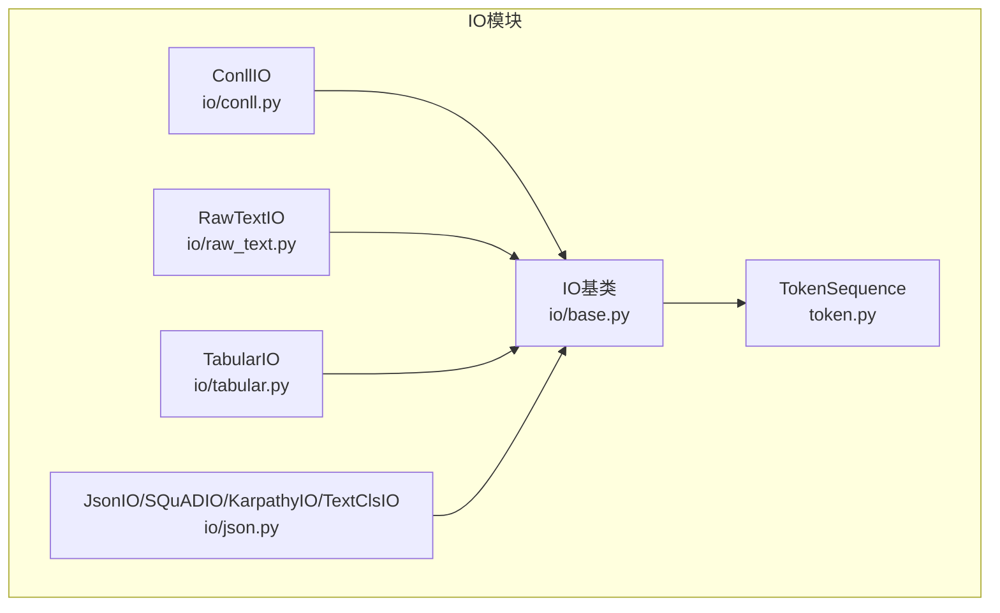
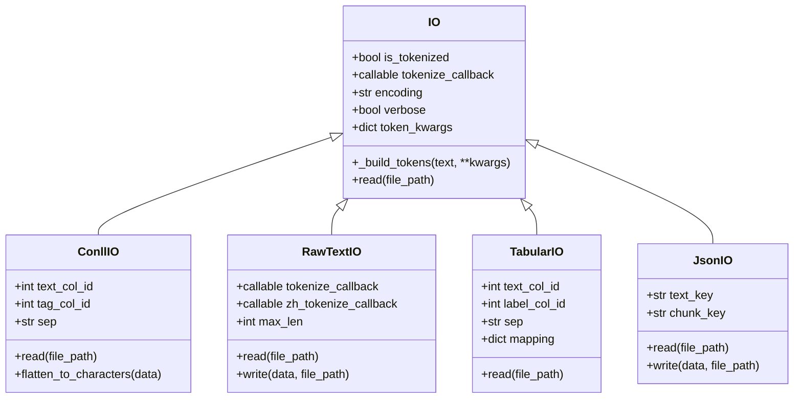
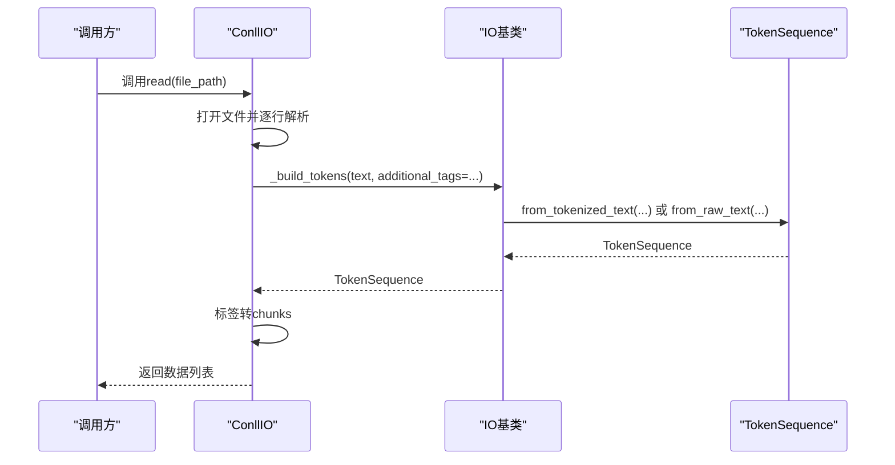
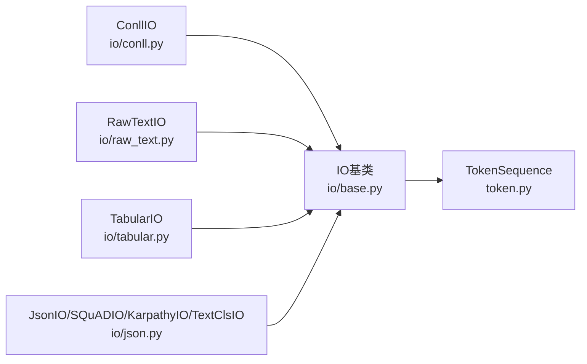
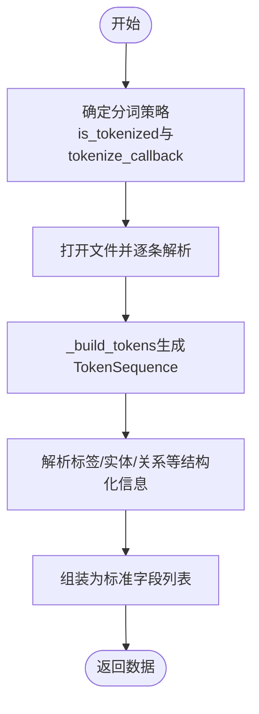

# 数据IO API

<cite>
**本文引用的文件**
- [eznlp/io/base.py](file://eznlp/io/base.py)
- [eznlp/token.py](file://eznlp/token.py)
- [eznlp/io/conll.py](file://eznlp/io/conll.py)
- [eznlp/io/raw_text.py](file://eznlp/io/raw_text.py)
- [eznlp/io/tabular.py](file://eznlp/io/tabular.py)
- [eznlp/io/json.py](file://eznlp/io/json.py)
- [eznlp/io/__init__.py](file://eznlp/io/__init__.py)
- [tests/io/test_conll.py](file://tests/io/test_conll.py)
- [tests/io/test_tabular.py](file://tests/io/test_tabular.py)
</cite>

## 目录
1. [简介](#简介)
2. [项目结构](#项目结构)
3. [核心组件](#核心组件)
4. [架构总览](#架构总览)
5. [详细组件分析](#详细组件分析)
6. [依赖关系分析](#依赖关系分析)
7. [性能考量](#性能考量)
8. [故障排查指南](#故障排查指南)
9. [结论](#结论)
10. [附录](#附录)

## 简介
本文件聚焦于eznlp项目中的数据IO API，重点解析位于eznlp/io/base.py中的IO基类。文档将系统阐述：
- IO基类的初始化参数与约束
- _build_tokens方法如何根据输入类型构建TokenSequence对象
- read方法的抽象接口设计及子类实现模式
- 基于现有实现的扩展实践，帮助读者快速实现支持新数据格式的自定义IO类

## 项目结构
eznlp/io目录提供了多种数据格式的IO实现，均继承自IO基类，并通过统一的read接口完成数据读取与预处理。核心文件如下：
- 基类与通用工具：io/base.py、token.py
- 具体实现：io/conll.py、io/raw_text.py、io/tabular.py、io/json.py
- 导出入口：io/__init__.py
- 测试用例：tests/io/test_conll.py、tests/io/test_tabular.py

图表来源
- [eznlp/io/base.py](file://eznlp/io/base.py#L1-L38)
- [eznlp/token.py](file://eznlp/token.py#L492-L920)
- [eznlp/io/conll.py](file://eznlp/io/conll.py#L1-L198)
- [eznlp/io/raw_text.py](file://eznlp/io/raw_text.py#L1-L192)
- [eznlp/io/tabular.py](file://eznlp/io/tabular.py#L1-L67)
- [eznlp/io/json.py](file://eznlp/io/json.py#L1-L438)

章节来源
- [eznlp/io/__init__.py](file://eznlp/io/__init__.py#L1-L26)

## 核心组件
本节围绕IO基类展开，解释其初始化参数、内部行为与扩展要点。

- 初始化参数与约束
  - is_tokenized：布尔值，指示输入文本是否已分词。若为True，则必须不提供tokenize_callback。
  - tokenize_callback：可选的分词回调，用于从原始文本构建TokenSequence。当is_tokenized为False时生效。
  - encoding：文件编码，默认None，由上层调用传入。
  - verbose：布尔值，控制日志输出的详细程度。
  - token_kwargs：传递给TokenSequence构建过程的关键字参数（如大小写归一化、数字归一化、分隔符等）。

- 内部行为
  - _build_tokens：根据is_tokenized选择TokenSequence的构建路径
    - 若is_tokenized为True：调用TokenSequence.from_tokenized_text，直接从分词列表构建TokenSequence。
    - 若is_tokenized为False：调用TokenSequence.from_raw_text，使用tokenize_callback对原始文本进行分词并构建TokenSequence。
  - read：抽象接口，子类需实现具体读取逻辑。

章节来源
- [eznlp/io/base.py](file://eznlp/io/base.py#L10-L38)
- [eznlp/token.py](file://eznlp/token.py#L736-L920)

## 架构总览
下图展示了IO基类与其子类之间的继承关系与交互：

图表来源
- [eznlp/io/base.py](file://eznlp/io/base.py#L1-L38)
- [eznlp/io/conll.py](file://eznlp/io/conll.py#L1-L198)
- [eznlp/io/raw_text.py](file://eznlp/io/raw_text.py#L1-L192)
- [eznlp/io/tabular.py](file://eznlp/io/tabular.py#L1-L67)
- [eznlp/io/json.py](file://eznlp/io/json.py#L1-L438)

## 详细组件分析

### IO基类与TokenSequence
- IO基类职责
  - 统一管理分词策略（is_tokenized与tokenize_callback）
  - 提供_token_kwargs与token_kwargs的合并机制
  - 抽象read接口，要求子类实现具体读取逻辑
- TokenSequence构建
  - from_tokenized_text：适用于已分词的文本列表，直接构造TokenSequence并附加额外标签。
  - from_raw_text：适用于原始文本，依据tokenize_callback进行分词，支持空格分词、字符级分词、Spacy、Jieba等多种分词器。

章节来源
- [eznlp/io/base.py](file://eznlp/io/base.py#L10-L38)
- [eznlp/token.py](file://eznlp/token.py#L736-L920)

### ConllIO：CoNLL格式读取
- 关键特性
  - 支持句子与文档级别的分隔标记配置
  - 可附加额外列作为Token属性（如词性标注）
  - 提供字符级展平能力，便于下游模型在字符粒度上训练
- 读取流程
  - 打开文件并逐行解析
  - 根据分隔标记切分句子/文档
  - 使用_token_build_tokens生成TokenSequence
  - 将标签序列转换为chunks
  - 返回包含tokens与chunks的数据列表

图表来源
- [eznlp/io/conll.py](file://eznlp/io/conll.py#L69-L142)
- [eznlp/io/base.py](file://eznlp/io/base.py#L26-L34)
- [eznlp/token.py](file://eznlp/token.py#L736-L920)

章节来源
- [eznlp/io/conll.py](file://eznlp/io/conll.py#L1-L198)

### RawTextIO：原始文本读取
- 关键特性
  - 支持两种输入模式：JSON行式与纯文本行式
  - 文档级分隔标记检测
  - 自动切分长文本，支持中文分词回调与英文分词器
- 读取流程
  - 二进制读取并过滤空行
  - 若未提供tokenize_callback：按JSON逐行解析
  - 若提供tokenize_callback：按行分词并切分为固定长度片段
  - 计算WWM边界，便于后续Span建模

章节来源
- [eznlp/io/raw_text.py](file://eznlp/io/raw_text.py#L1-L192)

### TabularIO：表格格式读取
- 关键特性
  - 支持自定义分隔符、列索引、映射规则
  - 使用pandas读取CSV，自动处理缺失值与编码
  - 通过_token_build_tokens统一构建TokenSequence
- 读取流程
  - pandas读取CSV
  - 迭代行，提取文本与标签
  - 应用映射规则清洗文本
  - 调用_token_build_tokens生成tokens并组装数据

章节来源
- [eznlp/io/tabular.py](file://eznlp/io/tabular.py#L1-L67)

### JsonIO系列：JSON格式读取
- JsonIO：通用实体/属性/关系抽取数据格式
  - 支持多键映射、去重、保留字段
  - 当is_tokenized为False时，可将原始文本与标注转换为chunks
- SQuADIO：问答数据格式
  - 从SQuAD结构中提取上下文、问题与答案span
- KarpathyIO：图像描述数据格式
  - 从Karpathy et al. JSON中读取图像路径与多句目标文本
- TextClsIO：文本分类数据格式
  - 支持单/双文本与标签映射

章节来源
- [eznlp/io/json.py](file://eznlp/io/json.py#L1-L438)

## 依赖关系分析
- IO基类依赖TokenSequence，后者负责Token对象的属性与序列操作
- 各子类通过继承IO基类，复用_token_build_tokens与read抽象接口
- 测试用例验证了不同子类在真实数据集上的行为一致性

图表来源
- [eznlp/io/base.py](file://eznlp/io/base.py#L1-L38)
- [eznlp/token.py](file://eznlp/token.py#L492-L920)
- [eznlp/io/conll.py](file://eznlp/io/conll.py#L1-L198)
- [eznlp/io/raw_text.py](file://eznlp/io/raw_text.py#L1-L192)
- [eznlp/io/tabular.py](file://eznlp/io/tabular.py#L1-L67)
- [eznlp/io/json.py](file://eznlp/io/json.py#L1-L438)

章节来源
- [eznlp/io/__init__.py](file://eznlp/io/__init__.py#L1-L26)

## 性能考量
- 分词器选择
  - 空格/字符分词适合快速原型；Spacy/Jieba在准确性与速度间权衡
  - 对长文本建议使用分段策略（如RawTextIO的segment_text_uniformly），避免一次性处理超长序列
- I/O与内存
  - 大文件建议按行读取（如JsonIO按行解析）或分块处理
  - 使用pandas读取CSV时注意dtype=str与na_filter=False，减少类型推断开销
- 日志与进度
  - verbose参数可用于控制进度条与警告输出，平衡调试信息与运行效率

## 故障排查指南
- 初始化断言失败
  - 当is_tokenized为True时，tokenize_callback必须为None；否则会触发断言错误
- 分词回调不兼容
  - from_raw_text对tokenize_callback有严格类型要求（空格、字符、Spacy、Jieba等），请确保回调签名与期望一致
- 编码问题
  - 明确指定encoding参数，避免默认编码导致的乱码或异常
- 数据不一致
  - 在非tokenized模式下，可借助TextChunksTranslator进行文本到chunks的对齐与校验，捕获错误与不匹配项

章节来源
- [eznlp/io/base.py](file://eznlp/io/base.py#L18-L20)
- [eznlp/token.py](file://eznlp/token.py#L800-L920)
- [eznlp/io/json.py](file://eznlp/io/json.py#L105-L203)

## 结论
IO基类为eznlp的数据读取提供了统一而灵活的抽象：通过is_tokenized与tokenize_callback的组合，既能适配已分词的文本，也能处理原始文本并统一构建TokenSequence。各子类在保持read接口一致性的前提下，针对不同数据格式实现了各自的解析逻辑。遵循本文的参数配置、构建流程与扩展实践，即可快速实现新的数据格式支持。

## 附录

### 扩展示例：实现自定义IO类
以下流程基于现有实现总结，帮助你快速扩展新的数据格式：

- 步骤1：确定分词策略
  - 若输入文本已分词：设置is_tokenized=True，无需tokenize_callback
  - 若输入为原始文本：设置is_tokenized=False，并提供合适的tokenize_callback
- 步骤2：实现read方法
  - 打开文件并逐条解析
  - 使用_token_build_tokens生成TokenSequence
  - 将标签/实体/关系等结构化信息转换为标准字段（如tokens、chunks、labels等）
  - 返回数据列表
- 步骤3：处理特殊需求
  - 若需要额外列作为Token属性，可在_token_build_tokens时传入additional_tags
  - 若需要字符级展平，参考ConllIO的flatten_to_characters思路
- 步骤4：测试与验证
  - 使用测试用例风格编写单元测试，覆盖典型数据与边界情况
  - 参考现有测试文件的断言与数据规模，确保结果一致性

图表来源
- [eznlp/io/base.py](file://eznlp/io/base.py#L26-L34)
- [eznlp/io/conll.py](file://eznlp/io/conll.py#L69-L142)
- [eznlp/io/tabular.py](file://eznlp/io/tabular.py#L37-L67)
- [eznlp/io/json.py](file://eznlp/io/json.py#L105-L203)

章节来源
- [eznlp/io/base.py](file://eznlp/io/base.py#L10-L38)
- [eznlp/token.py](file://eznlp/token.py#L736-L920)