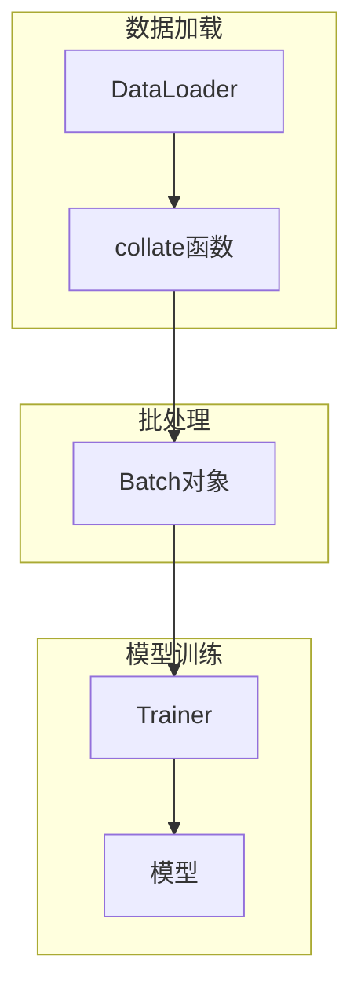
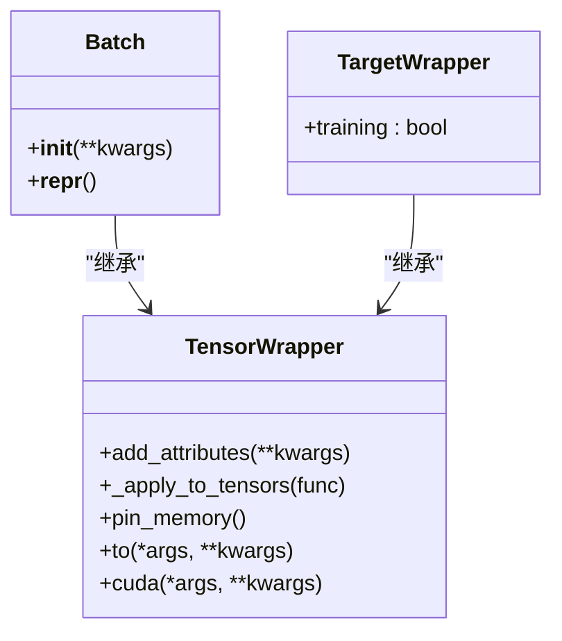
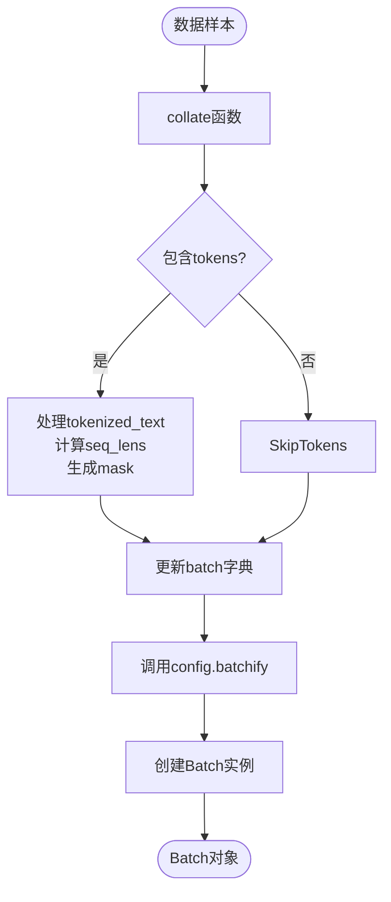
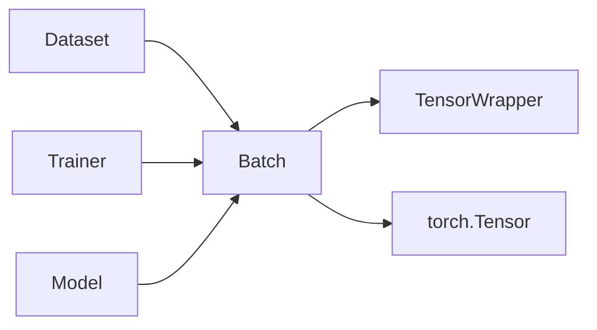

# Batch类

<cite>
**本文档引用的文件**
- [wrapper.py](file://eznlp/wrapper.py#L97-L105)
- [dataset.py](file://eznlp/dataset.py#L104-L114)
- [trainer.py](file://eznlp/training/trainer.py#L64-L81)
- [sequence_tagging.py](file://eznlp/model/decoder/sequence_tagging.py#L157-L178)
- [text_classification.py](file://eznlp/model/decoder/text_classification.py#L99-L105)
</cite>

## 目录
1. [简介](#简介)
2. [核心组件](#核心组件)
3. [架构概述](#架构概述)
4. [详细组件分析](#详细组件分析)
5. [依赖分析](#依赖分析)
6. [性能考量](#性能考量)
7. [故障排除指南](#故障排除指南)
8. [结论](#结论)

## 简介
Batch类是eznlp框架中的核心数据批处理容器，继承自TensorWrapper类，专门用于组织和管理深度学习训练过程中的批量数据。该类在自然语言处理任务中扮演着关键角色，特别是在数据加载、模型输入传递和GPU训练优化等方面。通过继承TensorWrapper，Batch类获得了对张量操作的统一接口，能够高效地处理包含input_ids、attention_mask、labels等属性的复杂数据结构。本文档将深入解析Batch类的设计优势、实现细节及其在实际训练场景中的使用模式。

## 核心组件
Batch类作为TensorWrapper的子类，继承了其核心功能并扩展了批处理特定的方法。其主要职责是封装一批数据样本，提供统一的接口来访问和操作这些数据。在初始化过程中，Batch类调用父类TensorWrapper的__init__方法，通过add_attributes方法注册传入的关键字参数作为对象属性。这种设计使得Batch对象能够灵活地容纳各种类型的数据，包括张量、字符串和其他可序列化的对象。特别地，Batch类重写了__repr__方法，以提供清晰的批处理对象信息展示，这对于调试和监控训练过程至关重要。

**本节来源**
- [wrapper.py](file://eznlp/wrapper.py#L97-L105)

## 架构概述
Batch类在整个eznlp框架中处于数据流的核心位置，连接着数据加载器和模型训练过程。当数据从Dataset对象中被提取时，collate函数会将多个样本组合成一个Batch实例。这个Batch实例随后被传递给模型进行前向传播计算。在训练循环中，Trainer类负责将Batch对象移动到指定设备（如GPU），并执行前向和后向传播操作。Batch类的设计充分考虑了PyTorch的张量操作特性，支持pin_memory和to等方法，以优化数据在CPU和GPU之间的传输效率。

**图表来源**
- [dataset.py](file://eznlp/dataset.py#L104-L114)
- [trainer.py](file://eznlp/training/trainer.py#L64-L81)

## 详细组件分析

### Batch类分析
Batch类的设计体现了面向对象编程的继承优势。通过继承TensorWrapper，Batch类获得了对张量操作的统一接口，同时可以根据批处理需求进行功能扩展。这种设计模式不仅提高了代码的复用性，还确保了不同组件之间接口的一致性。

#### 类结构分析

**图表来源**
- [wrapper.py](file://eznlp/wrapper.py#L39-L105)

#### 初始化方法分析
Batch类的__init__方法通过super().__init__(**kwargs)调用父类TensorWrapper的初始化机制。这种设计允许Batch类利用父类的add_attributes方法来注册传入的参数作为对象属性。在注册过程中，系统会检查每个属性是否为张量或字符串类型，只有符合要求的属性才会被注册。这种严格的类型检查确保了Batch对象内部数据的一致性和可靠性。

**本节来源**
- [wrapper.py](file://eznlp/wrapper.py#L100-L102)

#### 表示方法分析
Batch类重写了__repr__方法，以提供更清晰的对象信息展示。该方法返回一个字符串，格式为"Batch with attributes: {attribute_names}"，其中attribute_names是对象所有属性名的逗号分隔列表。这种简洁明了的表示方式有助于开发者快速了解Batch对象的结构和内容，在调试和日志记录中非常有用。

**本节来源**
- [wrapper.py](file://eznlp/wrapper.py#L103-L104)

### 实际使用模式分析
在实际的训练场景中，Batch对象在数据加载和模型输入传递过程中扮演着关键角色。以命名实体识别任务为例，一个典型的Batch实例可能包含input_ids、attention_mask、labels等属性。这些属性在DataLoader的序列化和反序列化过程中保持其结构完整性，确保数据能够正确地传递给模型。

#### 数据处理流程

**图表来源**
- [dataset.py](file://eznlp/dataset.py#L104-L114)

**本节来源**
- [dataset.py](file://eznlp/dataset.py#L104-L114)

#### 训练循环集成
Batch对象与PyTorch训练循环的集成主要通过Trainer类实现。在训练过程中，Trainer会将Batch对象移动到指定设备，并执行前向传播计算。对于不同的NLP任务，模型会从Batch对象中提取相应的属性进行计算。例如，在序列标注任务中，模型会使用full_hidden和batch.tags_objs来计算损失；在文本分类任务中，模型会使用full_hidden和batch.label_ids来进行预测。

**本节来源**
- [trainer.py](file://eznlp/training/trainer.py#L64-L81)

## 依赖分析
Batch类的实现依赖于多个核心组件，形成了一个紧密耦合的系统。首先，它直接依赖于PyTorch的张量系统，利用torch.Tensor的各种方法来实现数据操作。其次，它与Dataset类紧密配合，通过collate函数实现数据的批量处理。此外，Batch类还与Trainer类协同工作，共同完成模型的训练过程。这种依赖关系确保了数据在不同组件之间的无缝传递，提高了整个框架的运行效率。

**图表来源**
- [wrapper.py](file://eznlp/wrapper.py#L97-L105)
- [dataset.py](file://eznlp/dataset.py#L104-L114)
- [trainer.py](file://eznlp/training/trainer.py#L64-L81)

**本节来源**
- [wrapper.py](file://eznlp/wrapper.py#L97-L105)
- [dataset.py](file://eznlp/dataset.py#L104-L114)
- [trainer.py](file://eznlp/training/trainer.py#L64-L81)

## 性能考量
Batch类在GPU训练性能优化方面发挥了重要作用。通过pin_memory方法，Batch对象可以将数据存储在页锁定内存中，从而加快数据从CPU到GPU的传输速度。to方法则允许将整个Batch对象及其包含的所有张量移动到指定设备，避免了逐个移动张量的开销。这些优化措施显著提高了训练过程的效率，特别是在处理大规模数据集时表现尤为明显。此外，Batch类的设计还考虑了内存使用效率，通过共享内存和零拷贝技术来减少不必要的数据复制。

**本节来源**
- [wrapper.py](file://eznlp/wrapper.py#L87-L95)

## 故障排除指南
在使用Batch类时，可能会遇到一些常见问题。例如，如果传入的属性不是张量或字符串类型，add_attributes方法会抛出TypeError异常。此时需要检查数据预处理流程，确保所有属性都符合要求。另一个常见问题是内存不足，这通常是由于batch_size设置过大导致的。可以通过减小batch_size或使用梯度累积来解决这个问题。此外，如果在多GPU训练中遇到问题，可以检查Batch对象的张量是否正确地分布在各个设备上。

**本节来源**
- [wrapper.py](file://eznlp/wrapper.py#L46-L53)

## 结论
Batch类作为eznlp框架中的核心组件，通过继承TensorWrapper实现了高效的数据批处理功能。其设计充分考虑了深度学习训练的需求，在数据组织、模型集成和性能优化等方面表现出色。通过对__init__和__repr__方法的精心设计，Batch类提供了灵活而可靠的接口，使得开发者能够轻松地构建和管理复杂的训练流程。在未来的发展中，Batch类有望进一步扩展其功能，支持更多类型的数据和更复杂的训练场景。