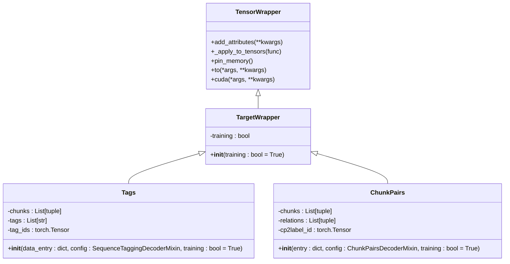
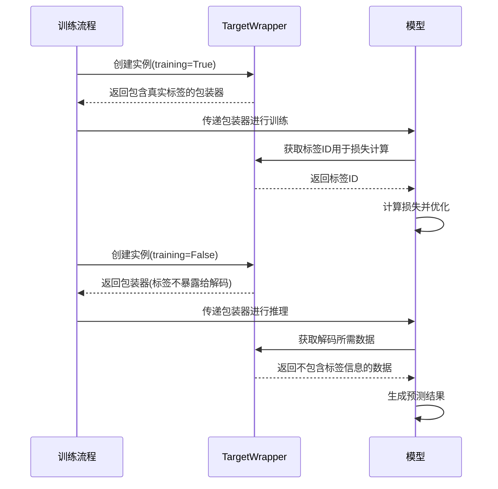

# TargetWrapper类

<cite>
**本文档中引用的文件**   
- [wrapper.py](file://eznlp/wrapper.py#L107-L121)
- [sequence_tagging.py](file://eznlp/model/decoder/sequence_tagging.py#L65-L91)
- [span_rel_classification.py](file://eznlp/model/decoder/span_rel_classification.py#L77-L84)
- [base.py](file://eznlp/model/decoder/base.py#L11-L114)
</cite>

## 目录
1. [简介](#简介)
2. [核心设计原则](#核心设计原则)
3. [训练模式控制机制](#训练模式控制机制)
4. [继承的设备迁移能力](#继承的设备迁移能力)
5. [实际应用示例](#实际应用示例)
6. [在序列标注任务中的应用](#在序列标注任务中的应用)
7. [在关系抽取任务中的应用](#在关系抽取任务中的应用)
8. [总结](#总结)

## 简介
TargetWrapper类是eznlp框架中用于封装建模目标的核心组件，专门设计用于处理包含真实标签信息的建模目标。该类通过继承TensorWrapper类，实现了对张量数据的高效封装和管理，同时引入了训练模式控制机制，确保模型在训练和推理阶段的行为一致性。

**Section sources**
- [wrapper.py](file://eznlp/wrapper.py#L107-L121)

## 核心设计原则
TargetWrapper类的设计遵循了严格的原则，确保在不同模式下模型行为的一致性。核心原则是：在推理模式下，用于解码的属性必须与真实标签无关，确保模型行为的一致性；而某些不参与解码的属性可以包含真实标签信息用于损失计算。

这种设计确保了模型在训练和推理阶段的解码过程完全一致，避免了因标签信息泄露导致的模型行为偏差。同时，允许在非解码属性中保留真实标签信息，为损失计算提供了必要的数据支持。

**Section sources**
- [wrapper.py](file://eznlp/wrapper.py#L113-L117)

## 训练模式控制机制
TargetWrapper类通过`training`标志位来控制目标数据在训练和推理模式下的暴露策略。在`__init__`方法中，`training`参数被初始化为True，表示默认处于训练模式。

当`training`为True时，对象可以暴露真实标签信息给所有属性，包括那些将用于解码的属性。这使得在训练阶段可以充分利用真实标签信息进行模型优化。当`training`为False时，对象不能将真实标签暴露给用于解码的属性，确保这些属性在有无真实标签的情况下保持一致。

这种机制通过子类的实现来具体化，例如在序列标注任务中，Tags类会根据`training`标志位决定是否将真实标签转换为标签ID张量。

**Diagram sources**
- [wrapper.py](file://eznlp/wrapper.py#L39-L121)
- [sequence_tagging.py](file://eznlp/model/decoder/sequence_tagging.py#L65-L91)
- [span_rel_classification.py](file://eznlp/model/decoder/span_rel_classification.py#L77-L84)

**Section sources**
- [wrapper.py](file://eznlp/wrapper.py#L120-L121)

## 继承的设备迁移能力
TargetWrapper类通过继承TensorWrapper类，获得了强大的设备迁移能力。这些能力包括`to`、`cuda`和`pin_memory`方法，可以方便地将包装的张量数据迁移到不同的计算设备上。

`to`方法可以将张量移动到指定的设备或转换为指定的数据类型，`cuda`方法专门用于将张量移动到CUDA设备，而`pin_memory`方法则用于将张量固定在内存中，加速CPU到GPU的数据传输。这些方法通过递归应用到所有注册的张量属性，确保了整个包装对象的一致性迁移。

这些设备迁移能力与训练模式控制相结合，使得TargetWrapper类能够在不同设备上高效地进行训练和推理，同时保持模式控制的一致性。

**Section sources**
- [wrapper.py](file://eznlp/wrapper.py#L87-L94)

## 实际应用示例
在实际使用中，TargetWrapper类的子类如Tags和ChunkPairs被用于具体的NLP任务。在训练阶段，创建包含真实标签的TargetWrapper实例；在推理阶段，创建不包含真实标签或真实标签不暴露给解码属性的实例。

例如，在序列标注任务中，训练阶段会创建包含真实标签的Tags实例，用于计算损失和优化模型；在推理阶段，创建的Tags实例虽然可能包含真实标签，但这些标签不会暴露给解码过程，确保预测结果的客观性。

**Diagram sources**
- [sequence_tagging.py](file://eznlp/model/decoder/sequence_tagging.py#L75-L91)
- [span_rel_classification.py](file://eznlp/model/decoder/span_rel_classification.py#L77-L84)

**Section sources**
- [sequence_tagging.py](file://eznlp/model/decoder/sequence_tagging.py#L45-L46)
- [span_rel_classification.py](file://eznlp/model/decoder/span_rel_classification.py#L77-L84)

## 在序列标注任务中的应用
在序列标注任务中，TargetWrapper类的子类Tags被用于封装标签信息。Tags类在初始化时接收数据条目和配置信息，根据`training`标志位决定如何处理真实标签。

当`training`为True时，Tags类会将真实标签转换为标签ID张量，用于损失计算。当`training`为False时，虽然仍然可以访问真实标签，但这些标签不会被用于解码过程，确保预测结果的客观性。

这种设计支持了复杂的训练-推理一致性要求，特别是在需要精确控制标签信息暴露的场景中，如命名实体识别、词性标注等任务。

**Section sources**
- [sequence_tagging.py](file://eznlp/model/decoder/sequence_tagging.py#L65-L91)

## 在关系抽取任务中的应用
在关系抽取任务中，TargetWrapper类的子类ChunkPairs被用于封装实体对和关系信息。ChunkPairs类同样遵循相同的训练模式控制原则，确保在推理阶段不会将真实关系标签暴露给解码过程。

这种设计特别适用于需要处理复杂关系结构的任务，如科学文献中的实体关系抽取。通过控制标签信息的暴露，确保了模型在推理阶段能够生成客观的预测结果，而不受训练数据标签的影响。

**Section sources**
- [span_rel_classification.py](file://eznlp/model/decoder/span_rel_classification.py#L77-L84)

## 总结
TargetWrapper类通过其精巧的设计，为NLP任务中的建模目标管理提供了强大的支持。其核心的训练模式控制机制确保了模型在训练和推理阶段的行为一致性，而继承的设备迁移能力则保证了在不同计算环境下的高效运行。

该类的设计原则和实现方式为处理复杂的训练-推理一致性要求提供了有效的解决方案，特别是在序列标注、关系抽取等需要精确控制信息流的任务中表现出色。通过合理使用TargetWrapper类，开发者可以构建更加可靠和一致的NLP模型。

**Section sources**
- [wrapper.py](file://eznlp/wrapper.py#L107-L121)
- [sequence_tagging.py](file://eznlp/model/decoder/sequence_tagging.py#L65-L91)
- [span_rel_classification.py](file://eznlp/model/decoder/span_rel_classification.py#L77-L84)