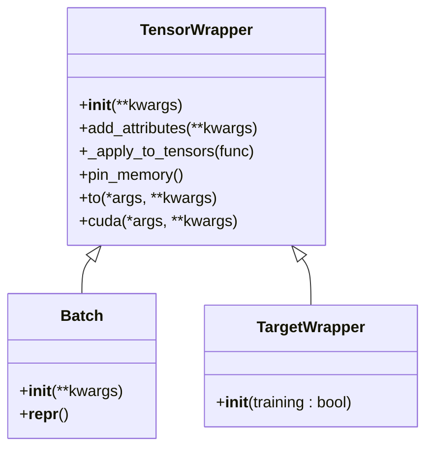
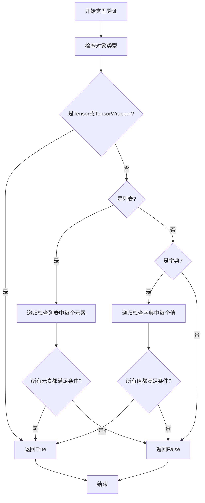
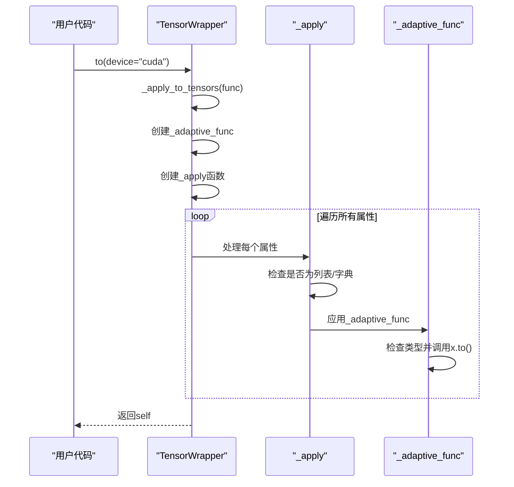

# TensorWrapper类

<cite>
**本文档中引用的文件**  
- [wrapper.py](file://eznlp/wrapper.py#L39-L95)
- [dataset.py](file://eznlp/dataset.py#L113-L114)
- [trainer.py](file://eznlp/training/trainer.py#L64-L135)
</cite>

## 目录
1. [简介](#简介)
2. [核心设计原理](#核心设计原理)
3. [属性管理机制](#属性管理机制)
4. [类型验证辅助函数](#类型验证辅助函数)
5. [_apply_to_tensors方法实现](#_apply_to_tensors方法实现)
6. [设备管理方法](#设备管理方法)
7. [实际应用示例](#实际应用示例)
8. [继承与扩展](#继承与扩展)

## 简介
TensorWrapper类是eznlp框架中的核心张量包装器，旨在提供一种统一的方式来管理和操作深度学习模型中的张量数据。该类通过封装PyTorch张量，实现了对复杂数据结构的递归处理能力，支持字符串和张量类型的属性注册，并提供了便捷的设备迁移和内存锁定功能。作为Batch和TargetWrapper等子类的基础，TensorWrapper在数据批处理、模型训练和评估流程中扮演着关键角色。

**Section sources**
- [wrapper.py](file://eznlp/wrapper.py#L39-L44)

## 核心设计原理
TensorWrapper的设计遵循了面向对象的封装原则，将张量数据及其相关操作封装在一个统一的接口中。其核心设计理念是通过递归遍历机制处理嵌套的数据结构，使得无论是简单的张量、列表中的张量还是字典中的张量集合，都能被统一管理和操作。这种设计特别适用于自然语言处理任务中复杂的批处理数据结构，能够有效简化张量操作的代码逻辑。



**Diagram sources**
- [wrapper.py](file://eznlp/wrapper.py#L39-L121)

**Section sources**
- [wrapper.py](file://eznlp/wrapper.py#L39-L44)

## 属性管理机制
### __init__方法
TensorWrapper的构造函数通过调用add_attributes方法来初始化实例属性。这种设计模式将对象的初始化和属性注册分离，提高了代码的可维护性和扩展性。构造函数接受任意数量的关键字参数，这些参数将被传递给add_attributes方法进行处理。

### add_attributes方法
该方法负责验证和注册属性，其工作流程如下：
1. 遍历所有传入的关键字参数
2. 跳过值为None的属性
3. 使用_is_tensor_like和_is_string_like函数验证属性类型
4. 将符合要求的属性通过setattr设置为实例属性
5. 对于不符合要求的输入抛出TypeError异常

这种机制确保了只有有效的张量或字符串类型数据才能被注册为TensorWrapper的属性，保证了数据的一致性和安全性。

**Section sources**
- [wrapper.py](file://eznlp/wrapper.py#L42-L54)

## 类型验证辅助函数
### _is_tensor_like函数
该函数通过_create_is_like高阶函数生成，用于递归判断一个对象是否为张量或包含张量的复杂数据结构。其判断逻辑如下：
- 直接检查对象是否为torch.Tensor或TensorWrapper实例
- 如果对象是列表，则递归检查所有元素
- 如果对象是字典，则递归检查所有值
- 对于其他类型返回False

这种递归检查机制能够有效处理嵌套的张量结构，如列表中的张量列表或字典中的张量集合。

### _is_string_like函数
与_is_tensor_like类似，该函数用于判断对象是否为字符串或包含字符串的复杂结构。它使用相同的递归模式，但判断条件是对象是否为str类型。这两个辅助函数共同构成了TensorWrapper的类型验证基础，确保了属性注册的安全性。



**Diagram sources**
- [wrapper.py](file://eznlp/wrapper.py#L5-L36)

**Section sources**
- [wrapper.py](file://eznlp/wrapper.py#L5-L36)

## _apply_to_tensors方法实现
### 整体架构
_apply_to_tensors方法是TensorWrapper的核心功能之一，它允许将任意函数应用到包装器中的所有张量上。该方法的设计体现了函数式编程的思想，通过高阶函数和闭包实现了灵活的张量操作。

### _adaptive_func函数
这是_apply_to_tensors内部定义的自适应函数，其作用是：
- 对于torch.Tensor类型对象，直接应用传入的函数
- 对于TensorWrapper类型对象，递归调用其自身的_apply_to_tensors方法

这种设计确保了函数能够正确处理嵌套的TensorWrapper实例。

### _create_apply函数
该函数是一个高阶函数生成器，它创建了一个能够递归处理列表和字典结构的_apply函数。其工作原理是：
- 检查当前对象是否满足条件（是张量或TensorWrapper）
- 如果是列表，则对每个元素递归调用_apply
- 如果是字典，则对每个值递归调用_apply
- 否则返回原对象

最终，_apply_to_tensors方法遍历实例的所有属性，对满足_is_tensor_like条件的属性应用_create_apply生成的函数。

**Section sources**
- [wrapper.py](file://eznlp/wrapper.py#L55-L85)

## 设备管理方法
### pin_memory方法
该方法通过调用_apply_to_tensors实现内存锁定功能。在深度学习训练中，将张量锁定在内存中可以提高数据加载的效率，特别是在使用CUDA进行训练时。其实现等价于：
```python
self._apply_to_tensors(lambda x: x.pin_memory())
```

### to方法
to方法用于将张量移动到指定设备（如CPU或GPU）或转换数据类型。它是PyTorch张量to方法的包装，通过_apply_to_tensors实现了对复杂数据结构中所有张量的批量设备迁移：
```python
self._apply_to_tensors(lambda x: x.to(*args, **kwargs))
```

### cuda方法
cuda方法专门用于将张量移动到CUDA设备。它同样基于_apply_to_tensors实现，提供了简化的接口来启用GPU加速：
```python
self._apply_to_tensors(lambda x: x.cuda(*args, **kwargs))
```

这些设备管理方法的统一实现方式体现了代码的DRY（Don't Repeat Yourself）原则，避免了重复的递归逻辑。



**Diagram sources**
- [wrapper.py](file://eznlp/wrapper.py#L87-L94)

**Section sources**
- [wrapper.py](file://eznlp/wrapper.py#L87-L94)

## 实际应用示例
在实际使用中，TensorWrapper通常通过Batch子类在数据加载过程中创建。以下是一个典型的使用流程：

1. **数据批处理**：在Dataset的collate方法中，将多个样本的张量数据组合成一个Batch实例
2. **设备迁移**：在训练循环中，使用to方法将整个Batch移动到GPU
3. **模型输入**：将处理后的Batch作为输入传递给模型

例如，在trainer.py中可以看到：
```python
batch = batch.to(self.device, non_blocking=self.non_blocking)
```
这行代码会递归地将Batch中所有的张量移动到指定设备，极大地简化了设备管理的代码。

**Section sources**
- [dataset.py](file://eznlp/dataset.py#L113-L114)
- [trainer.py](file://eznlp/training/trainer.py#L135)

## 继承与扩展
TensorWrapper通过继承机制派生出多个专用类：
- **Batch类**：用于表示数据批处理结果，重写了__repr__方法以提供更友好的字符串表示
- **TargetWrapper类**：用于包装模型目标（标签），包含training标志来控制训练和推理模式下的行为差异

这种继承结构体现了面向对象设计的开闭原则，允许在不修改基类代码的情况下扩展功能。TargetWrapper中的training标志特别重要，它确保了在推理模式下不会暴露训练专用的信息，保证了模型行为的一致性。

**Section sources**
- [wrapper.py](file://eznlp/wrapper.py#L97-L121)