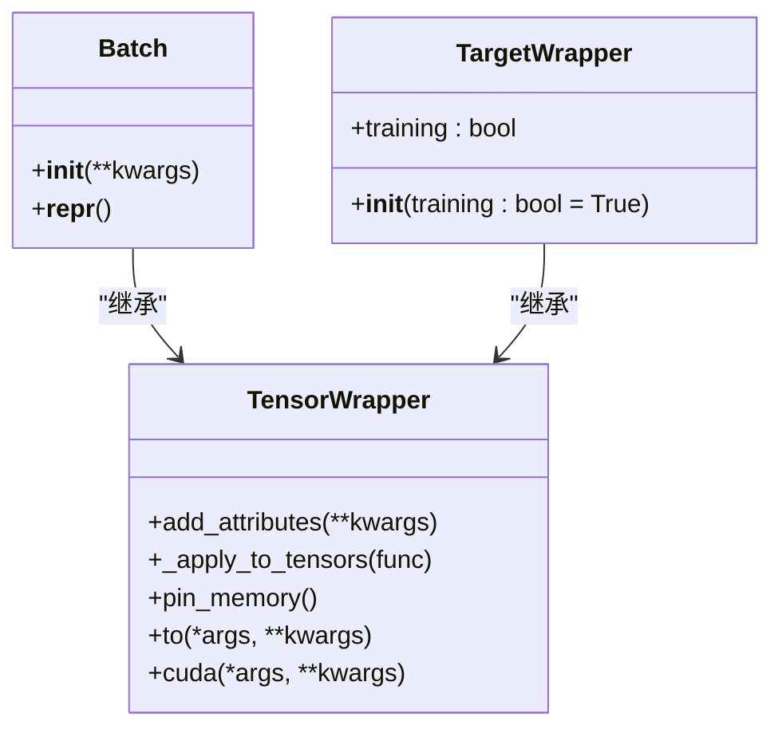
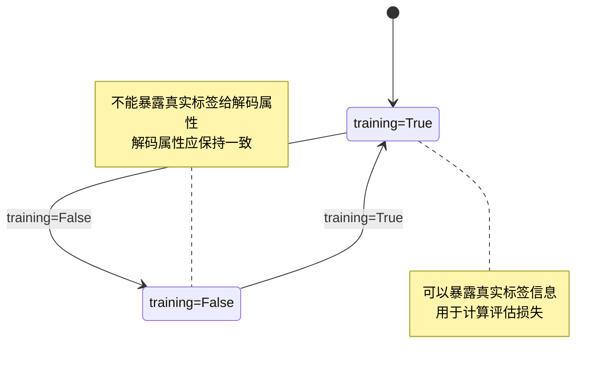
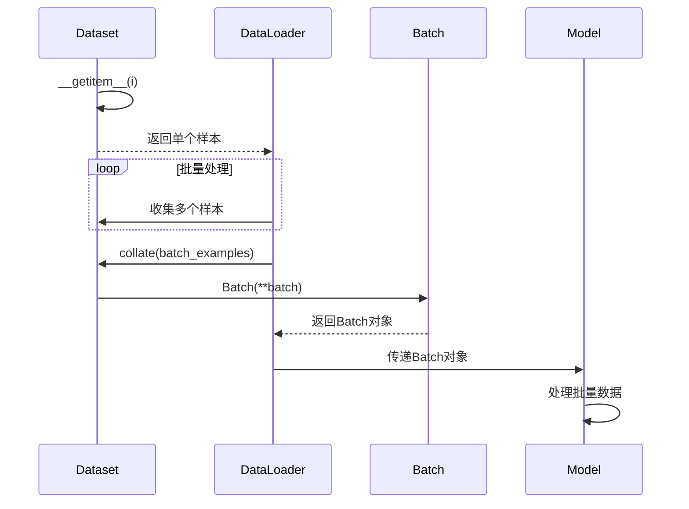

# 数据包装器API

<cite>
**本文档引用的文件**
- [wrapper.py](file://eznlp/wrapper.py)
- [dataset.py](file://eznlp/dataset.py)
- [sequence_tagging.py](file://eznlp/model/decoder/sequence_tagging.py)
- [text_classification.py](file://eznlp/model/decoder/text_classification.py)
- [base.py](file://eznlp/model/model/base.py)
</cite>

## 目录
1. [简介](#简介)
2. [核心组件](#核心组件)
3. [Batch类设计原理](#batch类设计原理)
4. [TargetWrapper行为分析](#targetwrapper行为分析)
5. [实际使用示例](#实际使用示例)
6. [数据转换与设备管理](#数据转换与设备管理)

## 简介
数据包装器API提供了一套用于处理深度学习模型输入输出的包装类，主要包括TensorWrapper、Batch和TargetWrapper三个核心类。这些类的设计旨在简化张量数据的管理和转换，特别是在批量处理和训练/推理模式切换时的数据处理。Batch类作为数据批处理容器，封装了批量数据的组织和访问方式；TargetWrapper则专门用于处理模型目标数据，在训练和推理模式下表现出不同的行为特征。

## 核心组件

数据包装器API的核心组件包括TensorWrapper、Batch和TargetWrapper三个类，它们构成了数据处理的基础架构。TensorWrapper作为基类，提供了张量属性管理和递归应用函数的基础功能；Batch类继承自TensorWrapper，专门用于批量数据的封装；TargetWrapper同样继承自TensorWrapper，但专注于模型目标数据的处理，特别是在训练和推理模式下的差异处理。

**Section sources**
- [wrapper.py](file://eznlp/wrapper.py#L39-L121)

## Batch类设计原理

Batch类作为数据批处理容器，其设计原理基于TensorWrapper的继承和扩展。它通过add_attributes方法接收批量数据的各个属性，并将这些属性存储为对象的实例变量。Batch类的构造函数接收关键字参数，这些参数会被传递给父类TensorWrapper的构造函数，从而实现属性的自动注册。

Batch类的关键设计特点包括：
1. 继承自TensorWrapper，获得张量属性管理和转换能力
2. 通过**kwargs参数接收任意数量的属性，实现灵活的数据封装
3. 提供__repr__方法，便于调试和日志输出
4. 与数据集类的collate方法紧密配合，实现批量数据的自动化包装

在数据处理流程中，Batch对象通常由数据集的collate方法创建，将多个样本数据整合为一个批量数据对象，便于模型的批量处理。

**Diagram sources**
- [wrapper.py](file://eznlp/wrapper.py#L39-L105)

**Section sources**
- [wrapper.py](file://eznlp/wrapper.py#L97-L105)
- [dataset.py](file://eznlp/dataset.py#L104-L114)

## TargetWrapper行为分析

TargetWrapper类专门用于处理模型的目标数据（如标签、块、关系等），其核心特性是通过training标志位来适应对象内容的变化。这个类的设计考虑了训练和推理两种模式下的不同需求。

在训练模式下（training=True），TargetWrapper可以暴露底层的真实标签信息，这些信息用于计算评估损失。然而，在推理模式下（training=False），对象不能将真实标签暴露给"解码时将使用的属性"，这意味着这些用于解码的属性在有无真实标签的情况下应该保持一致。这种设计确保了模型在推理时不会依赖于训练时才有的标签信息，从而保证了推理结果的可靠性和一致性。

TargetWrapper的另一个重要特性是不对目标对象的属性进行张量类型检查，这提供了更大的灵活性，允许包含各种类型的数据结构。

**Diagram sources**
- [wrapper.py](file://eznlp/wrapper.py#L107-L121)

**Section sources**
- [wrapper.py](file://eznlp/wrapper.py#L107-L121)
- [sequence_tagging.py](file://eznlp/model/decoder/sequence_tagging.py#L65-L91)

## 实际使用示例

在实际使用中，Batch对象的创建和操作通常与数据集的collate方法配合完成。以下是一个典型的使用流程：

1. 数据集的__getitem__方法返回单个样本的示例数据
2. DataLoader的collate_fn参数指定数据集的collate方法
3. collate方法将多个样本数据整合为一个Batch对象

在序列标注任务中，Tags类继承自TargetWrapper，用于包装标签数据。它在初始化时接收数据条目和配置信息，根据底层的块信息生成相应的标签序列和标签ID张量。这种设计将原始的块信息与模型所需的标签张量封装在一起，便于在训练过程中同时访问原始数据和处理后的张量数据。

对于文本分类任务，目标数据的处理相对简单，通常直接将标签转换为ID张量存储在Batch对象中。这种统一的包装方式使得不同任务的数据处理流程保持一致，提高了代码的可维护性和可扩展性。

**Diagram sources**
- [dataset.py](file://eznlp/dataset.py#L104-L114)
- [sequence_tagging.py](file://eznlp/model/decoder/sequence_tagging.py#L157-L178)

**Section sources**
- [dataset.py](file://eznlp/dataset.py#L104-L114)
- [sequence_tagging.py](file://eznlp/model/decoder/sequence_tagging.py#L157-L178)
- [text_classification.py](file://eznlp/model/decoder/text_classification.py#L99-L105)

## 数据转换与设备管理

Batch类继承了TensorWrapper的设备管理方法，包括pin_memory、to和cuda等，这些方法通过_apply_to_tensors机制递归地应用于所有张量属性。_apply_to_tensors方法是核心的递归应用函数，它接受一个可应用于torch.Tensor的函数作为参数，并将其应用到TensorWrapper注册的所有张量上。

pin_memory方法用于将张量的内存固定，这在使用CUDA时可以提高数据传输效率。to方法用于将张量移动到指定的设备或转换为指定的数据类型，而cuda方法则是to方法的快捷方式，专门用于将张量移动到CUDA设备。

这些方法的实现利用了_create_apply和_create_is_like等辅助函数，实现了对复杂数据结构（如嵌套的列表和字典）中张量的递归处理。这种设计使得即使Batch对象包含复杂的嵌套张量结构，也能通过单一方法调用完成所有张量的设备转换。

**Section sources**
- [wrapper.py](file://eznlp/wrapper.py#L87-L94)
- [base.py](file://eznlp/model/model/base.py#L84-L92)