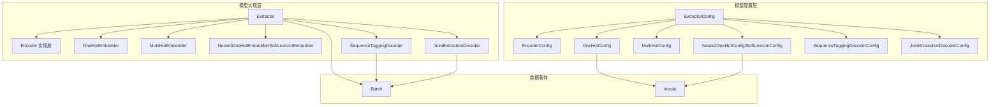
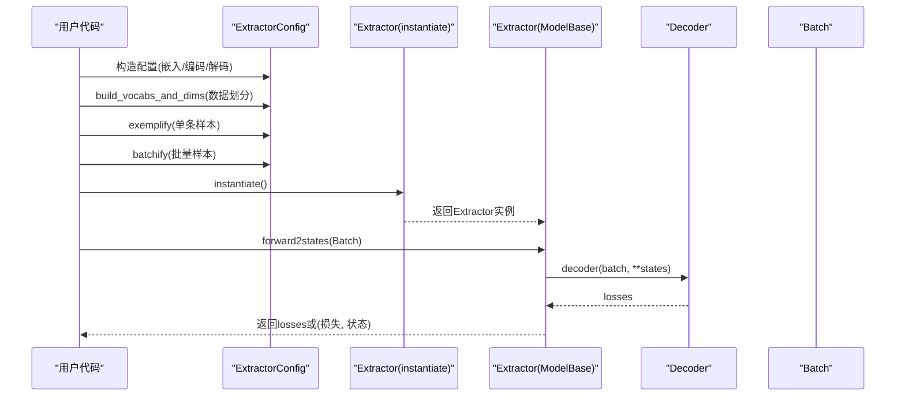
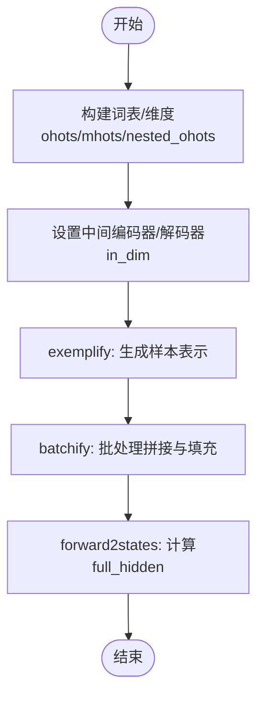
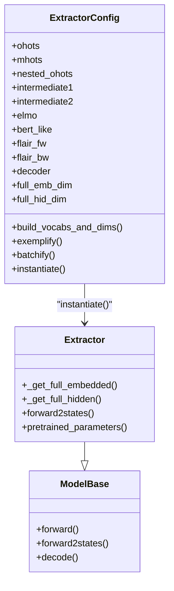

# 模型构建器API

<cite>
**本文引用的文件列表**
- [extractor.py](file://eznlp/model/model/extractor.py)
- [base.py](file://eznlp/model/model/base.py)
- [embedder.py](file://eznlp/model/embedder.py)
- [nested_embedder.py](file://eznlp/model/nested_embedder.py)
- [encoder.py](file://eznlp/model/encoder.py)
- [sequence_tagging.py](file://eznlp/model/decoder/sequence_tagging.py)
- [joint_extraction.py](file://eznlp/model/decoder/joint_extraction.py)
- [wrapper.py](file://eznlp/wrapper.py)
- [vocab.py](file://eznlp/vocab.py)
</cite>

## 目录
1. [简介](#简介)
2. [项目结构与定位](#项目结构与定位)
3. [核心组件总览](#核心组件总览)
4. [架构概览](#架构概览)
5. [详细组件解析](#详细组件解析)
6. [依赖关系分析](#依赖关系分析)
7. [性能与可扩展性](#性能与可扩展性)
8. [故障排查指南](#故障排查指南)
9. [结论](#结论)
10. [附录：配置与实例化示例](#附录配置与实例化示例)

## 简介
本文件聚焦于模型构建器API中的ExtractorConfig与Extractor类，系统阐述其如何协调嵌入层、编码器与解码器的配置，解释full_emb_dim与full_hid_dim等计算属性的实现逻辑，并深入说明数据处理方法build_vocabs_and_dims、exemplify与batchify的工作机制。同时，详细描述Extractor类的_forward2states与pretrained_parameters方法及其在训练流程中的作用，并提供完整的模型配置与实例化示例路径，帮助读者快速上手并正确使用该构建器。

## 项目结构与定位
- ExtractorConfig与Extractor位于模型子模块，负责抽取式任务的端到端建模。
- 嵌入层由OneHotConfig/MultiHotConfig/NestedOneHotConfig等构成；编码器由EncoderConfig及其实现类（如LSTM/GRU/Transformer/Conv等）构成；解码器由序列标注、联合抽取等解码器配置与实现组成。
- Batch包装器统一承载张量与元信息，贯穿数据从样本到批次的全流程。

图表来源
- [extractor.py](file://eznlp/model/model/extractor.py#L23-L209)
- [encoder.py](file://eznlp/model/encoder.py#L15-L90)
- [embedder.py](file://eznlp/model/embedder.py#L51-L139)
- [nested_embedder.py](file://eznlp/model/nested_embedder.py#L15-L97)
- [sequence_tagging.py](file://eznlp/model/decoder/sequence_tagging.py#L93-L141)
- [joint_extraction.py](file://eznlp/model/decoder/joint_extraction.py#L68-L152)
- [wrapper.py](file://eznlp/wrapper.py#L97-L122)
- [vocab.py](file://eznlp/vocab.py#L12-L66)

章节来源
- [extractor.py](file://eznlp/model/model/extractor.py#L23-L209)
- [base.py](file://eznlp/model/model/base.py#L10-L99)
- [embedder.py](file://eznlp/model/embedder.py#L51-L139)
- [nested_embedder.py](file://eznlp/model/nested_embedder.py#L15-L97)
- [encoder.py](file://eznlp/model/encoder.py#L15-L90)
- [sequence_tagging.py](file://eznlp/model/decoder/sequence_tagging.py#L93-L141)
- [joint_extraction.py](file://eznlp/model/decoder/joint_extraction.py#L68-L152)
- [wrapper.py](file://eznlp/wrapper.py#L97-L122)
- [vocab.py](file://eznlp/vocab.py#L12-L66)

## 核心组件总览
- ExtractorConfig：统一管理嵌入层（ohots/mhots/nested_ohots）、中间编码器（intermediate1/intermediate2）、预训练特征（elmo/bert_like/flair_fw/flair_bw）与解码器（decoder）的配置，提供full_emb_dim/full_hid_dim等维度计算属性，以及build_vocabs_and_dims、exemplify、batchify等数据处理流程。
- Extractor：基于ExtractorConfig实例化得到的模型对象，负责前向传播状态提取（forward2states）与预训练参数收集（pretrained_parameters），并在ModelBase的统一框架下完成损失计算与解码。

章节来源
- [extractor.py](file://eznlp/model/model/extractor.py#L23-L209)
- [base.py](file://eznlp/model/model/base.py#L64-L99)

## 架构概览
下图展示ExtractorConfig与Extractor在整体模型体系中的位置与交互关系，以及数据从样本到批次再到前向状态的流转过程。

图表来源
- [extractor.py](file://eznlp/model/model/extractor.py#L122-L209)
- [base.py](file://eznlp/model/model/base.py#L64-L99)

## 详细组件解析

### ExtractorConfig：配置协调与维度计算
- 组件职责
  - 统一管理嵌入层、中间编码器、预训练特征与解码器的配置。
  - 提供full_emb_dim与full_hid_dim两个关键维度属性，用于下游模块的输入/输出维度设置。
  - 提供build_vocabs_and_dims、exemplify、batchify三大数据处理方法，确保从原始样本到可训练批次的完整管线。
  - 支持多种解码器字符串别名（如sequence_tagging/span_classification等），自动映射为具体解码器配置。

- full_emb_dim与full_hid_dim的实现
  - full_emb_dim：累加ohots/mhots/nested_ohots各字段的输出维度；若存在nested_ohots且为SoftLexiconConfig，会基于训练与开发集构建词频权重以指导聚合。
  - full_hid_dim：若存在intermediate1，则取其输出维度；否则取full_emb_dim；再累加所有已启用的预训练特征（elmo/bert_like/flair_fw/flair_bw）的输出维度。
  - intermediate1与intermediate2的in_dim/out_dim在build_vocabs_and_dims中被显式设置，保证前后衔接一致；decoder的in_dim也在此阶段确定。

- 数据处理方法
  - build_vocabs_and_dims：依次处理ohots/mhots/nested_ohots的词表/维度构建；对SoftLexiconConfig额外构建频率统计；随后设置intermediate1/intermediate2与decoder的in_dim，并构建解码器词表。
  - exemplify：按字段生成嵌入层与预训练特征的样本表示，并调用decoder.exemplify产出标签/目标对象。
  - batchify：将多个样本的表示按字段拼接成批次张量，对嵌套序列进行内层长度掩码与填充，最后合并解码器的目标对象。

- 解码器选择
  - 支持字符串别名到具体解码器配置的映射，包括序列标注、span分类、span属性分类、span关系分类、边界选择、联合抽取等。

章节来源
- [extractor.py](file://eznlp/model/model/extractor.py#L23-L209)
- [embedder.py](file://eznlp/model/embedder.py#L51-L139)
- [nested_embedder.py](file://eznlp/model/nested_embedder.py#L15-L97)
- [encoder.py](file://eznlp/model/encoder.py#L15-L90)
- [sequence_tagging.py](file://eznlp/model/decoder/sequence_tagging.py#L93-L141)
- [joint_extraction.py](file://eznlp/model/decoder/joint_extraction.py#L68-L152)

### Extractor：前向状态与预训练参数
- 继承关系
  - Extractor继承自ModelBase，后者负责根据配置动态实例化各子模块（嵌入层、编码器、解码器），并提供统一的forward/forward2states/decode接口。

- _get_full_embedded
  - 将ohots/mhots/nested_ohots的嵌入结果拼接为统一的嵌入表示；nested_ohots需传入seq_lens以恢复外层步长形状。

- _get_full_hidden
  - 若存在嵌入层，则先经intermediate1编码（若未配置则直接使用嵌入）；随后拼接所有预训练特征的输出；最终若配置了intermediate2，则再经其编码；否则直接返回拼接后的隐藏表示。

- forward2states
  - 返回包含“full_hidden”的字典，供解码器使用；这是ModelBase.forward的中间状态，避免重复计算。

- pretrained_parameters
  - 汇总elmo/bert_like/flair_fw/flair_bw等预训练组件的参数，便于训练时按需冻结/解冻或单独优化学习率。

章节来源
- [extractor.py](file://eznlp/model/model/extractor.py#L211-L274)
- [base.py](file://eznlp/model/model/base.py#L64-L99)

### 数据处理流程详解
- build_vocabs_and_dims
  - 对ohots/mhots/nested_ohots分别构建词表/维度；对SoftLexiconConfig构建词频权重（跳过测试集）。
  - 设置intermediate1.in_dim=full_emb_dim；若存在intermediate2，则intermediate2.in_dim=full_hid_dim，decoder.in_dim=intermediate2.out_dim；否则decoder.in_dim=full_hid_dim。
  - 最后构建解码器词表。

- exemplify
  - 逐字段生成嵌入层与预训练特征的样本表示；调用decoder.exemplify产出标签/目标对象。

- batchify
  - 对ohots/mhots/nested_ohots分别进行padding与mask构造；对预训练特征调用其batchify；合并解码器目标对象。

图表来源
- [extractor.py](file://eznlp/model/model/extractor.py#L122-L209)

## 依赖关系分析
- 配置到实现的映射
  - ExtractorConfig通过instantiate返回Extractor实例；ModelBase在初始化时遍历_config._all_names，将每个非None配置实例化为Module或ModuleDict。
- 嵌入层依赖
  - OneHotConfig依赖Vocab；NestedOneHotConfig/SoftLexiconConfig依赖Vocab与EncoderConfig；MultiHotConfig提供数值型特征的线性映射。
- 编码器依赖
  - EncoderConfig支持多种架构，输出维度由hid_dim与shortcut决定；RNN系列支持pack/pad与可训练初始隐状态。
- 解码器依赖
  - SequenceTaggingDecoderConfig支持CRF或交叉熵；JointExtractionDecoderConfig组合多个解码器并分配权重。

图表来源
- [extractor.py](file://eznlp/model/model/extractor.py#L23-L274)
- [base.py](file://eznlp/model/model/base.py#L64-L99)

章节来源
- [extractor.py](file://eznlp/model/model/extractor.py#L23-L274)
- [base.py](file://eznlp/model/model/base.py#L64-L99)

## 性能与可扩展性
- 维度计算与拼接
  - full_emb_dim与full_hid_dim采用累加策略，确保下游模块输入维度准确；intermediate1/intermediate2的in_dim/out_dim在构建阶段即确定，减少运行时开销。
- 嵌套序列处理
  - NestedOneHotConfig/SoftLexiconConfig对内层序列进行掩码与聚合，避免无效填充带来的计算浪费；可选的权重（如词频）有助于提升语义一致性。
- 预训练参数分离
  - pretrained_parameters将预训练组件参数独立导出，便于冻结/微调策略与多学习率调度。

[本节为通用建议，不直接分析具体文件]

## 故障排查指南
- 常见问题
  - 解码器无效：确认decoder字符串别名是否正确，或显式传入具体解码器配置。
  - 维度不匹配：检查intermediate1/intermediate2与decoder的in_dim设置是否与full_emb_dim/full_hid_dim一致。
  - 嵌套序列形状异常：确保nested_ohots传入seq_lens以恢复外层步长。
  - 预训练组件冻结：通过pretrained_parameters区分训练参数，避免误冻结。

章节来源
- [extractor.py](file://eznlp/model/model/extractor.py#L23-L209)
- [base.py](file://eznlp/model/model/base.py#L64-L99)

## 结论
ExtractorConfig与Extractor构成了抽取式任务的完整构建器：前者负责配置协调与数据管线，后者负责前向状态与预训练参数管理。通过清晰的维度计算与模块化设计，该构建器既易于扩展又便于维护，适合在多种NLP任务中复用。

[本节为总结性内容，不直接分析具体文件]

## 附录：配置与实例化示例
以下示例仅给出配置项与实例化路径，避免直接粘贴代码片段。

- 嵌入层配置
  - OneHot嵌入：参考路径
    - [OneHotConfig](file://eznlp/model/embedder.py#L51-L139)
  - 多热嵌入：参考路径
    - [MultiHotConfig](file://eznlp/model/embedder.py#L197-L231)
  - 嵌套OneHot/软词典：参考路径
    - [NestedOneHotConfig](file://eznlp/model/nested_embedder.py#L15-L97)
    - [SoftLexiconConfig](file://eznlp/model/nested_embedder.py#L152-L213)

- 编码器配置
  - EncoderConfig与多种实现：参考路径
    - [EncoderConfig](file://eznlp/model/encoder.py#L15-L90)
    - [RNNEncoder](file://eznlp/model/encoder.py#L158-L252)
    - [TransformerEncoder](file://eznlp/model/encoder.py#L329-L375)

- 解码器配置
  - 序列标注：参考路径
    - [SequenceTaggingDecoderConfig](file://eznlp/model/decoder/sequence_tagging.py#L93-L141)
  - 联合抽取：参考路径
    - [JointExtractionDecoderConfig](file://eznlp/model/decoder/joint_extraction.py#L68-L152)

- Extractor配置与实例化
  - 构造ExtractorConfig并设置嵌入/编码/解码器：参考路径
    - [ExtractorConfig.__init__](file://eznlp/model/model/extractor.py#L50-L89)
  - 维度计算属性：参考路径
    - [ExtractorConfig.full_emb_dim](file://eznlp/model/model/extractor.py#L99-L108)
    - [ExtractorConfig.full_hid_dim](file://eznlp/model/model/extractor.py#L110-L120)
  - 数据处理方法：参考路径
    - [ExtractorConfig.build_vocabs_and_dims](file://eznlp/model/model/extractor.py#L122-L148)
    - [ExtractorConfig.exemplify](file://eznlp/model/model/extractor.py#L149-L173)
    - [ExtractorConfig.batchify](file://eznlp/model/model/extractor.py#L175-L203)
  - 实例化与前向：参考路径
    - [ExtractorConfig.instantiate](file://eznlp/model/model/extractor.py#L205-L209)
    - [Extractor.forward2states](file://eznlp/model/model/extractor.py#L272-L274)
    - [Extractor.pretrained_parameters](file://eznlp/model/model/extractor.py#L256-L271)
  - ModelBase统一接口：参考路径
    - [ModelBase.forward/forward2states/decode](file://eznlp/model/model/base.py#L64-L99)

- 数据载体与词表
  - Batch与TargetWrapper：参考路径
    - [Batch](file://eznlp/wrapper.py#L97-L122)
  - Vocab：参考路径
    - [Vocab](file://eznlp/vocab.py#L12-L66)