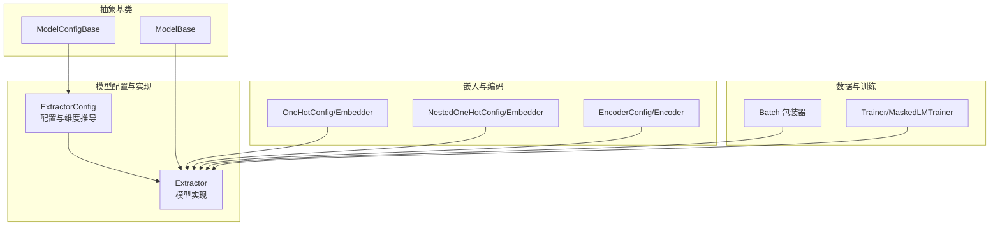
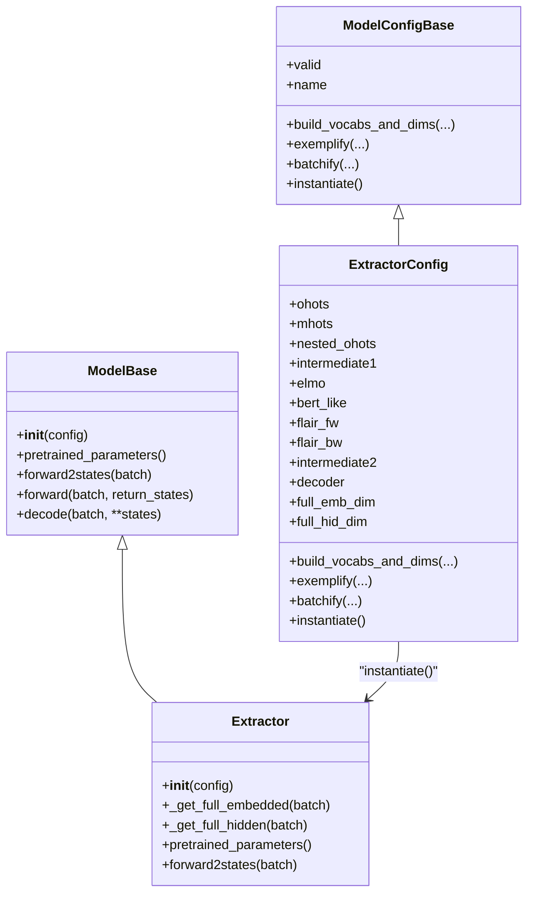
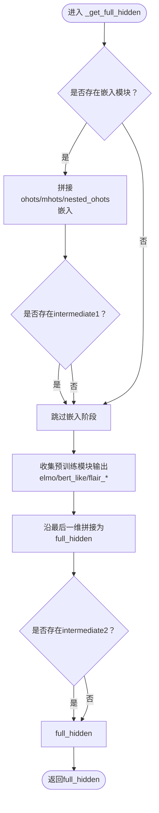
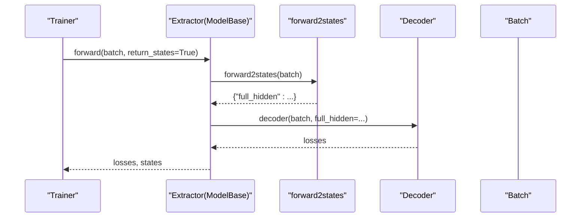
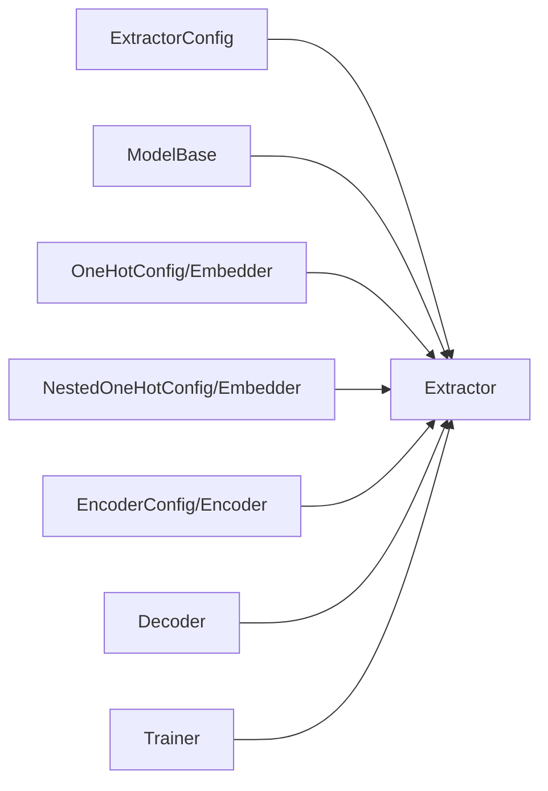

# 模型构建器实现类

<cite>
**本文引用的文件列表**
- [extractor.py](file://eznlp/model/model/extractor.py)
- [base.py](file://eznlp/model/model/base.py)
- [embedder.py](file://eznlp/model/embedder.py)
- [nested_embedder.py](file://eznlp/model/nested_embedder.py)
- [encoder.py](file://eznlp/model/encoder.py)
- [wrapper.py](file://eznlp/wrapper.py)
- [plm_trainer.py](file://eznlp/training/plm_trainer.py)
- [test_sequence_tagging.py](file://tests/model/test_sequence_tagging.py)
- [test_boundary_selection.py](file://tests/model/test_boundary_selection.py)
- [text_classification.py](file://scripts/text_classification.py)
</cite>

## 目录
1. [简介](#简介)
2. [项目结构](#项目结构)
3. [核心组件](#核心组件)
4. [架构总览](#架构总览)
5. [详细组件分析](#详细组件分析)
6. [依赖关系分析](#依赖关系分析)
7. [性能考量](#性能考量)
8. [故障排查指南](#故障排查指南)
9. [结论](#结论)
10. [附录](#附录)

## 简介
本文件面向Extractor类的API与实现细节，系统阐述其作为模型实现核心的作用：如何通过_forward2states整合嵌入层、编码器与预训练模型的输出，生成最终隐藏状态；如何拼接不同来源的嵌入特征（_get_full_embedded）与隐藏特征（_get_full_hidden）；如何识别并返回需要特殊优化的预训练模型参数（pretrained_parameters）；以及初始化过程与ExtractorConfig的关联。同时提供完整的前向传播调用示例与训练器协同工作的实践建议。

## 项目结构
- 模型层位于 eznlp/model/model/extractor.py，定义了ExtractorConfig与Extractor两类核心配置与实现。
- 抽象基类位于 eznlp/model/model/base.py，提供通用的模型配置与模型基类框架。
- 嵌入层与嵌套嵌入层分别位于 eznlp/model/embedder.py 与 eznlp/model/nested_embedder.py，支持one-hot/multi-hot/软词典等嵌入方式。
- 编码器位于 eznlp/model/encoder.py，支持Identity、FFN、RNN、CNN、Transformer等多种架构。
- 数据包装器Batch位于 eznlp/wrapper.py，统一承载批次数据。
- 训练器位于 eznlp/training/plm_trainer.py，演示如何以模型为入口进行前向计算与损失回传。
- 测试与脚本展示了Extractor在序列标注、边界选择等任务中的使用方式与训练流程。

图表来源
- [extractor.py](file://eznlp/model/model/extractor.py#L23-L210)
- [base.py](file://eznlp/model/model/base.py#L10-L99)
- [embedder.py](file://eznlp/model/embedder.py#L51-L139)
- [nested_embedder.py](file://eznlp/model/nested_embedder.py#L15-L97)
- [encoder.py](file://eznlp/model/encoder.py#L15-L90)
- [wrapper.py](file://eznlp/wrapper.py#L97-L122)
- [plm_trainer.py](file://eznlp/training/plm_trainer.py#L1-L35)

章节来源
- [extractor.py](file://eznlp/model/model/extractor.py#L23-L210)
- [base.py](file://eznlp/model/model/base.py#L10-L99)
- [embedder.py](file://eznlp/model/embedder.py#L51-L139)
- [nested_embedder.py](file://eznlp/model/nested_embedder.py#L15-L97)
- [encoder.py](file://eznlp/model/encoder.py#L15-L90)
- [wrapper.py](file://eznlp/wrapper.py#L97-L122)

## 核心组件
- ExtractorConfig：负责解析与校验配置项，计算嵌入与隐藏维度，构建词汇表与批处理逻辑，并实例化Extractor。
- Extractor：继承自ModelBase，实现前向状态提取（forward2states），内部通过_get_full_embedded与_get_full_hidden拼接多源嵌入与隐藏表示，并提供pretrained_parameters用于识别预训练模型参数。

章节来源
- [extractor.py](file://eznlp/model/model/extractor.py#L23-L210)
- [base.py](file://eznlp/model/model/base.py#L64-L99)

## 架构总览
ExtractorConfig与Extractor共同构成“配置-实现”双层结构：
- 配置层（ExtractorConfig）：定义可选模块集合（ohots/mhots/nested_ohots、intermediate1、elmo/bert_like/flair_*、intermediate2、decoder），并提供维度推导、批处理与实例化。
- 实现层（Extractor）：在构造时由ModelBase根据配置自动装配各子模块；在前向阶段按顺序拼接嵌入与隐藏状态，最终输出full_hidden供解码器使用。

图表来源
- [extractor.py](file://eznlp/model/model/extractor.py#L23-L274)
- [base.py](file://eznlp/model/model/base.py#L10-L99)

## 详细组件分析

### ExtractorConfig：配置与维度推导
- 可选模块分组
  - 嵌入层：ohots、mhots、nested_ohots
  - 中间编码器：intermediate1、intermediate2
  - 预训练模型：elmo、bert_like、flair_fw、flair_bw
  - 解码器：decoder（支持多种任务）
- 维度推导
  - full_emb_dim：统计ohots/mhots/nested_ohots输出维度之和
  - full_hid_dim：若存在intermediate1则取其输出维度，否则取full_emb_dim；再累加各预训练模块输出维度
- 批处理与示例化
  - exemplify：对每类输入（ohots/mhots/nested_ohots/预训练）调用对应配置的exemplify
  - batchify：对每类输入调用对应配置的batchify，并合并到Batch对象
- 实例化
  - instantiate：断言配置有效后返回Extractor实例

章节来源
- [extractor.py](file://eznlp/model/model/extractor.py#L23-L209)

### Extractor：前向状态提取与参数筛选
- 初始化
  - ModelBase.__init__会遍历ExtractorConfig._all_names，将每个非None配置实例化为Module或ModuleDict，并注册到Extractor实例上
- 嵌入拼接：_get_full_embedded
  - 依次对ohots/mhots/nested_ohots执行前向，得到各自嵌入张量，最后沿最后一维拼接
  - nested_ohots额外接收seq_lens等上下文信息
- 隐藏拼接：_get_full_hidden
  - 若存在嵌入模块，则先将拼接后的embedded送入intermediate1（若存在），否则直接使用embedded
  - 将各预训练模块（elmo/bert_like/flair_*）的输出加入full_hidden
  - 对上述所有分支沿最后一维拼接
  - 若存在intermediate2，则将其作用于拼接后的full_hidden并返回；否则直接返回full_hidden
- 前向状态：forward2states
  - 返回字典{"full_hidden": ...}，供解码器使用
- 预训练参数：pretrained_parameters
  - 仅收集elmo、bert_like、flair_fw、flair_bw所包含的参数（如ELMo LSTM、BERT-like权重、Flair语言模型）

图表来源
- [extractor.py](file://eznlp/model/model/extractor.py#L215-L255)

章节来源
- [extractor.py](file://eznlp/model/model/extractor.py#L211-L274)
- [base.py](file://eznlp/model/model/base.py#L64-L99)

### 嵌入层与嵌套嵌入层的工作机制
- OneHotConfig/Embedder
  - 支持字段级one-hot嵌入，可选位置编码与冻结策略
  - 输出维度由emb_dim决定
- NestedOneHotConfig/Embedder
  - 面向“每个token位置包含多个序列”的场景，支持通道聚合（均值池化/加权平均等）
  - 可选内层编码器，先编码再聚合
- 复杂度与性能
  - 嵌入层复杂度主要取决于词汇表大小与emb_dim
  - nested_ohots在存在内层编码器时增加额外计算，但可通过聚合模式降低冗余

章节来源
- [embedder.py](file://eznlp/model/embedder.py#L51-L139)
- [nested_embedder.py](file://eznlp/model/nested_embedder.py#L15-L151)

### 编码器的工作机制
- EncoderConfig
  - 支持Identity、FFN、LSTM/GRU、Conv/Gehring、Transformer等架构
  - 通过in_dim/hid_dim/num_layers等参数控制输出维度与复杂度
- Encoder.forward
  - 统一入口，先dropout与可选in_proj，再调用embedded2hidden
  - 可选shortcut连接输入嵌入，使输出维度为hid_dim+in_dim
- 复杂度与性能
  - RNN/Transformer等架构的计算开销较大，需结合batch_size与步长合理设置

章节来源
- [encoder.py](file://eznlp/model/encoder.py#L15-L121)

### 前向传播完整调用示例
- 训练阶段
  - 使用Trainer封装模型，对Batch执行forward，内部调用ModelBase.forward
  - ModelBase.forward会先调用forward2states获取states，再将states传给decoder计算损失
- 推理阶段
  - 可直接调用model(batch, return_states=True)获取(losses, states)，随后调用model.decode(batch, **states)

图表来源
- [base.py](file://eznlp/model/model/base.py#L84-L99)
- [extractor.py](file://eznlp/model/model/extractor.py#L272-L274)

章节来源
- [base.py](file://eznlp/model/model/base.py#L84-L99)
- [plm_trainer.py](file://eznlp/training/plm_trainer.py#L1-L35)
- [test_sequence_tagging.py](file://tests/model/test_sequence_tagging.py#L40-L73)
- [test_boundary_selection.py](file://tests/model/test_boundary_selection.py#L1-L39)

### 与训练器协同工作
- 训练器通常以模型为入口进行前向计算与损失回传
- 对于Extractor，forward2states返回的states可被复用，避免重复计算
- 在测试中可见，Extractor可直接参与训练循环，验证其可训练性与状态一致性

章节来源
- [plm_trainer.py](file://eznlp/training/plm_trainer.py#L1-L35)
- [test_boundary_selection.py](file://tests/model/test_boundary_selection.py#L1-L39)

## 依赖关系分析
- 组件耦合
  - ExtractorConfig与Extractor通过ModelBase的装配机制耦合，配置项决定模块树形结构
  - 嵌入层与编码器通过维度接口（out_dim/in_dim）解耦，便于替换与组合
- 外部依赖
  - 预训练模型（ELMo/BERT-like/Flair）通过各自的Config封装，Extractor仅暴露pretrained_parameters以支持差异化优化
- 循环依赖
  - 未发现循环导入；配置与实现分离清晰

图表来源
- [extractor.py](file://eznlp/model/model/extractor.py#L23-L210)
- [base.py](file://eznlp/model/model/base.py#L64-L99)
- [embedder.py](file://eznlp/model/embedder.py#L51-L139)
- [nested_embedder.py](file://eznlp/model/nested_embedder.py#L15-L97)
- [encoder.py](file://eznlp/model/encoder.py#L15-L90)
- [plm_trainer.py](file://eznlp/training/plm_trainer.py#L1-L35)

章节来源
- [extractor.py](file://eznlp/model/model/extractor.py#L23-L210)
- [base.py](file://eznlp/model/model/base.py#L64-L99)

## 性能考量
- 嵌入与编码器的维度与层数直接影响计算量，应结合任务规模与硬件资源合理配置
- nested_ohots在存在内层编码器时会增加额外计算，建议评估是否必要
- intermediate2的存在可提升表达能力，但也会带来额外的参数与计算成本
- 对预训练模型参数进行特殊优化（如冻结或学习率调整）可平衡收敛速度与效果

## 故障排查指南
- 配置有效性
  - 若配置无效，ExtractorConfig.valid会失败；请检查各子配置的valid属性
- 维度不匹配
  - full_emb_dim/full_hid_dim与后续模块in_dim不一致会导致报错；请确认各配置的out_dim与in_dim设置
- 预训练模块缺失
  - 若未提供预训练模块，pretrained_parameters将为空；请确保相应配置已正确设置
- 批处理异常
  - exemplify/batchify需与实际数据结构一致；请核对字段名与形状

章节来源
- [extractor.py](file://eznlp/model/model/extractor.py#L92-L121)
- [extractor.py](file://eznlp/model/model/extractor.py#L149-L204)

## 结论
Extractor通过清晰的配置-实现分离与模块化设计，实现了灵活的嵌入与编码组合，并以统一的forward2states接口输出full_hidden供解码器使用。其pretrained_parameters方法为预训练模型的差异化优化提供了基础。配合Trainer与Batch的使用，可在多种下游任务中高效运行。

## 附录
- 使用示例参考
  - 序列标注与边界选择测试展示了Extractor在训练中的典型用法
  - 文本分类脚本展示了如何组合ELMo/Flair/BERT-like等预训练模块

章节来源
- [test_sequence_tagging.py](file://tests/model/test_sequence_tagging.py#L40-L73)
- [test_boundary_selection.py](file://tests/model/test_boundary_selection.py#L1-L39)
- [text_classification.py](file://scripts/text_classification.py#L94-L137)