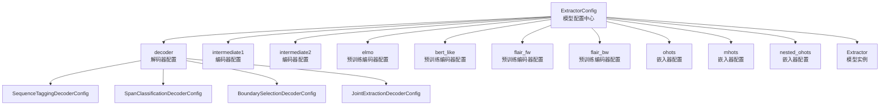
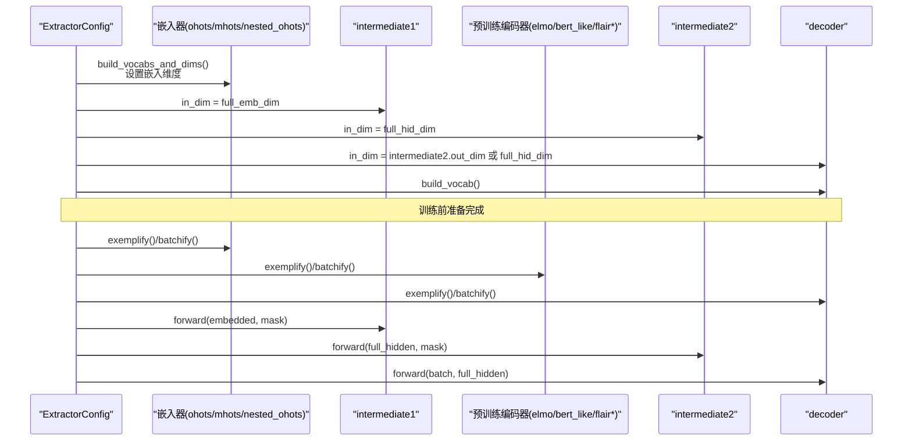
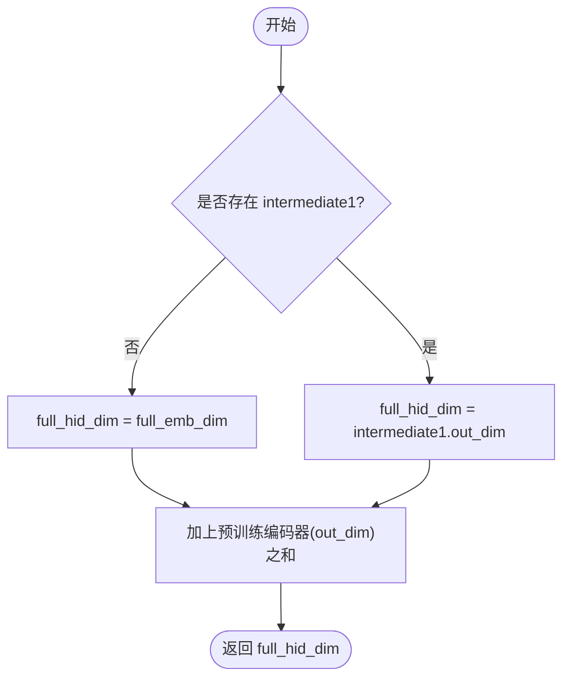
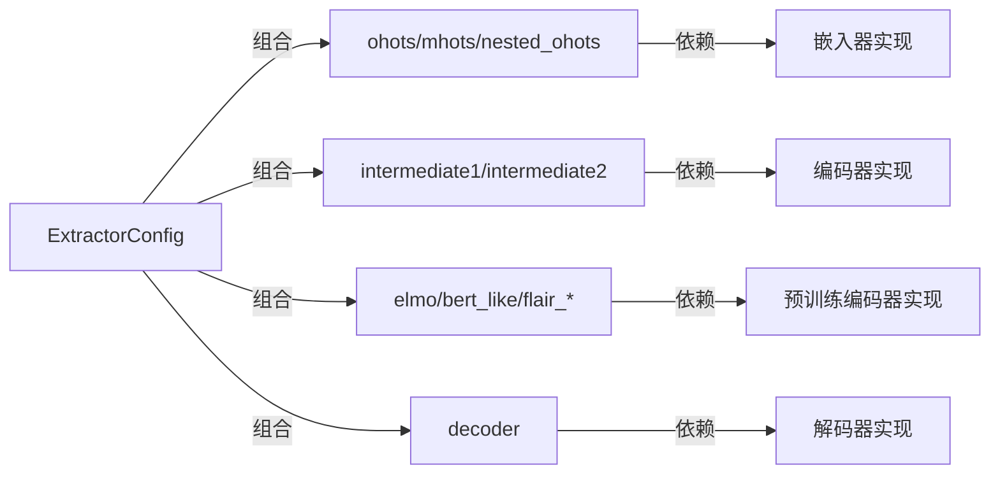

# 模型构建器配置类

<cite>
**本文引用的文件**
- [extractor.py](file://eznlp/model/model/extractor.py)
- [base.py](file://eznlp/model/model/base.py)
- [sequence_tagging.py](file://eznlp/model/decoder/sequence_tagging.py)
- [span_classification.py](file://eznlp/model/decoder/span_classification.py)
- [boundary_selection.py](file://eznlp/model/decoder/boundary_selection.py)
- [joint_extraction.py](file://eznlp/model/decoder/joint_extraction.py)
- [embedder.py](file://eznlp/model/embedder.py)
- [encoder.py](file://eznlp/model/encoder.py)
</cite>

## 目录
1. [简介](#简介)
2. [项目结构](#项目结构)
3. [核心组件](#核心组件)
4. [架构总览](#架构总览)
5. [详细组件分析](#详细组件分析)
6. [依赖关系分析](#依赖关系分析)
7. [性能考量](#性能考量)
8. [故障排查指南](#故障排查指南)
9. [结论](#结论)
10. [附录](#附录)

## 简介
本文件围绕ExtractorConfig类的API进行系统化文档化，重点阐述其作为“模型配置中心”的职责与实现细节。ExtractorConfig负责组织与协调以下子模块：
- 解码器（decoder）：支持序列标注、Span分类、边界选择、联合抽取等多种任务形态
- 编码器（intermediate1、intermediate2）：可选的浅层与深层特征变换
- 嵌入器（ohots、mhots、nested_ohots）：多字段one-hot与软词典嵌入
- 预训练编码器（elmo、bert_like、flair_fw、flair_bw）：外部预训练语言表示
- 维度协调：通过full_emb_dim与full_hid_dim确保各模块输入输出维度一致

同时，文档将深入解析build_vocabs_and_dims、exemplify、batchify三个核心方法的工作机制，并给出多种解码器配置示例及valid属性的验证规则说明。

## 项目结构
下图展示了ExtractorConfig与其相关组件的关系与调用链路。

图表来源
- [extractor.py](file://eznlp/model/model/extractor.py#L23-L120)
- [sequence_tagging.py](file://eznlp/model/decoder/sequence_tagging.py#L93-L140)
- [span_classification.py](file://eznlp/model/decoder/span_classification.py#L27-L87)
- [boundary_selection.py](file://eznlp/model/decoder/boundary_selection.py#L92-L128)
- [joint_extraction.py](file://eznlp/model/decoder/joint_extraction.py#L67-L110)

章节来源
- [extractor.py](file://eznlp/model/model/extractor.py#L23-L120)

## 核心组件
- ExtractorConfig：模型配置中心，负责装配解码器、嵌入器、编码器与预训练编码器，并完成维度协调与数据管线的构建。
- ModelConfigBase：所有模型配置的基础类，提供通用的valid校验、名称拼接与抽象接口。
- 解码器配置族：SequenceTaggingDecoderConfig、SpanClassificationDecoderConfig、BoundarySelectionDecoderConfig、JointExtractionDecoderConfig。
- 嵌入器配置族：OneHotConfig、MultiHotConfig（在嵌套场景中可能使用SoftLexiconConfig）。
- 编码器配置：EncoderConfig，支持FFN/LSTM/GRU/Conv/Gehring/Transformer等架构。

章节来源
- [extractor.py](file://eznlp/model/model/extractor.py#L23-L120)
- [base.py](file://eznlp/model/model/base.py#L10-L62)
- [embedder.py](file://eznlp/model/embedder.py#L51-L139)
- [encoder.py](file://eznlp/model/encoder.py#L15-L75)

## 架构总览
下图展示ExtractorConfig在训练/推理阶段的数据流与维度传递路径。

图表来源
- [extractor.py](file://eznlp/model/model/extractor.py#L121-L203)
- [encoder.py](file://eznlp/model/encoder.py#L15-L75)

## 详细组件分析

### 初始化与参数配置
- 解码器decoder
  - 支持传入具体解码器配置对象或字符串别名：
    - "sequence_tagging" → SequenceTaggingDecoderConfig
    - "span_classification" → SpanClassificationDecoderConfig
    - "span_attr" → SpanAttrClassificationDecoderConfig
    - "span_rel" → SpanRelClassificationDecoderConfig
    - "boundary" → BoundarySelectionDecoderConfig
    - "joint_extraction" → JointExtractionDecoderConfig（默认组合span_classification与span_rel）
  - 若传入字符串但不匹配任何已知别名，将抛出异常
- 嵌入器
  - ohots：默认为ConfigDict({"text": OneHotConfig(field="text")})；可按字段扩展
  - mhots：多字段多热嵌入（需在构建维度时提供tokens以确定维度）
  - nested_ohots：嵌套层级的one-hot或软词典嵌入（SoftLexiconConfig）
- 编码器
  - intermediate1：可选，若未设置则直接使用full_emb_dim作为后续输入
  - intermediate2：默认EncoderConfig(arch="LSTM")
- 预训练编码器
  - elmo、bert_like、flair_fw、flair_bw：可选，按需启用
- 其他
  - 通过super().__init__(**kwargs)将其他通用配置透传给基类

章节来源
- [extractor.py](file://eznlp/model/model/extractor.py#L49-L89)
- [joint_extraction.py](file://eznlp/model/decoder/joint_extraction.py#L67-L110)

### 维度协调：full_emb_dim与full_hid_dim
- full_emb_dim
  - 定义：ohots、mhots、nested_ohots各配置项的out_dim之和
  - 用途：作为intermediate1的in_dim，或在无intermediate1时作为intermediate2的in_dim
- full_hid_dim
  - 定义：若存在intermediate1，则取其out_dim；否则取full_emb_dim
  - 再加上所有已启用的预训练编码器（elmo、bert_like、flair_fw、flair_bw）的out_dim之和
  - 用途：作为intermediate2的in_dim，以及decoder的in_dim（若未设置intermediate2则decoder直接接收full_hid_dim）

图表来源
- [extractor.py](file://eznlp/model/model/extractor.py#L98-L119)

章节来源
- [extractor.py](file://eznlp/model/model/extractor.py#L98-L119)

### build_vocabs_and_dims：词汇表构建与维度设定
- 功能：对ohots/mhots/nested_ohots进行词汇表构建；对mhots进行维度推断；对nested_ohots（软词典）构建频率统计；随后设置各模块的in_dim/out_dim并构建decoder的词汇表。
- 关键步骤
  - ohots：逐个配置调用build_vocab(*partitions)
  - mhots：逐个配置调用build_dim(partitions[0][0]["tokens"])，用于确定嵌入维度
  - nested_ohots：逐个配置调用build_vocab(*partitions)，若为SoftLexiconConfig则额外构建频率统计（跳过最后一个划分，通常为测试集）
  - intermediate1：若存在，将其in_dim设为full_emb_dim
  - intermediate2：若存在，将其in_dim设为full_hid_dim，并将decoder.in_dim设为intermediate2.out_dim；否则将decoder.in_dim设为full_hid_dim
  - decoder：调用build_vocab(*partitions)完成标签/类别词汇表构建

章节来源
- [extractor.py](file://eznlp/model/model/extractor.py#L121-L147)

### exemplify：示例化（从原始样本到张量示例）
- 功能：将单条数据样本转换为可用于训练/评估的示例字典
- 处理流程
  - 对ohots/mhots/nested_ohots：分别调用对应配置的exemplify(data_entry["tokens"])生成张量
  - 对预训练编码器：调用对应配置的exemplify(data_entry["tokens"])生成相应输入
  - 对decoder：调用decoder.exemplify(data_entry, training=training)
  - 合并为一个示例字典并返回

章节来源
- [extractor.py](file://eznlp/model/model/extractor.py#L148-L172)

### batchify：批处理（从示例列表到批次张量）
- 功能：将一批示例合并为可用于模型前向的批次
- 处理流程
  - 对ohots/mhots/nested_ohots：对每个字段的示例列表调用对应配置的batchify
  - 对预训练编码器：对每个批次示例的对应字段调用batchify
  - 对decoder：调用decoder.batchify(batch_examples)
  - 合并为一个批次字典并返回

章节来源
- [extractor.py](file://eznlp/model/model/extractor.py#L174-L202)

### instantiate：实例化模型
- 功能：在配置通过valid校验后，构造具体的Extractor模型实例
- 注意：仅在最外层进行valid断言，内部不再重复校验

章节来源
- [extractor.py](file://eznlp/model/model/extractor.py#L204-L208)

### 解码器配置示例与用法要点
- 序列标注（SequenceTagging）
  - 适用：基于标签序列的任务，如命名实体识别（BILOU/BIOES等标注方案）
  - 关键点：可选CRF损失；需构建标签词汇表；支持BIOES等标注方案
  - 参考路径：[SequenceTaggingDecoderConfig](file://eznlp/model/decoder/sequence_tagging.py#L93-L140)
- Span分类（SpanClassification）
  - 适用：基于Span的分类任务，支持多标签与边界平滑策略
  - 关键点：自动统计最大Span长度与尺寸嵌入维度；支持多标签与内部/外部Span采样
  - 参考路径：[SpanClassificationDecoderConfig](file://eznlp/model/decoder/span_classification.py#L27-L87)
- 边界选择（BoundarySelection）
  - 适用：通过起止位置打分的Span分类任务，适合长序列与重叠实体
  - 关键点：双线性打分矩阵；支持尺寸嵌入与边界平滑；可配置优先级过滤
  - 参考路径：[BoundarySelectionDecoderConfig](file://eznlp/model/decoder/boundary_selection.py#L92-L128)
- 联合抽取（JointExtraction）
  - 适用：同时抽取主任务（如Span分类）与属性/关系任务
  - 关键点：可组合多个解码器；支持权重分配；需满足至少两个解码器有效
  - 参考路径：[JointExtractionDecoderConfig](file://eznlp/model/decoder/joint_extraction.py#L67-L110)

章节来源
- [sequence_tagging.py](file://eznlp/model/decoder/sequence_tagging.py#L93-L140)
- [span_classification.py](file://eznlp/model/decoder/span_classification.py#L27-L87)
- [boundary_selection.py](file://eznlp/model/decoder/boundary_selection.py#L92-L128)
- [joint_extraction.py](file://eznlp/model/decoder/joint_extraction.py#L67-L110)

### valid属性验证规则
- 基础校验：继承自ModelConfigBase，遍历_all_names下的所有子配置，若为字典则检查其中每个配置的valid，否则检查自身valid
- 特殊规则：ExtractorConfig在基础校验基础上增加对bert_like的限制：当bert_like非空时，必须满足from_tokenized条件

章节来源
- [base.py](file://eznlp/model/model/base.py#L21-L33)
- [extractor.py](file://eznlp/model/model/extractor.py#L92-L96)

## 依赖关系分析
- 组件耦合
  - ExtractorConfig与各子配置之间为组合关系，通过ConfigDict/ConfigList管理集合型嵌入器
  - 编码器与嵌入器之间通过维度对接（in_dim/out_dim）形成流水线
  - 解码器依赖于构建好的词汇表与维度信息
- 外部依赖
  - 预训练编码器（ELMo、BERT-like、Flair）通过各自的Config.exemplify与batchify参与数据管线
- 循环依赖
  - 未发现循环依赖迹象；配置类仅向下依赖具体实现，不反向依赖模型实例

图表来源
- [extractor.py](file://eznlp/model/model/extractor.py#L23-L120)

章节来源
- [extractor.py](file://eznlp/model/model/extractor.py#L23-L120)

## 性能考量
- 维度对齐
  - 使用full_emb_dim与full_hid_dim统一管理嵌入与编码后的维度，避免显式硬编码导致的维度错配
- 批处理优化
  - exemplify/batchify采用字典聚合，便于并行化与内存复用
- 预训练编码器参数共享
  - 可通过pretrained_parameters集中获取预训练参数，便于学习率调度与冻结策略
- 计算图复用
  - ModelBase在forward2states中缓存中间状态，decode阶段可直接复用，减少重复计算

章节来源
- [extractor.py](file://eznlp/model/model/extractor.py#L211-L274)
- [base.py](file://eznlp/model/model/base.py#L64-L99)

## 故障排查指南
- 解码器别名无效
  - 现象：初始化时抛出异常，提示decoder非法
  - 排查：确认decoder字符串是否匹配已支持的别名
  - 参考路径：[ExtractorConfig.__init__](file://eznlp/model/model/extractor.py#L70-L88)
- bert_like未满足from_tokenized
  - 现象：valid校验失败
  - 排查：确保bert_like配置满足from_tokenized要求
  - 参考路径：[ExtractorConfig.valid](file://eznlp/model/model/extractor.py#L92-L96)
- mhots维度未推断
  - 现象：构建维度时报错或维度不匹配
  - 排查：确保在build_vocabs_and_dims中传入了包含tokens的分区首元素
  - 参考路径：[ExtractorConfig.build_vocabs_and_dims](file://eznlp/model/model/extractor.py#L121-L147)
- nested_ohots软词典频率统计异常
  - 现象：SoftLexiconConfig未正确构建频率统计
  - 排查：确认nested_ohots为SoftLexiconConfig且构建流程未被跳过
  - 参考路径：[ExtractorConfig.build_vocabs_and_dims](file://eznlp/model/model/extractor.py#L131-L136)
- 解码器词汇表缺失
  - 现象：训练/评估时报词汇表相关错误
  - 排查：确认decoder.build_vocab已执行，且数据分区包含chunks信息
  - 参考路径：[ExtractorConfig.build_vocabs_and_dims](file://eznlp/model/model/extractor.py#L141-L147)

章节来源
- [extractor.py](file://eznlp/model/model/extractor.py#L70-L96)
- [extractor.py](file://eznlp/model/model/extractor.py#L121-L147)

## 结论
ExtractorConfig作为模型配置中心，通过清晰的层次化装配与严格的维度协调机制，实现了从嵌入、编码到解码的全链路配置与实例化。其build_vocabs_and_dims、exemplify、batchify三大方法覆盖了训练前准备、示例化与批处理的核心流程；valid属性确保了配置的完整性与兼容性。结合多种解码器配置，用户可以灵活适配序列标注、Span分类、边界选择与联合抽取等任务形态。

## 附录
- 常用配置要点速查
  - 嵌入器：ohots默认字段为"text"；mhots需提供tokens以推断维度；nested_ohots可选SoftLexiconConfig
  - 编码器：intermediate1可选；intermediate2默认LSTM；out_dim由in_dim与架构决定
  - 解码器：根据任务选择对应配置；JointExtraction可组合多个子解码器
- 相关参考路径
  - [ExtractorConfig类定义](file://eznlp/model/model/extractor.py#L23-L208)
  - [ModelConfigBase基础类](file://eznlp/model/model/base.py#L10-L62)
  - [OneHotConfig嵌入器](file://eznlp/model/embedder.py#L51-L139)
  - [EncoderConfig编码器](file://eznlp/model/encoder.py#L15-L75)
  - [SequenceTagging解码器](file://eznlp/model/decoder/sequence_tagging.py#L93-L140)
  - [SpanClassification解码器](file://eznlp/model/decoder/span_classification.py#L27-L87)
  - [BoundarySelection解码器](file://eznlp/model/decoder/boundary_selection.py#L92-L128)
  - [JointExtraction解码器](file://eznlp/model/decoder/joint_extraction.py#L67-L110)