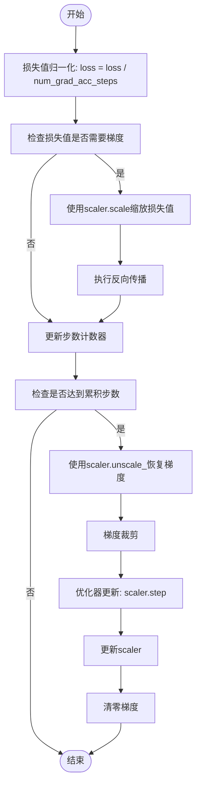
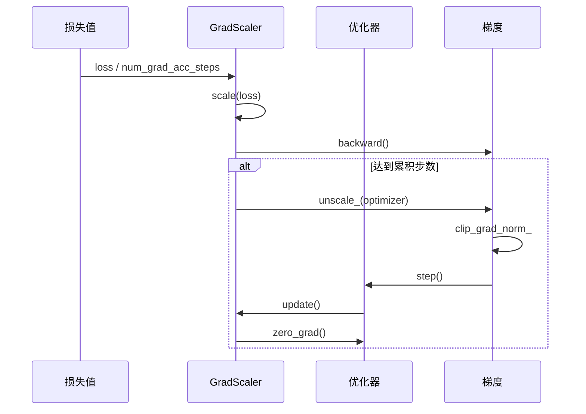
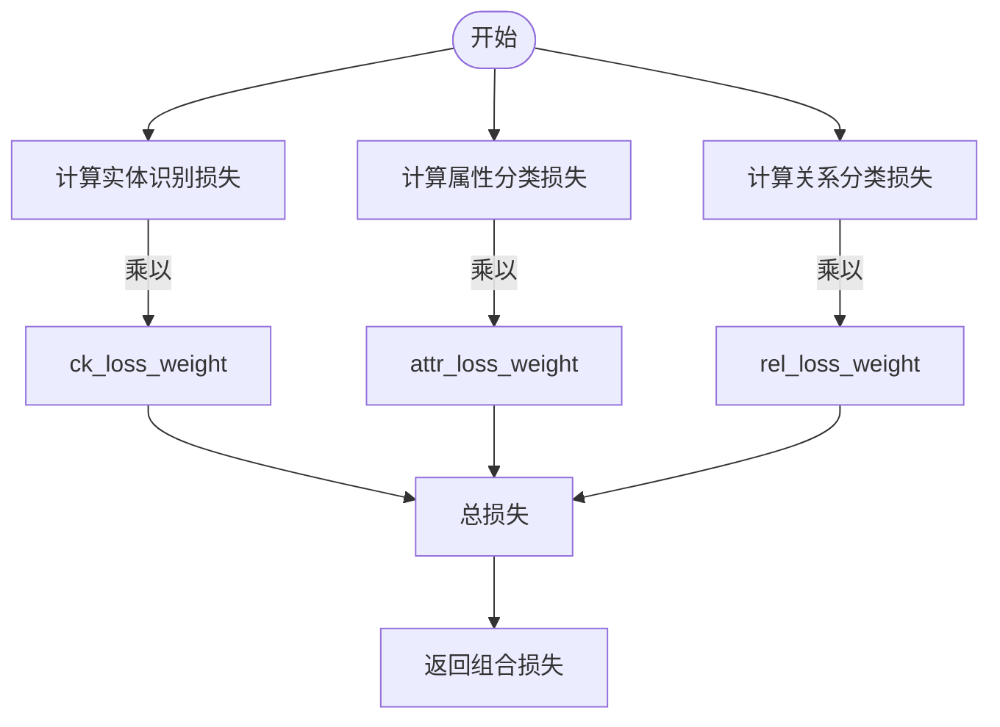

# 前向与反向传播

<cite>
**本文档引用的文件**   
- [trainer.py](file://eznlp/training/trainer.py)
- [base.py](file://eznlp/model/model/base.py)
- [wrapper.py](file://eznlp/wrapper.py)
- [sequence_tagging.py](file://eznlp/model/decoder/sequence_tagging.py)
- [joint_extraction.py](file://eznlp/model/decoder/joint_extraction.py)
</cite>

## 目录
1. [前向传播机制](#前向传播机制)
2. [反向传播与梯度累积](#反向传播与梯度累积)
3. [混合精度训练流程](#混合精度训练流程)
4. [复杂损失计算场景](#复杂损失计算场景)
5. [多任务学习中的损失组合](#多任务学习中的损失组合)
6. [空实体集情况下的梯度处理](#空实体集情况下的梯度处理)

## 前向传播机制

`forward_batch`方法负责执行前向传播计算，返回损失值和预测结果。该方法首先调用模型的`forward`函数，获取损失值和状态信息，然后根据模型配置决定返回内容。

当模型不包含解码器或解码器不产生度量时，方法仅返回平均损失值。当模型包含解码器时，方法还会调用解码器的`_unsqueezed_decode`方法获取预测结果，并与损失值一起返回。

**Section sources**
- [trainer.py](file://eznlp/training/trainer.py#L64-L81)
- [base.py](file://eznlp/model/model/base.py#L84-L92)

## 反向传播与梯度累积

`backward_batch`方法处理反向传播和梯度累积。该方法首先将损失值除以梯度累积步数，实现损失归一化，确保累积梯度等价于在更大批量上计算的梯度。

方法会检查损失值是否需要梯度计算，以处理特殊情况（如空实体集）。如果需要梯度，使用AMP（自动混合精度）的`scaler.scale`方法缩放损失值，然后执行反向传播。

当达到梯度累积步数时，执行梯度裁剪、优化器更新和梯度清零操作。学习率调度器根据配置在每一步或每个累积周期后更新。

**Diagram sources **
- [trainer.py](file://eznlp/training/trainer.py#L82-L113)

**Section sources**
- [trainer.py](file://eznlp/training/trainer.py#L82-L113)

## 混合精度训练流程

混合精度训练通过`torch.amp.GradScaler`实现，包含`scaler.scale`、`scaler.unscale_`和`scaler.step`等关键操作。

`scaler.scale`在反向传播前缩放损失值，防止小梯度值在半精度计算中下溢。`scaler.unscale_`在梯度裁剪前将梯度恢复到原始尺度，确保裁剪操作在正确尺度上进行。`scaler.step`在优化器更新时自动处理梯度缩放，`scaler.update`则更新缩放因子以适应后续迭代。

**Diagram sources **
- [trainer.py](file://eznlp/training/trainer.py#L62-L113)

**Section sources**
- [trainer.py](file://eznlp/training/trainer.py#L62-L113)

## 复杂损失计算场景

在复杂损失计算场景中，系统需要处理多种特殊情况。对于序列标注任务，损失计算可能使用CRF或交叉熵损失函数，其中CRF损失考虑标签间的转移概率，而交叉熵损失则独立计算每个位置的损失。

损失值的计算方式取决于具体任务和模型配置。在序列标注中，损失通常在序列长度维度上求和，然后在整个批次上取平均。这种计算方式确保了不同长度序列的损失具有可比性。

**Section sources**
- [sequence_tagging.py](file://eznlp/model/decoder/sequence_tagging.py#L157-L178)

## 多任务学习中的损失组合

在多任务学习中，`JointExtractionDecoder`负责组合多个子任务的损失值。每个子任务（如实体识别、属性分类、关系分类）都有独立的解码器和损失计算方法。

损失组合通过加权求和实现，每个子任务的损失乘以其对应的权重系数（`ck_loss_weight`、`attr_loss_weight`、`rel_loss_weight`）。这种设计允许调整不同任务的重要性，实现多任务学习的平衡。

**Diagram sources **
- [joint_extraction.py](file://eznlp/model/decoder/joint_extraction.py#L166-L177)

**Section sources**
- [joint_extraction.py](file://eznlp/model/decoder/joint_extraction.py#L166-L177)

## 空实体集情况下的梯度处理

在空实体集情况下，某些任务可能无法生成有效的损失计算（如关系分类中无实体则无法生成关系对）。系统通过检查`loss.requires_grad`属性来处理这种情况。

当损失值不需要梯度时（即所有计算张量都不需要梯度），跳过反向传播步骤，但仍更新步数计数器。这种设计确保了训练过程的连续性，避免因个别批次无法计算梯度而导致训练中断。

此外，系统在梯度累积过程中保持步数计数器的递增，确保学习率调度器能够正确更新，即使在某些步骤跳过了实际的参数更新。

**Section sources**
- [trainer.py](file://eznlp/training/trainer.py#L95-L98)
- [joint_extraction.py](file://eznlp/model/decoder/joint_extraction.py#L169-L176)