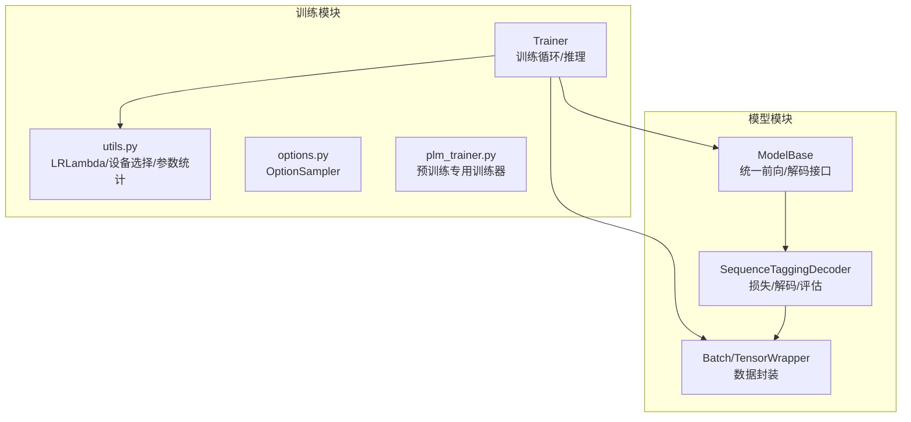
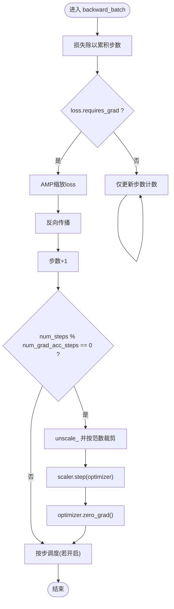
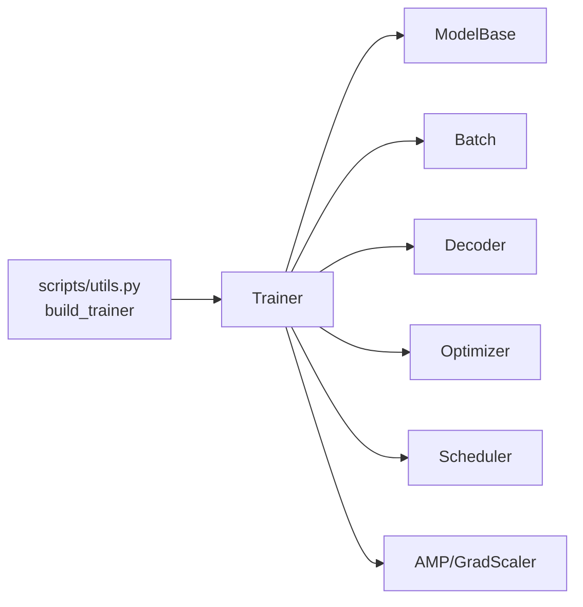
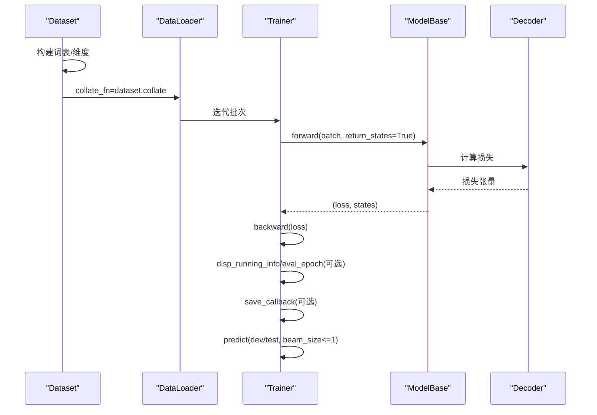

# 训练器API

<cite>
**本文引用的文件**
- [trainer.py](file://eznlp/training/trainer.py)
- [base.py](file://eznlp/model/model/base.py)
- [wrapper.py](file://eznlp/wrapper.py)
- [sequence_tagging.py](file://eznlp/model/decoder/sequence_tagging.py)
- [utils.py](file://eznlp/training/utils.py)
- [__init__.py](file://eznlp/training/__init__.py)
- [test_trainer.py](file://tests/training/test_trainer.py)
- [utils.py（scripts）](file://scripts/utils.py)
- [text2text.py](file://scripts/text2text.py)
</cite>

## 目录
1. [简介](#简介)
2. [项目结构](#项目结构)
3. [核心组件](#核心组件)
4. [架构总览](#架构总览)
5. [详细组件分析](#详细组件分析)
6. [依赖分析](#依赖分析)
7. [性能考虑](#性能考虑)
8. [故障排查指南](#故障排查指南)
9. [结论](#结论)
10. [附录](#附录)

## 简介
本文件面向“训练器API”，聚焦于 eznlp 中的 Trainer 类，系统性阐述其初始化参数、训练与推理流程、混合精度与梯度累积策略、学习率调度器的配合方式，并通过序列标注任务示例展示从数据加载到训练、评估、推理的完整闭环。读者无需深入底层即可理解 Trainer 的使用方式与关键行为。

## 项目结构
Trainer 所在模块位于 eznlp/training，围绕训练循环、评估、选项采样与工具函数组织；模型侧通过 ModelBase 提供统一的前向接口，Batch 包装数据张量，解码器负责损失计算与指标评估。



图表来源
- [trainer.py](file://eznlp/training/trainer.py#L1-L200)
- [base.py](file://eznlp/model/model/base.py#L64-L99)
- [sequence_tagging.py](file://eznlp/model/decoder/sequence_tagging.py#L143-L198)
- [wrapper.py](file://eznlp/wrapper.py#L97-L122)
- [utils.py](file://eznlp/training/utils.py#L1-L120)

章节来源
- [trainer.py](file://eznlp/training/trainer.py#L1-L200)
- [__init__.py](file://eznlp/training/__init__.py#L1-L37)

## 核心组件
- Trainer：封装训练与推理的统一入口，支持梯度累积、混合精度、学习率调度、梯度裁剪、按步/按轮调度等。
- ModelBase：提供 forward/forward2states 接口，将解码器与编码器/嵌入器组合为端到端模型。
- Batch/TensorWrapper：对张量进行递归封装与设备迁移，保证数据在 GPU/CPU 上的高效传输。
- SequenceTaggingDecoder：示例解码器，负责标签序列损失计算、标签解码与实体级评估指标。

章节来源
- [trainer.py](file://eznlp/training/trainer.py#L15-L124)
- [base.py](file://eznlp/model/model/base.py#L64-L99)
- [wrapper.py](file://eznlp/wrapper.py#L97-L122)
- [sequence_tagging.py](file://eznlp/model/decoder/sequence_tagging.py#L143-L198)

## 架构总览
Trainer 将“数据批”经由模型前向得到损失与中间状态，再根据是否需要指标返回额外预测；随后执行反向传播与权重更新；在推理阶段，支持直接解码或 beam search。

```mermaid
sequenceDiagram
participant DL as "DataLoader"
participant TR as "Trainer"
participant MD as "ModelBase"
participant DEC as "Decoder"
participant OPT as "Optimizer"
participant SCH as "Scheduler"
DL->>TR : 迭代批次
TR->>MD : 前向(batch, return_states=True)
MD->>DEC : 计算损失
DEC-->>MD : 损失张量
MD-->>TR : (loss, states)
TR->>TR : 混合精度/损失缩放/梯度累积
TR->>OPT : 反向传播/权重更新(按步)
TR->>SCH : 调度器步进(按步/按轮)
```

图表来源
- [trainer.py](file://eznlp/training/trainer.py#L64-L124)
- [trainer.py](file://eznlp/training/trainer.py#L155-L190)
- [base.py](file://eznlp/model/model/base.py#L84-L93)
- [sequence_tagging.py](file://eznlp/model/decoder/sequence_tagging.py#L157-L179)

## 详细组件分析

### 初始化参数与配置要点
- 关键参数
  - model: ModelBase 实例，需具备 decoder 属性以确定指标数量。
  - optimizer: PyTorch 优化器实例。
  - scheduler: 学习率调度器；当 schedule_by_step=True 时禁止 ReduceLROnPlateau。
  - schedule_by_step: 是否按“步”调度（否则按“轮”调度）。
  - num_grad_acc_steps: 梯度累积步数，默认 1；实际批大小等于名义批大小乘以该值。
  - device: 训练设备（必须显式指定）。
  - non_blocking: 数据搬运非阻塞标志。
  - grad_clip: 梯度范数裁剪阈值。
  - use_amp: 是否启用混合精度训练。
- 内部状态
  - scaler: GradScaler，用于 AMP。
  - num_steps: 当前累计步数，用于控制优化器步进与梯度累积。
  - num_metrics: 来自 decoder 的指标数量，决定是否返回预测与评估。

章节来源
- [trainer.py](file://eznlp/training/trainer.py#L27-L63)
- [trainer.py](file://eznlp/training/trainer.py#L15-L26)

### forward_batch：前向与可选指标返回
- 行为
  - 调用模型前向，返回损失张量；若存在指标（num_metrics > 0），同时返回解码后的预测列表。
  - 损失取平均后作为标量参与后续反向传播。
- 返回
  - 单损失标量，或 (loss, y_pred_1, y_pred_2, ...) 元组。

章节来源
- [trainer.py](file://eznlp/training/trainer.py#L64-L81)
- [base.py](file://eznlp/model/model/base.py#L84-L93)

### backward_batch：反向传播与权重更新
- 梯度累积
  - 将损失除以 num_grad_acc_steps，使有效批大小保持一致。
- 混合精度
  - 使用 scaler.scale(loss) 后反向，避免低精度下梯度溢出。
- 梯度裁剪
  - 在每“真实步”（num_steps % num_grad_acc_steps == 0）时执行裁剪与优化器步进。
  - 支持按范数裁剪，避免梯度爆炸。
- 学习率调度
  - 若 schedule_by_step 且已达到至少一个真实步，则按步调度；
  - 否则按轮调度（如 ReduceLROnPlateau 依据验证指标或损失）。



图表来源
- [trainer.py](file://eznlp/training/trainer.py#L82-L123)

章节来源
- [trainer.py](file://eznlp/training/trainer.py#L82-L123)

### train_epoch：按轮训练
- 流程
  - 设置模型为 train 模式。
  - 对每个批次：
    - 数据迁移到目标设备。
    - AMP 自动混合精度前向。
    - 若存在指标，收集 gold/pred 用于评估。
    - 反向传播与优化器步进。
  - 返回平均损失；若存在指标，返回 (avg_loss, metrics...)。
- 与 eval_epoch 的差异
  - eval_epoch 在 torch.no_grad 上运行，不参与反向传播。

章节来源
- [trainer.py](file://eznlp/training/trainer.py#L155-L190)
- [trainer.py](file://eznlp/training/trainer.py#L191-L219)

### predict：推理与 Beam Search
- 功能
  - 支持两种模式：
    - beam_size <= 1：直接调用模型 forward2states + 解码器解码。
    - beam_size > 1：调用模型 beam_search（要求 num_metrics == 1）。
  - 返回单个指标的预测列表，或多指标的列表集合。
- 注意
  - 当 num_metrics > 1 时，禁止 beam_size > 1。

章节来源
- [trainer.py](file://eznlp/training/trainer.py#L124-L154)

### train_steps：按步训练与早停/保存
- 主要能力
  - 支持按步显示训练信息、按步评估开发集并保存模型。
  - 支持按损失或指标保存（save_by_loss 控制）。
  - schedule_by_step 为真时按步调度；否则按轮调度（含 ReduceLROnPlateau）。
- 关键参数
  - train_loader/dev_loader：训练/开发数据加载器。
  - num_epochs/max_steps：最大轮数/步数。
  - disp_every_steps/eval_every_steps：显示频率与评估频率（需整除关系）。
  - save_callback：保存模型回调。
  - save_by_loss：按损失还是指标保存。
- 输出
  - 训练过程日志；开发集上损失/指标；最佳模型保存。

章节来源
- [trainer.py](file://eznlp/training/trainer.py#L221-L376)

### 混合精度与梯度累积
- AMP
  - Trainer 内置 GradScaler，结合 autocast 进行自动混合精度。
  - backward_batch 中对 loss 进行 scale 后反向，随后 unscale 与 step。
- 梯度累积
  - 通过 num_grad_acc_steps 控制“真实步”的更新频率，使有效批大小为名义批大小乘以该值。

章节来源
- [trainer.py](file://eznlp/training/trainer.py#L62-L63)
- [trainer.py](file://eznlp/training/trainer.py#L91-L114)

### 学习率调度器
- 支持按步/按轮两种模式
  - schedule_by_step=True：在 backward_batch 中按步推进 scheduler。
  - schedule_by_step=False：在 eval_epoch 或 train_steps 结束后按轮推进 scheduler。
- 特殊限制
  - schedule_by_step=True 时禁止使用 ReduceLROnPlateau。
- 工具函数
  - LRLambda 提供常量、线性衰减、指数衰减、幂律衰减等 warmup 策略。

章节来源
- [trainer.py](file://eznlp/training/trainer.py#L46-L49)
- [trainer.py](file://eznlp/training/trainer.py#L117-L123)
- [utils.py](file://eznlp/training/utils.py#L13-L85)

### 与模型/解码器的协作
- 模型前向
  - ModelBase.forward 返回损失；若 return_states=True，同时返回中间状态供 Trainer 使用。
- 解码器
  - 解码器负责损失计算与标签/实体解码；Trainer 通过 _unsqueezed_decode/_unsqueezed_retrieve/_unsqueezed_evaluate 与之交互。
- 示例：序列标注
  - SequenceTaggingDecoder 使用 CRF 或交叉熵计算损失，并将标签序列解码为实体块，用于评估 micro-F1。

章节来源
- [base.py](file://eznlp/model/model/base.py#L84-L93)
- [sequence_tagging.py](file://eznlp/model/decoder/sequence_tagging.py#L157-L198)

## 依赖分析
- Trainer 依赖
  - 模型：ModelBase（提供 forward/forward2states）
  - 数据：Batch（设备迁移、张量封装）
  - 解码器：指标数量、解码与评估接口
  - 工具：GradScaler、autocast、clip_grad_norm_
- 间接依赖
  - 训练脚本通过 build_trainer 组装优化器、调度器与 Trainer 实例。



图表来源
- [trainer.py](file://eznlp/training/trainer.py#L64-L124)
- [base.py](file://eznlp/model/model/base.py#L84-L93)
- [wrapper.py](file://eznlp/wrapper.py#L97-L122)
- [utils.py（scripts）](file://scripts/utils.py#L1300-L1338)

章节来源
- [trainer.py](file://eznlp/training/trainer.py#L64-L124)
- [utils.py（scripts）](file://scripts/utils.py#L1300-L1338)

## 性能考虑
- 混合精度
  - AMP 可显著降低显存占用与加速训练，建议在 GPU 上开启 use_amp。
- 梯度累积
  - 在显存受限时通过增大 num_grad_acc_steps 提升有效批大小，注意与学习率的平衡。
- 梯度裁剪
  - 合理设置 grad_clip，避免梯度爆炸导致训练不稳定。
- 设备选择
  - 使用 auto_device 自动选择空闲 GPU，确保稳定训练环境。
- 显示与评估频率
  - disp_every_steps 与 eval_every_steps 应合理设置，避免频繁 I/O 影响吞吐。

章节来源
- [trainer.py](file://eznlp/training/trainer.py#L62-L63)
- [trainer.py](file://eznlp/training/trainer.py#L105-L114)
- [utils.py](file://eznlp/training/utils.py#L158-L202)

## 故障排查指南
- AMP 相关
  - 若 loss.requires_grad 为 False，backward 将不会执行；检查数据是否包含可导张量或解码器是否正确生成损失。
- 梯度累积一致性
  - 测试用例验证了不同批大小与累积步数下的参数一致性，若出现异常可对照该逻辑核验。
- 调度器配置
  - schedule_by_step 与 ReduceLROnPlateau 不兼容；若使用后者，请关闭按步调度。
- 设备与内存
  - 若 CUDA 查询失败或显存不足，auto_device 会回退到 CPU；检查 nvidia-smi 与 CUDA_DEVICE_ORDER。

章节来源
- [trainer.py](file://eznlp/training/trainer.py#L95-L114)
- [test_trainer.py](file://tests/training/test_trainer.py#L36-L84)
- [utils.py](file://eznlp/training/utils.py#L158-L202)

## 结论
Trainer 提供了统一而灵活的训练与推理接口，覆盖混合精度、梯度累积、学习率调度、梯度裁剪与 beam search 等关键能力。通过与 ModelBase/解码器的清晰分工，用户可在多种下游任务（如序列标注、文本生成等）中快速构建稳定的训练流程。

## 附录

### 完整训练循环示例（序列标注）
以下流程展示了从数据准备到训练、评估与推理的关键步骤，便于快速上手。



图表来源
- [trainer.py](file://eznlp/training/trainer.py#L155-L219)
- [trainer.py](file://eznlp/training/trainer.py#L221-L376)
- [base.py](file://eznlp/model/model/base.py#L84-L93)
- [sequence_tagging.py](file://eznlp/model/decoder/sequence_tagging.py#L157-L198)

### 训练脚本中的 Trainer 使用
- 训练脚本通过 build_trainer 组装优化器与调度器，并传入 Trainer。
- 训练完成后，重新加载最优模型并使用 Trainer 进行推理与多 beam_size 评估。

章节来源
- [utils.py（scripts）](file://scripts/utils.py#L1300-L1338)
- [text2text.py](file://scripts/text2text.py#L194-L234)