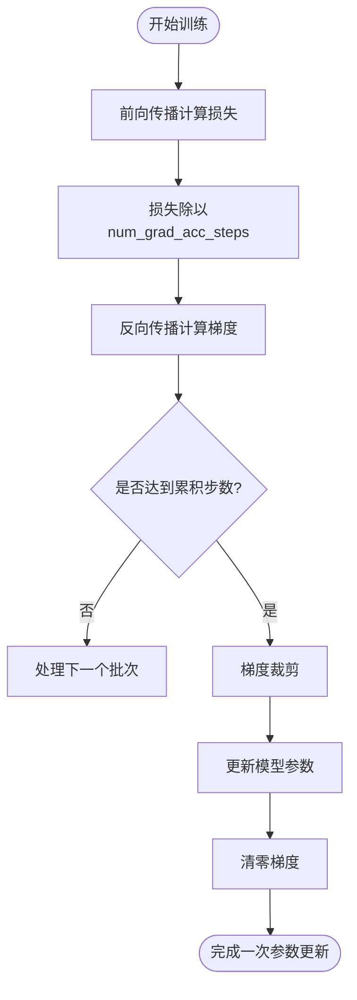
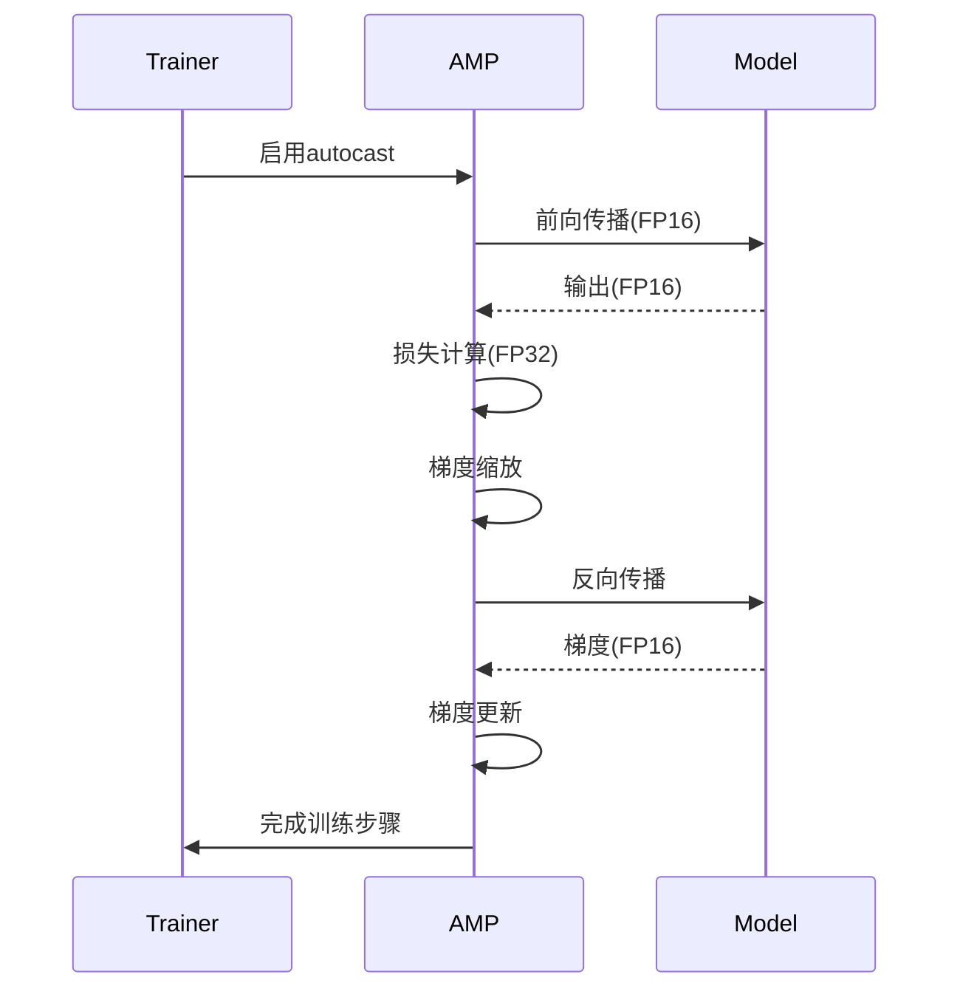
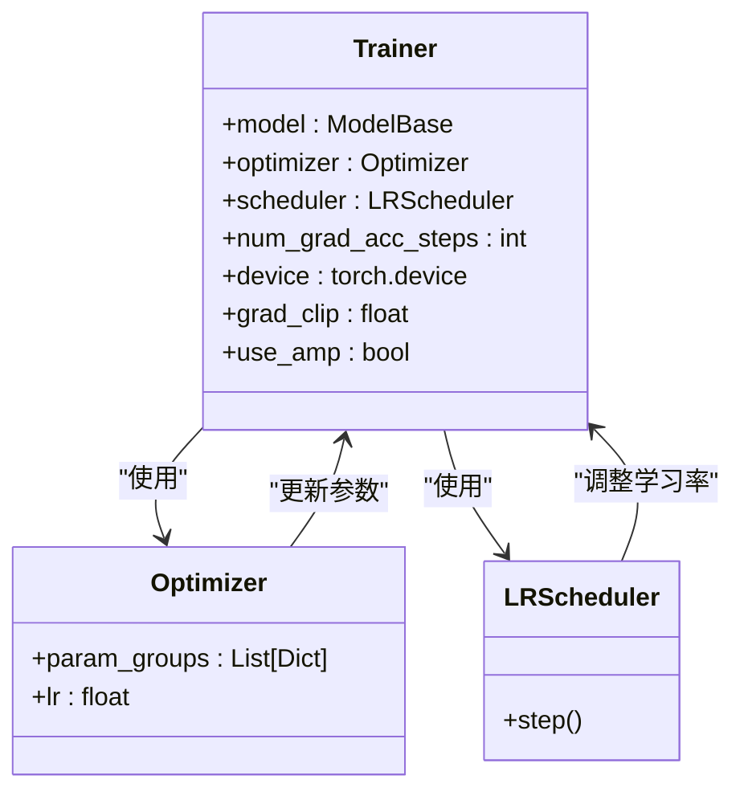
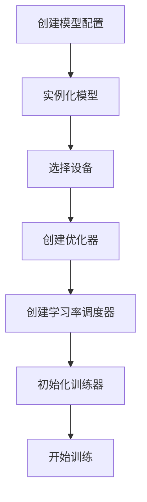

# 训练器初始化

<cite>
**本文档中引用的文件**  
- [trainer.py](file://eznlp/training/trainer.py#L27-L418)
- [utils.py](file://eznlp/training/utils.py#L13-L202)
- [test_trainer.py](file://tests/training/test_trainer.py#L1-L84)
- [text_classification.py](file://scripts/text_classification.py#L204-L304)
- [utils.py](file://scripts/utils.py#L1300-L1358)
</cite>

## 目录
1. [Trainer类初始化参数详解](#trainer类初始化参数详解)
2. [梯度累积机制](#梯度累积机制)
3. [混合精度训练（AMP）](#混合精度训练amp)
4. [优化器与学习率调度器配置](#优化器与学习率调度器配置)
5. [完整代码示例](#完整代码示例)
6. [参数默认值与使用场景](#参数默认值与使用场景)

## Trainer类初始化参数详解

`Trainer`类是eznlp框架中的核心训练组件，负责模型训练过程的控制和管理。其初始化方法接受多个关键参数，这些参数共同决定了训练过程的行为和性能。

**Section sources**
- [trainer.py](file://eznlp/training/trainer.py#L27-L63)

### model参数
`model`参数是训练器的核心，必须是一个继承自`ModelBase`的模型实例。该模型包含了完整的神经网络架构，包括编码器、解码器等组件。训练器通过该参数访问模型的前向传播、反向传播和参数更新功能。

### optimizer参数
`optimizer`参数指定用于更新模型参数的优化器，通常使用`torch.optim`中的优化算法，如`AdamW`。优化器负责根据梯度信息更新模型权重，是训练过程中的关键组件。

### scheduler参数
`scheduler`参数用于配置学习率调度器，可以是`torch.optim.lr_scheduler`中的任何调度器。学习率调度器根据训练进度动态调整学习率，有助于提高模型收敛速度和最终性能。

### num_grad_acc_steps参数
`num_grad_acc_steps`参数控制梯度累积的步数。通过设置该参数，可以在不增加显存占用的情况下模拟更大的批量大小，这对于显存有限的设备尤为重要。

### device参数
`device`参数指定训练所使用的设备，如`cuda:0`或`cpu`。该参数必须显式指定，训练器将把模型和数据移动到指定设备上进行计算。

### non_blocking参数
`non_blocking`参数控制数据传输是否使用非阻塞模式。当设置为`True`时，数据从CPU到GPU的传输不会阻塞主线程，可以提高数据加载效率。

### grad_clip参数
`grad_clip`参数用于梯度裁剪，防止梯度爆炸问题。通过设置梯度范数的最大值，可以稳定训练过程，特别是在处理长序列或深层网络时。

### use_amp参数
`use_amp`参数启用混合精度训练（Automatic Mixed Precision），通过使用半精度浮点数（FP16）来减少显存占用并加速训练，同时保持模型精度。

## 梯度累积机制

梯度累积是一种在有限显存条件下模拟大批量训练的技术。通过`num_grad_acc_steps`参数实现，其工作原理如下：

**Diagram sources**
- [trainer.py](file://eznlp/training/trainer.py#L91-L113)

在每次反向传播前，损失值会被除以`num_grad_acc_steps`，这样累积的梯度相当于在更大的批量上计算得到的梯度。只有当累积了指定步数的梯度后，才会执行参数更新和梯度清零操作。

**Section sources**
- [trainer.py](file://eznlp/training/trainer.py#L91-L113)
- [test_trainer.py](file://tests/training/test_trainer.py#L36-L84)

## 混合精度训练（AMP）

混合精度训练通过结合使用单精度（FP32）和半精度（FP16）浮点数来提高训练效率。在eznlp中，通过`use_amp`参数启用此功能。

**Diagram sources**
- [trainer.py](file://eznlp/training/trainer.py#L62)
- [trainer.py](file://eznlp/training/trainer.py#L168)
- [trainer.py](file://eznlp/training/trainer.py#L100)

混合精度训练使用`torch.amp.GradScaler`来处理梯度缩放，防止半精度计算中的下溢问题。训练器在前向传播时使用`autocast`上下文管理器，自动选择合适的数据类型进行计算。

**Section sources**
- [trainer.py](file://eznlp/training/trainer.py#L62)
- [trainer.py](file://eznlp/training/trainer.py#L168)

## 优化器与学习率调度器配置

优化器和学习率调度器的配置是训练过程中的关键环节。在eznlp中，通常通过`build_trainer`函数来统一配置这些组件。

**Diagram sources**
- [utils.py](file://scripts/utils.py#L1300-L1358)
- [trainer.py](file://eznlp/training/trainer.py#L27-L63)

优化器通常会为不同类型的参数设置不同的学习率，例如预训练模型参数使用较小的学习率进行微调，而新添加的层使用较大的学习率。学习率调度器可以根据训练进度动态调整学习率，常见的策略包括线性衰减、指数衰减等。

**Section sources**
- [utils.py](file://scripts/utils.py#L1300-L1358)
- [utils.py](file://eznlp/training/utils.py#L13-L84)

## 完整代码示例

以下是一个完整的训练器初始化代码示例，展示了如何配置优化器和学习率调度器：

**Diagram sources**
- [text_classification.py](file://scripts/text_classification.py#L204-L304)
- [utils.py](file://scripts/utils.py#L1300-L1358)

该示例展示了从模型配置到训练器初始化的完整流程，包括设备选择、优化器创建、学习率调度器配置等关键步骤。

**Section sources**
- [text_classification.py](file://scripts/text_classification.py#L204-L304)
- [utils.py](file://scripts/utils.py#L1300-L1358)

## 参数默认值与使用场景

### 默认值分析
- `num_grad_acc_steps`: 默认值为1，表示不使用梯度累积
- `non_blocking`: 默认值为False，数据传输为阻塞模式
- `grad_clip`: 默认值为None，不进行梯度裁剪
- `use_amp`: 默认值为False，不启用混合精度训练

### 使用场景
**non_blocking数据传输**适用于数据加载成为训练瓶颈的场景。当数据预处理和加载耗时较长时，启用非阻塞传输可以让数据加载和模型计算并行进行，提高GPU利用率。

**梯度裁剪**在处理长序列数据或深层神经网络时特别有用。这些场景下梯度容易出现爆炸现象，通过设置`grad_clip`参数（通常为1.0或5.0）可以有效稳定训练过程。

**Section sources**
- [trainer.py](file://eznlp/training/trainer.py#L33-L37)
- [trainer.py](file://eznlp/training/trainer.py#L50-L54)
- [trainer.py](file://eznlp/training/trainer.py#L60-L61)