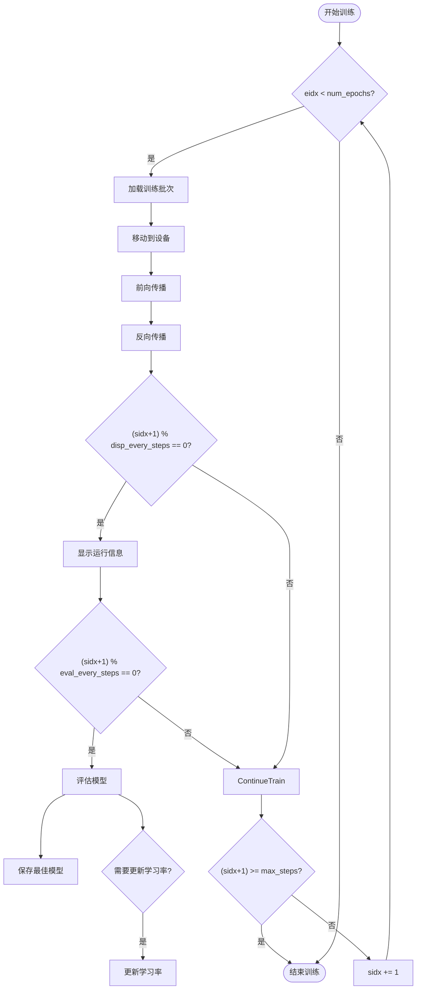
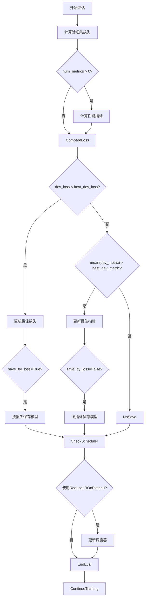
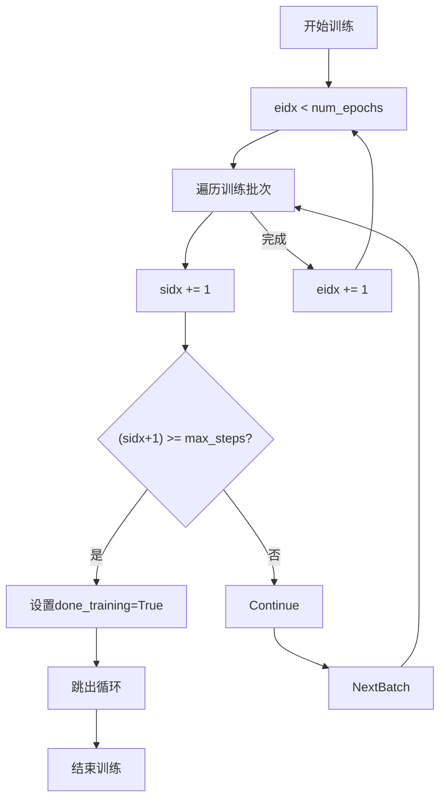

# 步进式训练控制

<cite>
**本文档引用的文件**   
- [trainer.py](file://eznlp/training/trainer.py#L221-L375)
- [utils.py](file://eznlp/training/utils.py#L377-L417)
- [text2text.py](file://scripts/text2text.py#L215-L224)
- [text_classification.py](file://scripts/text_classification.py#L275-L284)
- [pretraining.py](file://scripts/pretraining.py#L234-L239)
</cite>

## 目录
1. [引言](#引言)
2. [核心训练机制](#核心训练机制)
3. [早期停止与模型保存](#早期停止与模型保存)
4. [终止条件协同工作](#终止条件协同工作)
5. [分布式训练适用性](#分布式训练适用性)
6. [高级配置示例](#高级配置示例)
7. [总结](#总结)

## 引言
本文档全面解析`train_steps`方法的步进式训练机制，详细说明其如何实现基于训练步数而非epoch的训练控制。重点阐述定期评估、运行信息显示和模型保存的协调机制，以及早期停止的实现逻辑。

## 核心训练机制

`train_steps`方法实现了基于训练步数的精细化控制，通过`disp_every_steps`和`eval_every_steps`参数协调运行信息显示和模型评估。该方法支持`max_steps`和`num_epochs`双重终止条件，确保训练过程的灵活性和可控性。

**步进式训练流程**


**Diagram sources**
- [trainer.py](file://eznlp/training/trainer.py#L277-L374)

**Section sources**
- [trainer.py](file://eznlp/training/trainer.py#L221-L375)

## 早期停止与模型保存

`train_steps`方法实现了两种模型保存策略：基于损失和基于性能指标。通过`save_by_loss`参数控制保存策略，当`save_by_loss=True`时根据损失值保存模型，否则根据性能指标（如F1分数）保存。

**早期停止逻辑**


**Diagram sources**
- [trainer.py](file://eznlp/training/trainer.py#L332-L343)

**Section sources**
- [trainer.py](file://eznlp/training/trainer.py#L267-L345)

## 终止条件协同工作

`train_steps`方法通过`max_steps`和`num_epochs`双重终止条件协同工作，确保训练过程在达到任一条件时停止。`max_steps`参数设置最大训练步数，`num_epochs`参数设置最大训练轮数。

**终止条件检查**


**Diagram sources**
- [trainer.py](file://eznlp/training/trainer.py#L367-L374)

**Section sources**
- [trainer.py](file://eznlp/training/trainer.py#L277-L374)

## 分布式训练适用性

`train_steps`方法在分布式训练环境下具有良好的适用性，通过`torch.amp.autocast`和`GradScaler`支持混合精度训练，提高训练效率。方法中的评估和保存逻辑在分布式环境下也能正确工作。

**Section sources**
- [trainer.py](file://eznlp/training/trainer.py#L280-L281)
- [pretraining.py](file://scripts/pretraining.py#L240-L243)

## 高级配置示例

### 多指标监控配置
```python
def save_callback(model):
    torch.save(model, f"{save_path}/{config.name}.pth")

trainer.train_steps(
    train_loader=train_loader,
    dev_loader=dev_loader,
    num_epochs=args.num_epochs,
    save_callback=save_callback,
    save_by_loss=False,
)
```

**Section sources**
- [text2text.py](file://scripts/text2text.py#L215-L224)
- [text_classification.py](file://scripts/text_classification.py#L275-L284)

### 学习率调度器集成
```python
trainer.train_steps(
    train_loader=train_loader,
    num_epochs=args.num_epochs,
    disp_every_steps=args.disp_every_steps,
    eval_every_steps=args.disp_every_steps * 100,
)
```

**Section sources**
- [pretraining.py](file://scripts/pretraining.py#L234-L239)

### 自定义保存回调函数
```python
def save_callback(model):
    torch.save(model, f"{save_path}/{config.name}.pth")
```

**Section sources**
- [text2text.py](file://scripts/text2text.py#L215-L217)

## 总结
`train_steps`方法提供了一套完整的步进式训练控制机制，通过精细化的步数控制、灵活的评估策略和智能的模型保存逻辑，实现了高效稳定的模型训练。该方法在各种训练场景下都表现出良好的适用性和可靠性。

**Section sources**
- [trainer.py](file://eznlp/training/trainer.py#L221-L375)