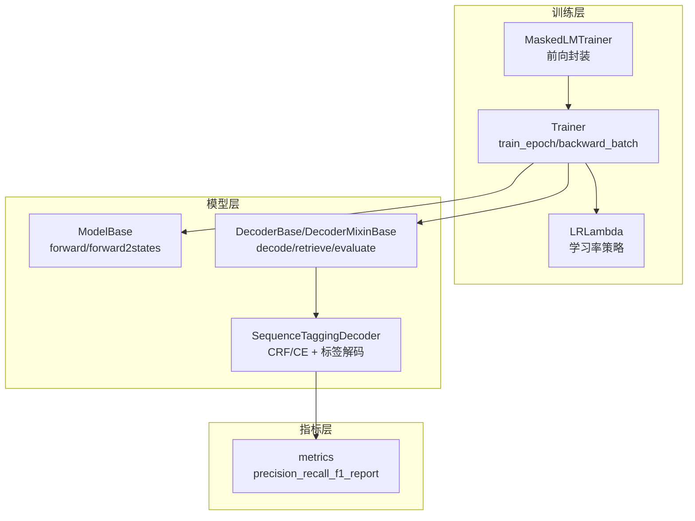
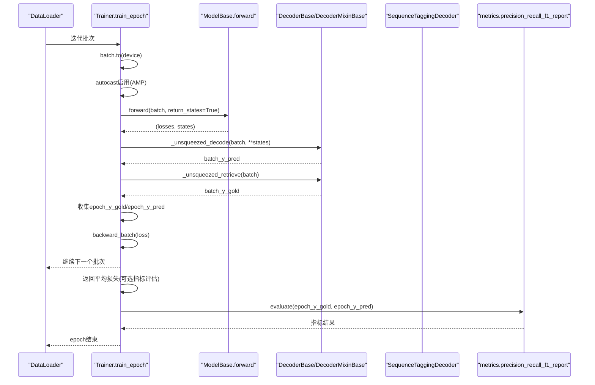
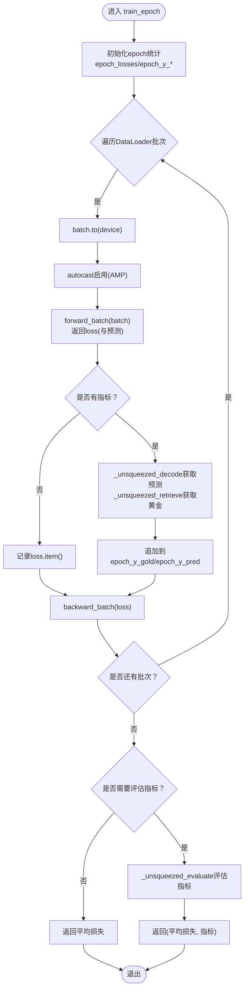
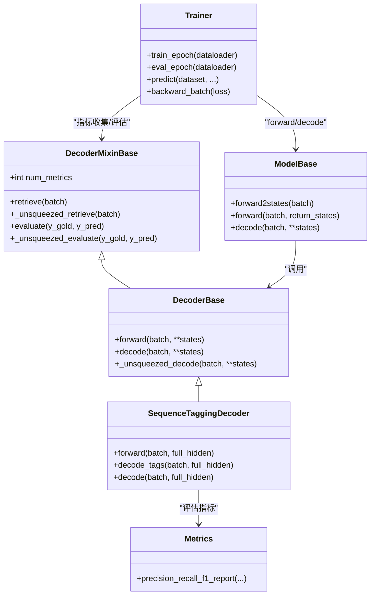
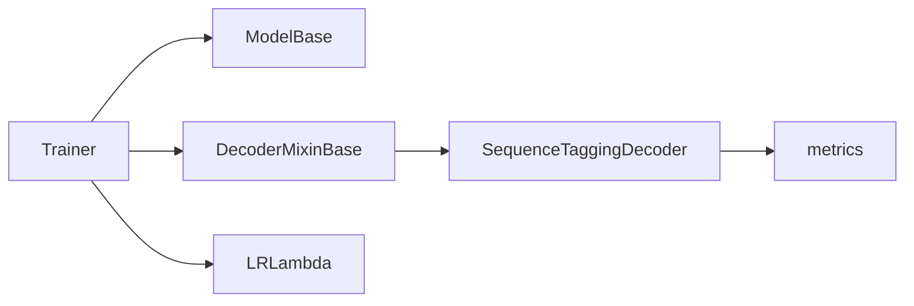

# 训练周期控制

<cite>
**本文引用的文件列表**
- [trainer.py](file://eznlp/training/trainer.py)
- [utils.py](file://eznlp/training/utils.py)
- [base.py](file://eznlp/model/model/base.py)
- [base.py](file://eznlp/model/decoder/base.py)
- [sequence_tagging.py](file://eznlp/model/decoder/sequence_tagging.py)
- [metrics.py](file://eznlp/metrics.py)
- [plm_trainer.py](file://eznlp/training/plm_trainer.py)
- [test_trainer.py](file://tests/training/test_trainer.py)
- [text2text.py](file://scripts/text2text.py)
</cite>

## 目录
1. [引言](#引言)
2. [项目结构](#项目结构)
3. [核心组件](#核心组件)
4. [架构总览](#架构总览)
5. [详细组件分析](#详细组件分析)
6. [依赖关系分析](#依赖关系分析)
7. [性能考量](#性能考量)
8. [故障排查指南](#故障排查指南)
9. [结论](#结论)
10. [附录](#附录)

## 引言
本文件围绕训练周期控制中的 train_epoch 方法展开，系统阐述其在一个 epoch 内的完整训练流程：数据加载、前向传播、损失计算、反向传播与梯度更新；重点说明混合精度训练（AMP）的集成方式，以及通过 num_grad_acc_steps 实现“梯度累积”以模拟更大批次的训练效果；同时解释指标（metrics）的收集与评估逻辑，尤其是当模型包含解码器时的标签预测与评估流程，并给出优化器状态重置与学习率调度协同工作的最佳实践示例。

## 项目结构
与训练周期控制直接相关的核心模块如下：
- 训练器与工具：eznlp/training/trainer.py、eznlp/training/utils.py、eznlp/training/plm_trainer.py
- 模型与解码器：eznlp/model/model/base.py、eznlp/model/decoder/base.py、eznlp/model/decoder/sequence_tagging.py
- 指标计算：eznlp/metrics.py
- 单元测试与示例脚本：tests/training/test_trainer.py、scripts/text2text.py

图表来源
- [trainer.py](file://eznlp/training/trainer.py#L155-L220)
- [utils.py](file://eznlp/training/utils.py#L13-L84)
- [base.py](file://eznlp/model/model/base.py#L81-L99)
- [base.py](file://eznlp/model/decoder/base.py#L11-L50)
- [sequence_tagging.py](file://eznlp/model/decoder/sequence_tagging.py#L143-L198)
- [metrics.py](file://eznlp/metrics.py#L98-L153)
- [plm_trainer.py](file://eznlp/training/plm_trainer.py#L11-L35)

章节来源
- [trainer.py](file://eznlp/training/trainer.py#L155-L220)
- [utils.py](file://eznlp/training/utils.py#L13-L84)
- [base.py](file://eznlp/model/model/base.py#L81-L99)
- [base.py](file://eznlp/model/decoder/base.py#L11-L50)
- [sequence_tagging.py](file://eznlp/model/decoder/sequence_tagging.py#L143-L198)
- [metrics.py](file://eznlp/metrics.py#L98-L153)
- [plm_trainer.py](file://eznlp/training/plm_trainer.py#L11-L35)

## 核心组件
- Trainer.train_epoch：负责单个 epoch 的训练循环，含数据加载、前向、指标收集、反向与权重更新。
- Trainer.backward_batch：统一处理损失缩放、梯度累积、梯度裁剪、优化器步进与零梯度，以及按步或按轮次的学习率调度。
- ModelBase.forward/forward2states：模型前向主入口，返回损失与中间状态，供解码器使用。
- DecoderBase/DecoderMixinBase：定义解码、指标检索与评估接口，支持多指标封装。
- SequenceTaggingDecoder：典型解码器，支持 CRF 或交叉熵损失，提供标签解码与实体块评估。
- LRLambda：提供常数、线性衰减、指数衰减、幂律等学习率策略与预热函数。
- MaskedLMTrainer：针对掩码语言建模的前向封装，适配不同模型输出键名。

章节来源
- [trainer.py](file://eznlp/training/trainer.py#L155-L220)
- [trainer.py](file://eznlp/training/trainer.py#L82-L124)
- [base.py](file://eznlp/model/model/base.py#L81-L99)
- [base.py](file://eznlp/model/decoder/base.py#L11-L50)
- [sequence_tagging.py](file://eznlp/model/decoder/sequence_tagging.py#L143-L198)
- [utils.py](file://eznlp/training/utils.py#L13-L84)
- [plm_trainer.py](file://eznlp/training/plm_trainer.py#L11-L35)

## 架构总览
下图展示 train_epoch 在一个 epoch 中的调用序列，从数据加载到指标评估的完整路径。

图表来源
- [trainer.py](file://eznlp/training/trainer.py#L155-L190)
- [base.py](file://eznlp/model/model/base.py#L84-L99)
- [base.py](file://eznlp/model/decoder/base.py#L11-L50)
- [sequence_tagging.py](file://eznlp/model/decoder/sequence_tagging.py#L143-L198)
- [metrics.py](file://eznlp/metrics.py#L98-L153)

## 详细组件分析

### train_epoch 方法工作原理
- 数据加载与设备迁移：每个批次先迁移到指定设备，支持非阻塞传输。
- 自动混合精度（AMP）：在 autocast 上下文中进行前向计算，降低显存占用并提升吞吐。
- 前向传播与损失：调用模型前向，返回损失张量与中间状态；若模型有解码器，则同时返回预测标签。
- 指标收集：当存在指标时，从解码器检索黄金标签与预测标签，分别追加到 epoch_y_gold 与 epoch_y_pred。
- 反向传播与权重更新：调用 backward_batch，内部对损失进行归一化（除以 num_grad_acc_steps），在累积步数满足条件时执行梯度裁剪、优化器步进与零梯度，并按步或按轮次更新学习率。
- 结果返回：若无指标，返回平均损失；若有指标，返回平均损失与评估指标。

图表来源
- [trainer.py](file://eznlp/training/trainer.py#L155-L190)
- [trainer.py](file://eznlp/training/trainer.py#L82-L124)
- [base.py](file://eznlp/model/decoder/base.py#L11-L50)

章节来源
- [trainer.py](file://eznlp/training/trainer.py#L155-L190)
- [trainer.py](file://eznlp/training/trainer.py#L82-L124)

### 混合精度训练（AMP）集成
- AMP 启用：Trainer 初始化时创建 GradScaler，并在 train_epoch 与 train_steps 中通过 autocast 包裹前向计算。
- 梯度缩放：backward_batch 对 loss 先进行缩放再反向，累积步数满足条件时再 unscale 并执行梯度裁剪与优化器步进。
- 设备要求：AMP 仅在 CUDA 设备上有效，CPU 环境下会自动降级为非 AMP。

章节来源
- [trainer.py](file://eznlp/training/trainer.py#L27-L63)
- [trainer.py](file://eznlp/training/trainer.py#L155-L190)
- [trainer.py](file://eznlp/training/trainer.py#L277-L320)

### 梯度累积与大批次模拟
- 累积机制：backward_batch 将损失除以 num_grad_acc_steps，使“名义批次大小 × 累积步数”等于“真实批次大小”，从而在小显存下模拟大批次。
- 步数计数：内部维护 num_steps，每处理一次 batch 增加 1；当 num_steps % num_grad_acc_steps == 0 时才执行优化器步进与零梯度。
- 学习率调度：当 schedule_by_step 为真时，按“名义步数”推进学习率；否则按“轮次”推进（如 ReduceLROnPlateau）。

章节来源
- [trainer.py](file://eznlp/training/trainer.py#L82-L124)
- [trainer.py](file://eznlp/training/trainer.py#L155-L190)
- [test_trainer.py](file://tests/training/test_trainer.py#L36-L83)

### 指标收集与评估（含解码器）
- 解码器接口：DecoderMixinBase 定义 _unsqueezed_decode/_unsqueezed_retrieve/_unsqueezed_evaluate 等方法，支持单/多指标封装。
- SequenceTaggingDecoder：提供标签解码（CRF 或 CE），并将标签转换为实体块，用于 precision_recall_f1_report 计算微平均 F1。
- Trainer 收集：train_epoch 与 eval_epoch 在有指标时，将 batch_y_gold 与 batch_y_pred 追加至 epoch_y_gold 与 epoch_y_pred，最终一次性评估。

图表来源
- [base.py](file://eznlp/model/decoder/base.py#L11-L50)
- [sequence_tagging.py](file://eznlp/model/decoder/sequence_tagging.py#L143-L198)
- [base.py](file://eznlp/model/model/base.py#L81-L99)
- [trainer.py](file://eznlp/training/trainer.py#L155-L220)
- [metrics.py](file://eznlp/metrics.py#L98-L153)

章节来源
- [base.py](file://eznlp/model/decoder/base.py#L11-L50)
- [sequence_tagging.py](file://eznlp/model/decoder/sequence_tagging.py#L143-L198)
- [metrics.py](file://eznlp/metrics.py#L98-L153)
- [trainer.py](file://eznlp/training/trainer.py#L155-L220)

### 训练步骤与学习率调度协同
- 按步调度：schedule_by_step=True 时，backward_batch 在累积步数满足条件后按“名义步数”推进学习率。
- 按轮调度：schedule_by_step=False 时，train_steps 在每个 eval 周期结束后按“轮次”推进学习率（如 ReduceLROnPlateau）。
- 预热策略：LRLambda 提供多种预热与衰减策略，便于与 num_grad_acc_steps 配合。

章节来源
- [trainer.py](file://eznlp/training/trainer.py#L115-L124)
- [trainer.py](file://eznlp/training/trainer.py#L277-L359)
- [utils.py](file://eznlp/training/utils.py#L13-L84)

### 面向掩码语言建模的前向封装
- MaskedLMTrainer.forward_batch：将 batch 中的字段映射为模型期望的输入键（如 input_ids、attention_mask、labels 等），并在多 GPU 场景下对 loss 做 mean 处理，确保标量损失。

章节来源
- [plm_trainer.py](file://eznlp/training/plm_trainer.py#L11-L35)

## 依赖关系分析
- Trainer 依赖 ModelBase 的 forward 与 forward2states，依赖 DecoderMixinBase 的指标接口。
- SequenceTaggingDecoder 依赖 metrics 的评估函数，支持 CRF 或交叉熵损失。
- LRLambda 为学习率策略提供通用函数族，可与 Trainer 的调度开关配合使用。

图表来源
- [trainer.py](file://eznlp/training/trainer.py#L155-L220)
- [base.py](file://eznlp/model/model/base.py#L81-L99)
- [base.py](file://eznlp/model/decoder/base.py#L11-L50)
- [sequence_tagging.py](file://eznlp/model/decoder/sequence_tagging.py#L143-L198)
- [metrics.py](file://eznlp/metrics.py#L98-L153)
- [utils.py](file://eznlp/training/utils.py#L13-L84)

章节来源
- [trainer.py](file://eznlp/training/trainer.py#L155-L220)
- [base.py](file://eznlp/model/model/base.py#L81-L99)
- [base.py](file://eznlp/model/decoder/base.py#L11-L50)
- [sequence_tagging.py](file://eznlp/model/decoder/sequence_tagging.py#L143-L198)
- [metrics.py](file://eznlp/metrics.py#L98-L153)
- [utils.py](file://eznlp/training/utils.py#L13-L84)

## 性能考量
- AMP 使用：在 CUDA 设备上启用 autocast 与 GradScaler，可显著降低显存占用并提升吞吐；需注意 CPU 环境下 AMP 无效。
- 梯度累积：通过增大 num_grad_acc_steps 可在有限显存下模拟更大批次，但会增加总步数；应结合 schedule_by_step 选择合适的调度节奏。
- 梯度裁剪：backward_batch 在累积步满足条件时执行 clip_grad_norm，有助于稳定训练。
- 预热与衰减：合理设置预热步数与衰减策略，可避免初期不稳定与后期收敛缓慢。

[本节为通用建议，不直接分析具体文件]

## 故障排查指南
- 前向失败：检查 batch 字段与模型输入键是否一致；参考 MaskedLMTrainer 的字段映射方式。
- 指标异常：确认解码器的 retrieve/decode 是否正确返回标签序列；检查 pad_idx 与标签体系一致性。
- 学习率未生效：确认 schedule_by_step 与调度器类型（ReduceLROnPlateau 与按步调度互斥）；核对 num_grad_acc_steps 与步数计数。
- 显存溢出：尝试减小 batch_size 或增大 num_grad_acc_steps；开启 AMP 并确保 GradScaler 正常更新。

章节来源
- [plm_trainer.py](file://eznlp/training/plm_trainer.py#L11-L35)
- [trainer.py](file://eznlp/training/trainer.py#L115-L124)
- [trainer.py](file://eznlp/training/trainer.py#L277-L359)

## 结论
train_epoch 将数据加载、前向传播、损失计算、反向传播与权重更新整合为统一的训练循环，并通过 AMP 与梯度累积实现高效稳定的训练。当模型包含解码器时，指标收集与评估通过统一接口完成，保证了训练与评估的一致性。结合合理的学习率预热与衰减策略，可在不同硬件条件下获得稳健的收敛表现。

[本节为总结，不直接分析具体文件]

## 附录

### 最佳实践示例（优化器状态重置与学习率调度协同）
- 使用 num_grad_acc_steps 模拟大批次：在小显存环境下，通过增大累积步数提升有效批次大小，同时保持较小的批内内存占用。
- schedule_by_step 与按轮次调度的选择：
  - 若使用 Linear/Exponential/Power Decay 预热与衰减，建议 schedule_by_step=True，以便按“名义步数”推进学习率。
  - 若使用 ReduceLROnPlateau，建议 schedule_by_step=False，并在每个 eval 周期结束后按轮次推进。
- AMP 与 GradScaler：确保在 backward_batch 中先 scale(loss)，再 unscale(optimizer) 执行梯度裁剪，最后 step() 与 update()。
- 预热策略：LRLambda 提供多种预热与衰减函数，可根据任务规模与收敛行为进行选择。

章节来源
- [trainer.py](file://eznlp/training/trainer.py#L82-L124)
- [trainer.py](file://eznlp/training/trainer.py#L115-L124)
- [trainer.py](file://eznlp/training/trainer.py#L277-L359)
- [utils.py](file://eznlp/training/utils.py#L13-L84)
- [test_trainer.py](file://tests/training/test_trainer.py#L36-L83)
- [text2text.py](file://scripts/text2text.py#L209-L224)