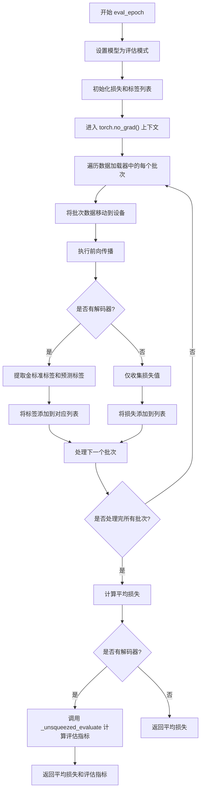
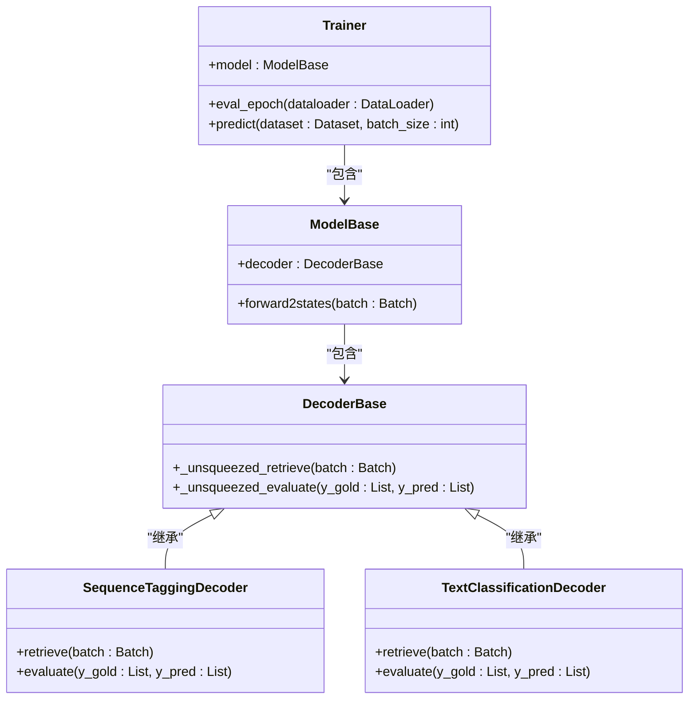
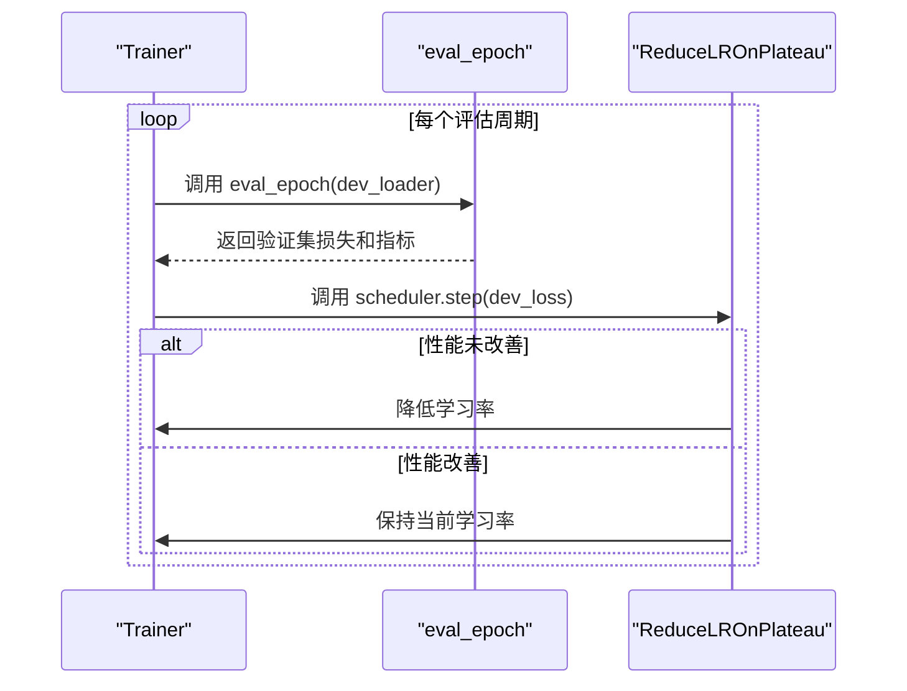
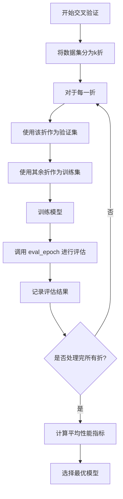

# 评估周期执行

<cite>
**本文档中引用的文件**
- [trainer.py](file://eznlp/training/trainer.py#L191-L219)
- [evaluation.py](file://eznlp/training/evaluation.py#L1-L203)
- [sequence_tagging.py](file://eznlp/model/decoder/sequence_tagging.py#L1-L198)
- [text_classification.py](file://eznlp/model/decoder/text_classification.py#L1-L117)
- [base.py](file://eznlp/model/decoder/base.py#L1-L75)
</cite>

## 目录
1. [引言](#引言)
2. [eval_epoch方法执行流程](#eval_epoch方法执行流程)
3. [与模型解码器的协同工作](#与模型解码器的协同工作)
4. [学习率调度器集成机制](#学习率调度器集成机制)
5. [交叉验证与模型选择场景](#交叉验证与模型选择场景)
6. [结论](#结论)

## 引言
`eval_epoch`方法是eznlp框架中用于在评估模式下执行模型验证的核心组件。该方法在神经网络训练过程中扮演着关键角色，特别是在实体识别、文本分类等自然语言处理任务中。通过在`torch.no_grad()`上下文中执行前向传播，`eval_epoch`能够安全地计算损失值和评估指标，同时避免不必要的梯度计算。本文档将深入解析该方法的执行流程，重点阐述其与模型解码器的协同工作机制，以及与学习率调度器（特别是ReduceLROnPlateau）的集成机制。

## eval_epoch方法执行流程
`eval_epoch`方法在评估模式下的执行流程遵循严格的步骤，确保在不计算梯度的情况下准确评估模型性能。该方法首先将模型设置为评估模式（`model.eval()`），然后在`torch.no_grad()`上下文中遍历数据加载器中的每个批次。

在每个批次的处理过程中，方法首先将批次数据移动到指定设备（如GPU），然后调用`forward_batch`方法执行前向传播。这一过程的关键在于`torch.no_grad()`上下文管理器的使用，它确保了所有张量操作都不会跟踪梯度，从而显著减少内存消耗并提高计算效率。

执行前向传播后，方法会根据模型是否定义了解码器来决定后续处理流程。如果模型没有定义解码器（`num_metrics == 0`），则仅返回平均损失值；否则，方法会收集金标准标签和预测标签，并在所有批次处理完成后调用解码器的`_unsqueezed_evaluate`方法计算评估指标。

**图示来源**
- [trainer.py](file://eznlp/training/trainer.py#L191-L219)

**本节来源**
- [trainer.py](file://eznlp/training/trainer.py#L191-L219)

## 与模型解码器的协同工作
`eval_epoch`方法与模型解码器的协同工作是其功能实现的核心。这种协同主要通过`_unsqueezed_retrieve`和`_unsqueezed_evaluate`两个方法实现，它们分别负责金标准标签的提取和性能评估。

`_unsqueezed_retrieve`方法的作用是从批次数据中提取金标准标签。在序列标注任务中，这通常涉及从`batch.tags_objs`中提取真实的标签序列；在文本分类任务中，则是从`batch.label_ids`中提取真实的类别标签。这些金标准标签随后被用于与模型预测结果进行比较。

`_unsqueezed_evaluate`方法则负责计算评估指标。对于不同的任务类型，该方法会调用相应的评估函数。例如，在实体识别任务中，它会调用`precision_recall_f1_report`函数计算精确率、召回率和F1分数；在文本分类任务中，则计算准确率。

**图示来源**
- [trainer.py](file://eznlp/training/trainer.py#L191-L219)
- [sequence_tagging.py](file://eznlp/model/decoder/sequence_tagging.py#L1-L198)
- [text_classification.py](file://eznlp/model/decoder/text_classification.py#L1-L117)

**本节来源**
- [sequence_tagging.py](file://eznlp/model/decoder/sequence_tagging.py#L1-L198)
- [text_classification.py](file://eznlp/model/decoder/text_classification.py#L1-L117)
- [base.py](file://eznlp/model/decoder/base.py#L1-L75)

## 学习率调度器集成机制
`eval_epoch`方法与学习率调度器（特别是ReduceLROnPlateau）的集成机制是模型训练过程中的关键优化策略。这种集成主要在`train_steps`方法中实现，其中`eval_epoch`被用作验证集性能监控的工具。

当使用`ReduceLROnPlateau`调度器时，`eval_epoch`的返回值（通常是验证集损失或评估指标）被用作调整学习率的依据。如果验证集性能在连续几个周期内没有改善，调度器会自动降低学习率，从而帮助模型跳出局部最优解。

这种集成机制的关键在于`eval_epoch`能够提供准确的性能评估结果。通过在评估模式下执行前向传播，方法确保了评估结果的稳定性和可靠性，为学习率调整提供了可信的依据。

**图示来源**
- [trainer.py](file://eznlp/training/trainer.py#L318-L357)

**本节来源**
- [trainer.py](file://eznlp/training/trainer.py#L318-L357)

## 交叉验证与模型选择场景
在交叉验证和模型选择场景中，`eval_epoch`方法发挥着至关重要的作用。通过在不同的数据折上反复调用`eval_epoch`，可以全面评估模型的泛化能力。

在k折交叉验证中，数据集被分为k个子集，每次使用k-1个子集作为训练集，剩余1个子集作为验证集。`eval_epoch`方法在每个验证集上执行评估，最终将k次评估结果的平均值作为模型性能的最终评估。

在模型选择场景中，`eval_epoch`被用于比较不同超参数配置下的模型性能。通过在验证集上执行`eval_epoch`，可以选择性能最优的模型配置。

**图示来源**
- [trainer.py](file://eznlp/training/trainer.py#L221-L375)

**本节来源**
- [trainer.py](file://eznlp/training/trainer.py#L221-L375)

## 结论
`eval_epoch`方法作为eznlp框架中的核心评估组件，通过在`torch.no_grad()`上下文中执行前向传播，实现了安全高效的模型性能评估。该方法与模型解码器的紧密协同，通过`_unsqueezed_retrieve`和`_unsqueezed_evaluate`方法实现了金标准标签的提取和性能评估。与学习率调度器（特别是ReduceLROnPlateau）的集成机制，使得模型能够在训练过程中根据验证集性能动态调整学习率。在交叉验证和模型选择场景中，`eval_epoch`提供了可靠的性能评估基础，为选择最优模型配置提供了重要依据。