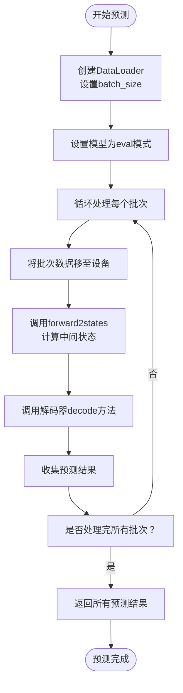
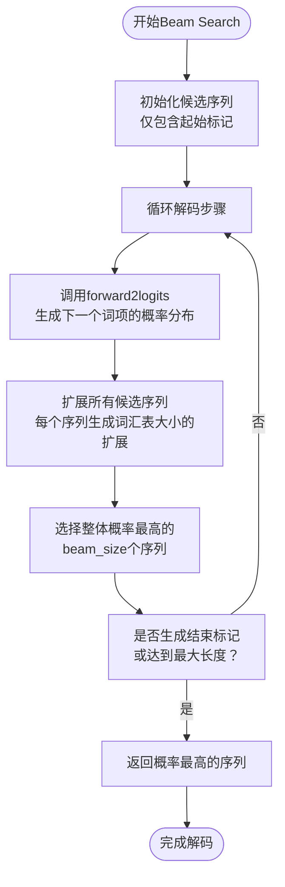
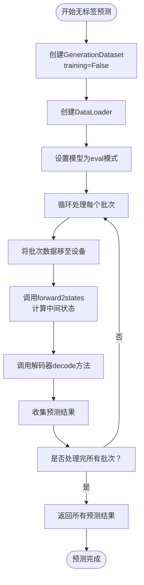

# 预测与推理

<cite>
**本文档中引用的文件**   
- [base.py](file://eznlp/model/model/base.py)
- [text2text.py](file://eznlp/model/model/text2text.py)
- [trainer.py](file://eznlp/training/trainer.py)
- [dataset.py](file://eznlp/dataset.py)
- [generator.py](file://eznlp/model/decoder/generator.py)
- [sequence_tagging.py](file://eznlp/model/decoder/sequence_tagging.py)
- [text_classification.py](file://eznlp/model/decoder/text_classification.py)
- [wrapper.py](file://eznlp/wrapper.py)
</cite>

## 目录
1. [预测功能概述](#预测功能概述)
2. [批量预测实现机制](#批量预测实现机制)
3. [Beam Search解码支持](#beam-search解码支持)
4. [无标签数据集上的预测](#无标签数据集上的预测)
5. [模型状态管理](#模型状态管理)
6. [解码器输出格式处理](#解码器输出格式处理)
7. [性能优化建议](#性能优化建议)

## 预测功能概述

该框架提供了全面的预测与推理功能，支持多种生成式任务。核心预测功能通过`Trainer`类的`predict`方法实现，该方法能够处理不同类型的解码器并支持批量预测。模型的预测流程遵循标准的机器学习推理模式：首先将模型设置为评估模式，然后通过数据加载器逐批处理输入数据，最后调用相应的解码方法生成预测结果。

预测功能的设计遵循模块化原则，将模型、解码器和训练器分离，使得不同组件可以独立开发和测试。这种设计允许用户灵活地组合不同的模型架构和解码策略，以适应各种自然语言处理任务的需求。

**Section sources**
- [trainer.py](file://eznlp/training/trainer.py#L124-L153)
- [base.py](file://eznlp/model/model/base.py#L84-L98)

## 批量预测实现机制

批量预测的实现基于PyTorch的数据加载机制，通过`DataLoader`类将数据集分割成多个批次进行处理。在`Trainer.predict`方法中，首先创建一个不进行数据打乱的`DataLoader`，确保预测结果与输入数据的顺序保持一致。每个批次的数据被转换为模型可接受的格式后，通过`forward2states`方法计算模型的中间状态，然后调用解码器的`decode`方法生成预测结果。

批量预测的关键优势在于能够充分利用GPU的并行计算能力，显著提高大规模数据集的处理效率。同时，通过合理设置批次大小，可以在内存使用和计算效率之间取得平衡。对于内存受限的场景，可以采用较小的批次大小，虽然这可能会增加总的预测时间，但能确保预测过程的稳定性。

**Diagram sources **
- [trainer.py](file://eznlp/training/trainer.py#L124-L153)
- [base.py](file://eznlp/model/model/base.py#L84-L98)

**Section sources**
- [trainer.py](file://eznlp/training/trainer.py#L124-L153)
- [dataset.py](file://eznlp/dataset.py#L104-L114)

## Beam Search解码支持

Beam Search解码是一种广泛应用于生成式任务的解码策略，它通过维护一个固定大小的候选序列集合（即"beam"）来平衡搜索的广度和深度。在该框架中，`Text2Text`模型类提供了`beam_search`方法，该方法接受`beam_size`参数来控制候选序列的数量。当`beam_size`为1时，Beam Search退化为贪心搜索；随着`beam_size`的增加，搜索空间扩大，生成结果的质量通常会提高，但计算成本也随之增加。

Beam Search的实现基于解码器的`forward2logits`方法，该方法为每个时间步生成词汇表上所有词项的概率分布。在每个解码步骤中，算法从当前候选序列集合中选择概率最高的`beam_size`个序列，并为每个序列生成下一个词项的所有可能扩展。然后，从所有扩展中选择整体概率最高的`beam_size`个序列作为新的候选集合，重复此过程直到生成结束标记或达到最大长度。

**Diagram sources **
- [text2text.py](file://eznlp/model/model/text2text.py#L84-L93)
- [generator.py](file://eznlp/model/decoder/generator.py)

**Section sources**
- [text2text.py](file://eznlp/model/model/text2text.py#L84-L93)
- [trainer.py](file://eznlp/training/trainer.py#L145-L149)

## 无标签数据集上的预测

在无标签数据集上执行预测是实际应用中的常见场景，特别是在模型部署阶段。该框架通过`GenerationDataset`类支持无标签数据的预测，该类继承自`Dataset`基类并重写了相关方法以适应无标签数据的处理。当创建`GenerationDataset`实例时，可以通过设置`training=False`来指示数据集用于预测而非训练。

在预测过程中，`Trainer.predict`方法会自动检测数据集是否包含标签信息。如果数据集不包含标签，预测过程将跳过损失计算步骤，直接调用解码方法生成预测结果。这种设计确保了预测流程的灵活性和效率，使得同一套代码可以无缝地应用于训练、验证和测试等不同阶段。

**Diagram sources **
- [dataset.py](file://eznlp/dataset.py#L117-L160)
- [trainer.py](file://eznlp/training/trainer.py#L124-L153)

**Section sources**
- [dataset.py](file://eznlp/dataset.py#L117-L160)
- [trainer.py](file://eznlp/training/trainer.py#L178-L180)

## 模型状态管理

模型在评估模式下的状态管理是确保预测结果一致性和可重复性的关键。在该框架中，通过调用`model.eval()`方法将模型切换到评估模式，这会禁用所有训练特定的行为，如Dropout和Batch Normalization的统计量更新。评估模式确保了模型在预测过程中的行为是确定性的，这对于生产环境中的模型部署至关重要。

状态管理还包括中间计算结果的缓存机制。在`forward`方法中，当`return_states`参数为`True`时，模型不仅返回损失值，还返回中间状态。这些中间状态可以在后续的解码过程中重用，避免了重复计算，从而提高了预测效率。这种设计特别适用于需要多次调用解码方法的场景，如同时进行贪心搜索和Beam Search的对比实验。

**Section sources**
- [base.py](file://eznlp/model/model/base.py#L84-L98)
- [trainer.py](file://eznlp/training/trainer.py#L131-L134)

## 解码器输出格式处理

不同解码器产生的预测输出格式可能有所不同，框架通过统一的接口设计确保了输出格式的一致性。所有解码器都继承自`DecoderBase`基类，并实现了`decode`方法，该方法返回标准化的预测结果。对于序列标注任务，输出通常是标签序列；对于文本分类任务，输出是类别标签；对于生成式任务，输出是生成的文本序列。

解码器输出格式的处理还涉及到后处理步骤，如将模型输出的索引转换为可读的标签或文本。这通常通过`idx2label`或`idx2tag`等映射表实现。框架还提供了`retrieve`方法用于从批次数据中提取真实标签，这在评估预测结果时非常有用。通过统一的输出格式和后处理机制，框架简化了不同任务之间的结果比较和分析。

**Section sources**
- [base.py](file://eznlp/model/decoder/base.py#L98-L114)
- [sequence_tagging.py](file://eznlp/model/decoder/sequence_tagging.py#L195-L198)
- [text_classification.py](file://eznlp/model/decoder/text_classification.py#L113-L116)

## 性能优化建议

在实际应用中进行大规模预测时，性能优化是确保系统高效运行的关键。以下是一些基于框架特性的性能优化建议：

1. **批大小选择**：选择合适的批大小是平衡内存使用和计算效率的关键。过大的批大小可能导致GPU内存溢出，而过小的批大小则无法充分利用GPU的并行计算能力。建议根据具体模型和硬件配置进行实验，找到最优的批大小。

2. **GPU内存管理**：通过合理设置`non_blocking`参数和使用`pin_memory`技术，可以减少数据传输时间，提高GPU利用率。此外，对于内存受限的场景，可以考虑使用梯度累积技术，在较小的批大小下模拟较大的批大小效果。

3. **混合精度训练**：启用`use_amp`（自动混合精度）可以显著减少内存使用并加速计算，特别是在支持Tensor Cores的现代GPU上。这在大规模预测任务中尤其有益。

4. **模型并行化**：对于非常大的模型，可以考虑使用模型并行化技术，将模型的不同部分分配到多个GPU上。这需要对模型架构进行适当修改，但可以有效解决单个GPU内存不足的问题。

5. **预编译和缓存**：对于频繁执行的预测任务，可以考虑使用TorchScript或ONNX等工具将模型预编译为优化的执行图。这可以消除Python解释器的开销，进一步提高预测速度。

**Section sources**
- [trainer.py](file://eznlp/training/trainer.py#L37-L62)
- [trainer.py](file://eznlp/training/trainer.py#L124-L153)