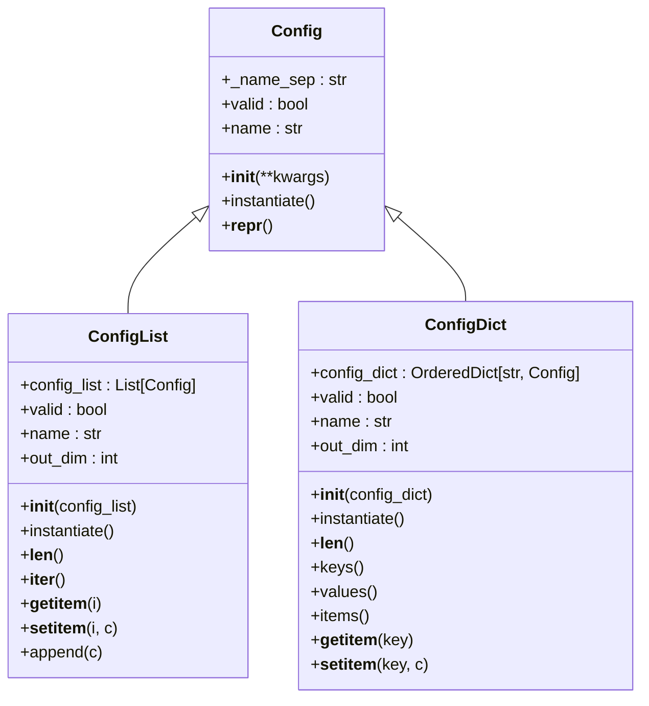
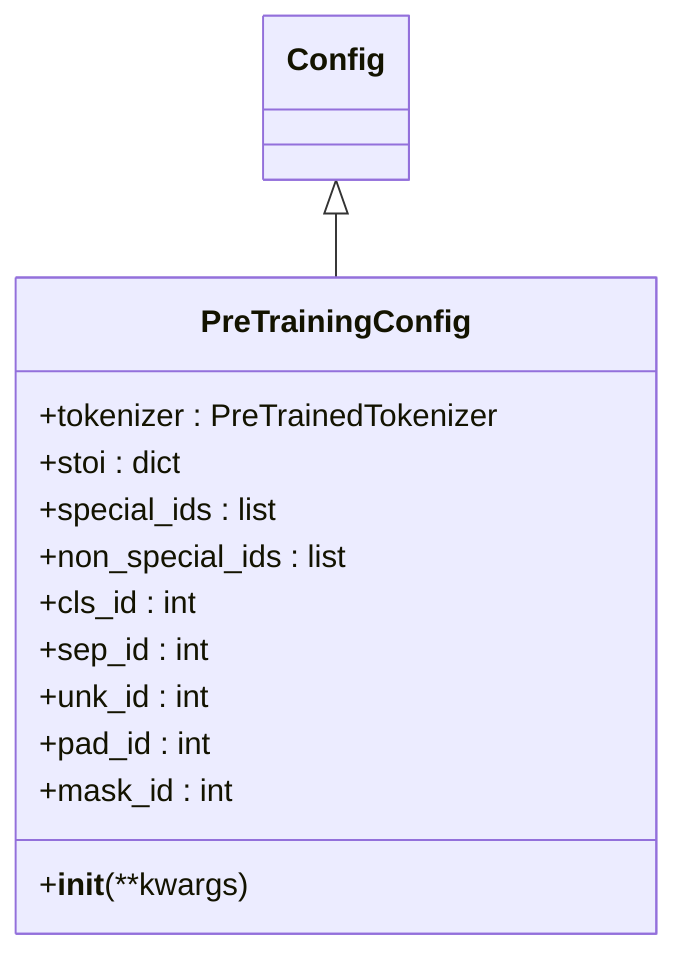

# 基础配置类

<cite>
**本文档引用文件**  
- [config.py](file://eznlp/config.py#L1-L173)
- [model/base.py](file://eznlp/model/model/base.py#L1-L83)
- [plm/base.py](file://eznlp/plm/base.py#L1-L39)
- [model/embedder.py](file://eznlp/model/embedder.py#L1-L248)
- [model/classifier.py](file://eznlp/model/model/classifier.py#L1-L249)
</cite>

## 目录
1. [简介](#简介)
2. [核心功能](#核心功能)
3. [参数处理机制](#参数处理机制)
4. [验证逻辑](#验证逻辑)
5. [名称属性](#名称属性)
6. [实例化契约](#实例化契约)
7. [格式化工具](#格式化工具)
8. [设计原则](#设计原则)
9. [继承示例](#继承示例)
10. [配置验证失败场景](#配置验证失败场景)

## 简介
`Config` 类是 eznlp 框架中所有配置类的基类，用于存储和验证模型或组件的配置。该类定义了处理数据和张量的方法，并建议通过 `instantiate` 方法来实例化模型或组件。根据设计原则，`Config` 类不建议作为对应模型或组件的属性进行注册。

**Section sources**
- [config.py](file://eznlp/config.py#L20-L27)

## 核心功能
`Config` 类提供了配置管理的核心功能，包括参数初始化、有效性验证、名称生成和实例化。这些功能通过抽象方法和属性实现，确保子类必须实现特定的行为。`Config` 类还提供了两个重要的子类：`ConfigList` 和 `ConfigDict`，分别用于管理配置列表和配置字典。

**Diagram sources**
- [config.py](file://eznlp/config.py#L20-L173)

**Section sources**
- [config.py](file://eznlp/config.py#L20-L173)

## 参数处理机制
`__init__` 方法接受任意数量的关键字参数，并将它们直接设置为实例属性。如果提供了参数，会记录警告信息，提示这些配置未经检查可能会被忽略。这种设计允许灵活的配置传递，但需要开发者注意参数的有效性。

**Section sources**
- [config.py](file://eznlp/config.py#L31-L39)

## 验证逻辑
`valid` 属性实现了递归验证逻辑，检查所有属性是否为 `None` 或嵌套的 `Config` 对象是否有效。这是确保配置完整性的关键机制。对于 `ConfigList` 和 `ConfigDict`，验证逻辑还检查列表或字典是否为空。

**Section sources**
- [config.py](file://eznlp/config.py#L40-L47)
- [config.py](file://eznlp/config.py#L84-L86)
- [config.py](file://eznlp/config.py#L132-L136)

## 名称属性
`name` 属性是一个抽象属性，必须由子类实现。它用于生成配置的唯一标识符。`ConfigList` 和 `ConfigDict` 通过连接子配置的名称来生成名称，使用 `_name_sep` 作为分隔符。

**Section sources**
- [config.py](file://eznlp/config.py#L49-L51)
- [config.py](file://eznlp/config.py#L88-L90)
- [config.py](file://eznlp/config.py#L138-L140)

## 实例化契约
`instantiate` 方法是一个抽象方法，必须由子类实现。它是建议的实例化方式，用于创建模型或组件的实例。`ConfigList` 和 `ConfigDict` 分别返回 `torch.nn.ModuleList` 和 `torch.nn.ModuleDict`。

**Section sources**
- [config.py](file://eznlp/config.py#L70-L71)
- [config.py](file://eznlp/config.py#L113-L115)
- [config.py](file://eznlp/config.py#L165-L169)

## 格式化工具
`_add_indents` 函数是一个格式化工具，用于在多行字符串中添加缩进。它在 `_repr_config_attrs` 方法中被调用，用于生成美观的配置表示。这个工具在输出嵌套配置时特别有用，可以清晰地显示层次结构。

**Section sources**
- [config.py](file://eznlp/config.py#L11-L17)
- [config.py](file://eznlp/config.py#L62-L68)

## 设计原则
`Config` 类的设计原则是不建议作为模型属性注册。这是因为配置类的主要职责是配置管理，而不是作为模型的一部分。这种分离有助于保持代码的清晰性和可维护性。此外，`Config` 类的设计鼓励通过继承来扩展功能，而不是直接修改基类。

**Section sources**
- [config.py](file://eznlp/config.py#L26-L27)

## 继承示例
以下是一个继承 `Config` 类创建自定义配置的示例。`PreTrainingConfig` 类继承自 `Config`，并实现了特定的初始化逻辑和属性。这展示了如何通过继承来扩展 `Config` 类的功能。

**Diagram sources**
- [plm/base.py](file://eznlp/plm/base.py#L7-L39)

**Section sources**
- [plm/base.py](file://eznlp/plm/base.py#L7-L39)

## 配置验证失败场景
配置验证失败的典型场景包括：属性为 `None`、嵌套配置无效、列表或字典为空。调试这些问题的方法是检查配置对象的属性，确保所有必需的属性都已正确设置。可以使用 `repr` 方法来查看配置的详细信息，帮助定位问题。

**Section sources**
- [config.py](file://eznlp/config.py#L42-L47)
- [model/classifier.py](file://eznlp/model/model/classifier.py#L65-L69)