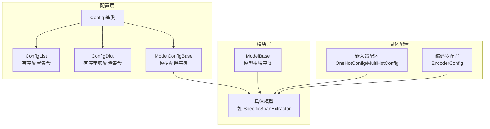
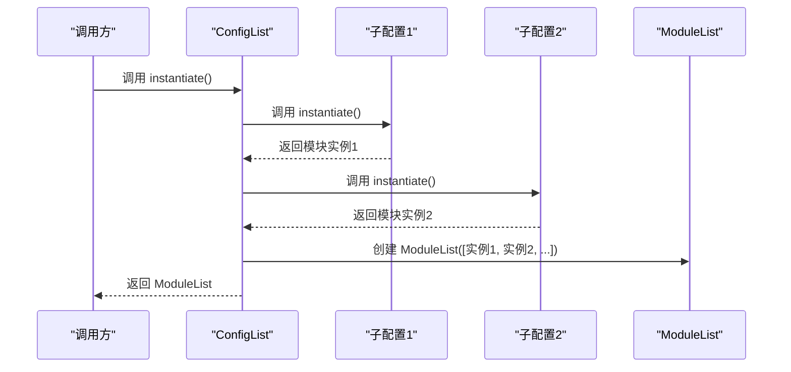
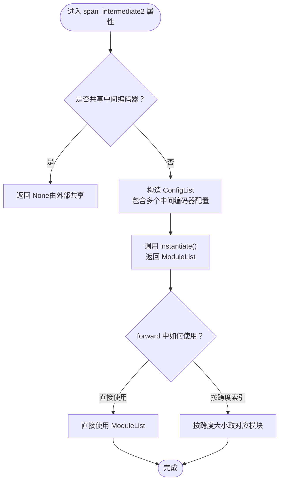
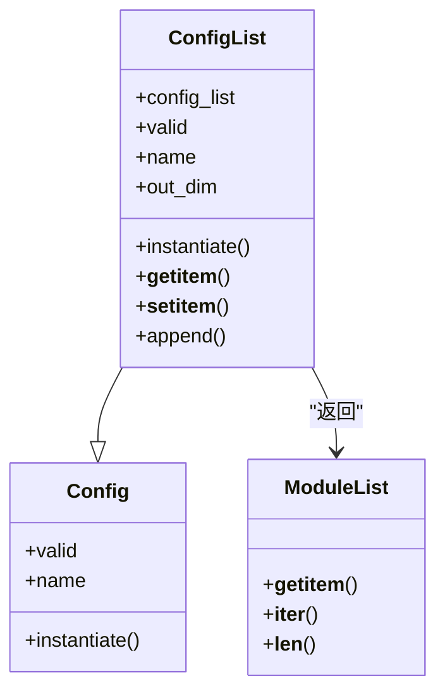

# 配置列表类

<cite>
**本文引用的文件**
- [eznlp/config.py](file://eznlp/config.py)
- [eznlp/model/model/specific_span_extractor.py](file://eznlp/model/model/specific_span_extractor.py)
- [eznlp/model/model/base.py](file://eznlp/model/model/base.py)
- [eznlp/model/embedder.py](file://eznlp/model/embedder.py)
- [eznlp/model/encoder.py](file://eznlp/model/encoder.py)
</cite>

## 目录
1. [简介](#简介)
2. [项目结构](#项目结构)
3. [核心组件](#核心组件)
4. [架构总览](#架构总览)
5. [详细组件分析](#详细组件分析)
6. [依赖分析](#依赖分析)
7. [性能考虑](#性能考虑)
8. [故障排查指南](#故障排查指南)
9. [结论](#结论)
10. [附录](#附录)

## 简介
本文件系统性地阐述ConfigList类的设计与实现，重点说明其作为“有序配置集合”的职责与行为，包括：
- __init__方法对输入列表的类型检查与转换逻辑
- valid属性的验证规则（要求列表非空且所有元素有效）
- name属性通过分隔符连接各子配置名称的机制
- out_dim属性的累加计算方式
- instantiate方法如何返回torch.nn.ModuleList实例并保证顺序一致性
- 容器方法__getitem__、__setitem__、append的使用要点
- 在模型组件组合中的典型应用场景（如多特征编码器的配置管理）
- 与PyTorch ModuleList的对应关系与注意事项

## 项目结构
ConfigList位于配置体系的核心层，与Config、ModelConfigBase、具体模块配置（如嵌入器、编码器）共同构成可组合、可验证、可实例化的配置-模块映射框架。

图表来源
- [eznlp/config.py](file://eznlp/config.py#L20-L173)
- [eznlp/model/model/base.py](file://eznlp/model/model/base.py#L10-L62)
- [eznlp/model/embedder.py](file://eznlp/model/embedder.py#L51-L140)
- [eznlp/model/encoder.py](file://eznlp/model/encoder.py#L15-L90)

章节来源
- [eznlp/config.py](file://eznlp/config.py#L20-L173)
- [eznlp/model/model/base.py](file://eznlp/model/model/base.py#L10-L62)

## 核心组件
- Config：配置基类，定义通用的验证、名称与实例化接口约定
- ConfigList：有序配置集合，封装多个Config对象，提供序列式访问与实例化能力
- ModelConfigBase：模型配置基类，负责整体有效性与名称拼接
- 具体配置类：如OneHotConfig、MultiHotConfig、EncoderConfig等，各自定义valid/name/out_dim/instantiate

章节来源
- [eznlp/config.py](file://eznlp/config.py#L20-L173)
- [eznlp/model/model/base.py](file://eznlp/model/model/base.py#L10-L62)
- [eznlp/model/embedder.py](file://eznlp/model/embedder.py#L51-L140)
- [eznlp/model/encoder.py](file://eznlp/model/encoder.py#L15-L90)

## 架构总览
ConfigList在配置-模块映射中的位置如下：
- ConfigList本身继承自Config，因此具备valid/name/out_dim/instantiate等统一接口
- instantiate返回torch.nn.ModuleList，内部按插入顺序依次实例化每个子配置
- ModelBase在构建模型时，会将Config中的属性（包括ConfigList）通过instantiate转换为对应的ModuleList

图表来源
- [eznlp/config.py](file://eznlp/config.py#L113-L116)
- [eznlp/model/model/base.py](file://eznlp/model/model/base.py#L64-L77)

章节来源
- [eznlp/config.py](file://eznlp/config.py#L74-L119)
- [eznlp/model/model/base.py](file://eznlp/model/model/base.py#L64-L77)

## 详细组件分析

### ConfigList类概览
- 继承关系：ConfigList -> Config
- 关键属性与方法：
  - __init__(config_list): 输入支持None、列表或可迭代；最终统一转为list并断言元素均为Config
  - valid: 列表非空且所有元素有效
  - name: 使用分隔符连接各子配置的name
  - __len__/__iter__/__getitem__/__setitem__/append: 序列式容器接口
  - out_dim: 各子配置out_dim求和
  - instantiate: 返回torch.nn.ModuleList，保持插入顺序

章节来源
- [eznlp/config.py](file://eznlp/config.py#L74-L119)

#### 初始化与类型检查
- 输入为空则初始化为空列表
- 若输入不是list，则尝试转换为list
- 断言所有元素为Config类型
- 将最终列表赋给内部属性

章节来源
- [eznlp/config.py](file://eznlp/config.py#L75-L82)

#### 验证规则（valid）
- 列表长度必须大于0
- 所有子配置的valid必须为真

章节来源
- [eznlp/config.py](file://eznlp/config.py#L84-L87)

#### 名称生成（name）
- 使用类级分隔符连接各子配置的name
- 该规则确保配置树的可读性与唯一性

章节来源
- [eznlp/config.py](file://eznlp/config.py#L88-L91)

#### 输出维度（out_dim）
- 对所有子配置的out_dim求和
- 用于下游模块的维度对接与校验

章节来源
- [eznlp/config.py](file://eznlp/config.py#L109-L112)

#### 实例化（instantiate）
- 返回torch.nn.ModuleList，内部模块按插入顺序实例化
- 注释强调顺序需与对应forward一致，避免运行期不一致

章节来源
- [eznlp/config.py](file://eznlp/config.py#L113-L116)

#### 容器方法
- __getitem__/__setitem__: 支持索引访问与替换，均断言新值为Config
- append: 追加新的Config
- __len__/__iter__: 提供序列式遍历与长度查询

章节来源
- [eznlp/config.py](file://eznlp/config.py#L92-L108)
- [eznlp/config.py](file://eznlp/config.py#L105-L108)

#### 与PyTorch ModuleList的对应关系
- ConfigList.instantiate返回torch.nn.ModuleList
- ModuleList保持插入顺序，便于在forward中按序调用
- ModelBase在构建模型时，会将Config中的属性（含ConfigList）通过instantiate转换为ModuleList

章节来源
- [eznlp/config.py](file://eznlp/config.py#L113-L116)
- [eznlp/model/model/base.py](file://eznlp/model/model/base.py#L64-L77)

### 典型应用场景：多特征编码器的配置管理
在特定跨度抽取器配置中，ConfigList用于管理不同跨度大小下的中间编码器：
- 当span_bert_like不共享权重时，为每个跨度大小创建一个中间编码器配置
- 通过ConfigList将这些配置打包为有序集合
- 在forward中根据跨度大小选择对应索引的中间编码器模块

图表来源
- [eznlp/model/model/specific_span_extractor.py](file://eznlp/model/model/specific_span_extractor.py#L65-L81)
- [eznlp/model/model/specific_span_extractor.py](file://eznlp/model/model/specific_span_extractor.py#L140-L155)
- [eznlp/config.py](file://eznlp/config.py#L113-L116)

章节来源
- [eznlp/model/model/specific_span_extractor.py](file://eznlp/model/model/specific_span_extractor.py#L65-L81)
- [eznlp/model/model/specific_span_extractor.py](file://eznlp/model/model/specific_span_extractor.py#L140-L155)

### 与具体配置类的协作
- OneHotConfig/MultiHotConfig：提供嵌入维度与输出维度，参与ConfigList的out_dim累加
- EncoderConfig：提供编码器架构与输出维度，参与ConfigList的out_dim累加

章节来源
- [eznlp/model/embedder.py](file://eznlp/model/embedder.py#L51-L140)
- [eznlp/model/encoder.py](file://eznlp/model/encoder.py#L15-L90)

## 依赖分析
- ConfigList依赖于Config体系（valid/name/out_dim/instantiate）
- 与ModelBase存在间接依赖：ModelBase在构建模型时会调用Config.instantiate，从而间接触发ConfigList.instantiate
- 与torch.nn.ModuleList存在直接依赖：instantiate返回ModuleList

图表来源
- [eznlp/config.py](file://eznlp/config.py#L20-L119)

章节来源
- [eznlp/config.py](file://eznlp/config.py#L20-L119)

## 性能考虑
- instantiate内部按顺序实例化子配置，时间复杂度与子配置数量线性相关
- out_dim累加为O(n)，其中n为子配置数量
- ModuleList的索引访问为O(1)，forward中按序调用开销可控
- 建议在构建阶段一次性完成ConfigList的组装与实例化，避免在训练循环中重复构建

## 故障排查指南
- 验证失败（valid为False）
  - 检查ConfigList是否为空
  - 检查每个子配置的valid是否为真
- 名称异常（name不符合预期）
  - 确认子配置的name属性是否正确实现
  - 确认分隔符设置是否符合预期
- 实例化后顺序不一致
  - 确保在ConfigList中插入顺序与forward中使用顺序一致
  - 避免在forward中对ModuleList进行二次排序或重排
- 运行时报错（out_dim不匹配）
  - 检查子配置的out_dim是否与下游模块in_dim一致
  - 如使用ConfigList，确认累加结果与下游期望一致

章节来源
- [eznlp/config.py](file://eznlp/config.py#L84-L87)
- [eznlp/config.py](file://eznlp/config.py#L88-L91)
- [eznlp/config.py](file://eznlp/config.py#L109-L112)
- [eznlp/config.py](file://eznlp/config.py#L113-L116)

## 结论
ConfigList为配置体系提供了“有序配置集合”的抽象，既保证了配置树的可验证性与可读性，又通过instantiate与ModuleList的对应关系，实现了模块化、可组合的模型构建。在多特征编码器等场景中，ConfigList能够以简洁的方式管理多个同构配置，确保顺序一致性与维度对接。

## 附录

### 使用示例（路径指引）
- 容器方法使用
  - 访问与修改：参考路径 [eznlp/config.py](file://eznlp/config.py#L98-L104)
  - 追加新配置：参考路径 [eznlp/config.py](file://eznlp/config.py#L105-L108)
- 动态操作示例（概念性说明）
  - 通过__getitem__/__setitem__对已有配置进行替换
  - 通过append追加新的子配置
  - 注意：每次修改后，建议重新验证整体有效性（valid）

章节来源
- [eznlp/config.py](file://eznlp/config.py#L98-L108)