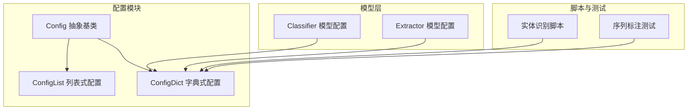
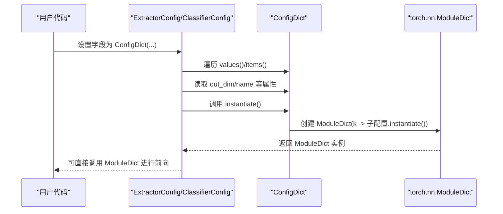
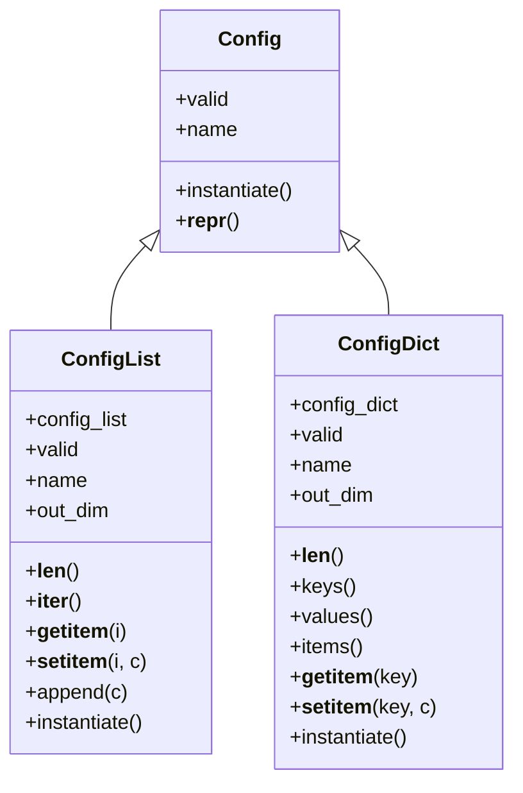
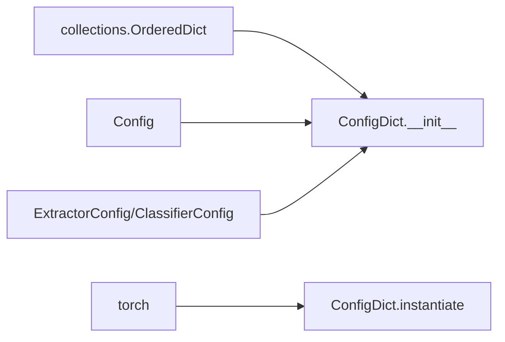

# 配置字典类

<cite>
**本文引用的文件**
- [eznlp/config.py](file://eznlp/config.py)
- [eznlp/model/model/classifier.py](file://eznlp/model/model/classifier.py)
- [eznlp/model/model/extractor.py](file://eznlp/model/model/extractor.py)
- [scripts/entity_recognition.py](file://scripts/entity_recognition.py)
- [tests/model/test_sequence_tagging.py](file://tests/model/test_sequence_tagging.py)
- [tests/test_dataset.py](file://tests/test_dataset.py)
</cite>

## 目录
1. [简介](#简介)
2. [项目结构](#项目结构)
3. [核心组件](#核心组件)
4. [架构总览](#架构总览)
5. [详细组件分析](#详细组件分析)
6. [依赖关系分析](#依赖关系分析)
7. [性能考量](#性能考量)
8. [故障排查指南](#故障排查指南)
9. [结论](#结论)
10. [附录](#附录)

## 简介
本文件系统性地阐述 ConfigDict 类的设计与使用，重点说明其作为“命名配置集合”的有序字典实现。内容涵盖：
- __init__ 方法如何确保 OrderedDict 的有序性；
- valid 属性对字典值的批量验证逻辑；
- name 属性从所有值配置生成连接名称的规则；
- out_dim 属性对所有配置输出维度的求和机制；
- instantiate 方法返回 torch.nn.ModuleDict 的实现细节；
- keys、values、items 等字典方法的使用示例与遍历查询操作；
- 在需要键值映射的复杂模型结构（如多任务学习头）中的应用；
- 与 ConfigList 的适用场景差异。

## 项目结构
ConfigDict 位于配置模块中，是 Config 抽象基类的子类，用于封装一组具名的配置对象，并在实例化时映射为对应的模块容器。其典型使用场景包括：
- 文本分类与抽取模型中的多特征嵌入头（ohots/mhots/nested_ohots）；
- 多语言/多预训练模型的组合；
- 多解码器或联合抽取任务的配置管理。

图表来源
- [eznlp/config.py](file://eznlp/config.py#L20-L173)
- [eznlp/model/model/classifier.py](file://eznlp/model/model/classifier.py#L40-L120)
- [eznlp/model/model/extractor.py](file://eznlp/model/model/extractor.py#L50-L120)
- [scripts/entity_recognition.py](file://scripts/entity_recognition.py#L350-L420)
- [tests/model/test_sequence_tagging.py](file://tests/model/test_sequence_tagging.py#L90-L138)

章节来源
- [eznlp/config.py](file://eznlp/config.py#L20-L173)

## 核心组件
- Config：抽象基类，定义通用的配置行为（如 valid、name、instantiate），并提供统一的字符串表示工具。
- ConfigList：列表式配置容器，适合顺序聚合多个配置；支持索引访问与拼接。
- ConfigDict：字典式配置容器，基于有序字典存储具名配置；支持键访问、批量验证、名称拼接与维度求和。

章节来源
- [eznlp/config.py](file://eznlp/config.py#L20-L173)

## 架构总览
ConfigDict 与上层模型配置（如 ClassifierConfig、ExtractorConfig）协同工作：
- 模型配置在构建阶段将字段设置为 ConfigDict，例如 ohots、mhots、nested_ohots；
- 在 build_vocabs_and_dims 或 exemplify/batchify 阶段，通过遍历 ConfigDict 的 values()/items() 获取各子配置；
- 在 instantiate 阶段，ConfigDict 将其内部配置转换为 ModuleDict，保证前向传播顺序与注册顺序一致。

图表来源
- [eznlp/model/model/extractor.py](file://eznlp/model/model/extractor.py#L120-L205)
- [eznlp/model/model/classifier.py](file://eznlp/model/model/classifier.py#L180-L239)
- [eznlp/config.py](file://eznlp/config.py#L121-L173)

## 详细组件分析

### ConfigDict 类设计要点
- 有序性保障：构造函数会将传入的映射转换为有序字典，确保后续遍历与模块注册顺序一致。
- 批量验证：valid 属性要求至少包含一个配置，且每个子配置均有效。
- 名称拼接：name 属性按分隔符连接所有子配置的 name。
- 维度求和：out_dim 属性对所有子配置的 out_dim 求和，便于上层计算输入/输出维度。
- 实例化：instantiate 返回 torch.nn.ModuleDict，键与 ConfigDict 的键一致，值为对应子配置的模块实例。

图表来源
- [eznlp/config.py](file://eznlp/config.py#L20-L173)

章节来源
- [eznlp/config.py](file://eznlp/config.py#L121-L173)

### __init__ 方法与有序性
- 当传入的映射不是 OrderedDict 时，构造函数会显式转换为 OrderedDict，从而保证后续 keys()/items() 的顺序稳定。
- 该设计与 torch.nn.ModuleDict 的有序特性保持一致，避免因字典顺序不一致导致的前向传播顺序错乱。

章节来源
- [eznlp/config.py](file://eznlp/config.py#L121-L131)

### valid 属性的批量验证逻辑
- 至少包含一个子配置；
- 每个子配置的 valid 均为真时，整体才视为有效；
- 该属性常用于模型配置的前置校验，确保下游构建与训练安全。

章节来源
- [eznlp/config.py](file://eznlp/config.py#L132-L141)

### name 属性的连接规则
- 使用类内分隔符连接所有子配置的 name；
- 适用于生成模型/模块的标识字符串，便于日志、保存与可视化。

章节来源
- [eznlp/config.py](file://eznlp/config.py#L138-L141)

### out_dim 属性的求和机制
- 对所有子配置的 out_dim 求和；
- 上层模型在构建中间层或解码器时，通常依据该值设置 in_dim/out_dim。

章节来源
- [eznlp/config.py](file://eznlp/config.py#L161-L164)

### instantiate 方法与 ModuleDict
- 返回 torch.nn.ModuleDict，键来自 ConfigDict 的键，值为各子配置的模块实例；
- 保证前向传播顺序与注册顺序一致，避免顺序不一致带来的错误。

章节来源
- [eznlp/config.py](file://eznlp/config.py#L165-L169)

### 字典方法与遍历查询示例
- keys()/values()/items()：用于遍历具名配置，常见于模型配置的构建与批处理；
- __getitem__/__setitem__：用于按键访问与更新配置；
- 示例路径（不展示具体代码）：
  - 遍历 nested_ohots 的 values：[遍历示例](file://eznlp/model/model/classifier.py#L92-L107)
  - 遍历 ohots 的 items：[遍历示例](file://eznlp/model/model/classifier.py#L120-L137)
  - 遍历 mhots 的 values：[遍历示例](file://eznlp/model/model/extractor.py#L122-L148)
  - 测试中批量构建 ohots/mhots：[测试示例](file://tests/test_dataset.py#L15-L24)
  - 测试中多字段 ohots/mhots：[测试示例](file://tests/model/test_sequence_tagging.py#L122-L134)

章节来源
- [eznlp/model/model/classifier.py](file://eznlp/model/model/classifier.py#L92-L137)
- [eznlp/model/model/extractor.py](file://eznlp/model/model/extractor.py#L122-L148)
- [tests/test_dataset.py](file://tests/test_dataset.py#L15-L24)
- [tests/model/test_sequence_tagging.py](file://tests/model/test_sequence_tagging.py#L122-L134)

### 在复杂模型结构中的应用
- 多任务学习头配置管理：通过 ConfigDict 为不同任务/特征域提供具名配置，便于统一管理与扩展；
- 典型场景：
  - 文本分类：ohots 作为基础文本特征头，mhots 作为多热特征头，nested_ohots 作为嵌套特征头；
  - 实体识别：根据语言与资源选择是否启用 char/softlexicon/expert_dict 等嵌套特征头；
  - 预训练模型：结合 bert_like/elmo/flair 等预训练编码器，统一维度计算与前向拼接。

章节来源
- [eznlp/model/model/classifier.py](file://eznlp/model/model/classifier.py#L40-L120)
- [eznlp/model/model/extractor.py](file://eznlp/model/model/extractor.py#L50-L120)
- [scripts/entity_recognition.py](file://scripts/entity_recognition.py#L350-L420)

### 与 ConfigList 的适用场景差异
- ConfigList：适合顺序聚合多个配置，如连续的中间层或解码器链路；强调顺序一致性与线性拼接。
- ConfigDict：适合具名配置集合，如多头或多域特征；强调键值映射与可选性，便于按需启用/禁用。

章节来源
- [eznlp/config.py](file://eznlp/config.py#L74-L120)

## 依赖关系分析
- ConfigDict 依赖：
  - collections.OrderedDict：保证键值顺序；
  - torch：返回 torch.nn.ModuleDict；
  - Config：继承自 Config，复用 valid/name/instantiate 等约定；
  - 上层模型配置：ExtractorConfig/ClassifierConfig 等在构建阶段使用 ConfigDict。

图表来源
- [eznlp/config.py](file://eznlp/config.py#L121-L173)

章节来源
- [eznlp/config.py](file://eznlp/config.py#L121-L173)

## 性能考量
- 有序字典转换：构造时将映射转为 OrderedDict，避免后续遍历顺序不确定性；
- 遍历开销：keys()/values()/items() 为 O(n)，建议在频繁调用处缓存结果；
- ModuleDict 实例化：instantiate 为 O(n)，注意避免重复创建；
- 维度求和：out_dim 为 O(n)，建议在配置构建完成后一次性计算并缓存。

## 故障排查指南
- 验证失败（valid 为假）：
  - 检查是否存在空的 ConfigDict；
  - 检查子配置是否全部有效；
  - 参考：[验证逻辑](file://eznlp/config.py#L132-L141)
- 键不存在：
  - 使用 __getitem__ 前先检查键是否存在，或使用 get 语义的安全访问；
  - 参考：[键访问](file://eznlp/config.py#L154-L159)
- 顺序不一致：
  - 确保传入映射为 OrderedDict，或在构造前显式转换；
  - 参考：[有序性保障](file://eznlp/config.py#L121-L131)
- 维度不匹配：
  - 检查各子配置的 out_dim 是否正确设置；
  - 参考：[维度求和](file://eznlp/config.py#L161-L164)

章节来源
- [eznlp/config.py](file://eznlp/config.py#L121-L169)

## 结论
ConfigDict 通过有序字典封装具名配置，提供了稳定的遍历、验证、命名与维度汇总能力，并在 instantiate 时映射为 ModuleDict，满足复杂模型结构（尤其是多任务/多头）的配置管理需求。相较之下，ConfigList 更适合顺序聚合的线性结构。两者结合使用，可在保证可维护性的同时，灵活适配多样化的模型架构。

## 附录
- 使用示例路径（不展示具体代码）：
  - 构建 ohots/mhots/nested_ohots：[示例](file://eznlp/model/model/classifier.py#L40-L60)
  - 遍历与批处理：[示例](file://eznlp/model/model/extractor.py#L149-L203)
  - 脚本中动态配置：[示例](file://scripts/entity_recognition.py#L350-L420)
  - 测试中批量配置：[示例](file://tests/model/test_sequence_tagging.py#L122-L134)