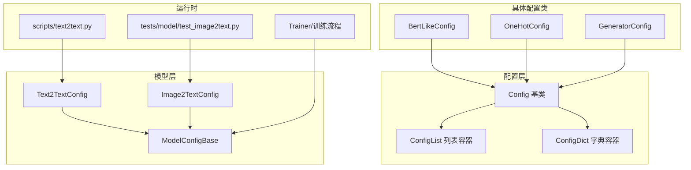
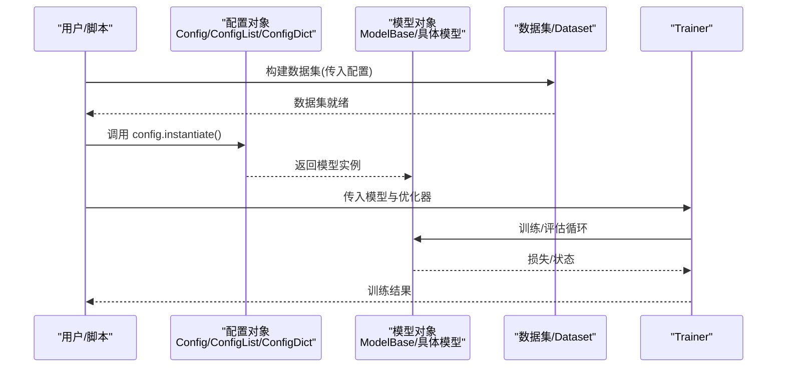
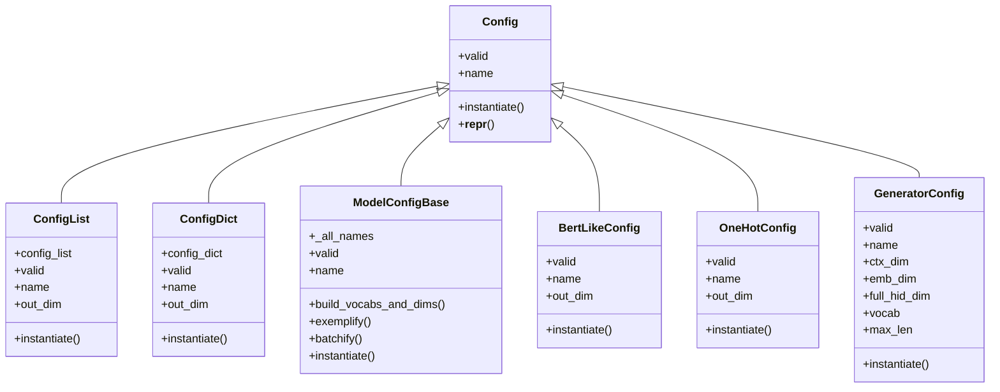

# 配置系统API

<cite>
**本文引用的文件列表**
- [eznlp/config.py](file://eznlp/config.py)
- [eznlp/model/model/base.py](file://eznlp/model/model/base.py)
- [eznlp/model/bert_like.py](file://eznlp/model/bert_like.py)
- [eznlp/model/embedder.py](file://eznlp/model/embedder.py)
- [eznlp/model/decoder/generator.py](file://eznlp/model/decoder/generator.py)
- [eznlp/model/model/image2text.py](file://eznlp/model/model/image2text.py)
- [eznlp/model/model/text2text.py](file://eznlp/model/model/text2text.py)
- [scripts/text2text.py](file://scripts/text2text.py)
- [tests/model/test_image2text.py](file://tests/model/test_image2text.py)
</cite>

## 目录
1. [简介](#简介)
2. [项目结构与定位](#项目结构与定位)
3. [核心组件概览](#核心组件概览)
4. [架构总览](#架构总览)
5. [详细组件分析](#详细组件分析)
6. [依赖关系分析](#依赖关系分析)
7. [性能与复杂度](#性能与复杂度)
8. [故障排查指南](#故障排查指南)
9. [结论](#结论)
10. [附录：使用示例与最佳实践](#附录使用示例与最佳实践)

## 简介
本文件面向“配置系统API”的使用者与维护者，聚焦于 eznlp/config.py 中定义的 Config、ConfigList 与 ConfigDict 三类配置容器，系统阐述其属性、方法与使用模式，并结合项目中的具体配置类（如 BertLikeConfig、OneHotConfig、GeneratorConfig 等）说明配置验证、命名规则、实例化流程与生命周期管理。文档同时给出配置继承与组合的实际示例，帮助读者通过配置驱动模型构建与训练。

## 项目结构与定位
- 配置系统位于 eznlp/config.py，提供通用的配置基类与两种组合容器（列表与字典），用于组织复杂模型的子模块配置。
- 具体的配置类（如 BertLikeConfig、OneHotConfig、GeneratorConfig 等）分别定义在各自模块中，均继承自 Config 或 ModelConfigBase，负责自身字段的校验、名称生成与实例化。
- 训练脚本与测试用例展示了配置从构建到实例化的完整调用链路，体现配置驱动模型构建的生命周期。

图表来源
- [eznlp/config.py](file://eznlp/config.py#L1-L173)
- [eznlp/model/model/base.py](file://eznlp/model/model/base.py#L1-L99)
- [eznlp/model/bert_like.py](file://eznlp/model/bert_like.py#L90-L289)
- [eznlp/model/embedder.py](file://eznlp/model/embedder.py#L1-L200)
- [eznlp/model/decoder/generator.py](file://eznlp/model/decoder/generator.py#L70-L269)
- [eznlp/model/model/text2text.py](file://eznlp/model/model/text2text.py#L1-L83)
- [eznlp/model/model/image2text.py](file://eznlp/model/model/image2text.py#L1-L45)
- [scripts/text2text.py](file://scripts/text2text.py#L1-L200)
- [tests/model/test_image2text.py](file://tests/model/test_image2text.py#L1-L68)

章节来源
- [eznlp/config.py](file://eznlp/config.py#L1-L173)
- [eznlp/model/model/base.py](file://eznlp/model/model/base.py#L1-L99)
- [scripts/text2text.py](file://scripts/text2text.py#L1-L200)
- [tests/model/test_image2text.py](file://tests/model/test_image2text.py#L1-L68)

## 核心组件概览
- Config：所有配置类的抽象基类，提供统一的验证、命名与实例化接口约定；支持任意关键字参数注入，但会发出未检查警告。
- ConfigList：有序配置列表容器，聚合多个子配置，提供顺序拼接的 out_dim 与 ModuleList 实例化。
- ConfigDict：有序配置字典容器，聚合多个子配置，提供键值映射的 out_dim 与 ModuleDict 实例化。
- ModelConfigBase：模型级配置基类，基于 _all_names 组合子配置，统一验证与命名策略，并提供 build_vocabs_and_dims、exemplify、batchify 等数据处理接口。
- 具体配置类（如 BertLikeConfig、OneHotConfig、GeneratorConfig）：各自实现 valid、name、out_dim、instantiate 等，遵循配置驱动模型构建的契约。

章节来源
- [eznlp/config.py](file://eznlp/config.py#L1-L173)
- [eznlp/model/model/base.py](file://eznlp/model/model/base.py#L1-L99)

## 架构总览
配置系统采用“配置即契约”的设计：上层通过 Config/ConfigList/ConfigDict 组织子配置，下层具体配置类负责字段校验与实例化，最终由训练脚本或测试用例调用 config.instantiate() 获取可执行的模型对象。

图表来源
- [eznlp/model/model/base.py](file://eznlp/model/model/base.py#L64-L99)
- [scripts/text2text.py](file://scripts/text2text.py#L194-L234)
- [tests/model/test_image2text.py](file://tests/model/test_image2text.py#L42-L68)

## 详细组件分析

### Config 基类
- 属性与行为
  - valid：遍历自身属性，若存在 None 或子配置无效则返回 False。
  - name：抽象属性，需子类实现。
  - instantiate：抽象方法，需子类实现。
  - __repr__：输出非配置属性的简洁表示；内部提供 _repr_config_attrs/_repr_non_config_attrs 用于格式化。
  - _name_sep：分隔符，默认“-”，用于组合容器的名称拼接。
  - __init__：接受任意关键字参数，若传入未显式声明的字段，会记录警告并动态挂载为属性。
- 使用要点
  - 子类必须实现 name 与 instantiate。
  - 若需要对字段进行严格校验，建议在子类中覆盖 valid 并显式声明必填字段。
  - 可通过 __init__ 注入临时字段，但不建议长期依赖。

章节来源
- [eznlp/config.py](file://eznlp/config.py#L1-L72)

### ConfigList 容器
- 属性与行为
  - config_list：存储子配置列表，元素类型必须为 Config。
  - valid：要求列表非空且所有子配置有效。
  - name：按 _name_sep 连接各子配置的 name。
  - out_dim：累加各子配置的 out_dim。
  - instantiate：返回 torch.nn.ModuleList，顺序与 forward 保持一致。
  - 支持 len、迭代、索引、追加与设置等操作。
- 使用要点
  - 适用于顺序堆叠的模块组合（如多分支编码器）。
  - 注意顺序一致性，避免与模型前向逻辑不匹配。

章节来源
- [eznlp/config.py](file://eznlp/config.py#L74-L119)

### ConfigDict 容器
- 属性与行为
  - config_dict：存储子配置字典，键为字符串，值为 Config；内部使用有序字典保证顺序。
  - valid：要求字典非空且所有子配置有效。
  - name：按 _name_sep 连接各子配置的 name。
  - out_dim：累加各子配置的 out_dim。
  - instantiate：返回 torch.nn.ModuleDict，键与 forward 保持一致。
  - 支持 keys、values、items、索引与设置等操作。
- 使用要点
  - 适用于命名化组合（如多特征嵌入、多解码器分支）。
  - 键名应稳定且语义明确，便于调试与日志输出。

章节来源
- [eznlp/config.py](file://eznlp/config.py#L121-L173)

### ModelConfigBase 模型配置基类
- 属性与行为
  - _all_names：由子类声明，列出参与组合的子配置字段名。
  - valid：遍历 _all_names，对 None 跳过，对字典类型的子配置递归校验。
  - name：按 _name_sep 连接各子配置的 name，字典类型按值序列拼接。
  - build_vocabs_and_dims、exemplify、batchify：抽象接口，供子类实现。
  - instantiate：抽象接口，供子类实现。
- 生命周期
  - 在数据集构建阶段调用 build_vocabs_and_dims 完成词表与维度初始化。
  - 在训练脚本中先构建数据集，再调用 config.instantiate() 获取模型实例。

章节来源
- [eznlp/model/model/base.py](file://eznlp/model/model/base.py#L1-L63)

### 具体配置类示例

#### BertLikeConfig（预训练编码器）
- 关键点
  - valid：默认基于字段非空判断。
  - name：返回架构标识。
  - out_dim：返回隐藏维度。
  - instantiate：返回 BertLikeEmbedder。
- 适用场景
  - 作为文本编码器的预训练骨干，支持冻结/混合层等策略。

章节来源
- [eznlp/model/bert_like.py](file://eznlp/model/bert_like.py#L90-L140)
- [eznlp/model/bert_like.py](file://eznlp/model/bert_like.py#L270-L289)

#### OneHotConfig（嵌入器）
- 关键点
  - valid：除 vectors 外，其余字段不可为 None。
  - name：返回字段名（如 text）。
  - out_dim：返回嵌入维度。
  - instantiate：返回 OneHotEmbedder。
- 适用场景
  - 文本/标签的 one-hot 或带预训练向量的嵌入。

章节来源
- [eznlp/model/embedder.py](file://eznlp/model/embedder.py#L51-L104)
- [eznlp/model/embedder.py](file://eznlp/model/embedder.py#L137-L139)

#### GeneratorConfig（解码器/生成器）
- 关键点
  - 根据 arch 分支选择 LSTM/GRU、Gehring 或 Transformer 结构，设置相应超参。
  - name：由评分方式、架构与损失类型拼接而成。
  - out_dim：由嵌入维度与上下文维度决定。
  - instantiate：根据架构返回对应生成器模块。
- 适用场景
  - 机器翻译、文本生成等任务的解码器。

章节来源
- [eznlp/model/decoder/generator.py](file://eznlp/model/decoder/generator.py#L80-L156)
- [eznlp/model/decoder/generator.py](file://eznlp/model/decoder/generator.py#L193-L201)

#### Text2TextConfig（端到端文本到文本模型）
- 关键点
  - 组合 embedder、encoder、decoder 三个子配置。
  - build_vocabs_and_dims：先构建目标侧词表，再设置 encoder 的 in_dim。
  - exemplify/batchify：整合嵌入器与解码器的数据处理。
  - instantiate：返回 Text2Text 模型实例。
- 适用场景
  - 机器翻译、对话生成等。

章节来源
- [eznlp/model/model/text2text.py](file://eznlp/model/model/text2text.py#L1-L83)

#### Image2TextConfig（图像到文本模型）
- 关键点
  - 组合 encoder 与 decoder（含嵌入器）。
  - build_vocabs_and_dims：构建目标侧词表并将 encoder 输出维度设为 decoder 输入维度。
  - exemplify/batchify：整合编码器与解码器的数据处理。
  - instantiate：返回 Image2Text 模型实例。
- 适用场景
  - 图像描述生成。

章节来源
- [eznlp/model/model/image2text.py](file://eznlp/model/model/image2text.py#L1-L45)

## 依赖关系分析

图表来源
- [eznlp/config.py](file://eznlp/config.py#L1-L173)
- [eznlp/model/model/base.py](file://eznlp/model/model/base.py#L1-L63)
- [eznlp/model/bert_like.py](file://eznlp/model/bert_like.py#L90-L140)
- [eznlp/model/embedder.py](file://eznlp/model/embedder.py#L51-L104)
- [eznlp/model/decoder/generator.py](file://eznlp/model/decoder/generator.py#L80-L156)

## 性能与复杂度
- 验证复杂度
  - Config.valid：O(N)，N 为实例属性数量。
  - ConfigList.valid/ConfigDict.valid：O(M)，M 为子配置数量。
  - ModelConfigBase.valid：对字典类型按值遍历，整体 O(K)，K 为 _all_names 长度及子配置数量。
- 实例化复杂度
  - ConfigList.instantiate：O(M)，逐个实例化子配置并放入 ModuleList。
  - ConfigDict.instantiate：O(M)，逐个实例化子配置并放入 ModuleDict。
- 名称拼接复杂度
  - name 拼接为 O(S)，S 为子配置名称长度之和。
- 内存与设备
  - 预训练模型（如 BertLikeConfig）在 instantiate 时仅保存配置信息，不加载权重；实际权重在运行时按需加载。
  - 训练脚本中通过 to(device) 将模型移动至目标设备。

[本节为通用性能讨论，无需特定文件引用]

## 故障排查指南
- 配置未通过验证
  - 现象：调用 config.instantiate() 前 assert self.valid 报错。
  - 排查：确认必填字段均已设置，且子配置（如嵌入器、解码器）均有效。
  - 参考路径：
    - [eznlp/model/model/base.py](file://eznlp/model/model/base.py#L21-L33)
    - [eznlp/model/embedder.py](file://eznlp/model/embedder.py#L83-L90)
    - [eznlp/model/bert_like.py](file://eznlp/model/bert_like.py#L118-L124)
- 未实现抽象方法
  - 现象：调用 name/instantiate 抛出未实现错误。
  - 排查：确保子类实现了 name 与 instantiate。
  - 参考路径：
    - [eznlp/config.py](file://eznlp/config.py#L49-L72)
- 顺序不一致导致前向错误
  - 现象：ModuleList/ModuleDict 顺序与模型前向不一致，导致张量维度不匹配。
  - 排查：确保 ConfigList/ConfigDict 的 instantiate 顺序与模型 forward 一致。
  - 参考路径：
    - [eznlp/config.py](file://eznlp/config.py#L113-L116)
    - [eznlp/config.py](file://eznlp/config.py#L165-L169)
- 未检查的关键字参数
  - 现象：初始化时出现未检查配置项的警告。
  - 排查：显式声明字段或在子类中覆盖 __init__ 进行校验。
  - 参考路径：
    - [eznlp/config.py](file://eznlp/config.py#L31-L39)

章节来源
- [eznlp/config.py](file://eznlp/config.py#L31-L39)
- [eznlp/config.py](file://eznlp/config.py#L49-L72)
- [eznlp/model/model/base.py](file://eznlp/model/model/base.py#L21-L33)
- [eznlp/model/embedder.py](file://eznlp/model/embedder.py#L83-L90)
- [eznlp/model/bert_like.py](file://eznlp/model/bert_like.py#L118-L124)

## 结论
配置系统通过 Config、ConfigList、ConfigDict 提供了统一的配置组织与实例化契约，配合具体配置类的字段校验与命名策略，实现了“配置驱动模型构建”。在训练脚本与测试用例中，配置从构建、数据集构建、模型实例化到训练评估形成闭环。遵循顺序一致、字段完备与命名规范，可显著提升可维护性与可扩展性。

[本节为总结性内容，无需特定文件引用]

## 附录：使用示例与最佳实践

### 配置继承与组合的实际示例
- 多特征嵌入（ConfigDict）
  - 场景：将 OneHotConfig 与自定义嵌入配置组合为 nested_ohots。
  - 参考路径：
    - [eznlp/model/model/base.py](file://eznlp/model/model/base.py#L64-L77)
    - [eznlp/model/embedder.py](file://eznlp/model/embedder.py#L51-L104)
- 编码器-解码器（ConfigList/ConfigDict）
  - 场景：Text2TextConfig 组合 embedder、encoder、decoder；Image2TextConfig 组合 encoder、decoder(embedding)。
  - 参考路径：
    - [eznlp/model/model/text2text.py](file://eznlp/model/model/text2text.py#L1-L83)
    - [eznlp/model/model/image2text.py](file://eznlp/model/model/image2text.py#L1-L45)

### 配置验证与实例化流程
- 数据集构建阶段
  - 调用数据集构造函数并传入配置，随后调用 build_vocabs_and_dims 完成词表与维度初始化。
  - 参考路径：
    - [scripts/text2text.py](file://scripts/text2text.py#L186-L193)
    - [tests/model/test_image2text.py](file://tests/model/test_image2text.py#L42-L50)
- 模型实例化阶段
  - 调用 config.instantiate() 获取模型实例，并移动至目标设备。
  - 参考路径：
    - [scripts/text2text.py](file://scripts/text2text.py#L204-L206)
    - [tests/model/test_image2text.py](file://tests/model/test_image2text.py#L45-L49)

### 配置驱动模型构建的生命周期
- 配置构建 → 数据集构建与维度初始化 → 模型实例化 → 训练/评估 → 模型保存与加载
- 参考路径：
  - [scripts/text2text.py](file://scripts/text2text.py#L194-L234)
  - [tests/model/test_image2text.py](file://tests/model/test_image2text.py#L42-L68)

章节来源
- [eznlp/model/model/base.py](file://eznlp/model/model/base.py#L64-L99)
- [eznlp/model/embedder.py](file://eznlp/model/embedder.py#L51-L104)
- [eznlp/model/model/text2text.py](file://eznlp/model/model/text2text.py#L1-L83)
- [eznlp/model/model/image2text.py](file://eznlp/model/model/image2text.py#L1-L45)
- [scripts/text2text.py](file://scripts/text2text.py#L186-L234)
- [tests/model/test_image2text.py](file://tests/model/test_image2text.py#L42-L68)