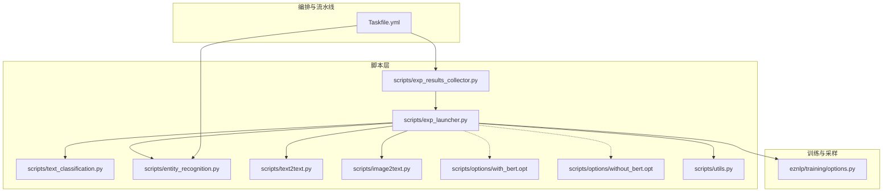
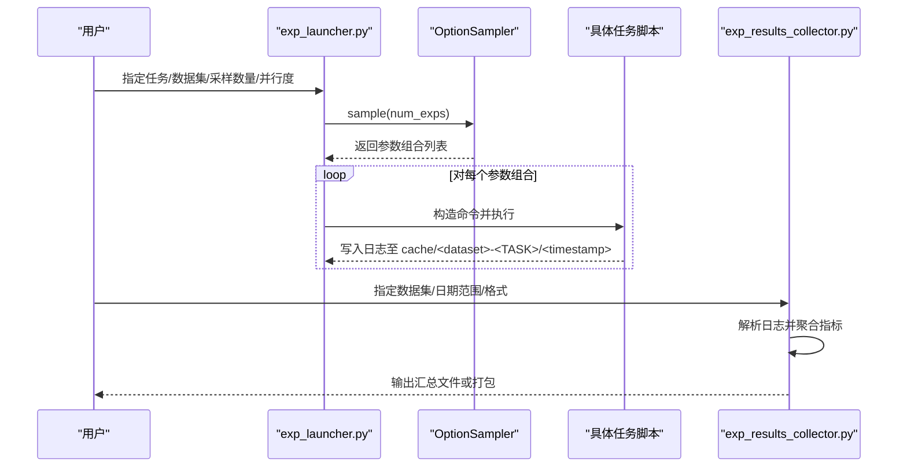
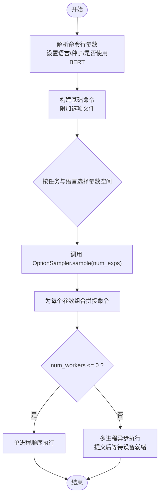
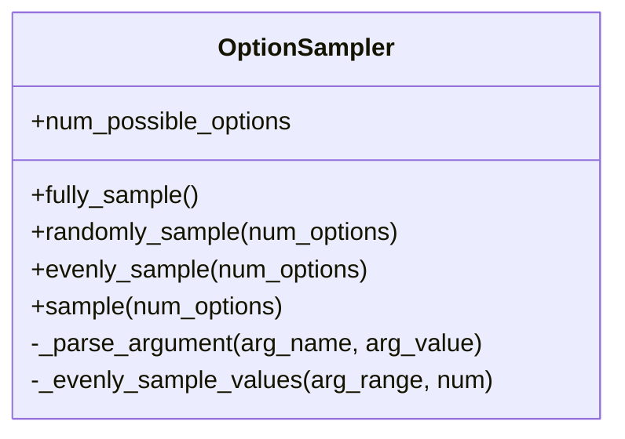
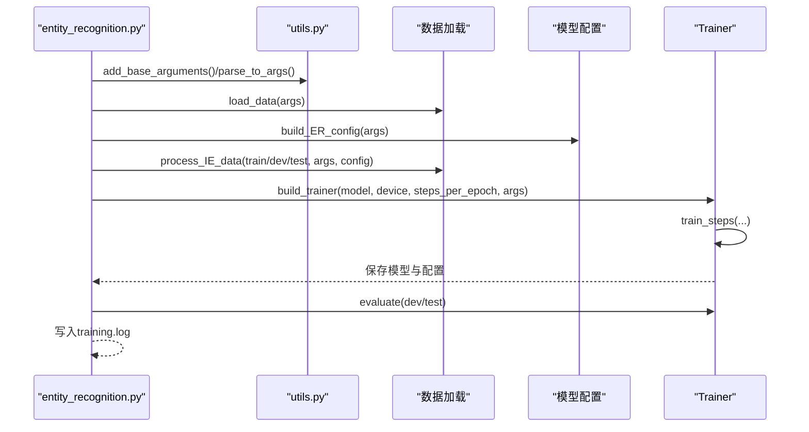
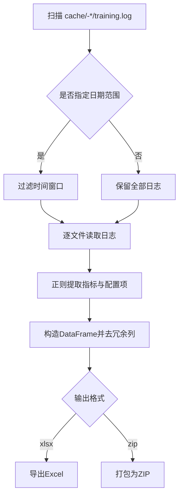
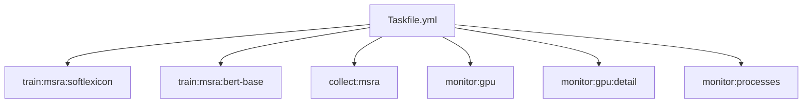
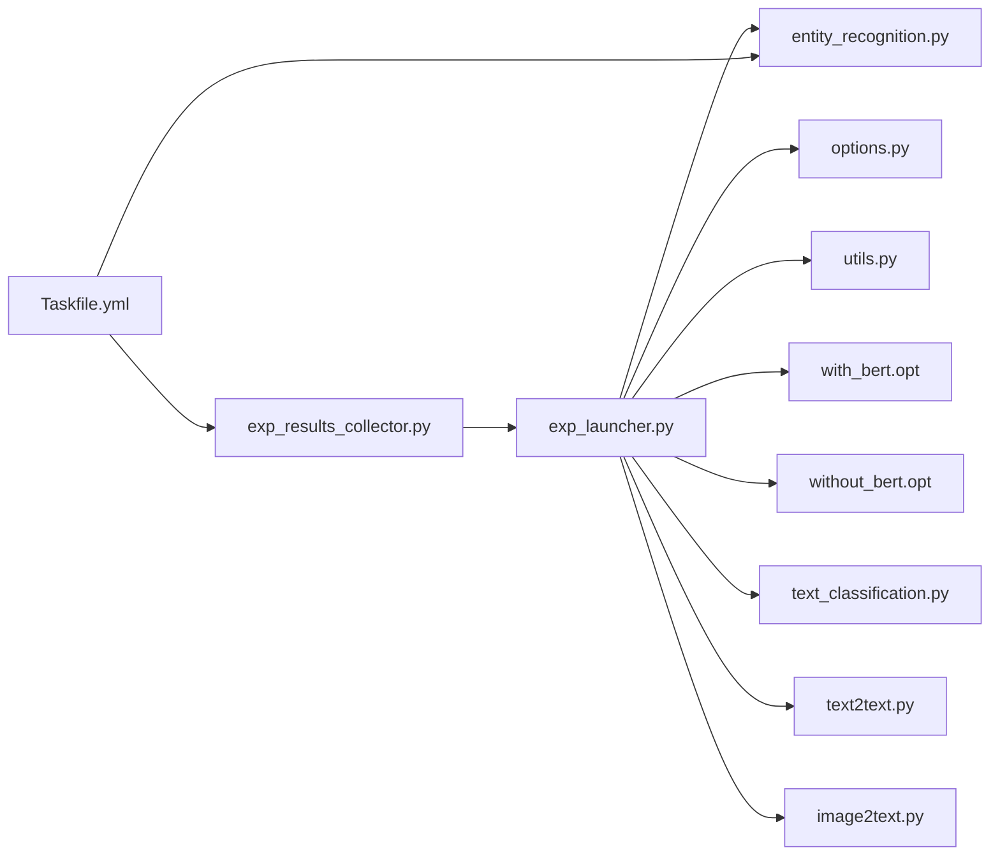

# 实验执行

<cite>
**本文引用的文件**
- [exp_launcher.py](file://scripts/exp_launcher.py)
- [Taskfile.yml](file://Taskfile.yml)
- [exp_results_collector.py](file://scripts/exp_results_collector.py)
- [options/with_bert.opt](file://scripts/options/with_bert.opt)
- [options/without_bert.opt](file://scripts/options/without_bert.opt)
- [utils.py](file://scripts/utils.py)
- [options.py](file://eznlp/training/options.py)
- [entity_recognition.py](file://scripts/entity_recognition.py)
- [text_classification.py](file://scripts/text_classification.py)
- [text2text.py](file://scripts/text2text.py)
- [image2text.py](file://scripts/image2text.py)
- [NER任务完整流程.md](file://docs/NER任务完整流程.md)
</cite>

## 目录
1. [简介](#简介)
2. [项目结构](#项目结构)
3. [核心组件](#核心组件)
4. [架构总览](#架构总览)
5. [详细组件分析](#详细组件分析)
6. [依赖关系分析](#依赖关系分析)
7. [性能考量](#性能考量)
8. [故障排查指南](#故障排查指南)
9. [结论](#结论)
10. [附录](#附录)

## 简介
本文件系统性解析实验执行子系统，重点覆盖以下目标：
- 大规模实验自动化调度：参数网格搜索、随机搜索与批量任务管理
- 与 Taskfile 的集成方式：如何通过 Taskfile 定义复杂实验流水线
- 实际配置与启动示例：如何组织多组对比实验
- 任务队列管理、资源分配与错误重试机制
- 常见问题排查（任务卡死、资源不足）与性能优化建议

## 项目结构
该仓库围绕“脚本驱动 + 参数采样 + 结果收集”的实验体系构建，核心文件分布如下：
- scripts/：实验入口脚本与工具
  - exp_launcher.py：统一的实验编排器，负责参数采样与并发执行
  - exp_results_collector.py：实验结果聚合与导出
  - 各任务脚本：text_classification.py、entity_recognition.py、text2text.py、image2text.py
  - options/*.opt：预置参数模板
  - utils.py：通用工具与参数解析
- eznlp/training/：训练与采样基础设施
  - options.py：OptionSampler 实现
- Taskfile.yml：实验流水线定义
- docs/NER任务完整流程.md：包含 Taskfile 使用与批量实验说明

图表来源
- [exp_launcher.py](file://scripts/exp_launcher.py#L1-L267)
- [exp_results_collector.py](file://scripts/exp_results_collector.py#L1-L139)
- [options.py](file://eznlp/training/options.py#L1-L99)
- [Taskfile.yml](file://Taskfile.yml#L1-L81)

章节来源
- [exp_launcher.py](file://scripts/exp_launcher.py#L1-L267)
- [Taskfile.yml](file://Taskfile.yml#L1-L81)

## 核心组件
- 实验编排器（exp_launcher.py）
  - 负责根据任务类型与语言选择合适的 OptionSampler 参数空间
  - 将采样得到的参数组合拼接为命令行参数，支持从选项文件注入默认参数
  - 单进程串行或多进程并行执行，内置简单的设备分配间隔
- 参数采样器（eznlp/training/options.py）
  - 提供完全采样（笛卡尔积）、随机采样与均匀采样三种策略
  - 自动解析布尔/数值/字符串参数为命令行片段
- 任务脚本（scripts/*.py）
  - 统一采用 fromfile 前缀加载选项文件，支持命令行覆盖
  - 每个任务脚本负责数据加载、配置构建、训练与评估，并输出日志到 cache/<dataset>-<TASK>/YYYYMMDD-HHMMSS-μs/
- 结果收集器（scripts/exp_results_collector.py）
  - 解析各实验日志中的指标，生成汇总表格或打包归档
- Taskfile（Taskfile.yml）
  - 定义常用实验任务与监控命令，便于一键执行与结果收集

章节来源
- [exp_launcher.py](file://scripts/exp_launcher.py#L1-L267)
- [options.py](file://eznlp/training/options.py#L1-L99)
- [exp_results_collector.py](file://scripts/exp_results_collector.py#L1-L139)
- [Taskfile.yml](file://Taskfile.yml#L1-L81)

## 架构总览
下图展示了从参数采样到任务执行与结果收集的整体流程。

图表来源
- [exp_launcher.py](file://scripts/exp_launcher.py#L240-L267)
- [options.py](file://eznlp/training/options.py#L68-L99)
- [exp_results_collector.py](file://scripts/exp_results_collector.py#L77-L139)

## 详细组件分析

### 组件A：参数采样与实验编排（exp_launcher.py）
- 参数空间定义
  - 针对不同任务（文本分类、命名实体识别、关系抽取、属性抽取、联合抽取、机器翻译、图像描述）与语言（英文/中文），exp_launcher.py 内置了针对不同场景的 OptionSampler 参数范围
  - 采样策略自动选择：当 num_exps 接近参数空间大小时采用随机采样；否则采用均匀采样，避免某些超参维度被过度偏向
- 命令构造与选项注入
  - 基础命令由 --task 与 --dataset 等参数构成
  - 通过 fromfile 前缀加载选项文件（with_bert.opt / without_bert.opt），再叠加采样参数
  - 当 num_workers > 0 时，自动追加 no_log_terminal 以减少终端输出干扰
- 并发执行与设备分配
  - 单进程模式：顺序执行，适合调试与小规模实验
  - 多进程模式：使用 multiprocessing.Pool 异步提交任务，并在每次提交后等待固定时间，确保 GPU 设备完成初始化与资源释放
- 日志与可观测性
  - 记录每个命令的开始与结束，便于追踪失败点
  - 通过日志路径与时间戳区分不同实验

图表来源
- [exp_launcher.py](file://scripts/exp_launcher.py#L20-L60)
- [exp_launcher.py](file://scripts/exp_launcher.py#L62-L239)
- [exp_launcher.py](file://scripts/exp_launcher.py#L240-L267)
- [options.py](file://eznlp/training/options.py#L68-L99)

章节来源
- [exp_launcher.py](file://scripts/exp_launcher.py#L1-L267)
- [options.py](file://eznlp/training/options.py#L1-L99)

### 组件B：参数采样器（OptionSampler）
- 数据结构与复杂度
  - 以字典形式记录每个超参的取值集合，参数空间大小为各维度取值数的乘积
  - 完全采样采用笛卡尔积，时间复杂度 O(|S|)，空间复杂度 O(|S|)，其中 |S| 为参数空间大小
  - 随机采样基于完全采样的子集，时间复杂度 O(k)，k 为采样数量
  - 均匀采样通过复制与随机抽样，尽量保证各维度均衡覆盖，时间复杂度近似 O(k·d)，d 为维度数
- 关键算法
  - _parse_argument：将布尔/数值/字符串转换为命令行片段
  - _evenly_sample_values：对给定维度进行复制+随机抽样，保证均匀覆盖
  - sample：根据 k 与 |S| 的关系自动选择策略

图表来源
- [options.py](file://eznlp/training/options.py#L1-L99)

章节来源
- [options.py](file://eznlp/training/options.py#L1-L99)

### 组件C：任务脚本（以 entity_recognition.py 为例）
- 参数解析与默认值
  - 任务脚本统一使用 fromfile 前缀加载选项文件，随后可被命令行覆盖
  - 通过 utils.add_base_arguments 注入训练与模型相关参数
- 数据与配置
  - 加载数据集，构建 Dataset 与 DataLoader
  - 根据参数构建模型配置，必要时进行预处理（如 BERT 分词、长句截断、句子切分等）
- 训练与评估
  - 训练阶段保存中间模型与配置
  - 评估阶段分别在开发集与测试集上计算指标，并输出日志
- 结果落盘
  - 日志写入 cache/<dataset>-<TASK>/<timestamp>/training.log
  - 模型与配置保存在同一目录，便于后续结果收集

图表来源
- [entity_recognition.py](file://scripts/entity_recognition.py#L727-L800)
- [utils.py](file://scripts/utils.py#L33-L210)

章节来源
- [entity_recognition.py](file://scripts/entity_recognition.py#L1-L800)
- [utils.py](file://scripts/utils.py#L1-L280)

### 组件D：结果收集器（exp_results_collector.py）
- 输入输出
  - 输入：cache/<dataset>-<TASK>/YYYYMMDD-HHMMSS-μs/training.log
  - 输出：Excel 或 ZIP 归档，ZIP 可直接下载用于离线分析
- 解析逻辑
  - 从日志中提取 dev/test 指标，构造 DataFrame
  - 过滤冗余列，合并多个实验结果
- 时间范围筛选
  - 支持 from_date/to_date 限定实验窗口，便于跨时间段对比

图表来源
- [exp_results_collector.py](file://scripts/exp_results_collector.py#L77-L139)

章节来源
- [exp_results_collector.py](file://scripts/exp_results_collector.py#L1-L139)

### 组件E：Taskfile 集成与流水线
- 任务定义
  - Taskfile.yml 中定义了针对 MSRA 数据集的多种训练任务，以及结果收集与 GPU 监控任务
  - 每个任务包含描述与命令列表，支持 silent 控制输出
- 与 exp_launcher 的关系
  - Taskfile 适合快速执行固定参数的对比实验
  - exp_launcher 更适合大规模参数搜索与批量调度

图表来源
- [Taskfile.yml](file://Taskfile.yml#L1-L81)

章节来源
- [Taskfile.yml](file://Taskfile.yml#L1-L81)
- [NER任务完整流程.md](file://docs/NER任务完整流程.md#L292-L355)

## 依赖关系分析
- exp_launcher.py 依赖
  - eznlp/training/options.py：参数采样
  - scripts/utils.py：参数解析与通用工具
  - scripts/options/*.opt：默认参数模板
  - 具体任务脚本：text_classification.py、entity_recognition.py、text2text.py、image2text.py
- 结果收集器依赖
  - pandas：结果聚合
  - 正则表达式：指标提取
- Taskfile 依赖
  - Python 与脚本路径：直接调用 scripts/*.py
  - 外部工具：nvidia-smi（监控任务）

图表来源
- [exp_launcher.py](file://scripts/exp_launcher.py#L1-L267)
- [options.py](file://eznlp/training/options.py#L1-L99)
- [exp_results_collector.py](file://scripts/exp_results_collector.py#L1-L139)
- [Taskfile.yml](file://Taskfile.yml#L1-L81)

章节来源
- [exp_launcher.py](file://scripts/exp_launcher.py#L1-L267)
- [options.py](file://eznlp/training/options.py#L1-L99)
- [exp_results_collector.py](file://scripts/exp_results_collector.py#L1-L139)
- [Taskfile.yml](file://Taskfile.yml#L1-L81)

## 性能考量
- 并发与资源分配
  - 多进程模式下，建议 num_workers 与 GPU 数量匹配，避免显存争抢
  - exp_launcher 在提交任务之间加入固定等待时间，缓解设备初始化开销
- 采样策略选择
  - 当参数空间较大且实验预算有限时，优先使用随机采样或均匀采样
  - 若需要穷举验证，使用完全采样但注意内存与时间成本
- I/O 与日志
  - 任务脚本将日志写入独立目录，便于并行时不互相干扰
  - 结果收集器支持 ZIP 归档，便于离线分析与迁移
- 监控与诊断
  - Taskfile 提供 GPU 使用率与进程监控任务，有助于定位资源瓶颈

[本节为通用指导，无需列出章节来源]

## 故障排查指南
- 任务卡死
  - 现象：某次实验长时间无输出
  - 排查要点：
    - 检查 GPU 显存占用与进程列表（参考 Taskfile 的 monitor 任务）
    - 查看对应 cache/<dataset>-<TASK>/<timestamp>/training.log 是否仍在写入
    - 若为多进程模式，确认等待时间是否过短导致设备未就绪
- 资源不足（OOM）
  - 现象：训练报错或进程被杀
  - 排查要点：
    - 降低 batch_size 或 num_layers
    - 关闭不必要的特征（如 use_elmo/use_flair/bert_arch=None）
    - 使用更小的预训练模型或冻结部分权重
- 结果收集失败
  - 现象：exp_results_collector 报告解析失败
  - 排查要点：
    - 确认日志中包含“Evaluating on dev-set”与“Evaluating on test-set”的标记
    - 检查日期范围参数是否正确
    - 确保日志文件未被外部程序修改或删除

章节来源
- [exp_results_collector.py](file://scripts/exp_results_collector.py#L93-L139)
- [Taskfile.yml](file://Taskfile.yml#L64-L81)

## 结论
本实验执行体系通过“参数采样 + 任务脚本 + 结果收集”的闭环，实现了从参数搜索到结果汇总的自动化。exp_launcher 提供灵活的采样策略与并发控制，Taskfile 则为常用流水线提供了便捷入口。结合监控与日志，能够高效地开展大规模对比实验并稳定产出可复现的结果。

[本节为总结性内容，无需列出章节来源]

## 附录

### 实际配置与启动示例（路径指引）
- 使用 Taskfile 快速执行固定参数对比实验
  - 示例：在 MSRA 数据集上训练 SoftLexicon 模型
  - 参考路径：[Taskfile.yml](file://Taskfile.yml#L1-L20)
- 使用 exp_launcher 进行参数搜索与批量实验
  - 示例：在 MSRA 数据集上对命名实体识别进行 5 组对比实验
  - 参考路径：[NER任务完整流程.md](file://docs/NER任务完整流程.md#L344-L355)
  - 参数采样与命令拼接逻辑：[exp_launcher.py](file://scripts/exp_launcher.py#L62-L239)
  - 选项文件注入：[with_bert.opt](file://scripts/options/with_bert.opt#L1-L11)、[without_bert.opt](file://scripts/options/without_bert.opt#L1-L2)

### 与 Taskfile 集成的关键点
- 任务定义：在 Taskfile.yml 中为常用实验编写任务块，便于一键执行
- 结果收集：通过 collect:* 任务统一导出 Excel 或打包 ZIP
- 监控：利用 monitor:* 任务实时观察 GPU 使用情况

章节来源
- [Taskfile.yml](file://Taskfile.yml#L1-L81)
- [NER任务完整流程.md](file://docs/NER任务完整流程.md#L292-L355)