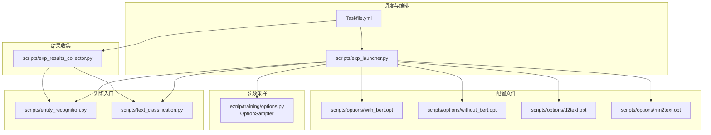
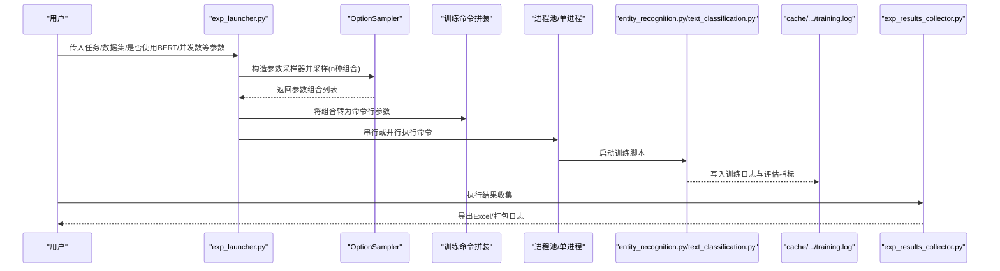
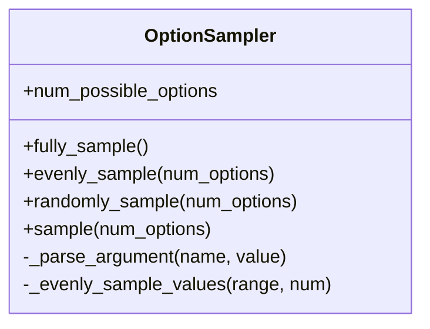
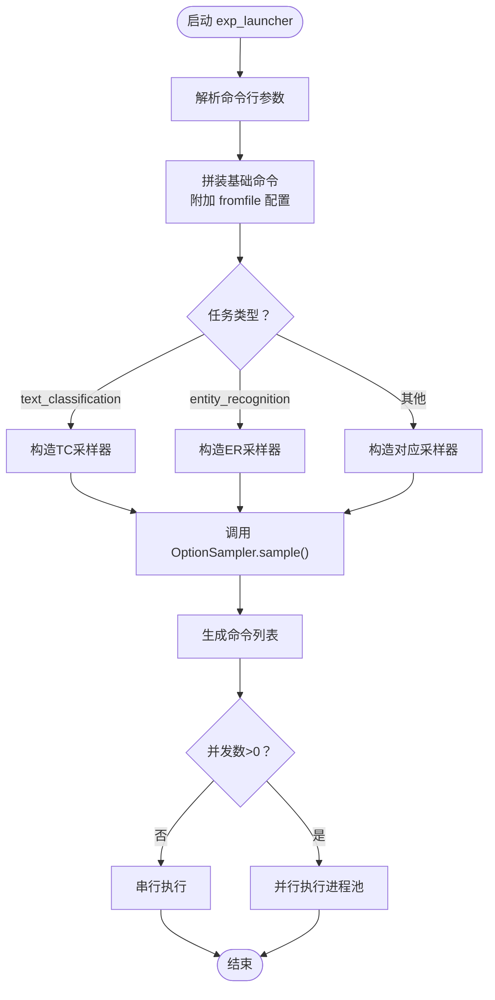
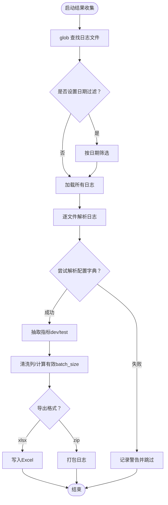
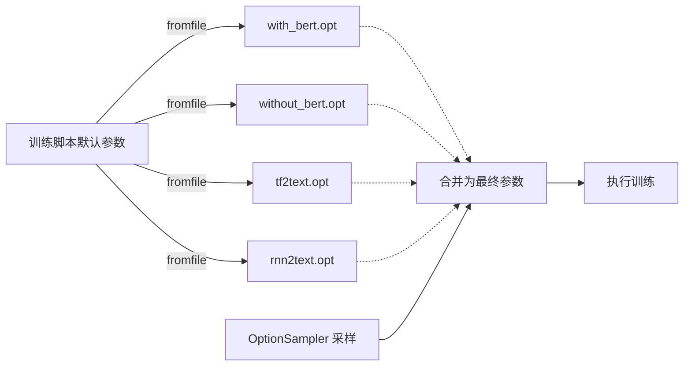
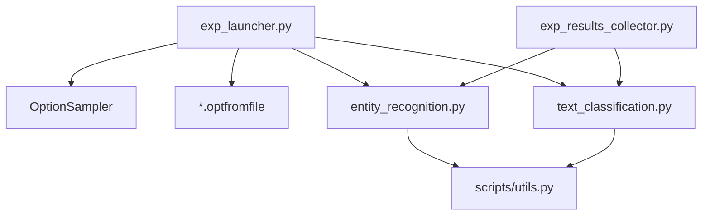

# 实验管理

<cite>
**本文引用的文件**
- [scripts/exp_launcher.py](file://scripts/exp_launcher.py)
- [eznlp/training/options.py](file://eznlp/training/options.py)
- [scripts/exp_results_collector.py](file://scripts/exp_results_collector.py)
- [scripts/options/with_bert.opt](file://scripts/options/with_bert.opt)
- [scripts/options/without_bert.opt](file://scripts/options/without_bert.opt)
- [scripts/options/rnn2text.opt](file://scripts/options/rnn2text.opt)
- [scripts/options/tf2text.opt](file://scripts/options/tf2text.opt)
- [Taskfile.yml](file://Taskfile.yml)
- [scripts/text_classification.py](file://scripts/text_classification.py)
- [scripts/entity_recognition.py](file://scripts/entity_recognition.py)
- [scripts/utils.py](file://scripts/utils.py)
</cite>

## 目录
1. [简介](#简介)
2. [项目结构](#项目结构)
3. [核心组件](#核心组件)
4. [架构总览](#架构总览)
5. [详细组件分析](#详细组件分析)
6. [依赖关系分析](#依赖关系分析)
7. [性能与可扩展性](#性能与可扩展性)
8. [故障排查指南](#故障排查指南)
9. [结论](#结论)
10. [附录](#附录)

## 简介
本文件系统化梳理该仓库的实验管理流程，围绕以下目标展开：
- 如何使用 exp_launcher.py 进行大规模实验的自动化调度，支持参数网格搜索与随机搜索。
- 如何使用 exp_results_collector.py 聚合与分析多个实验的结果。
- scripts/options/ 目录下配置文件（如 with_bert.opt、tf2text.opt 等）的结构与继承机制。
- 如何利用 Taskfile.yml 定义与执行复杂的实验工作流。
- 如何对实验结果进行可视化与比较，辅助模型迭代与决策。

## 项目结构
该实验管理子系统由“调度器 + 参数采样 + 结果收集 + 配置文件 + 工作流编排”五部分组成，配合脚本层的训练入口（如 entity_recognition.py、text_classification.py）完成端到端的实验生命周期管理。

图表来源
- [scripts/exp_launcher.py](file://scripts/exp_launcher.py#L1-L267)
- [eznlp/training/options.py](file://eznlp/training/options.py#L1-L99)
- [scripts/exp_results_collector.py](file://scripts/exp_results_collector.py#L1-L139)
- [scripts/options/with_bert.opt](file://scripts/options/with_bert.opt#L1-L11)
- [scripts/options/without_bert.opt](file://scripts/options/without_bert.opt#L1-L2)
- [scripts/options/tf2text.opt](file://scripts/options/tf2text.opt#L1-L29)
- [scripts/options/rnn2text.opt](file://scripts/options/rnn2text.opt#L1-L15)
- [Taskfile.yml](file://Taskfile.yml#L1-L81)
- [scripts/entity_recognition.py](file://scripts/entity_recognition.py#L1-L928)
- [scripts/text_classification.py](file://scripts/text_classification.py#L1-L304)

章节来源
- [scripts/exp_launcher.py](file://scripts/exp_launcher.py#L1-L267)
- [Taskfile.yml](file://Taskfile.yml#L1-L81)

## 核心组件
- 实验调度器：负责解析命令行参数、构建训练命令、根据 OptionSampler 生成参数组合、串行或并行执行。
- 参数采样器：提供完全遍历、均匀采样、随机采样的三种策略，自动将参数空间转换为命令行选项。
- 结果收集器：从 cache 下的日志中抽取指标，清洗列，导出 Excel 或打包日志。
- 配置文件：以“@前缀”的 fromfile 形式注入默认超参，支持按任务与模型选择不同的模板。
- 工作流编排：通过 Taskfile.yml 将常见实验组合封装为可复用的任务，便于一键执行与监控。

章节来源
- [eznlp/training/options.py](file://eznlp/training/options.py#L1-L99)
- [scripts/exp_launcher.py](file://scripts/exp_launcher.py#L1-L267)
- [scripts/exp_results_collector.py](file://scripts/exp_results_collector.py#L1-L139)
- [Taskfile.yml](file://Taskfile.yml#L1-L81)

## 架构总览
下图展示了从参数采样到实验执行再到结果收集的整体流程。

图表来源
- [scripts/exp_launcher.py](file://scripts/exp_launcher.py#L1-L267)
- [eznlp/training/options.py](file://eznlp/training/options.py#L1-L99)
- [scripts/exp_results_collector.py](file://scripts/exp_results_collector.py#L1-L139)
- [scripts/entity_recognition.py](file://scripts/entity_recognition.py#L1-L928)
- [scripts/text_classification.py](file://scripts/text_classification.py#L1-L304)

## 详细组件分析

### 组件A：参数采样器 OptionSampler
- 功能要点
  - 接收任意关键字参数，将标量/列表/元组/布尔值统一为可枚举的参数范围。
  - 提供三种采样策略：
    - 全量遍历：生成笛卡尔积，适合小参数空间。
    - 均匀采样：尽量覆盖每个维度，避免偏斜，适合中等规模。
    - 随机采样：从全量集合中不放回抽样，适合大规模参数空间。
  - 自动将参数值转换为命令行格式（支持布尔开关、数值、字符串等）。
- 复杂度与优化
  - 笛卡尔积规模随维度增长呈指数级增长；当参数空间过大时，优先采用随机或均匀采样。
  - 均匀采样通过复制与重采样减少重复组合，再去重后返回目标数量。
- 错误处理
  - 对非法参数类型抛出异常；断言采样数量小于可能选项数。

图表来源
- [eznlp/training/options.py](file://eznlp/training/options.py#L1-L99)

章节来源
- [eznlp/training/options.py](file://eznlp/training/options.py#L1-L99)

### 组件B：实验调度器 exp_launcher.py
- 功能要点
  - 解析任务类型、数据集、随机种子、是否使用 BERT、并发数等。
  - 根据任务与语言动态构造 OptionSampler 的参数空间，支持文本分类、命名实体识别、属性抽取、关系抽取、联合抽取、文本到文本、图像到文本等。
  - 通过命令行拼装与 fromfile 注入配置文件（如 with_bert.opt、without_bert.opt、tf2text.opt、rnn2text.opt），并支持多进程并行执行。
- 并发控制
  - 单进程串行执行或使用进程池并行执行；为避免显存争用，相邻进程间有时间间隔。
- 日志与可观测性
  - 记录每个命令的开始与结束，便于追踪失败点。

图表来源
- [scripts/exp_launcher.py](file://scripts/exp_launcher.py#L1-L267)
- [eznlp/training/options.py](file://eznlp/training/options.py#L1-L99)

章节来源
- [scripts/exp_launcher.py](file://scripts/exp_launcher.py#L1-L267)

### 组件C：结果收集器 exp_results_collector.py
- 功能要点
  - 从 cache/args.dataset/*/training.log 中读取日志，解析 dev/test 指标与实验配置字典。
  - 支持日期过滤（from_date/to_date）、输出格式（xlsx/zip）。
  - 清洗列（如 AMP、CRF、负采样相关等），计算有效 batch_size（含梯度累积），导出 Excel。
- 正则解析
  - 使用预编译正则表达式抽取 Accuracy、Micro Precision、Micro Recall、Micro F1-score、BLEU-4 等指标。
- 错误处理
  - 对无法解析的日志记录警告并跳过，保证整体流程稳健。

图表来源
- [scripts/exp_results_collector.py](file://scripts/exp_results_collector.py#L1-L139)

章节来源
- [scripts/exp_results_collector.py](file://scripts/exp_results_collector.py#L1-L139)

### 组件D：配置文件与继承机制（scripts/options/*.opt）
- 结构说明
  - 采用“@前缀”的 fromfile 方式注入，训练脚本在解析参数时启用 fromfile_prefix_chars="@"。
  - 每个 opt 文件代表一组默认超参模板，例如：
    - with_bert.opt：开启 AdamW 优化器、LinearDecayWithWarmup 调度器、禁用字符编码器、指定 BERT 架构等。
    - without_bert.opt：启用 use_interm2 等非 BERT 特征开关。
    - tf2text.opt：Transformer 编码器/解码器、教师强制率等。
    - rnn2text.opt：RNN 编码器/解码器、批大小、隐藏维等。
- 继承与叠加
  - exp_launcher.py 会根据任务与是否使用 BERT，将相应 opt 文件作为 fromfile 注入到命令中，从而实现“模板继承 + 采样参数覆盖”的组合。
  - 采样器生成的参数组合会进一步覆盖 opt 文件中的默认值，形成最终的训练命令。

图表来源
- [scripts/exp_launcher.py](file://scripts/exp_launcher.py#L1-L267)
- [scripts/text_classification.py](file://scripts/text_classification.py#L1-L304)
- [scripts/entity_recognition.py](file://scripts/entity_recognition.py#L1-L928)
- [scripts/options/with_bert.opt](file://scripts/options/with_bert.opt#L1-L11)
- [scripts/options/without_bert.opt](file://scripts/options/without_bert.opt#L1-L2)
- [scripts/options/tf2text.opt](file://scripts/options/tf2text.opt#L1-L29)
- [scripts/options/rnn2text.opt](file://scripts/options/rnn2text.opt#L1-L15)

章节来源
- [scripts/exp_launcher.py](file://scripts/exp_launcher.py#L1-L267)
- [scripts/text_classification.py](file://scripts/text_classification.py#L1-L304)
- [scripts/entity_recognition.py](file://scripts/entity_recognition.py#L1-L928)
- [scripts/options/with_bert.opt](file://scripts/options/with_bert.opt#L1-L11)
- [scripts/options/without_bert.opt](file://scripts/options/without_bert.opt#L1-L2)
- [scripts/options/tf2text.opt](file://scripts/options/tf2text.opt#L1-L29)
- [scripts/options/rnn2text.opt](file://scripts/options/rnn2text.opt#L1-L15)

### 组件E：工作流编排 Taskfile.yml
- 任务组织
  - 提供在 MSRA 数据集上训练不同模型（如 SoftLexicon、LSTM+CRF、BERT、BERT+LSTM、BERT+SoftLexicon、BERT+Interm2 等）的一键命令。
  - 提供收集 MSRA 结果的任务，支持导出 Excel 或打包日志。
  - 提供 GPU 监控任务，便于观察资源占用与进程状态。
- 使用方式
  - 通过 task 任务名直接运行，无需手动拼装命令，降低出错概率，提升可重复性。

章节来源
- [Taskfile.yml](file://Taskfile.yml#L1-L81)

## 依赖关系分析
- 调度器依赖参数采样器与配置文件模板，通过命令行拼装与 fromfile 注入实现“模板 + 采样”的组合。
- 训练脚本依赖 utils 提供的参数解析、数据加载、设备选择、日志写入等通用能力。
- 结果收集器依赖 pandas、正则表达式与文件系统，对 cache 下的日志进行解析与汇总。

图表来源
- [scripts/exp_launcher.py](file://scripts/exp_launcher.py#L1-L267)
- [eznlp/training/options.py](file://eznlp/training/options.py#L1-L99)
- [scripts/exp_results_collector.py](file://scripts/exp_results_collector.py#L1-L139)
- [scripts/utils.py](file://scripts/utils.py#L1-L399)
- [scripts/entity_recognition.py](file://scripts/entity_recognition.py#L1-L928)
- [scripts/text_classification.py](file://scripts/text_classification.py#L1-L304)

章节来源
- [scripts/utils.py](file://scripts/utils.py#L1-L399)

## 性能与可扩展性
- 参数空间爆炸
  - 当参数维度较多时，笛卡尔积规模会迅速膨胀。建议：
    - 优先使用随机采样或均匀采样，并结合早停策略。
    - 对关键超参（学习率、批次大小、编码器架构）分别采样，避免同时遍历全部维度。
- 并发与资源
  - 并发执行时注意显存分配，exp_launcher.py 已内置进程间隔以缓解资源争用。
  - 可根据 GPU 数量与显存上限调整 num_workers。
- 结果收集
  - 大规模实验建议先导出 Excel，再离线分析；若需保留原始日志，可使用 zip 输出模式。

[本节为通用指导，不直接分析具体文件]

## 故障排查指南
- 训练命令未生效
  - 确认 fromfile 前缀是否正确（训练脚本启用 fromfile_prefix_chars="@"）。
  - 检查配置文件路径与内容是否与任务匹配。
- 采样数量异常
  - 若采样数量大于等于可能选项数，调度器会退化为全量遍历；若小于阈值，会采用均匀采样。
  - 若采样数量过大，可能导致重复组合增多，建议增大 num_options 或改用随机采样。
- 结果收集失败
  - 检查 cache 下是否存在对应日志文件，确认日期过滤条件是否过于严格。
  - 若日志格式变化，需要更新正则表达式与指标字段。
- 并发执行卡顿
  - 检查 GPU 显存是否被占满；适当降低并发数或增加进程间隔。
  - 关注 exp_launcher 的日志，定位失败命令。

章节来源
- [scripts/exp_launcher.py](file://scripts/exp_launcher.py#L1-L267)
- [scripts/exp_results_collector.py](file://scripts/exp_results_collector.py#L1-L139)

## 结论
该实验管理子系统通过“参数采样 + fromfile 配置 + 并行调度 + 结果收集 + 任务编排”的闭环设计，实现了从参数探索到结果可视化的全流程自动化。借助 Taskfile.yml，用户可以快速复现实验组合；借助 OptionSampler，可以在有限时间内高效探索参数空间；借助 exp_results_collector.py，可以稳定地汇总与比较实验结果，支撑模型迭代与决策。

[本节为总结性内容，不直接分析具体文件]

## 附录

### A. 常见使用示例（基于 Taskfile.yml）
- 在 MSRA 上训练 SoftLexicon 模型（含 BERT）
  - task: train:msra:softlexicon+bert
- 收集 MSRA 实验结果并导出 Excel
  - task: collect:msra
- 收集 MSRA 实验结果并打包日志
  - task: collect:msra:zip
- 监控 GPU 使用情况
  - task: monitor:gpu / monitor:gpu:detail / monitor:processes

章节来源
- [Taskfile.yml](file://Taskfile.yml#L1-L81)

### B. 采样策略选择建议
- 小参数空间（可能选项数较小）：使用全量遍历，确保覆盖所有组合。
- 中等参数空间：使用均匀采样，平衡维度覆盖与样本数量。
- 大参数空间：使用随机采样，结合早停与验证集指标筛选优解。

章节来源
- [eznlp/training/options.py](file://eznlp/training/options.py#L1-L99)

### C. 实验结果可视化与比较建议
- 导出 Excel 后，可使用透视表按关键超参（如学习率、批次大小、编码器架构）分组，对比 dev/test 指标。
- 对比不同任务/数据集下的收敛曲线与最终指标，识别最优配置区间。
- 结合日志压缩包进行回溯分析，定位异常实验的失败原因。

章节来源
- [scripts/exp_results_collector.py](file://scripts/exp_results_collector.py#L1-L139)