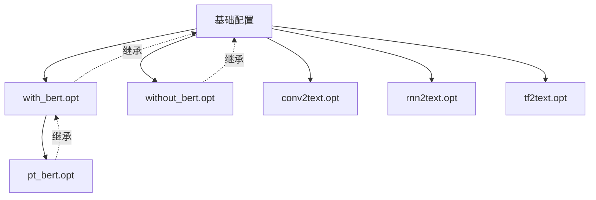
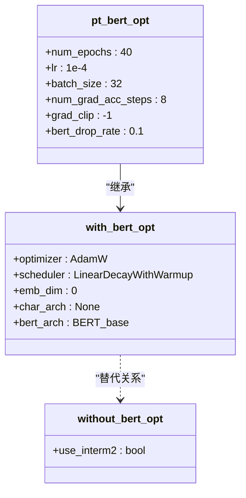
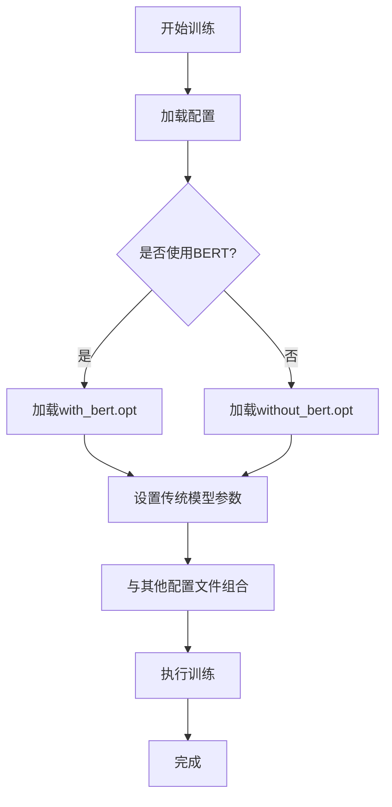
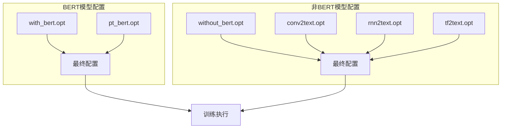
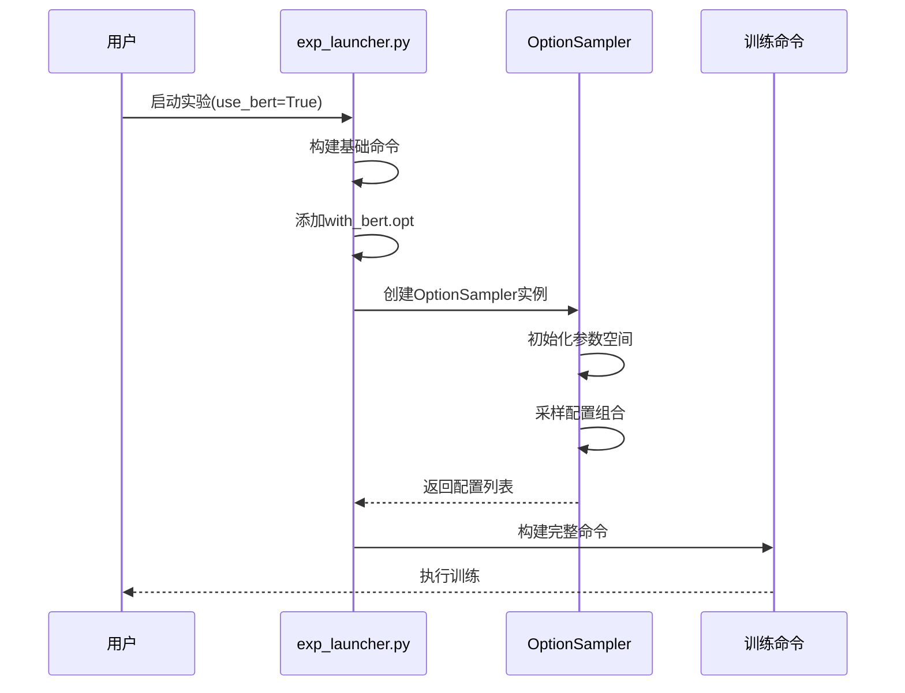

# 实验配置

<cite>
**本文档中引用的文件**   
- [with_bert.opt](file://scripts/options/with_bert.opt)
- [without_bert.opt](file://scripts/options/without_bert.opt)
- [pt_bert.opt](file://scripts/options/pt_bert.opt)
- [conv2text.opt](file://scripts/options/conv2text.opt)
- [rnn2text.opt](file://scripts/options/rnn2text.opt)
- [tf2text.opt](file://scripts/options/tf2text.opt)
- [exp_launcher.py](file://scripts/exp_launcher.py)
- [options.py](file://eznlp/training/options.py)
- [text_classification.py](file://scripts/text_classification.py)
- [text2text.py](file://scripts/text2text.py)
- [image2text.py](file://scripts/image2text.py)
</cite>

## 目录
1. [简介](#简介)
2. [配置文件结构与继承机制](#配置文件结构与继承机制)
3. [with_bert.opt与without_bert.opt的差异分析](#with_bertopt与without_bertopt的差异分析)
4. [核心参数详解](#核心参数详解)
5. [配置组合与模型切换](#配置组合与模型切换)
6. [配置继承与覆盖机制](#配置继承与覆盖机制)
7. [自定义实验配置最佳实践](#自定义实验配置最佳实践)
8. [结论](#结论)

## 简介
本项目提供了一套灵活的实验配置系统，通过`.opt`配置文件实现模型架构、训练超参数和嵌入层设置的灵活配置。系统支持BERT与非BERT模型的快速切换，通过配置文件的组合与继承机制，研究人员可以高效地进行不同实验设置的对比研究。

## 配置文件结构与继承机制
本项目的配置系统采用模块化设计，通过多个`.opt`文件实现不同功能模块的配置分离。系统通过`@`符号实现配置文件的引用和继承，形成层次化的配置结构。



**图示来源**
- [with_bert.opt](file://scripts/options/with_bert.opt#L1-L11)
- [without_bert.opt](file://scripts/options/without_bert.opt#L1-L2)
- [pt_bert.opt](file://scripts/options/pt_bert.opt#L1-L19)

**本节来源**
- [exp_launcher.py](file://scripts/exp_launcher.py#L57-L60)
- [options.py](file://eznlp/training/options.py#L10-L98)

## with_bert.opt与without_bert.opt的差异分析
`with_bert.opt`和`without_bert.opt`是两个核心配置文件，分别用于BERT模型和非BERT模型的配置。它们的主要差异体现在模型架构、优化器设置和超参数选择上。

### with_bert.opt配置特点
`with_bert.opt`文件配置了基于BERT的模型所需的关键参数：

- **优化器**: 使用AdamW优化器
- **学习率调度**: 采用LinearDecayWithWarmup策略
- **嵌入维度**: 设置为0（由BERT模型自动处理）
- **字符架构**: 设置为None（不使用字符级特征）
- **BERT架构**: 指定为BERT_base

### without_bert.opt配置特点
`without_bert.opt`文件为非BERT模型提供了基础配置：

- **中间层使用**: 通过`use_interm2`参数控制是否使用第二中间层
- **灵活性**: 为传统RNN、CNN等架构提供基础配置
- **扩展性**: 可与其他架构特定的配置文件组合使用



**图示来源**
- [with_bert.opt](file://scripts/options/with_bert.opt#L1-L11)
- [without_bert.opt](file://scripts/options/without_bert.opt#L1-L2)
- [pt_bert.opt](file://scripts/options/pt_bert.opt#L1-L19)

**本节来源**
- [with_bert.opt](file://scripts/options/with_bert.opt#L1-L11)
- [without_bert.opt](file://scripts/options/without_bert.opt#L1-L2)

## 核心参数详解
### 模型架构参数
- **bert_arch**: 指定BERT模型架构，可选值包括BERT_base、RoBERTa_base、BERT_large等
- **enc_arch**: 编码器架构，支持GRU、LSTM、Transformer等
- **dec_arch**: 解码器架构，与编码器架构对应

### 训练超参数
- **optimizer**: 优化器选择，支持AdamW、SGD、Adadelta等
- **lr**: 学习率设置
- **finetune_lr**: 微调学习率，通常比主学习率小1-2个数量级
- **batch_size**: 批处理大小
- **num_epochs**: 训练轮数

### 嵌入层设置
- **emb_dim**: 嵌入维度
- **drop_rate**: dropout率
- **use_elmo**: 是否使用ELMo嵌入
- **use_flair**: 是否使用Flair嵌入
- **char_arch**: 字符级架构，支持LSTM或Conv



**图示来源**
- [exp_launcher.py](file://scripts/exp_launcher.py#L57-L60)
- [options.py](file://eznlp/training/options.py#L10-L98)

**本节来源**
- [with_bert.opt](file://scripts/options/with_bert.opt#L1-L11)
- [without_bert.opt](file://scripts/options/without_bert.opt#L1-L2)
- [pt_bert.opt](file://scripts/options/pt_bert.opt#L1-L19)

## 配置组合与模型切换
通过组合不同的配置文件，可以实现BERT与非BERT模型的快速切换。系统通过`exp_launcher.py`中的逻辑实现这一功能。

### 模型切换机制
```python
if args.use_bert:
    COMMAND = " ".join([COMMAND, "@scripts/options/with_bert.opt"])
else:
    COMMAND = " ".join([COMMAND, "@scripts/options/without_bert.opt"])
```

### 配置组合示例
1. **纯BERT模型**: `@scripts/options/with_bert.opt`
2. **BERT预训练模型**: `@scripts/options/with_bert.opt @scripts/options/pt_bert.opt`
3. **CNN文本生成模型**: `@scripts/options/without_bert.opt @scripts/options/conv2text.opt`
4. **RNN文本生成模型**: `@scripts/options/without_bert.opt @scripts/options/rnn2text.opt`
5. **Transformer文本生成模型**: `@scripts/options/without_bert.opt @scripts/options/tf2text.opt`



**图示来源**
- [exp_launcher.py](file://scripts/exp_launcher.py#L57-L60)
- [conv2text.opt](file://scripts/options/conv2text.opt#L1-L23)
- [rnn2text.opt](file://scripts/options/rnn2text.opt#L1-L15)
- [tf2text.opt](file://scripts/options/tf2text.opt#L1-L29)

**本节来源**
- [exp_launcher.py](file://scripts/exp_launcher.py#L57-L60)
- [conv2text.opt](file://scripts/options/conv2text.opt#L1-L23)
- [rnn2text.opt](file://scripts/options/rnn2text.opt#L1-L15)
- [tf2text.opt](file://scripts/options/tf2text.opt#L1-L29)

## 配置继承与覆盖机制
系统通过`OptionSampler`类实现配置的继承与覆盖机制，确保配置参数的灵活性和可扩展性。

### OptionSampler工作机制
`OptionSampler`类通过以下方式处理配置参数：

1. **参数初始化**: 接收关键字参数并存储为属性
2. **参数解析**: 将参数值转换为命令行格式
3. **参数采样**: 支持完全采样、随机采样和均匀采样三种模式

### 配置覆盖规则
1. **后加载优先**: 后加载的配置文件会覆盖先加载的同名参数
2. **类型安全**: 确保参数值的类型正确
3. **默认值**: 为未指定的参数提供合理的默认值



**图示来源**
- [exp_launcher.py](file://scripts/exp_launcher.py#L20-L267)
- [options.py](file://eznlp/training/options.py#L10-L98)

**本节来源**
- [exp_launcher.py](file://scripts/exp_launcher.py#L20-L267)
- [options.py](file://eznlp/training/options.py#L10-L98)

## 自定义实验配置最佳实践
### 创建新配置文件
1. **命名规范**: 使用描述性名称，如`my_experiment.opt`
2. **内容组织**: 按功能模块组织参数
3. **注释说明**: 为关键参数添加注释

### 配置文件组合策略
1. **基础+扩展**: 以`with_bert.opt`或`without_bert.opt`为基础，添加特定功能配置
2. **避免冲突**: 确保组合的配置文件没有参数冲突
3. **测试验证**: 在小规模数据上测试新配置的有效性

### 参数调优建议
1. **学习率**: BERT模型通常使用较小的学习率（1e-5到2e-5）
2. **批量大小**: 根据GPU内存调整，BERT模型通常使用较小的批量
3. **训练轮数**: BERT微调通常需要较少的轮数（3-10轮）
4. **dropout率**: 适当设置dropout率防止过拟合

### 实验管理
1. **版本控制**: 将配置文件纳入版本控制
2. **文档记录**: 记录每个配置文件的设计目的和实验结果
3. **复用共享**: 建立配置文件库，促进团队间的知识共享

**本节来源**
- [exp_launcher.py](file://scripts/exp_launcher.py#L64-L250)
- [options.py](file://eznlp/training/options.py#L10-L98)
- [text_classification.py](file://scripts/text_classification.py#L68-L147)

## 结论
本项目的配置系统通过模块化的`.opt`文件设计，实现了BERT与非BERT模型的灵活配置和快速切换。`with_bert.opt`和`without_bert.opt`作为核心配置文件，分别针对不同类型的模型提供了优化的参数设置。通过配置文件的组合与继承机制，研究人员可以高效地进行各种实验设置的对比研究，加速模型开发和优化过程。建议在实际使用中遵循最佳实践，合理组织和管理配置文件，以提高实验的可重复性和可维护性。