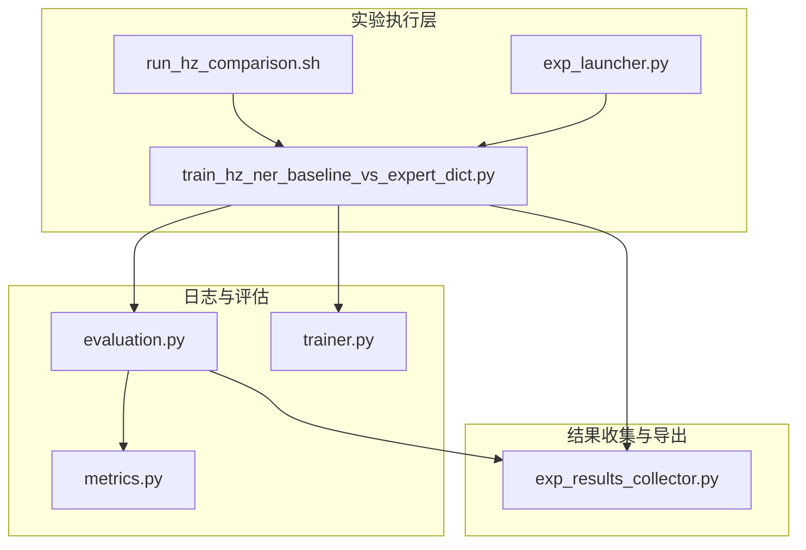
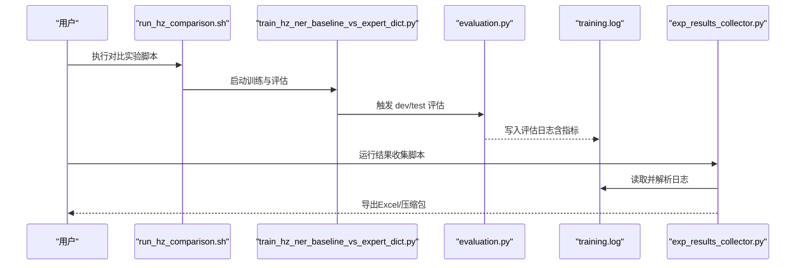
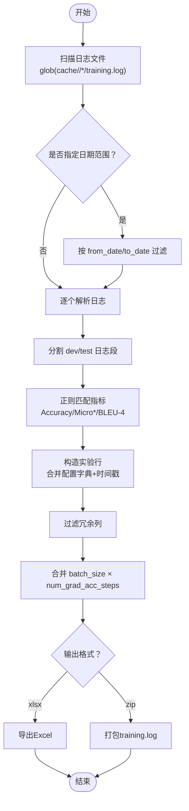
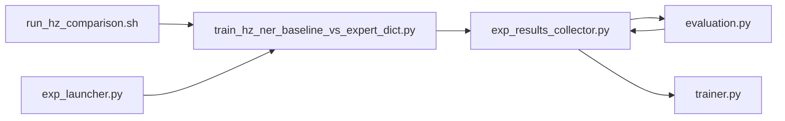

# 结果收集与分析

<cite>
**本文引用的文件**
- [scripts/exp_results_collector.py](file://scripts/exp_results_collector.py)
- [scripts/run_hz_comparison.sh](file://scripts/run_hz_comparison.sh)
- [scripts/train_hz_ner_baseline_vs_expert_dict.py](file://scripts/train_hz_ner_baseline_vs_expert_dict.py)
- [eznlp/training/evaluation.py](file://eznlp/training/evaluation.py)
- [eznlp/metrics.py](file://eznlp/metrics.py)
- [eznlp/training/trainer.py](file://eznlp/training/trainer.py)
- [scripts/exp_launcher.py](file://scripts/exp_launcher.py)
- [README.md](file://README.md)
</cite>

## 目录
1. [简介](#简介)
2. [项目结构](#项目结构)
3. [核心组件](#核心组件)
4. [架构总览](#架构总览)
5. [详细组件分析](#详细组件分析)
6. [依赖关系分析](#依赖关系分析)
7. [性能考量](#性能考量)
8. [故障排查指南](#故障排查指南)
9. [结论](#结论)
10. [附录](#附录)

## 简介
本文件系统化文档化了实验结果收集与分析流程，重点围绕以下目标展开：
- 解释 exp_results_collector.py 如何从多个实验目录中提取指标数据并生成结构化报告。
- 说明结果聚合的逻辑，包括指标提取、实验分组和统计汇总。
- 展示如何使用配套的 shell 脚本（如 run_hz_comparison.sh）进行模型性能对比分析。
- 提供结果可视化方法，包括生成表格、图表和统计显著性检验。
- 介绍结果导出格式（如 Excel、压缩包）及与其他分析工具的集成方式。

## 项目结构
该仓库采用“脚本驱动实验 + 日志解析 + 可视化”的组织方式。与本主题直接相关的文件分布如下：
- scripts/exp_results_collector.py：实验结果收集与导出的核心脚本。
- scripts/run_hz_comparison.sh：针对 HZ 数据集的对比实验启动脚本。
- scripts/train_hz_ner_baseline_vs_expert_dict.py：对比实验训练脚本，负责写入标准日志。
- eznlp/training/evaluation.py：评估模块，定义各类任务的评估日志格式。
- eznlp/metrics.py：评估指标计算工具，支撑微平均/宏平均等统计。
- eznlp/training/trainer.py：训练器，包含批大小与梯度累积的关系，影响最终导出列。
- scripts/exp_launcher.py：通用实验启动器，用于批量运行不同配置的实验。
- README.md：项目概览与运行说明。

图示来源
- [scripts/run_hz_comparison.sh](file://scripts/run_hz_comparison.sh#L1-L42)
- [scripts/train_hz_ner_baseline_vs_expert_dict.py](file://scripts/train_hz_ner_baseline_vs_expert_dict.py#L1-L200)
- [eznlp/training/evaluation.py](file://eznlp/training/evaluation.py#L1-L203)
- [eznlp/metrics.py](file://eznlp/metrics.py#L1-L153)
- [eznlp/training/trainer.py](file://eznlp/training/trainer.py#L1-L200)
- [scripts/exp_results_collector.py](file://scripts/exp_results_collector.py#L1-L139)

章节来源
- [README.md](file://README.md#L1-L116)

## 核心组件
- 实验结果收集器（exp_results_collector.py）
  - 功能：扫描 cache/<dataset>/*/training.log，按日期范围筛选，解析 dev/test 集上的指标，生成 Excel 或压缩包。
  - 关键点：通过固定前缀的日志片段定位 dev/test 指标；正则匹配 Accuracy/Micro Precision/Recall/F1-score/BLEU-4；过滤冗余列；合并 batch_size 与梯度累积信息。
- 对比实验启动脚本（run_hz_comparison.sh）
  - 功能：为 HZ 数据集的 Baseline vs +ExpertDict 对比实验提供一键启动入口，统一环境变量与参数传递。
- 训练脚本（train_hz_ner_baseline_vs_expert_dict.py）
  - 功能：构建模型配置、训练与评估流程，并将评估日志写入 training.log。
- 评估模块（evaluation.py）
  - 功能：定义各类任务的评估日志输出格式，如 Accuracy、Micro Precision/Recall/F1-score、BLEU-4 等。
- 指标计算（metrics.py）
  - 功能：提供微平均/宏平均等指标计算工具，支撑评估模块的输出。
- 训练器（trainer.py）
  - 功能：记录 num_grad_acc_steps，影响最终导出的 batch_size 列值。

章节来源
- [scripts/exp_results_collector.py](file://scripts/exp_results_collector.py#L1-L139)
- [scripts/run_hz_comparison.sh](file://scripts/run_hz_comparison.sh#L1-L42)
- [scripts/train_hz_ner_baseline_vs_expert_dict.py](file://scripts/train_hz_ner_baseline_vs_expert_dict.py#L1-L200)
- [eznlp/training/evaluation.py](file://eznlp/training/evaluation.py#L1-L203)
- [eznlp/metrics.py](file://eznlp/metrics.py#L1-L153)
- [eznlp/training/trainer.py](file://eznlp/training/trainer.py#L1-L200)

## 架构总览
下图展示了从实验执行到结果导出的整体流程，以及关键组件之间的交互关系。

图示来源
- [scripts/run_hz_comparison.sh](file://scripts/run_hz_comparison.sh#L1-L42)
- [scripts/train_hz_ner_baseline_vs_expert_dict.py](file://scripts/train_hz_ner_baseline_vs_expert_dict.py#L1-L200)
- [eznlp/training/evaluation.py](file://eznlp/training/evaluation.py#L1-L203)
- [scripts/exp_results_collector.py](file://scripts/exp_results_collector.py#L1-L139)

## 详细组件分析

### 组件A：实验结果收集器（exp_results_collector.py）
- 输入与筛选
  - 通过 glob 匹配 cache/<dataset>/*/training.log，支持 from_date/to_date 日期范围过滤。
- 指标提取
  - 使用固定前缀定位 dev/test 日志段，正则匹配 Accuracy、Micro Precision、Micro Recall、Micro F1-score、BLEU-4。
  - 将匹配到的指标按 dev/test 与指标类型拼接为新列名，自动处理多折线或多轮评估场景。
- 实验分组与统计
  - 保留实验配置字典（从日志中的字典字符串解析而来），并附加日志时间戳作为分组依据。
  - 过滤冗余列（FILTER_COLS），合并 batch_size 与梯度累积（batch_size = batch_size × num_grad_acc_steps）。
- 输出格式
  - xlsx：导出为 Excel 文件，便于后续统计与可视化。
  - zip：将所有 training.log 压缩归档，便于离线复盘或二次解析。

图示来源
- [scripts/exp_results_collector.py](file://scripts/exp_results_collector.py#L1-L139)

章节来源
- [scripts/exp_results_collector.py](file://scripts/exp_results_collector.py#L1-L139)

### 组件B：对比实验启动脚本（run_hz_comparison.sh）
- 作用：为 HZ 数据集的 Baseline vs +ExpertDict 对比实验提供统一入口，设置 PYTHONPATH、选择当前 Python 环境，并传入固定参数。
- 使用建议：在执行前确保数据目录与专家词典路径正确，必要时可追加参数覆盖默认值。

章节来源
- [scripts/run_hz_comparison.sh](file://scripts/run_hz_comparison.sh#L1-L42)

### 组件C：训练脚本（train_hz_ner_baseline_vs_expert_dict.py）
- 作用：构建 Baseline 与 +ExpertDict 两种配置，执行训练与评估，并将评估日志写入 training.log。
- 日志格式：评估阶段会输出 dev/test 的评估日志，包含 Accuracy、Micro Precision/Recall/F1-score、BLEU-4 等指标，供结果收集器解析。

章节来源
- [scripts/train_hz_ner_baseline_vs_expert_dict.py](file://scripts/train_hz_ner_baseline_vs_expert_dict.py#L1-L200)

### 组件D：评估模块（evaluation.py）与指标计算（metrics.py）
- 作用：定义各类任务的评估日志输出格式，提供微平均/宏平均等指标计算工具，支撑评估模块的输出。
- 影响：exp_results_collector.py 正则依赖这些固定前缀与数值格式，保证解析稳定性。

章节来源
- [eznlp/training/evaluation.py](file://eznlp/training/evaluation.py#L1-L203)
- [eznlp/metrics.py](file://eznlp/metrics.py#L1-L153)

### 组件E：训练器（trainer.py）
- 作用：记录 num_grad_acc_steps，影响最终导出的 batch_size 列值（实际批大小 = nominal_batch_size × num_grad_acc_steps）。
- 影响：exp_results_collector.py 在导出前对 batch_size 进行合并处理，确保与实际训练配置一致。

章节来源
- [eznlp/training/trainer.py](file://eznlp/training/trainer.py#L1-L200)

### 组件F：通用实验启动器（exp_launcher.py）
- 作用：根据任务类型与语言，采样超参组合并批量运行实验，便于大规模对比实验的自动化。
- 影响：与 exp_results_collector.py 协同工作，前者产出大量日志，后者负责统一收集与导出。

章节来源
- [scripts/exp_launcher.py](file://scripts/exp_launcher.py#L1-L267)

## 依赖关系分析
- exp_results_collector.py 依赖于：
  - 日志格式约定（evaluation.py 中的固定前缀与数值格式）。
  - 训练器的批大小合并规则（trainer.py 中 num_grad_acc_steps）。
  - pandas 与正则表达式进行解析与导出。
- run_hz_comparison.sh 依赖于训练脚本的参数与日志输出格式。
- exp_launcher.py 与 exp_results_collector.py 共同构成“批量实验 + 结果收集”的闭环。

图示来源
- [scripts/exp_results_collector.py](file://scripts/exp_results_collector.py#L1-L139)
- [eznlp/training/evaluation.py](file://eznlp/training/evaluation.py#L1-L203)
- [eznlp/training/trainer.py](file://eznlp/training/trainer.py#L1-L200)
- [scripts/run_hz_comparison.sh](file://scripts/run_hz_comparison.sh#L1-L42)
- [scripts/train_hz_ner_baseline_vs_expert_dict.py](file://scripts/train_hz_ner_baseline_vs_expert_dict.py#L1-L200)
- [scripts/exp_launcher.py](file://scripts/exp_launcher.py#L1-L267)

## 性能考量
- 日志解析复杂度
  - 时间复杂度：O(N × M)，N 为日志文件数，M 为每个文件中指标匹配次数。
  - 空间复杂度：O(R)，R 为解析后行数与列数。
- 批大小合并
  - 在导出前进行 batch_size × num_grad_acc_steps 合并，避免重复计算与误导性统计。
- 并行与批量
  - exp_launcher.py 支持多进程并行运行实验，exp_results_collector.py 逐个解析日志，整体流程可扩展至大规模实验。

[本节为一般性指导，不涉及具体文件分析]

## 故障排查指南
- 日志未被解析
  - 现象：导出空表或警告提示解析失败。
  - 排查要点：确认日志中包含固定的 dev/test 评估前缀与指标格式；检查日期范围过滤是否过于严格导致无文件命中。
  - 参考路径：[scripts/exp_results_collector.py](file://scripts/exp_results_collector.py#L77-L126)
- 指标缺失
  - 现象：某些指标列为空。
  - 排查要点：确认评估阶段确实输出对应指标；检查正则是否与日志格式一致。
  - 参考路径：[eznlp/training/evaluation.py](file://eznlp/training/evaluation.py#L1-L203)
- 批大小异常
  - 现象：导出的 batch_size 与预期不符。
  - 排查要点：核对 num_grad_acc_steps 是否正确；确认导出前的合并逻辑已执行。
  - 参考路径：[eznlp/training/trainer.py](file://eznlp/training/trainer.py#L1-L200)、[scripts/exp_results_collector.py](file://scripts/exp_results_collector.py#L127-L131)
- 输出格式问题
  - 现象：导出 Excel 失败或压缩包为空。
  - 排查要点：确认 pandas 已安装；检查输出路径权限；确认存在日志文件。
  - 参考路径：[scripts/exp_results_collector.py](file://scripts/exp_results_collector.py#L93-L139)

章节来源
- [scripts/exp_results_collector.py](file://scripts/exp_results_collector.py#L77-L139)
- [eznlp/training/evaluation.py](file://eznlp/training/evaluation.py#L1-L203)
- [eznlp/training/trainer.py](file://eznlp/training/trainer.py#L1-L200)

## 结论
- exp_results_collector.py 通过固定前缀与正则解析，实现了对多实验日志的自动化采集与结构化导出。
- 结合 run_hz_comparison.sh 与 exp_launcher.py，可实现从“批量实验”到“统一结果”的完整闭环。
- 通过 Excel 导出与进一步统计工具，可轻松开展对比分析与可视化。

[本节为总结性内容，不涉及具体文件分析]

## 附录

### 使用指南与最佳实践
- 运行对比实验
  - 使用 run_hz_comparison.sh 启动 Baseline vs +ExpertDict 对比实验，确保数据与词典路径正确。
  - 参考路径：[scripts/run_hz_comparison.sh](file://scripts/run_hz_comparison.sh#L1-L42)
- 收集结果
  - 使用 exp_results_collector.py 指定 dataset、from_date、to_date 与输出格式（xlsx/zip），生成结构化报告。
  - 参考路径：[scripts/exp_results_collector.py](file://scripts/exp_results_collector.py#L50-L139)
- 批量实验
  - 使用 exp_launcher.py 采样超参组合并批量运行，随后统一收集结果。
  - 参考路径：[scripts/exp_launcher.py](file://scripts/exp_launcher.py#L1-L267)

### 结果导出与可视化
- 导出格式
  - Excel：适合人工审阅与统计软件处理。
  - 压缩包：便于离线复盘与二次解析。
- 可视化建议
  - 表格：按任务/数据集/模型变体分组，比较 dev/test 指标。
  - 图表：箱线图/误差条展示不同配置的指标分布。
  - 统计显著性：使用非参数检验（如 Wilcoxon）比较两模型在多个数据集上的差异。
- 与其他工具集成
  - Excel：可直接导入统计软件（如 R/Python）进行深入分析。
  - CSV：便于脚本化处理与自动化报告生成。

[本节为一般性指导，不涉及具体文件分析]