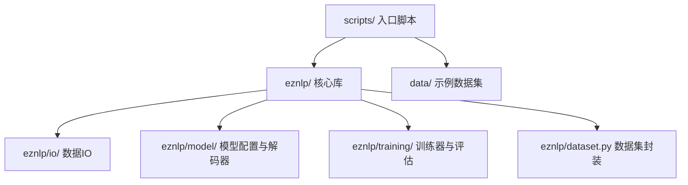
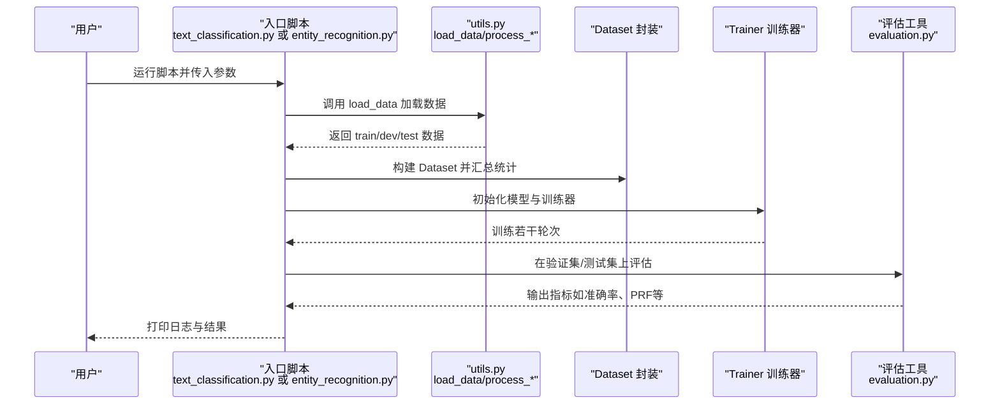
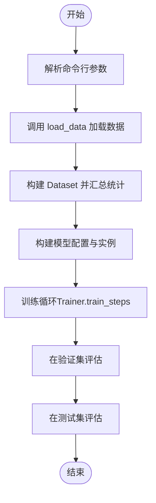
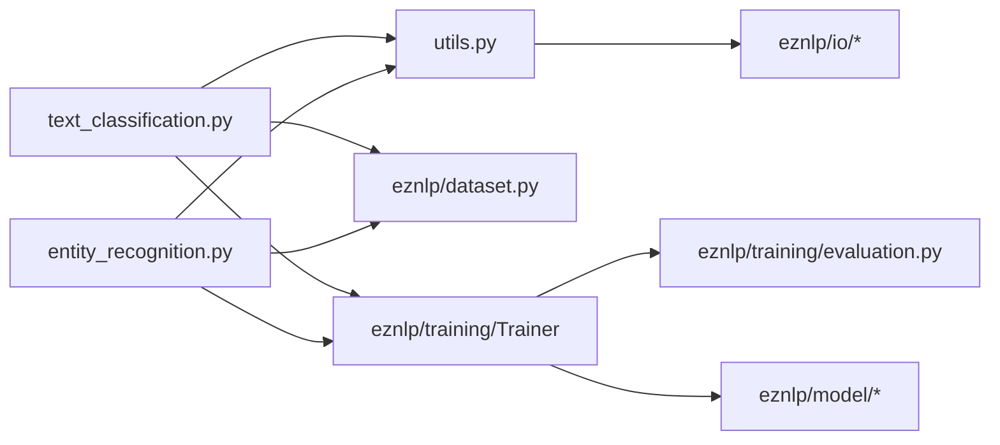

# 快速入门

<cite>
**本文引用的文件**
- [README.md](file://README.md)
- [scripts/text_classification.py](file://scripts/text_classification.py)
- [scripts/entity_recognition.py](file://scripts/entity_recognition.py)
- [scripts/utils.py](file://scripts/utils.py)
- [data/conll2003/demo.eng.train](file://data/conll2003/demo.eng.train)
- [data/yelp_review_full/demo.train.csv](file://data/yelp_review_full/demo.train.csv)
- [data/yelp_review_full/demo.test.csv](file://data/yelp_review_full/demo.test.csv)
- [eznlp/dataset.py](file://eznlp/dataset.py)
- [eznlp/training/evaluation.py](file://eznlp/training/evaluation.py)
- [eznlp/training/__init__.py](file://eznlp/training/__init__.py)
- [eznlp/model/__init__.py](file://eznlp/model/__init__.py)
</cite>

## 目录
1. [简介](#简介)
2. [项目结构](#项目结构)
3. [核心组件](#核心组件)
4. [架构总览](#架构总览)
5. [详细组件解析](#详细组件解析)
6. [依赖关系分析](#依赖关系分析)
7. [性能与资源建议](#性能与资源建议)
8. [故障排查指南](#故障排查指南)
9. [结论](#结论)
10. [附录：命令与参数速查](#附录命令与参数速查)

## 简介
本教程面向新手，在10分钟内带你完成两个典型NLP任务的首次训练：文本分类与中文命名实体识别（NER）。你将学会：
- 如何直接调用 scripts/ 下的入口脚本
- 如何准备最小化数据集（英文CONLL-2003示例；中文ResumeNER示例）
- 如何使用默认参数快速跑通训练与评估
- 如何解读日志输出与评估指标

目标是让你尽快获得正向反馈，建立信心后再深入探索高级参数与数据格式。

## 项目结构
本项目采用“脚本驱动 + 模块化库”的组织方式：
- scripts/ 提供训练入口脚本（如 text_classification.py、entity_recognition.py）
- eznlp/ 是核心库模块，封装了数据加载、模型配置、训练器与评估工具
- data/ 收录了多种公开数据集的示例文件，便于快速上手

图表来源
- [scripts/text_classification.py](file://scripts/text_classification.py#L1-L60)
- [scripts/entity_recognition.py](file://scripts/entity_recognition.py#L1-L60)
- [eznlp/dataset.py](file://eznlp/dataset.py#L1-L60)
- [eznlp/training/__init__.py](file://eznlp/training/__init__.py#L1-L37)
- [eznlp/model/__init__.py](file://eznlp/model/__init__.py#L1-L31)

章节来源
- [README.md](file://README.md#L46-L67)

## 核心组件
- 入口脚本：scripts/text_classification.py、scripts/entity_recognition.py
- 数据加载与预处理：scripts/utils.py 中的 load_data、process_* 函数
- 数据集封装：eznlp/dataset.py 的 Dataset 类
- 评估工具：eznlp/training/evaluation.py 的 evaluate_* 函数
- 模型配置：eznlp/model/\*（由脚本构建）

章节来源
- [scripts/text_classification.py](file://scripts/text_classification.py#L204-L304)
- [scripts/entity_recognition.py](file://scripts/entity_recognition.py#L727-L928)
- [scripts/utils.py](file://scripts/utils.py#L288-L800)
- [eznlp/dataset.py](file://eznlp/dataset.py#L1-L115)
- [eznlp/training/evaluation.py](file://eznlp/training/evaluation.py#L1-L120)

## 架构总览
下面的时序图展示了从启动脚本到训练与评估的整体流程。

图表来源
- [scripts/text_classification.py](file://scripts/text_classification.py#L232-L303)
- [scripts/entity_recognition.py](file://scripts/entity_recognition.py#L755-L928)
- [scripts/utils.py](file://scripts/utils.py#L288-L800)
- [eznlp/dataset.py](file://eznlp/dataset.py#L1-L115)
- [eznlp/training/evaluation.py](file://eznlp/training/evaluation.py#L1-L120)

## 详细组件解析

### 文本分类（10分钟快速上手）
- 启动命令
  - 使用默认参数快速训练文本分类模型（IMDB为默认数据集）：
    - python scripts/text_classification.py --dataset imdb
  - 若需保存预测结果（无标签测试集常用）：
    - python scripts/text_classification.py --dataset imdb --save_preds

- 关键参数（默认值已足够上手）
  - --dataset：数据集名称，默认 imdb
  - --batch_size：批大小，默认 64
  - --num_epochs：训练轮数，默认 100
  - --seed：随机种子，默认 515
  - --bert_arch：是否使用BERT类编码器，默认 None（不使用）
  - --enc_arch：词级编码器架构，默认 LSTM
  - --hid_dim：隐藏维度，默认 200
  - --drop_rate：dropout，默认 0.5
  - --use_amp：是否启用混合精度，默认 False
  - --save_preds：是否保存测试集预测，默认 False

- 数据准备（最小化示例）
  - 可直接使用内置数据集（如 imdb），无需额外准备
  - 若希望自定义CSV文本分类数据，可参考 data/yelp_review_full/demo.train.csv 的格式（包含评分与评论文本两列）

- 预期日志与结果解读
  - 训练开始与参数打印
  - 数据集摘要（样本数、类别数、平均/最大序列长度等）
  - 训练过程日志（每轮损失、评估指标）
  - 最终在验证集与测试集上的准确率（或评估指标）

章节来源
- [README.md](file://README.md#L48-L56)
- [scripts/text_classification.py](file://scripts/text_classification.py#L40-L100)
- [scripts/text_classification.py](file://scripts/text_classification.py#L232-L303)
- [eznlp/training/evaluation.py](file://eznlp/training/evaluation.py#L14-L26)
- [data/yelp_review_full/demo.train.csv](file://data/yelp_review_full/demo.train.csv#L1-L11)
- [data/yelp_review_full/demo.test.csv](file://data/yelp_review_full/demo.test.csv#L1-L11)

### 命名实体识别（中文示例）
- 启动命令
  - 英文CONLL-2003示例（默认）：
    - python scripts/entity_recognition.py --dataset conll2003
  - 中文ResumeNER示例（需指定数据集）：
    - python scripts/entity_recognition.py --dataset ResumeNER

- 关键参数（默认值已足够上手）
  - --dataset：数据集名称，默认 conll2003
  - --ck_decoder：解码策略，默认 sequence_tagging（BIOES+CRF）
  - --scheme：标注方案，默认 BIOES
  - --use_crf：是否使用CRF，默认 True
  - --batch_size：批大小，默认 64
  - --num_epochs：训练轮数，默认 100
  - --seed：随机种子，默认 515
  - --bert_arch：是否使用BERT类编码器，默认 None（不使用）
  - --enc_arch：词级编码器架构，默认 LSTM
  - --hid_dim：隐藏维度，默认 200
  - --drop_rate：dropout，默认 0.5
  - --use_amp：是否启用混合精度，默认 False
  - --save_preds：是否保存预测（默认 True，可通过 --no_save_preds 关闭）

- 数据准备（最小化示例）
  - 英文CONLL-2003示例格式参考 data/conll2003/demo.eng.train
  - 中文ResumeNER示例格式参考 data/ResumeNER/demo.train.char.bmes
  - 以上均为标准CoNLL/BMES格式，脚本会自动按字段解析

- 预期日志与结果解读
  - 训练开始与参数打印
  - 数据集摘要（样本数、实体类型数、平均/最大序列长度等）
  - 训练过程日志（每轮损失、评估指标）
  - 最终在验证集与测试集上的 Micro/Macro Precision/Recall/F1（NER指标）

章节来源
- [README.md](file://README.md#L53-L56)
- [scripts/entity_recognition.py](file://scripts/entity_recognition.py#L53-L120)
- [scripts/entity_recognition.py](file://scripts/entity_recognition.py#L727-L928)
- [eznlp/training/evaluation.py](file://eznlp/training/evaluation.py#L64-L95)
- [data/conll2003/demo.eng.train](file://data/conll2003/demo.eng.train#L1-L60)
- [data/ResumeNER/demo.train.char.bmes](file://data/ResumeNER/demo.train.char.bmes#L1-L20)

### 数据加载与预处理流程（算法流）

图表来源
- [scripts/text_classification.py](file://scripts/text_classification.py#L232-L303)
- [scripts/entity_recognition.py](file://scripts/entity_recognition.py#L755-L928)
- [scripts/utils.py](file://scripts/utils.py#L288-L800)
- [eznlp/dataset.py](file://eznlp/dataset.py#L1-L115)

## 依赖关系分析
- 脚本依赖 utils.py 提供的数据加载与参数解析能力
- Dataset 封装统一了数据访问与批处理逻辑
- Trainer 与 evaluation 工具负责训练与评估
- model/\* 提供模型配置与解码器选择

图表来源
- [scripts/text_classification.py](file://scripts/text_classification.py#L1-L60)
- [scripts/entity_recognition.py](file://scripts/entity_recognition.py#L1-L60)
- [scripts/utils.py](file://scripts/utils.py#L1-L120)
- [eznlp/dataset.py](file://eznlp/dataset.py#L1-L60)
- [eznlp/training/__init__.py](file://eznlp/training/__init__.py#L1-L37)
- [eznlp/model/__init__.py](file://eznlp/model/__init__.py#L1-L31)

章节来源
- [eznlp/training/__init__.py](file://eznlp/training/__init__.py#L1-L37)
- [eznlp/model/__init__.py](file://eznlp/model/__init__.py#L1-L31)

## 性能与资源建议
- 默认参数已针对快速上手优化，适合CPU环境快速体验
- 若有GPU且显存充足，可适当提高 --batch_size 以加速收敛
- 混合精度（--use_amp）可显著节省显存并提升吞吐，但需确保CUDA/驱动版本兼容
- 大多数示例数据集较小，通常几分钟即可完成一轮训练与评估

[本节为通用建议，不直接分析具体文件]

## 故障排查指南
- 数据路径问题
  - 确认 data/ 下存在对应示例数据文件（如 conll2003/demo.eng.train、ResumeNER/demo.train.char.bmes）
  - 自定义数据请遵循脚本期望的字段与格式（文本列、标签/实体列等）

- 训练卡住或显存不足
  - 降低 --batch_size
  - 关闭 --use_amp 或检查CUDA/驱动版本
  - 使用更小的 --num_epochs 以缩短时间

- 评估指标为空
  - 确认脚本正确加载了测试集数据
  - 对于文本分类，若未保存预测，评估会直接输出指标；对于NER，会输出Micro/Macro PRF

章节来源
- [scripts/utils.py](file://scripts/utils.py#L288-L800)
- [eznlp/training/evaluation.py](file://eznlp/training/evaluation.py#L1-L120)

## 结论
通过本教程，你已经掌握了：
- 使用默认参数在10分钟内完成文本分类与中文NER的首次训练
- 理解入口脚本、数据加载、训练与评估的关键流程
- 明确如何准备最小化数据集并解读日志与指标

建议下一步：
- 尝试切换不同数据集（如 ResumeNER、WeiboNER 等）
- 探索更丰富的解码策略与模型配置（如 CRF、BERT、Span-based 等）
- 自定义数据格式并扩展 IO 层以适配业务场景

[本节为总结性内容，不直接分析具体文件]

## 附录：命令与参数速查

- 文本分类（默认数据集 imdb）
  - python scripts/text_classification.py --dataset imdb
  - 可选：--save_preds

- 命名实体识别（英文CONLL-2003）
  - python scripts/entity_recognition.py --dataset conll2003
  - 可选：--no_save_preds（关闭保存预测）

- 常用参数（默认值已足够上手）
  - --dataset：数据集名称
  - --batch_size：批大小
  - --num_epochs：训练轮数
  - --seed：随机种子
  - --bert_arch：是否使用BERT类编码器
  - --enc_arch：词级编码器架构
  - --hid_dim：隐藏维度
  - --drop_rate：dropout
  - --use_amp：混合精度

章节来源
- [README.md](file://README.md#L48-L56)
- [scripts/text_classification.py](file://scripts/text_classification.py#L40-L100)
- [scripts/entity_recognition.py](file://scripts/entity_recognition.py#L53-L120)