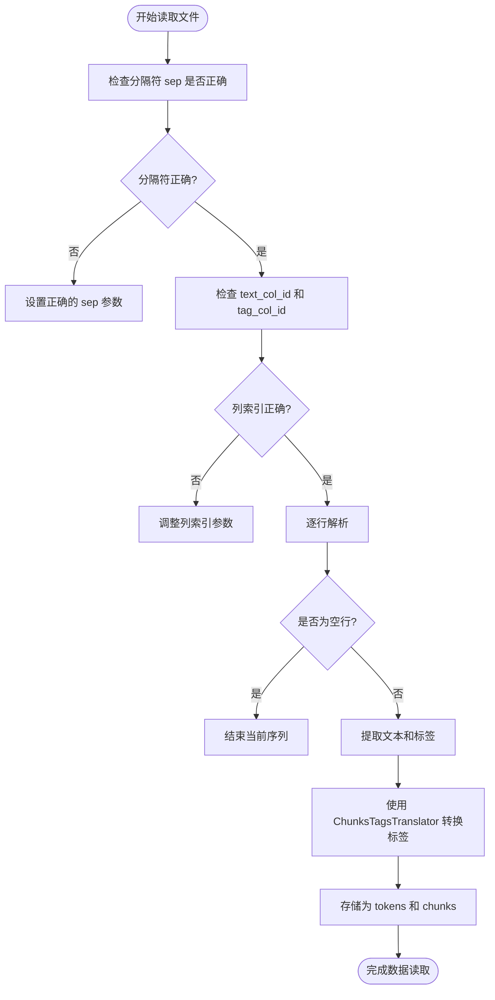
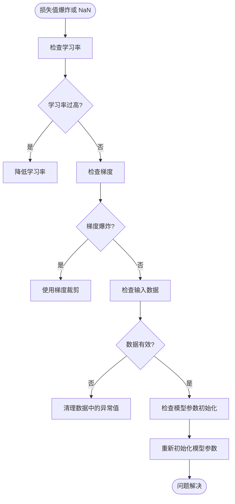
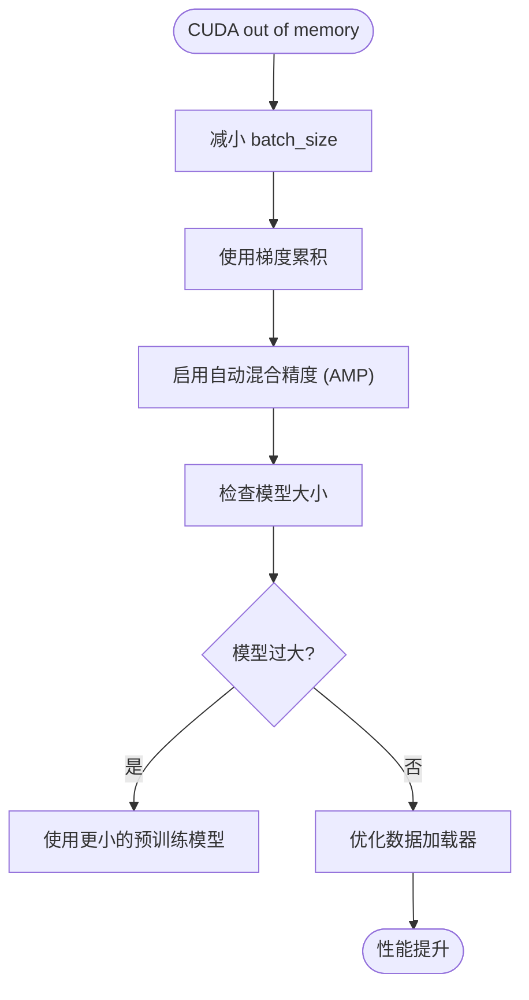
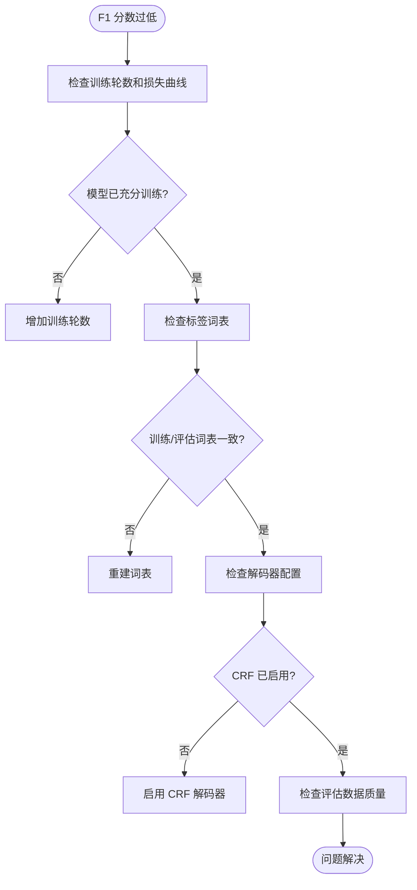

# 故障排除

<cite>
**本文档中引用的文件**  
- [quick_check.py](file://scripts/quick_check.py)
- [debug_training.py](file://scripts/debug_training.py)
- [trainer.py](file://eznlp/training/trainer.py)
- [plm_trainer.py](file://eznlp/training/plm_trainer.py)
- [dataset.py](file://eznlp/dataset.py)
- [conll.py](file://eznlp/io/conll.py)
- [metrics.py](file://eznlp/metrics.py)
- [wrapper.py](file://eznlp/wrapper.py)
- [entity_recognition.py](file://scripts/entity_recognition.py)
- [relation_extraction.py](file://scripts/relation_extraction.py)
- [text_classification.py](file://scripts/text_classification.py)
</cite>

## 目录
1. [简介](#简介)
2. [常见问题分类](#常见问题分类)
3. [数据加载错误](#数据加载错误)
4. [训练异常](#训练异常)
5. [性能瓶颈](#性能瓶颈)
6. [评估结果异常](#评估结果异常)
7. [调试工具使用指南](#调试工具使用指南)
8. [日志分析技巧](#日志分析技巧)
9. [关键检查点列表](#关键检查点列表)
10. [快速响应手册](#快速响应手册)

## 简介
本指南旨在为使用 `eznlp` 框架进行自然语言处理任务的用户提供系统性的故障排除支持。文档覆盖了从数据加载、模型训练到评估阶段的常见问题，重点解决数据格式解析失败、训练过程中的损失异常、GPU内存不足以及评估指标异常等典型场景。通过推荐使用 `quick_check.py` 进行环境与数据验证，以及 `debug_training.py` 进行单步调试，帮助用户快速定位并解决问题。

## 常见问题分类
在使用 `eznlp` 进行模型开发和训练时，用户可能遇到以下几类主要问题：
- **数据加载错误**：包括文件格式解析失败、标签方案不匹配、数据文件路径错误等。
- **训练异常**：如损失值爆炸、出现 NaN 值、梯度消失或爆炸等。
- **性能瓶颈**：主要表现为 GPU 内存不足、训练速度过慢、数据加载成为瓶颈等。
- **评估结果异常**：如 F1 分数过低、预测结果全为某一类别、评估脚本运行失败等。

**Section sources**
- [trainer.py](file://eznlp/training/trainer.py#L1-L418)
- [dataset.py](file://eznlp/dataset.py#L1-L210)

## 数据加载错误
数据加载是模型训练的第一步，也是最容易出错的环节。常见的数据加载错误包括：

### CoNLL 格式解析失败
当使用 `ConllIO` 类读取 CoNLL 格式文件时，如果文件的列分隔符、标签列 ID 或文本列 ID 设置不正确，会导致解析失败或数据错位。



**Diagram sources**
- [conll.py](file://eznlp/io/conll.py#L1-L198)
- [dataset.py](file://eznlp/dataset.py#L1-L210)

### 标签方案不匹配
`eznlp` 支持多种标签方案（如 BIO1, BMES）。如果数据文件使用的标签方案与 `ConllIO` 初始化时指定的 `scheme` 参数不一致，会导致 `tags2chunks` 转换错误。

**Section sources**
- [conll.py](file://eznlp/io/conll.py#L8-L198)
- [quick_check.py](file://scripts/quick_check.py#L1-L37)

## 训练异常
训练过程中的异常通常表现为损失值的不正常行为。

### 损失爆炸或 NaN 值
损失值在训练初期迅速增大至无穷大或变为 NaN，通常是由于学习率过高、梯度爆炸或数据中存在异常值导致。



**Diagram sources**
- [trainer.py](file://eznlp/training/trainer.py#L82-L114)
- [plm_trainer.py](file://eznlp/training/plm_trainer.py#L1-L35)

### 损失值接近零
在 `debug_training.py` 脚本中，如果前向传播后损失值接近零，可能意味着标签数据未正确加载或 `tag_ids` 字段缺失。

**Section sources**
- [debug_training.py](file://scripts/debug_training.py#L1-L200)
- [trainer.py](file://eznlp/training/trainer.py#L74-L81)

## 性能瓶颈
性能问题主要集中在硬件资源利用和数据处理效率上。

### GPU 内存不足
当模型过大或批次尺寸（batch size）设置过高时，容易导致 GPU 内存溢出。



**Diagram sources**
- [trainer.py](file://eznlp/training/trainer.py#L37-L62)
- [dataset.py](file://eznlp/dataset.py#L104-L114)

## 评估结果异常
评估阶段的问题通常与预测逻辑或指标计算有关。

### F1 分数过低或为零
这可能是由于模型未充分训练、标签词表不匹配或解码器（如 CRF）配置错误导致。



**Diagram sources**
- [metrics.py](file://eznlp/metrics.py#L1-L153)
- [trainer.py](file://eznlp/training/trainer.py#L124-L153)

**Section sources**
- [metrics.py](file://eznlp/metrics.py#L1-L153)
- [trainer.py](file://eznlp/training/trainer.py#L124-L153)

## 调试工具使用指南
`eznlp` 提供了两个关键的调试脚本，用于快速验证环境和排查问题。

### quick_check.py 使用方法
该脚本用于快速检查数据文件的格式和内容。

```python
# 示例：检查 HZ 数据集
from eznlp.io import ConllIO
io = ConllIO(text_col_id=0, tag_col_id=1, scheme='BMES', encoding='utf-8')
data = io.read('data/HZ/hz_train.bmes')
print('Tokens 长度:', len(data[0]['tokens']))
print('Chunks:', data[0]['chunks'][:5])
```

此脚本可以帮助用户确认：
- 文件路径是否正确
- 分隔符和列索引是否匹配
- 标签方案（BIO/BMES）是否正确
- 数据中是否存在重叠或无效的实体

### debug_training.py 使用方法
该脚本提供了一个完整的单步调试流程，从数据加载到前向传播和梯度计算。

```python
# 脚本执行流程
1. 加载数据 --> 2. 构建模型配置 --> 3. 构建数据集 --> 4. 测试数据批次 --> 5. 测试前向传播 --> 6. 测试训练一步
```

通过运行此脚本，用户可以：
- 验证数据集能否成功构建
- 检查 `tag_ids` 是否正确生成
- 确认模型前向传播是否成功
- 观察梯度是否正常计算和回传

**Section sources**
- [quick_check.py](file://scripts/quick_check.py#L1-L37)
- [debug_training.py](file://scripts/debug_training.py#L1-L200)

## 日志分析技巧
`eznlp` 使用 Python 的 `logging` 模块输出运行信息。关键日志信息包括：

- **设备分配**：`Automatically allocating device...` 日志显示了自动设备选择的结果。
- **参数统计**：`The model has X parameters, in which Y are trainable` 提供了模型参数的详细信息。
- **训练进度**：`Train Loss: X.XXX | Train Metrics: Y.YY%` 显示了每个训练周期的损失和指标。

分析日志时，应重点关注错误（ERROR）和警告（WARNING）级别的消息，它们通常直接指出了问题的根源。

**Section sources**
- [trainer.py](file://eznlp/training/trainer.py#L376-L418)
- [utils.py](file://eznlp/training/utils.py#L1-L202)

## 关键检查点列表
在启动训练前，建议按以下清单进行检查：

- [ ] 数据文件路径正确且可读
- [ ] `ConllIO` 的 `text_col_id` 和 `tag_col_id` 与数据文件匹配
- [ ] 标签方案（`scheme`）设置正确（BIO 或 BMES）
- [ ] 预训练模型路径或名称正确
- [ ] 批次尺寸（`batch_size`）适合 GPU 内存
- [ ] 学习率（`lr`）设置合理
- [ ] `use_crf` 参数根据任务需求正确配置

**Section sources**
- [entity_recognition.py](file://scripts/entity_recognition.py)
- [relation_extraction.py](file://scripts/relation_extraction.py)
- [text_classification.py](file://scripts/text_classification.py)

## 快速响应手册
将常见错误信息与可能原因及解决方案建立映射：

| 错误信息 | 可能原因 | 解决方案 |
| :--- | :--- | :--- |
| `CUDA out of memory` | 批次尺寸过大或模型过大 | 减小 `batch_size`，启用 `use_amp`，使用梯度累积 |
| `loss is nan` | 学习率过高或数据异常 | 降低学习率，检查数据中是否有 NaN 或空值 |
| `no attribute 'tag_ids'` | 数据未正确加载或 `chunks2tags` 失败 | 使用 `quick_check.py` 验证数据格式，检查 `scheme` 参数 |
| `F1 score is 0` | 模型未训练充分或标签词表不匹配 | 增加训练轮数，确保训练和评估使用相同的词表 |
| `KeyError: 'tokens'` | 数据文件格式错误或路径错误 | 检查数据文件内容，确认 `io.read()` 路径正确 |

**Section sources**
- [debug_training.py](file://scripts/debug_training.py#L1-L200)
- [trainer.py](file://eznlp/training/trainer.py#L1-L418)
- [dataset.py](file://eznlp/dataset.py#L1-L210)