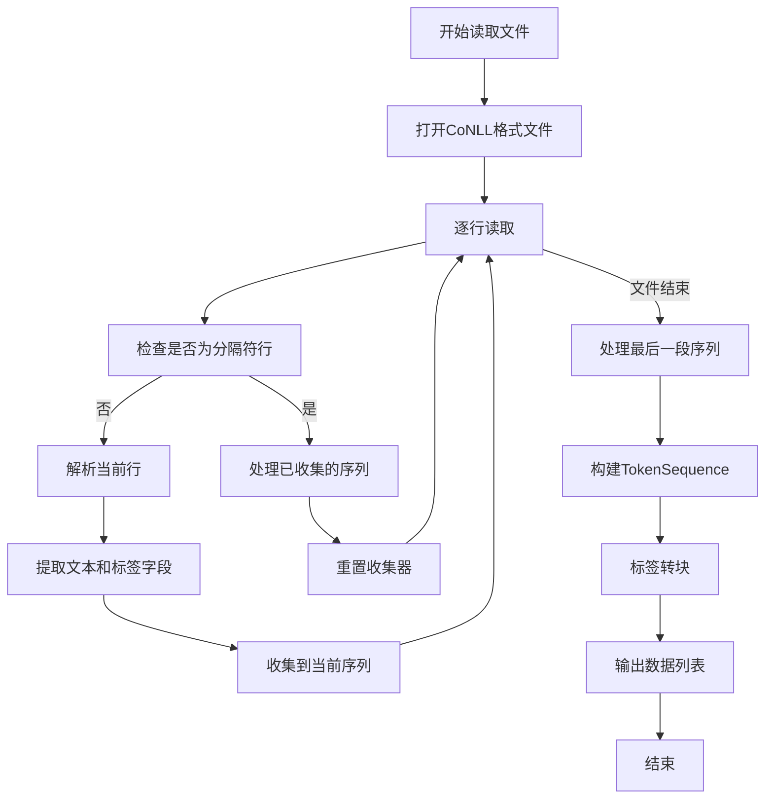
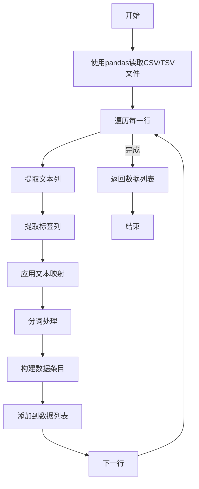
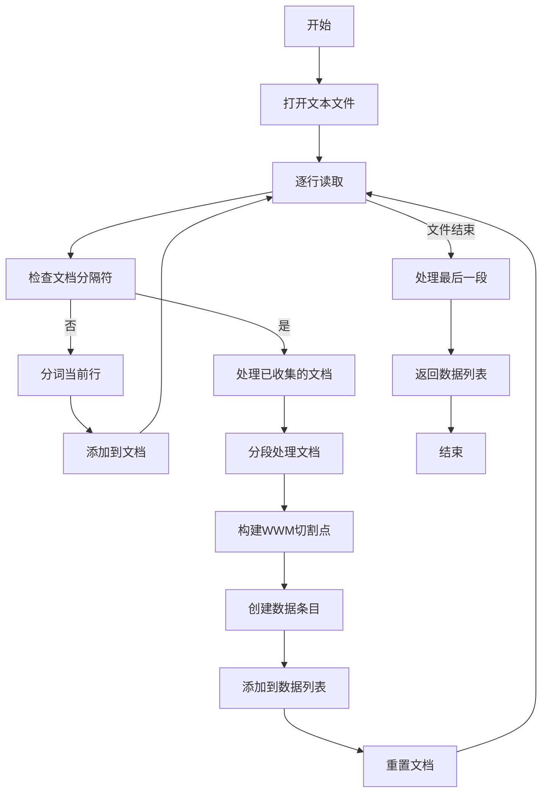
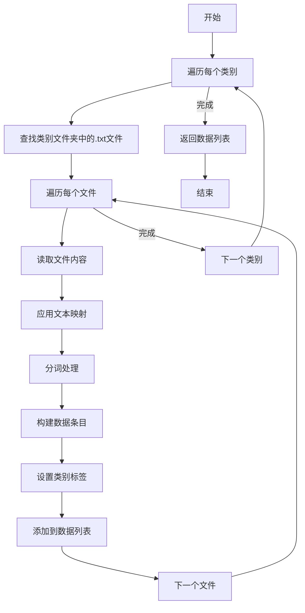
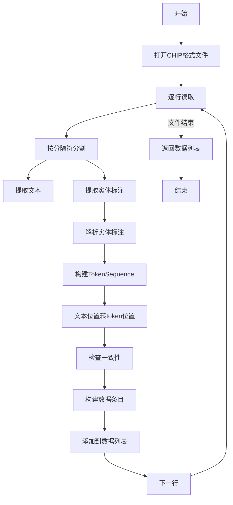

# 支持的数据格式

<cite>
**本文档引用的文件**   
- [conll.py](file://eznlp/io/conll.py)
- [tabular.py](file://eznlp/io/tabular.py)
- [raw_text.py](file://eznlp/io/raw_text.py)
- [category_folder.py](file://eznlp/io/category_folder.py)
- [chip.py](file://eznlp/io/chip.py)
- [base.py](file://eznlp/io/base.py)
- [token.py](file://eznlp/token.py)
- [transition.py](file://eznlp/utils/transition.py)
- [chunk.py](file://eznlp/utils/chunk.py)
</cite>

## 目录
1. [简介](#简介)
2. [CoNLL格式](#conll格式)
3. [TSV/文本对格式](#tsv文本对格式)
4. [纯文本格式](#纯文本格式)
5. [文件夹分类格式](#文件夹分类格式)
6. [CHIP格式](#chip格式)
7. [数据格式转换建议](#数据格式转换建议)

## 简介
eznlp库提供了多种数据格式的IO实现类，支持从不同格式的数据文件中读取和解析数据。这些IO类都继承自基类`IO`，并针对特定的数据格式进行了专门的实现。本文档将详细介绍各种数据格式的支持情况，包括CoNLL、TSV/文本对、纯文本、文件夹分类和CHIP格式，重点说明它们的字段解析机制、适用场景和使用方法。

## CoNLL格式

CoNLL格式是自然语言处理领域常用的标注数据格式，特别适用于命名实体识别（NER）、词性标注（POS）和句法分析等任务。`ConllIO`类提供了对CoNLL格式文件的读取支持，能够解析token、POS、chunk和NER标签等多种信息。

`ConllIO`类通过配置参数来适应不同版本的CoNLL格式，如CoNLL2003、CoNLL2011/2012（OntoNotes）等。它使用`ChunksTagsTranslator`工具类来处理标签到块（chunk）的转换，支持多种标签方案（BIO1、BIO2、BIOES、BMES、BILOU、OntoNotes等）。

在解析过程中，`ConllIO`会根据配置的分隔符（sep）将每行数据分割成多个字段，然后根据指定的列ID提取文本和标签信息。对于额外的字段（如POS标签），可以通过`additional_col_id2name`参数进行映射。解析时会根据`sentence_sep_starts`和`document_sep_starts`参数识别句子和文档的分隔符，从而正确地分割数据。

**图表来源**
- [conll.py](file://eznlp/io/conll.py#L69-L141)
- [transition.py](file://eznlp/utils/transition.py#L167-L217)

**本节来源**
- [conll.py](file://eznlp/io/conll.py#L8-L198)
- [transition.py](file://eznlp/utils/transition.py#L12-L267)

## TSV/文本对格式

TSV/文本对格式是一种简单的表格格式，常用于机器翻译和文本分类任务。`TabularIO`类提供了对这种格式的支持，能够从CSV或TSV文件中读取文本和标签对。

`TabularIO`类的主要特点是灵活性高，可以通过参数配置来适应不同的文件格式。它支持自定义分隔符（sep）、列ID、表头（header）等。对于文本预处理，可以提供`tokenize_callback`函数进行分词，也可以通过`mapping`参数进行文本替换。

在机器翻译任务中，TSV格式通常用于存储源语言和目标语言的句子对。在文本分类任务中，则用于存储文本和对应的类别标签。`TabularIO`通过`pandas.read_csv`方法读取文件，然后逐行处理，将文本和标签分别提取出来。

**图表来源**
- [tabular.py](file://eznlp/io/tabular.py#L37-L67)

**本节来源**
- [tabular.py](file://eznlp/io/tabular.py#L8-L67)

## 纯文本格式

纯文本格式是最简单的文本输入格式，适用于需要对原始文本进行处理的场景。`RawTextIO`类提供了对纯文本文件的支持，能够将原始文本分割成token序列。

`RawTextIO`类的主要特点是支持对长文本进行分段处理。它可以通过`max_len`参数指定最大长度，将长文本分割成多个较短的片段。对于中文文本，可以提供`zh_tokenize_callback`进行专门的中文分词。

该类还支持通过`document_sep_starts`参数识别文档分隔符，从而正确地分割不同文档。在处理过程中，`RawTextIO`会构建"whole word masking"（wwm）的切割点，这对于使用BERT等预训练模型进行微调时特别有用。

**图表来源**
- [raw_text.py](file://eznlp/io/raw_text.py#L158-L165)

**本节来源**
- [raw_text.py](file://eznlp/io/raw_text.py#L15-L192)

## 文件夹分类格式

文件夹分类格式是一种常见的文本分类数据组织方式，其中每个类别的文本文件存储在单独的文件夹中。`CategoryFolderIO`类提供了对这种格式的支持，能够从按类别组织的文件夹中读取数据。

`CategoryFolderIO`类通过`glob`模块查找指定类别文件夹中的所有文本文件，然后逐个读取。每个文件的内容被视为一个样本，文件所在的文件夹名称作为该样本的类别标签。

这种格式特别适用于大规模文本分类任务，如情感分析、新闻分类等。通过`tokenize_callback`参数可以指定分词方法，`mapping`参数可用于文本预处理，如HTML标签替换等。

**图表来源**
- [category_folder.py](file://eznlp/io/category_folder.py#L32-L51)

**本节来源**
- [category_folder.py](file://eznlp/io/category_folder.py#L10-L51)

## CHIP格式

CHIP格式是中国中文信息处理学会（CIPS）组织的评测任务中使用的一种特殊格式，主要用于中文命名实体识别等任务。`ChipIO`类提供了对CHIP格式文件的支持。

CHIP格式的特点是将文本和实体标注信息放在同一行，用分隔符（默认为"|||"）分隔。实体标注信息包括实体类型、起始位置和结束位置。`ChipIO`类会解析这些信息，并将其转换为标准的chunk格式。

该类使用`TextChunksTranslator`工具类来处理文本位置到token位置的转换，能够处理中文文本中字符位置与token位置不一致的情况。解析过程中会进行一致性检查，并报告可能的错误和不匹配。

**图表来源**
- [chip.py](file://eznlp/io/chip.py#L34-L72)
- [chunk.py](file://eznlp/utils/chunk.py#L97-L250)

**本节来源**
- [chip.py](file://eznlp/io/chip.py#L10-L72)
- [chunk.py](file://eznlp/utils/chunk.py#L97-L250)

## 数据格式转换建议

在实际应用中，选择合适的数据格式对于提高数据处理效率和模型性能至关重要。以下是一些数据格式转换的建议：

1. **CoNLL格式**：适用于需要详细标注信息的任务，如NER、POS标注等。当数据已经以CoNLL格式存在时，直接使用`ConllIO`是最高效的选择。对于中文NER任务，建议使用BMES或BIO2方案。

2. **TSV/文本对格式**：适用于机器翻译、文本分类等任务。当数据量较大且格式简单时，TSV格式是很好的选择。可以利用`TabularIO`的`mapping`功能进行文本预处理。

3. **纯文本格式**：适用于需要对原始文本进行处理的场景，如预训练任务。当处理长文档时，`RawTextIO`的分段功能非常有用。

4. **文件夹分类格式**：适用于大规模文本分类任务。当数据已经按类别组织在文件夹中时，使用`CategoryFolderIO`可以避免额外的数据转换工作。

5. **CHIP格式**：主要用于参加CIPS组织的评测任务。当需要处理中文NER数据时，这种格式能够清晰地表示实体的位置信息。

在进行数据格式转换时，应注意保持标注信息的准确性，特别是在处理中文文本时，要确保字符位置与token位置的正确对应。可以利用`TextChunksTranslator`等工具类来辅助完成这种转换。

**本节来源**
- [conll.py](file://eznlp/io/conll.py)
- [tabular.py](file://eznlp/io/tabular.py)
- [raw_text.py](file://eznlp/io/raw_text.py)
- [category_folder.py](file://eznlp/io/category_folder.py)
- [chip.py](file://eznlp/io/chip.py)