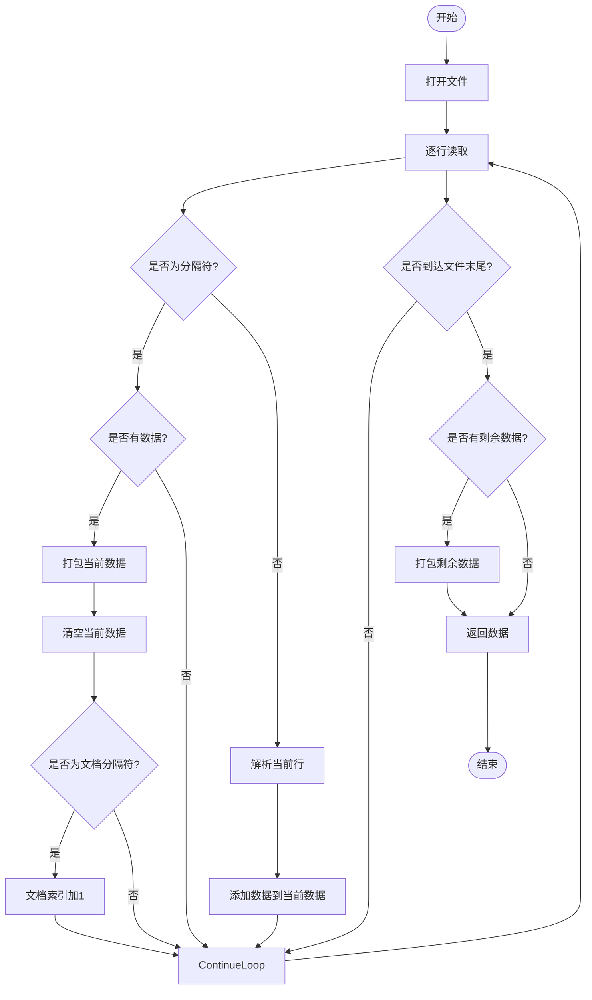
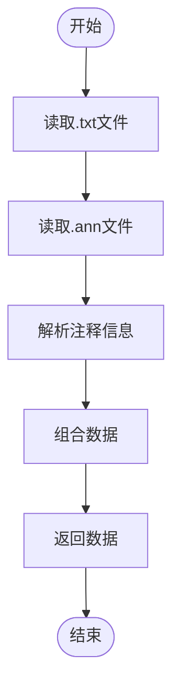
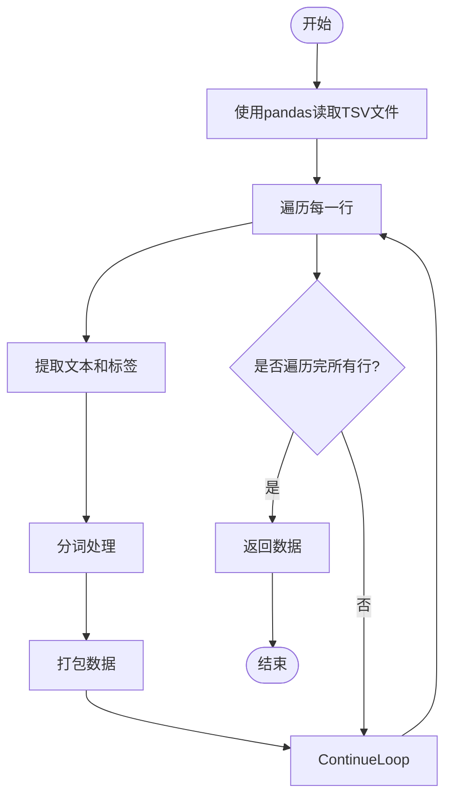
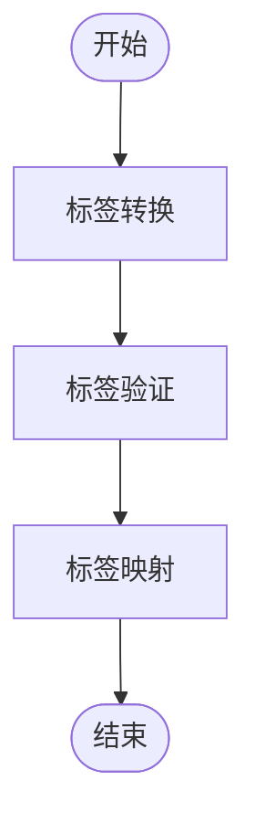
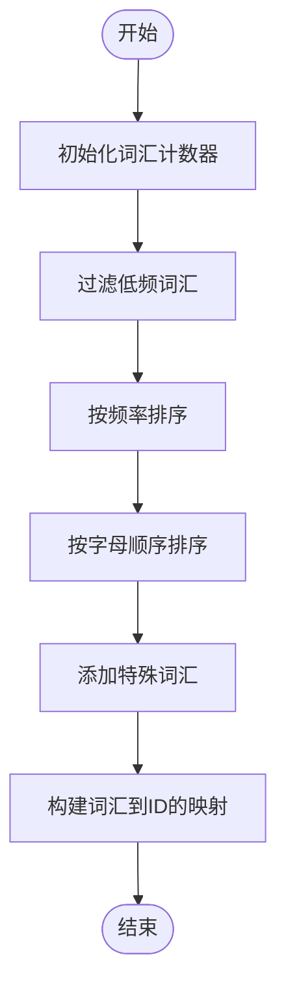
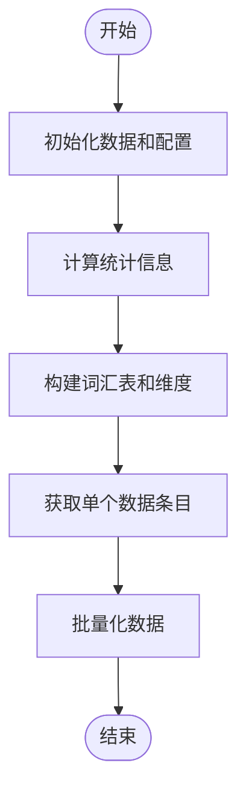
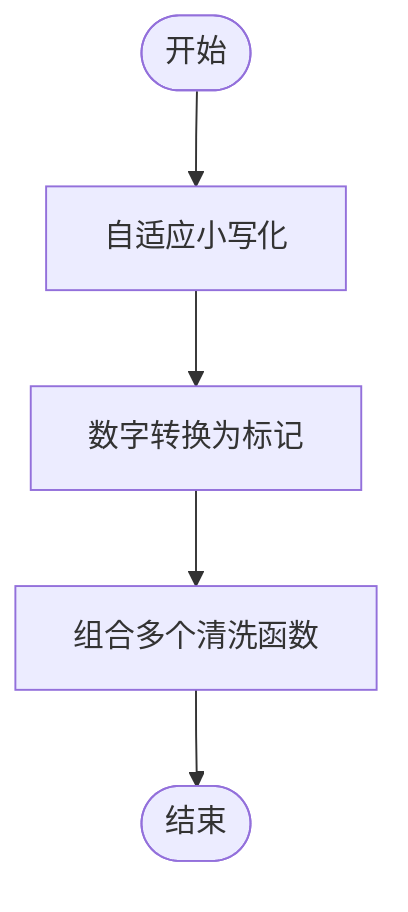
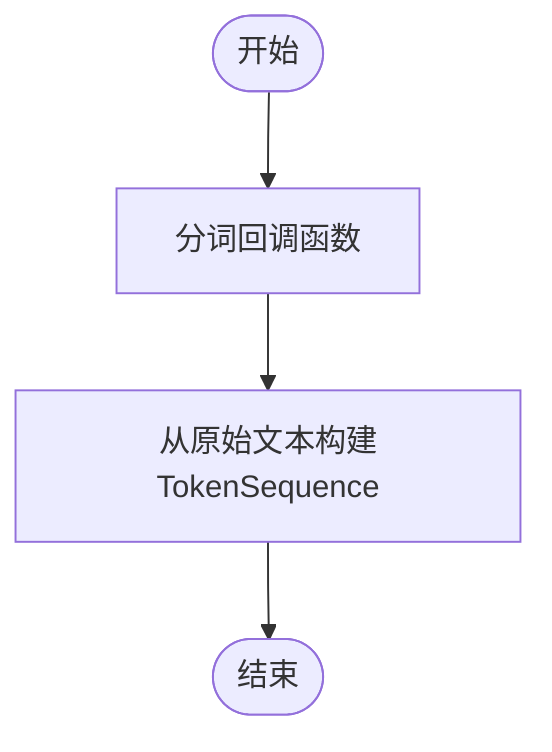
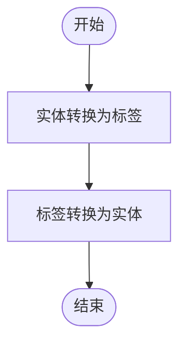

# 数据处理

<cite>
**本文档引用的文件**   
- [__init__.py](file://eznlp/io/__init__.py)
- [base.py](file://eznlp/io/base.py)
- [conll.py](file://eznlp/io/conll.py)
- [tabular.py](file://eznlp/io/tabular.py)
- [raw_text.py](file://eznlp/io/raw_text.py)
- [chip.py](file://eznlp/io/chip.py)
- [src2trg.py](file://eznlp/io/src2trg.py)
- [category_folder.py](file://eznlp/io/category_folder.py)
- [processing.py](file://eznlp/io/processing.py)
- [vocab.py](file://eznlp/vocab.py)
- [dataset.py](file://eznlp/dataset.py)
- [token.py](file://eznlp/token.py)
- [chunk.py](file://eznlp/utils/chunk.py)
- [segmentation.py](file://eznlp/utils/segmentation.py)
- [transition.py](file://eznlp/utils/transition.py)
- [brat.py](file://eznlp/io/brat.py)
</cite>

## 目录
1. [引言](#引言)
2. [支持的数据格式与IO类](#支持的数据格式与io类)
3. [数据加载流程](#数据加载流程)
4. [预处理函数](#预处理函数)
5. [自定义数据格式扩展](#自定义数据格式扩展)
6. [性能优化建议](#性能优化建议)
7. [总结](#总结)

## 引言

eznlp 是一个专注于自然语言处理任务的框架，特别在命名实体识别（NER）方面提供了强大的支持。本文档旨在全面记录 eznlp 的数据处理机制，涵盖其支持的数据格式、IO 类的设计与实现、数据加载流程、预处理函数、自定义数据格式的扩展方法以及性能优化建议。通过本文档，用户可以深入了解 eznlp 如何高效地处理和转换各种数据格式，为模型训练和评估提供高质量的数据输入。

## 支持的数据格式与IO类

eznlp 支持多种数据格式，每种格式都有对应的 IO 类来处理数据的读取和解析。这些 IO 类继承自基类 `IO`，并根据具体的数据格式实现了相应的读取逻辑。

### CoNLL 格式

CoNLL 格式是一种广泛使用的命名实体识别数据格式，通常以 TSV 文件形式存储。每行包含一个词及其对应的标签，空行表示句子的结束。eznlp 通过 `ConllIO` 类来处理 CoNLL 格式的数据。

**ConllIO 类的主要参数**:
- `text_col_id`: 文本列的索引，默认为 0。
- `tag_col_id`: 标签列的索引，默认为 1。
- `sep`: 列分隔符，默认为制表符。
- `scheme`: 标签方案，支持 "BIO1", "BIO2", "BIOES", "BMES", "BILOU", "OntoNotes" 等。
- `tag_sep`: 标签分隔符，默认为 "-"。
- `breaking_for_types`: 是否根据类型断开标签，默认为 True。
- `additional_col_id2name`: 额外列的映射字典。
- `sentence_sep_starts`: 句子分隔符的起始字符串列表。
- `document_sep_starts`: 文档分隔符的起始字符串列表。

**ConllIO 类的读取流程**:
1. 打开文件并逐行读取。
2. 检查当前行是否为句子或文档分隔符。
3. 如果是分隔符且已有数据，则将当前数据打包并清空。
4. 如果不是分隔符，则解析当前行的文本和标签，并添加到当前数据中。
5. 处理完所有行后，将剩余的数据打包并返回。



**Diagram sources**
- [conll.py](file://eznlp/io/conll.py#L69-L141)

**Section sources**
- [conll.py](file://eznlp/io/conll.py#L8-L198)

### BRAT 格式

BRAT 格式是一种基于注释文件的命名实体识别数据格式，通常包含两个文件：`.txt` 文件存储原始文本，`.ann` 文件存储注释信息。eznlp 通过 `BratIO` 类来处理 BRAT 格式的数据。

**BratIO 类的主要参数**:
- `encoding`: 文件编码，默认为 None。
- `verbose`: 是否显示详细信息，默认为 True。

**BratIO 类的读取流程**:
1. 读取 `.txt` 文件中的原始文本。
2. 读取 `.ann` 文件中的注释信息。
3. 将注释信息解析为实体和关系。
4. 将原始文本和注释信息组合成数据条目。



**Diagram sources**
- [brat.py](file://eznlp/io/brat.py)

**Section sources**
- [brat.py](file://eznlp/io/brat.py)

### TSV 格式

TSV 格式是一种简单的表格数据格式，通常用于存储分类任务的数据。eznlp 通过 `TabularIO` 类来处理 TSV 格式的数据。

**TabularIO 类的主要参数**:
- `tokenize_callback`: 分词回调函数，默认为 None。
- `text_col_id`: 文本列的索引，默认为 0。
- `label_col_id`: 标签列的索引，默认为 1。
- `sep`: 列分隔符，默认为 ","。
- `header`: 表头行索引，默认为 None。
- `mapping`: 文本映射字典，默认为 None。

**TabularIO 类的读取流程**:
1. 使用 pandas 读取 TSV 文件。
2. 遍历每一行，提取文本和标签。
3. 对文本进行分词处理。
4. 将处理后的数据打包并返回。



**Diagram sources**
- [tabular.py](file://eznlp/io/tabular.py#L37-L67)

**Section sources**
- [tabular.py](file://eznlp/io/tabular.py#L8-L67)

### 其他格式

除了上述三种主要格式外，eznlp 还支持其他几种数据格式，包括：

- **RawTextIO**: 处理原始文本文件，支持分词和字符级处理。
- **ChipIO**: 处理 CHIP 格式的数据，支持字符级和词级标注。
- **Src2TrgIO**: 处理源到目标的文本对，常用于机器翻译任务。
- **CategoryFolderIO**: 处理按类别文件夹组织的文本数据，常用于文本分类任务。

这些 IO 类的设计思路与 `ConllIO` 类类似，都是通过继承 `IO` 基类并实现 `read` 方法来完成数据的读取和解析。

## 数据加载流程

eznlp 的数据加载流程主要包括以下几个步骤：文件读取、标签解析、词汇表构建和批处理。每个步骤都由相应的类和方法来完成。

### 文件读取

文件读取是数据加载的第一步，由各个 IO 类的 `read` 方法完成。不同的 IO 类根据数据格式的不同，采用不同的读取策略。例如，`ConllIO` 类逐行读取 TSV 文件，`BratIO` 类分别读取 `.txt` 和 `.ann` 文件，`TabularIO` 类使用 pandas 读取表格文件。

### 标签解析

标签解析是将原始标签转换为模型可理解的格式的过程。eznlp 使用 `ChunksTagsTranslator` 类来完成标签解析。该类支持多种标签方案，如 "BIO1", "BIO2", "BIOES", "BMES", "BILOU" 等。标签解析的主要步骤包括：

1. **标签转换**: 将原始标签转换为指定的标签方案。
2. **标签验证**: 检查标签转换后的标签序列是否合法。
3. **标签映射**: 将标签映射到具体的实体类型。



**Diagram sources**
- [transition.py](file://eznlp/utils/transition.py#L12-L267)

**Section sources**
- [transition.py](file://eznlp/utils/transition.py#L12-L267)

### 词汇表构建

词汇表构建是将文本中的词汇映射到唯一的整数 ID 的过程。eznlp 使用 `Vocab` 类来完成词汇表的构建。`Vocab` 类的主要参数包括：

- `counter`: 词汇计数器。
- `max_size`: 词汇表的最大大小。
- `min_freq`: 词汇的最小频率。
- `specials`: 特殊词汇列表，如 "<unk>", "<pad>"。
- `specials_first`: 特殊词汇是否放在词汇表的前面。

**Vocab 类的构建流程**:
1. 初始化词汇计数器。
2. 过滤掉频率低于 `min_freq` 的词汇。
3. 按频率排序，然后按字母顺序排序。
4. 添加特殊词汇。
5. 构建词汇到 ID 的映射。



**Diagram sources**
- [vocab.py](file://eznlp/vocab.py#L12-L66)

**Section sources**
- [vocab.py](file://eznlp/vocab.py#L6-L66)

### 批处理

批处理是将数据划分为多个批次，以便于模型训练的过程。eznlp 使用 `Dataset` 类来完成批处理。`Dataset` 类的主要参数包括：

- `data`: 数据列表。
- `config`: 模型配置对象。
- `training`: 是否为训练模式。

**Dataset 类的批处理流程**:
1. 初始化数据和配置。
2. 计算数据的统计信息。
3. 构建词汇表和维度。
4. 获取单个数据条目。
5. 批量化数据。



**Diagram sources**
- [dataset.py](file://eznlp/dataset.py#L13-L210)

**Section sources**
- [dataset.py](file://eznlp/dataset.py#L13-L210)

## 预处理函数

eznlp 提供了一系列预处理函数，用于清洗文本、分词和标签转换。这些函数主要集中在 `processing.py` 文件中。

### 文本清洗

文本清洗是去除文本中的噪声和不相关信息的过程。eznlp 提供了多种文本清洗函数，如去除标点符号、转换全角字符为半角字符等。

**文本清洗函数**:
- `_adaptive_lower`: 自适应小写化，保留停用词的小写形式。
- `_text_to_num_mark`: 将数字转换为标记，如 "<int4>"。
- `_pipeline`: 组合多个文本清洗函数。



**Diagram sources**
- [token.py](file://eznlp/token.py#L286-L362)

**Section sources**
- [token.py](file://eznlp/token.py#L286-L362)

### 分词

分词是将文本分割成单词或字符的过程。eznlp 支持多种分词方法，包括基于空格的分词、基于字符的分词和基于 jieba 的分词。

**分词方法**:
- `tokenize_callback`: 分词回调函数，可以是 `None`、"char" 或 jieba 的分词函数。
- `from_raw_text`: 从原始文本构建 `TokenSequence` 对象。



**Diagram sources**
- [token.py](file://eznlp/token.py#L772-L800)

**Section sources**
- [token.py](file://eznlp/token.py#L772-L800)

### 标签转换

标签转换是将原始标签转换为模型可理解的格式的过程。eznlp 使用 `ChunksTagsTranslator` 类来完成标签转换。该类支持多种标签方案，如 "BIO1", "BIO2", "BIOES", "BMES", "BILOU" 等。

**标签转换函数**:
- `chunks2tags`: 将实体转换为标签。
- `tags2chunks`: 将标签转换为实体。



**Diagram sources**
- [transition.py](file://eznlp/utils/transition.py#L80-L217)

**Section sources**
- [transition.py](file://eznlp/utils/transition.py#L80-L217)

## 自定义数据格式扩展

eznlp 提供了灵活的机制，允许用户自定义新的数据格式和 IO 处理器。用户可以通过继承 `IO` 基类并实现 `read` 方法来创建新的 IO 处理器。

### 创建新的 IO 处理器

1. **定义新的 IO 类**: 继承 `IO` 基类。
2. **实现 `__init__` 方法**: 定义必要的参数。
3. **实现 `read` 方法**: 实现数据读取和解析逻辑。

**示例**:
```python
from eznlp.io.base import IO

class CustomIO(IO):
    def __init__(self, custom_param, **kwargs):
        super().__init__(is_tokenized=True, **kwargs)
        self.custom_param = custom_param

    def read(self, file_path):
        data = []
        with open(file_path, 'r', encoding=self.encoding) as f:
            for line in f:
                # 解析每一行
                text, label = line.strip().split('\t')
                tokens = self._build_tokens(text)
                chunks = [(label, 0, len(tokens))]
                data.append({"tokens": tokens, "chunks": chunks})
        return data
```

**Section sources**
- [base.py](file://eznlp/io/base.py#L7-L38)

### 注册新的 IO 处理器

1. **修改 `__init__.py` 文件**: 将新的 IO 类添加到 `__all__` 列表中。
2. **更新文档**: 在文档中添加新的 IO 处理器的说明。

**示例**:
```python
# eznlp/io/__init__.py
from .custom import CustomIO

__all__ = [
    "TabularIO",
    "CategoryFolderIO",
    "ConllIO",
    "BratIO",
    "JsonIO",
    "SQuADIO",
    "KarpathyIO",
    "TextClsIO",
    "ChipIO",
    "Src2TrgIO",
    "RawTextIO",
    "PostIO",
    "CustomIO",  # 添加新的 IO 类
]
```

**Section sources**
- [__init__.py](file://eznlp/io/__init__.py#L1-L26)

## 性能优化建议

为了提高数据处理的效率，eznlp 提供了一些性能优化建议。

### 词汇表裁剪

词汇表裁剪是减少词汇表大小，从而降低内存消耗和提高训练速度的方法。可以通过设置 `max_size` 参数来限制词汇表的大小。

**建议**:
- 设置合理的 `max_size` 值，避免词汇表过大。
- 保留高频词汇，去除低频词汇。

### 批处理大小调整

批处理大小是影响模型训练速度和内存消耗的重要因素。较大的批处理大小可以提高训练速度，但会增加内存消耗。

**建议**:
- 根据硬件资源选择合适的批处理大小。
- 在训练初期使用较小的批处理大小，逐步增加。

### 数据缓存

数据缓存是将处理后的数据保存到磁盘，避免重复处理的方法。可以显著提高数据加载速度。

**建议**:
- 对于大型数据集，使用数据缓存。
- 定期清理缓存文件，避免占用过多磁盘空间。

## 总结

eznlp 提供了一套完整的数据处理机制，支持多种数据格式，包括 CoNLL、BRAT 和 TSV 等。通过继承 `IO` 基类并实现 `read` 方法，用户可以轻松扩展新的数据格式。数据加载流程包括文件读取、标签解析、词汇表构建和批处理，每个步骤都有相应的类和方法来完成。此外，eznlp 还提供了一系列预处理函数，用于文本清洗、分词和标签转换。为了提高性能，建议进行词汇表裁剪、调整批处理大小和使用数据缓存。通过这些机制，eznlp 能够高效地处理和转换各种数据格式，为模型训练和评估提供高质量的数据输入。