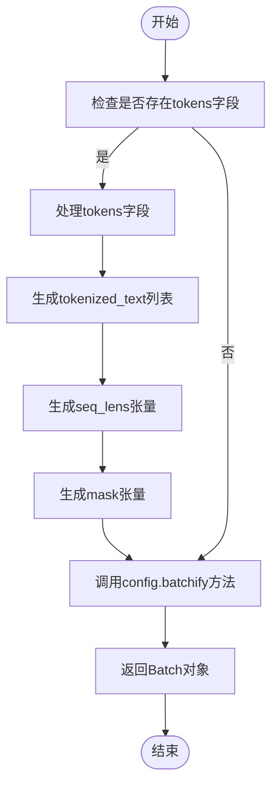
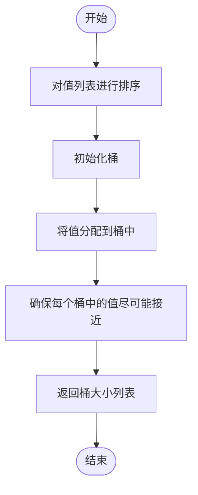

# 数据集构建与批处理

<cite>
**本文档引用的文件**
- [dataset.py](file://eznlp/dataset.py)
- [utils.py](file://eznlp/training/utils.py)
- [exp_launcher.py](file://scripts/exp_launcher.py)
- [wrapper.py](file://eznlp/wrapper.py)
- [base.py](file://eznlp/model/model/base.py)
- [extractor.py](file://eznlp/model/model/extractor.py)
- [functional.py](file://eznlp/nn/functional.py)
</cite>

## 目录
1. [简介](#简介)
2. [Dataset类核心机制](#dataset类核心机制)
3. [批处理与collate_fn实现](#批处理与collate_fn实现)
4. [批处理策略与优化](#批处理策略与优化)
5. [实验配置与应用场景](#实验配置与应用场景)
6. [配置建议与性能优化](#配置建议与性能优化)

## 简介
本文档系统性地分析了`Dataset`类的内部机制，重点阐述了如何将原始样本转换为模型可接受的张量格式，支持动态填充和长度截断。文档详细解释了`__getitem__`和`__len__`的实现逻辑，以及与PyTorch DataLoader的集成方式。同时，文档描述了批处理策略，如按长度分桶以减少填充开销，支持排序和批内打乱。结合`training/utils.py`中的`collate_fn`实现，说明了多任务输入的拼接与对齐方法。最后，文档提供了配置建议，并通过`exp_launcher.py`中的实验配置示例展示了实际应用场景。

## Dataset类核心机制

`Dataset`类继承自`torch.utils.data.Dataset`，是数据处理的核心组件。其主要功能是将原始数据转换为模型可接受的张量格式。`__init__`方法接收数据、配置和训练标志作为参数，初始化数据集。

`__len__`方法返回数据集的长度，即数据条目的数量。`__getitem__`方法根据索引获取单个数据条目，并通过`config.exemplify`方法将其转换为模型可接受的格式。`exemplify`方法的具体实现由`ModelConfigBase`的子类提供，如`ExtractorConfig`。

`build_vocabs_and_dims`方法用于构建词汇表和维度，`collate`方法用于将多个样本合并为一个批次。`collate`方法首先处理`tokens`字段，生成`tokenized_text`、`seq_lens`和`mask`，然后通过`config.batchify`方法将批次数据转换为模型可接受的格式。

**本节来源**
- [dataset.py](file://eznlp/dataset.py#L13-L114)
- [base.py](file://eznlp/model/model/base.py#L10-L62)
- [extractor.py](file://eznlp/model/model/extractor.py#L23-L200)

## 批处理与collate_fn实现

批处理是深度学习训练中的关键步骤，它将多个样本合并为一个批次，以提高训练效率。`Dataset`类的`collate`方法实现了批处理逻辑。该方法首先检查是否存在`tokens`字段，如果存在，则生成`tokenized_text`列表、`seq_lens`张量和`mask`张量。

`seq_lens`张量存储每个样本的序列长度，`mask`张量通过`seq_lens2mask`函数生成，用于标识填充位置。`mask`张量的形状为`(batch_size, max_seq_len)`，其中`max_seq_len`是批次中最长序列的长度。`mask`张量中，填充位置的值为`True`，非填充位置的值为`False`。

`collate`方法然后调用`config.batchify`方法，将批次数据转换为模型可接受的格式。`batchify`方法的具体实现由`ModelConfigBase`的子类提供。最后，`collate`方法返回一个`Batch`对象，该对象继承自`TensorWrapper`，用于包装批次数据。

**图表来源**
- [dataset.py](file://eznlp/dataset.py#L104-L114)
- [functional.py](file://eznlp/nn/functional.py#L5-L20)
- [wrapper.py](file://eznlp/wrapper.py#L97-L104)

## 批处理策略与优化

为了优化批处理效率，减少填充开销，系统采用了多种策略。其中，按长度分桶（bucketing）是一种有效的策略。该策略将长度相近的样本分到同一个桶中，然后从每个桶中随机选择样本组成批次。这样可以减少填充开销，提高训练效率。

`assign_consecutive_to_buckets`函数实现了按长度分桶的逻辑。该函数接收一个值列表和桶的数量作为参数，返回一个桶大小列表。桶大小列表中的每个元素表示对应桶中的样本数量。`assign_consecutive_to_buckets`函数首先对值列表进行排序，然后将值分配到桶中，确保每个桶中的值尽可能接近。

在实际应用中，可以先根据样本长度对数据集进行排序，然后使用`assign_consecutive_to_buckets`函数将样本分配到桶中。每个桶可以作为一个独立的数据集，使用`DataLoader`进行批处理。这样可以确保每个批次中的样本长度相近，减少填充开销。

**图表来源**
- [utils.py](file://eznlp/utils/algorithms.py#L1-L40)
- [dataset.py](file://eznlp/dataset.py#L13-L114)

## 实验配置与应用场景

`exp_launcher.py`脚本展示了如何使用`Dataset`类和批处理策略进行实验。该脚本接收任务名称、数据集名称、随机种子、是否使用BERT、实验数量和工作进程数作为参数。根据这些参数，脚本生成实验配置，并运行实验。

例如，对于实体识别任务，如果使用BERT，脚本会设置`batch_size`为48，`num_epochs`为50，`lr`为[1e-3, 2e-3]，`finetune_lr`为[1e-5, 2e-5]。如果未使用BERT，脚本会设置`batch_size`为32，`num_epochs`为100，`lr`为0.1。这些配置通过`OptionSampler`类生成，并应用于实验。

`exp_launcher.py`脚本还支持多进程运行实验。如果`num_workers`大于0，脚本会创建一个进程池，并将实验分配给不同的工作进程。这可以显著提高实验效率，特别是在处理大量实验时。

**本节来源**
- [exp_launcher.py](file://scripts/exp_launcher.py#L1-L267)
- [dataset.py](file://eznlp/dataset.py#L13-L114)

## 配置建议与性能优化

为了优化训练效率，建议根据硬件资源和数据集特性选择合适的`batch_size`。较大的`batch_size`可以提高GPU利用率，但需要更多的内存。较小的`batch_size`可以减少内存使用，但可能降低GPU利用率。通常，可以根据GPU内存大小和数据集特性进行调整。

`num_workers`参数控制`DataLoader`的工作进程数。设置合适的`num_workers`可以提高数据加载速度，减少训练过程中的等待时间。通常，可以将`num_workers`设置为CPU核心数的1-2倍。但是，过多的工作进程可能导致CPU资源竞争，反而降低性能。

在实际应用中，建议使用`auto_device`函数自动选择设备。该函数会返回具有最多空闲内存的CUDA设备，如果CUDA不可用，则返回CPU设备。这可以确保在多GPU环境中充分利用硬件资源。

**本节来源**
- [exp_launcher.py](file://scripts/exp_launcher.py#L1-L267)
- [utils.py](file://eznlp/training/utils.py#L158-L202)