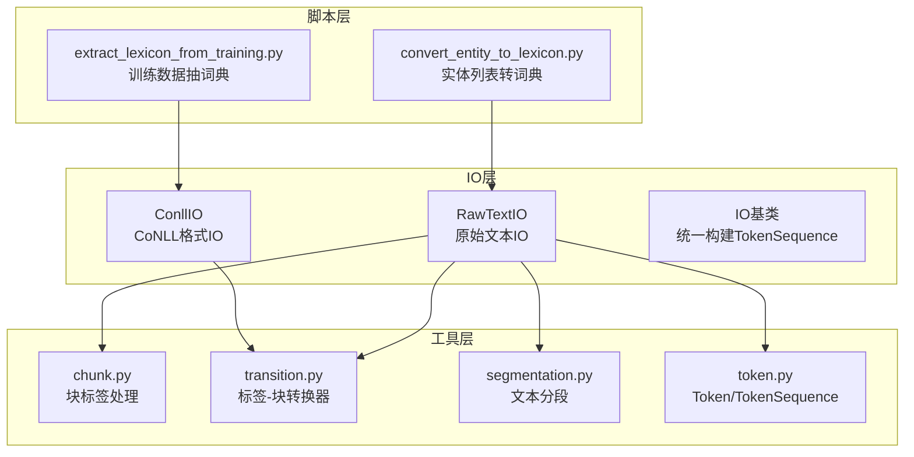
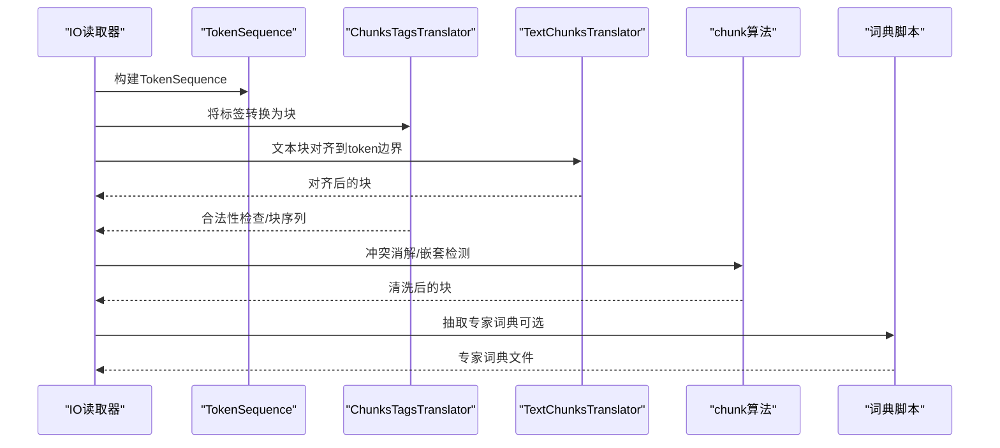
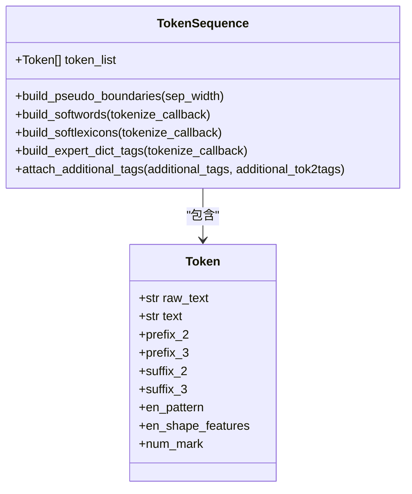
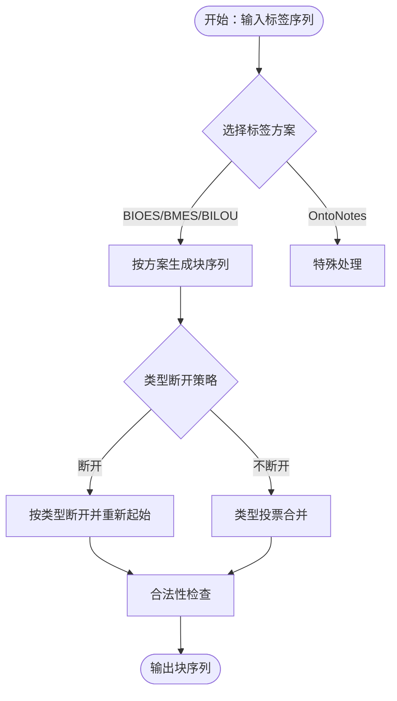
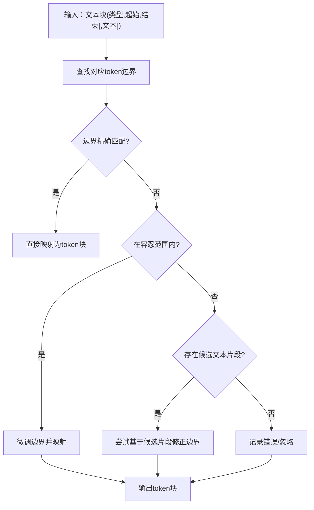
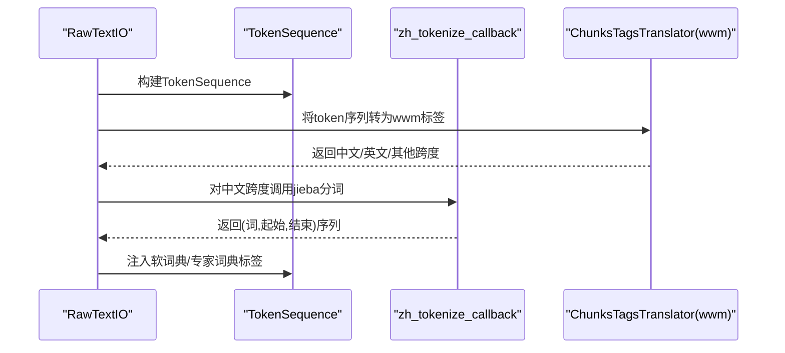
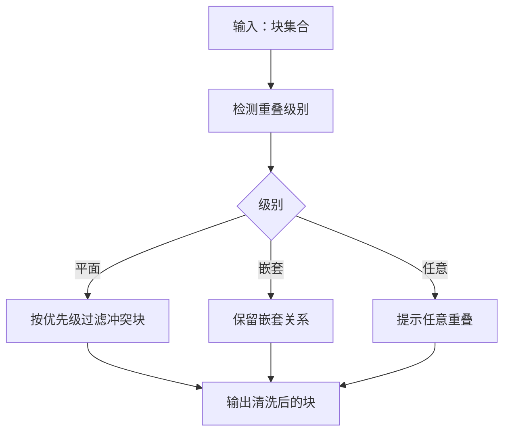
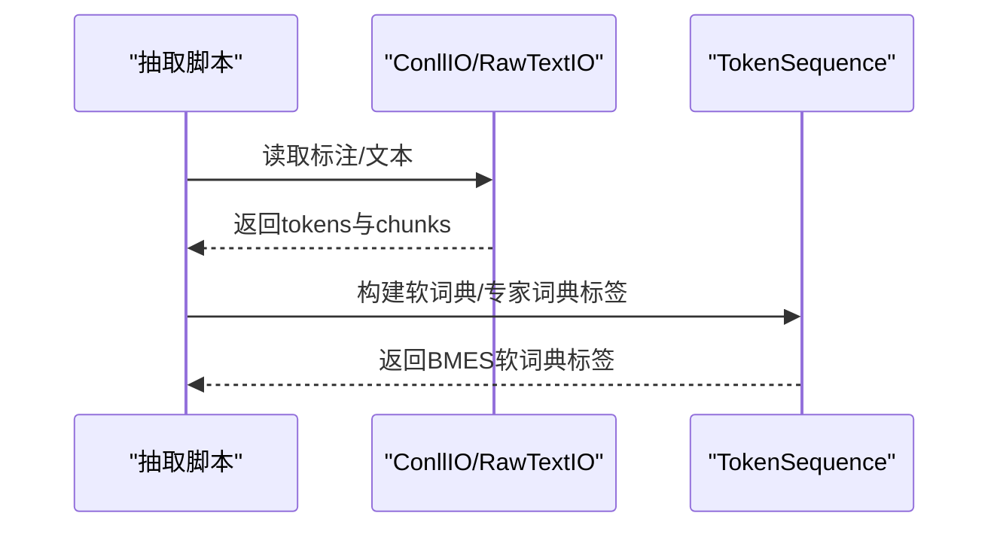
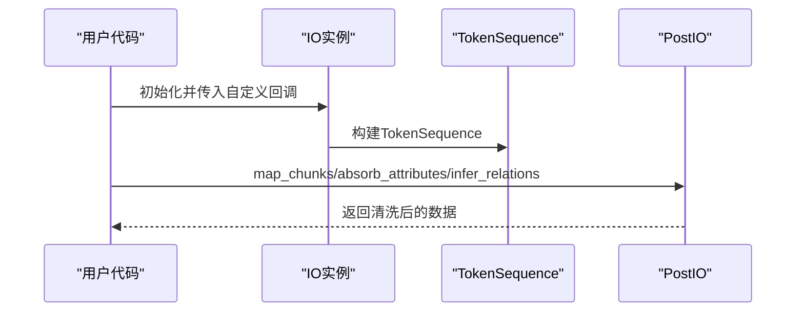
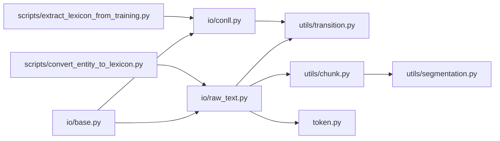

# 数据预处理

<cite>
**本文引用的文件**
- [processing.py](file://eznlp/io/processing.py)
- [chunk.py](file://eznlp/utils/chunk.py)
- [transition.py](file://eznlp/utils/transition.py)
- [token.py](file://eznlp/token.py)
- [conll.py](file://eznlp/io/conll.py)
- [raw_text.py](file://eznlp/io/raw_text.py)
- [segmentation.py](file://eznlp/utils/segmentation.py)
- [base.py](file://eznlp/io/base.py)
- [convert_entity_to_lexicon.py](file://scripts/convert_entity_to_lexicon.py)
- [extract_lexicon_from_training.py](file://scripts/extract_lexicon_from_training.py)
- [test_processing.py](file://tests/io/test_processing.py)
- [test_chunk.py](file://tests/utils/test_chunk.py)
- [test_transition.py](file://tests/utils/test_transition.py)
</cite>

## 目录
1. [简介](#简介)
2. [项目结构](#项目结构)
3. [核心组件](#核心组件)
4. [架构总览](#架构总览)
5. [详细组件分析](#详细组件分析)
6. [依赖关系分析](#依赖关系分析)
7. [性能考量](#性能考量)
8. [故障排查指南](#故障排查指南)
9. [结论](#结论)
10. [附录](#附录)

## 简介
本章节系统性解析eznlp中的数据预处理流程，覆盖以下关键能力：
- 文本标准化与清洗策略
- 标签编码转换（如BIOES/BMES/IOB等）与状态转移规则
- 实体边界对齐与冲突消解
- 分词集成机制（与jieba的结合、中文文本预处理策略）
- 块标签处理算法（块重叠级别检测、嵌套识别、距离计算）
- 词典构建与软词典嵌入（从训练数据抽取专家词典）
- 自定义预处理管道的扩展方法（函数注册与链式调用）

## 项目结构
eznlp的数据预处理主要分布在以下模块：
- IO层：负责从原始文本或标注文件读取并构建TokenSequence，同时进行标签到块的转换与后处理
- 工具层：提供块标签转换器、块边界对齐器、分段工具等
- 脚本层：提供从实体列表与训练数据中抽取专家词典的工具

图表来源
- [raw_text.py](file://eznlp/io/raw_text.py#L1-L120)
- [conll.py](file://eznlp/io/conll.py#L1-L120)
- [base.py](file://eznlp/io/base.py#L1-L38)
- [chunk.py](file://eznlp/utils/chunk.py#L1-L120)
- [transition.py](file://eznlp/utils/transition.py#L1-L120)
- [segmentation.py](file://eznlp/utils/segmentation.py#L1-L82)
- [token.py](file://eznlp/token.py#L365-L780)
- [convert_entity_to_lexicon.py](file://scripts/convert_entity_to_lexicon.py#L1-L79)
- [extract_lexicon_from_training.py](file://scripts/extract_lexicon_from_training.py#L1-L120)

章节来源
- [raw_text.py](file://eznlp/io/raw_text.py#L1-L120)
- [conll.py](file://eznlp/io/conll.py#L1-L120)
- [base.py](file://eznlp/io/base.py#L1-L38)
- [chunk.py](file://eznlp/utils/chunk.py#L1-L120)
- [transition.py](file://eznlp/utils/transition.py#L1-L120)
- [segmentation.py](file://eznlp/utils/segmentation.py#L1-L82)
- [token.py](file://eznlp/token.py#L365-L780)
- [convert_entity_to_lexicon.py](file://scripts/convert_entity_to_lexicon.py#L1-L79)
- [extract_lexicon_from_training.py](file://scripts/extract_lexicon_from_training.py#L1-L120)

## 核心组件
- 文本标准化与清洗
  - Token与TokenSequence提供大小写归一化、数字标记、全角半角转换、简繁转换等预处理管线
  - 支持通过回调函数注入自定义预处理步骤
- 标签编码转换与状态转移
  - ChunksTagsTranslator支持多种标签方案（BIO1/BIO2/BIOES/BMES/BILOU/OntoNotes/wwm），内置状态转移规则表
  - 提供标签合法性检查、块序列构建与回溯
- 实体边界对齐与冲突消解
  - TextChunksTranslator在文本级与token级之间进行边界对齐，并容忍一定不一致
  - chunk.py提供块重叠级别检测、嵌套识别、优先级过滤等算法
- 分词集成与中文预处理
  - RawTextIO结合tokenize_callback与zh_tokenize_callback，支持中文jieba分词
  - TokenSequence.build_softwords/build_softlexicons/build_expert_dict_tags支持软词典嵌入
- 词典抽取与软词典嵌入
  - convert_entity_to_lexicon.py将实体列表转为专家词典
  - extract_lexicon_from_training.py从BMES标注中抽取高频实体作为专家词典

章节来源
- [token.py](file://eznlp/token.py#L365-L780)
- [transition.py](file://eznlp/utils/transition.py#L1-L160)
- [chunk.py](file://eznlp/utils/chunk.py#L1-L120)
- [raw_text.py](file://eznlp/io/raw_text.py#L1-L120)
- [conll.py](file://eznlp/io/conll.py#L1-L120)
- [convert_entity_to_lexicon.py](file://scripts/convert_entity_to_lexicon.py#L1-L79)
- [extract_lexicon_from_training.py](file://scripts/extract_lexicon_from_training.py#L1-L120)

## 架构总览
下图展示了从原始文本到模型输入的关键数据流，以及各组件之间的交互关系。

图表来源
- [raw_text.py](file://eznlp/io/raw_text.py#L1-L120)
- [conll.py](file://eznlp/io/conll.py#L1-L120)
- [token.py](file://eznlp/token.py#L365-L780)
- [transition.py](file://eznlp/utils/transition.py#L1-L160)
- [chunk.py](file://eznlp/utils/chunk.py#L1-L120)
- [convert_entity_to_lexicon.py](file://scripts/convert_entity_to_lexicon.py#L1-L79)
- [extract_lexicon_from_training.py](file://scripts/extract_lexicon_from_training.py#L1-L120)

## 详细组件分析

### 文本标准化与清洗（Token/TokenSequence）
- 功能要点
  - 大小写归一化、数字标记、全角半角转换、简繁转换
  - 通过pipeline组合多个归一化步骤，支持自定义回调
  - TokenSequence提供token级属性（前缀、后缀、形状特征等）
- 关键实现位置
  - Token构造与归一化管线
  - TokenSequence属性访问与批量构建
  - 软词典/专家词典标签构建（BMES软词典嵌入）

图表来源
- [token.py](file://eznlp/token.py#L365-L780)

章节来源
- [token.py](file://eznlp/token.py#L365-L780)

### 标签编码转换与状态转移（ChunksTagsTranslator）
- 功能要点
  - 支持BIO1/BIO2/BIOES/BMES/BILOU/OntoNotes/wwm等标签方案
  - 内置状态转移规则表，支持合法性检查与块序列回溯
  - 支持按类型断开（breaking_for_types）与类型投票（多类型时的优先策略）
- 关键实现位置
  - 标签到块的转换（tags2chunks）
  - 块到标签的转换（chunks2tags）
  - 合法性检查（check_transitions_legal）
  - wwm标签推导（_token2wwm_tag）

图表来源
- [transition.py](file://eznlp/utils/transition.py#L1-L200)

章节来源
- [transition.py](file://eznlp/utils/transition.py#L1-L200)

### 实体边界对齐与冲突消解（TextChunksTranslator）
- 功能要点
  - 在文本边界与token边界之间进行对齐，容忍一定范围内的不一致
  - 提供一致性校验（正则映射），自动修复轻微偏移
  - 支持将块序列转换为文本块表示，便于人工核对
- 关键实现位置
  - 文本块到token块（text_chunks2chunks）
  - token块到文本块（chunks2text_chunks）
  - 一致性校验（is_consistency）

图表来源
- [chunk.py](file://eznlp/utils/chunk.py#L120-L250)

章节来源
- [chunk.py](file://eznlp/utils/chunk.py#L120-L250)

### 分词集成与中文预处理（RawTextIO + TokenSequence）
- 功能要点
  - RawTextIO支持tokenize_callback与zh_tokenize_callback，用于通用分词与中文jieba分词
  - 结合ChunksTagsTranslator的wwm标签，识别中文连续子词跨度
  - TokenSequence.build_softwords/build_softlexicons/build_expert_dict_tags支持软词典嵌入
- 关键实现位置
  - RawTextIO中检测wwm切分并调用中文分词回调
  - TokenSequence中软词典标签构建

图表来源
- [raw_text.py](file://eznlp/io/raw_text.py#L1-L120)
- [token.py](file://eznlp/token.py#L560-L700)
- [transition.py](file://eznlp/utils/transition.py#L240-L267)

章节来源
- [raw_text.py](file://eznlp/io/raw_text.py#L1-L120)
- [token.py](file://eznlp/token.py#L560-L700)
- [transition.py](file://eznlp/utils/transition.py#L240-L267)

### 块标签处理算法（chunk.py）
- 功能要点
  - 检测块重叠级别（平面/嵌套/任意重叠）
  - 嵌套识别与计数
  - 块间距离计算（重叠时为负重叠大小，否则为间距）
  - 冲突块按优先级过滤（长块优先）
- 关键实现位置
  - 重叠/嵌套判定
  - 重叠级别检测
  - 距离计算
  - 优先级过滤

图表来源
- [chunk.py](file://eznlp/utils/chunk.py#L1-L120)

章节来源
- [chunk.py](file://eznlp/utils/chunk.py#L1-L120)

### 词典抽取与软词典嵌入（脚本）
- convert_entity_to_lexicon.py
  - 从实体列表文件中解析实体类别与实体名，去重并保存为专家词典
- extract_lexicon_from_training.py
  - 从BMES标注文件中提取实体，支持按频次与长度过滤，输出专家词典
- 与TokenSequence的集成
  - TokenSequence.build_expert_dict_tags可用于将专家词典映射到token级别BMES标签

图表来源
- [extract_lexicon_from_training.py](file://scripts/extract_lexicon_from_training.py#L1-L120)
- [convert_entity_to_lexicon.py](file://scripts/convert_entity_to_lexicon.py#L1-L79)
- [token.py](file://eznlp/token.py#L630-L700)

章节来源
- [extract_lexicon_from_training.py](file://scripts/extract_lexicon_from_training.py#L1-L120)
- [convert_entity_to_lexicon.py](file://scripts/convert_entity_to_lexicon.py#L1-L79)
- [token.py](file://eznlp/token.py#L630-L700)

### 自定义预处理管道的扩展方法
- 函数注册与链式调用
  - IO基类提供统一的_tokenize与_token_kwargs入口，可在初始化时传入自定义分词回调
  - TokenSequence支持附加额外标签（attach_additional_tags），便于扩展特征
  - PostIO提供map_chunks/map_attributes/map_relations等链式处理接口，支持类型映射、吸收属性、排除属性、关系推理等
- 测试验证
  - 单元测试覆盖了属性吸收/排除、关系推理等后处理流程

图表来源
- [base.py](file://eznlp/io/base.py#L1-L38)
- [processing.py](file://eznlp/io/processing.py#L1-L130)
- [token.py](file://eznlp/token.py#L712-L780)
- [test_processing.py](file://tests/io/test_processing.py#L1-L88)

章节来源
- [base.py](file://eznlp/io/base.py#L1-L38)
- [processing.py](file://eznlp/io/processing.py#L1-L130)
- [token.py](file://eznlp/token.py#L712-L780)
- [test_processing.py](file://tests/io/test_processing.py#L1-L88)

## 依赖关系分析
- IO层依赖TokenSequence与工具层（ChunksTagsTranslator、TextChunksTranslator）
- RawTextIO依赖tokenize_callback与zh_tokenize_callback，以及ChunksTagsTranslator
- ConllIO依赖ChunksTagsTranslator进行标签到块的转换
- chunk.py与transition.py相互独立但共同服务于块与标签的双向转换
- 脚本层依赖IO与工具层，形成从数据到词典的闭环

图表来源
- [base.py](file://eznlp/io/base.py#L1-L38)
- [raw_text.py](file://eznlp/io/raw_text.py#L1-L120)
- [conll.py](file://eznlp/io/conll.py#L1-L120)
- [transition.py](file://eznlp/utils/transition.py#L1-L160)
- [chunk.py](file://eznlp/utils/chunk.py#L1-L120)
- [segmentation.py](file://eznlp/utils/segmentation.py#L1-L82)
- [token.py](file://eznlp/token.py#L365-L780)
- [convert_entity_to_lexicon.py](file://scripts/convert_entity_to_lexicon.py#L1-L79)
- [extract_lexicon_from_training.py](file://scripts/extract_lexicon_from_training.py#L1-L120)

章节来源
- [base.py](file://eznlp/io/base.py#L1-L38)
- [raw_text.py](file://eznlp/io/raw_text.py#L1-L120)
- [conll.py](file://eznlp/io/conll.py#L1-L120)
- [transition.py](file://eznlp/utils/transition.py#L1-L160)
- [chunk.py](file://eznlp/utils/chunk.py#L1-L120)
- [segmentation.py](file://eznlp/utils/segmentation.py#L1-L82)
- [token.py](file://eznlp/token.py#L365-L780)
- [convert_entity_to_lexicon.py](file://scripts/convert_entity_to_lexicon.py#L1-L79)
- [extract_lexicon_from_training.py](file://scripts/extract_lexicon_from_training.py#L1-L120)

## 性能考量
- TokenSequence的span切分与最大长度控制
  - TokenSequence.spans_within_max_length按句末标点切分，避免跨句截断
- 批量处理与进度条
  - PostIO在map_chunks/map_attributes/map_relations中使用tqdm显示进度
- 标签转换复杂度
  - tags2chunks遍历标签序列，时间复杂度O(n)，空间复杂度O(n)
- 边界对齐容忍度
  - TextChunksTranslator的mismatch_tol参数允许微小偏差，减少对齐失败率

章节来源
- [token.py](file://eznlp/token.py#L700-L780)
- [processing.py](file://eznlp/io/processing.py#L1-L130)
- [chunk.py](file://eznlp/utils/chunk.py#L120-L250)

## 故障排查指南
- 标签合法性问题
  - 使用ChunksTagsTranslator.check_transitions_legal进行合法性检查
  - 若出现非法转移，检查标签方案与类型断开策略（breaking_for_types）
- 边界对齐失败
  - 检查TextChunksTranslator的一致性映射与mismatch_tol设置
  - 确认原始文本与token边界是否一致
- 属性吸收/排除异常
  - 使用PostIO.absorb_attributes与exclude_attributes进行回退验证
  - 确保attr_sep分隔符未被误用
- 关系推理缺失
  - 检查group_rel_types配置与chunk2group构建过程
  - 确认新关系未重复添加

章节来源
- [transition.py](file://eznlp/utils/transition.py#L1-L120)
- [chunk.py](file://eznlp/utils/chunk.py#L120-L250)
- [processing.py](file://eznlp/io/processing.py#L130-L249)
- [test_transition.py](file://tests/utils/test_transition.py#L1-L120)
- [test_chunk.py](file://tests/utils/test_chunk.py#L1-L70)
- [test_processing.py](file://tests/io/test_processing.py#L1-L88)

## 结论
eznlp的数据预处理体系以IO层为核心，围绕TokenSequence与工具层（标签转换、块对齐、分段）构建了完整的数据准备流水线。通过标准化的Token归一化、灵活的标签转换、稳健的边界对齐与冲突消解，以及可扩展的后处理管道，能够高效支撑中文与多语言场景下的命名实体识别任务。配合专家词典抽取脚本，进一步强化了软词典嵌入能力，提升模型在特定领域的泛化性能。

## 附录
- 常用配置建议
  - 标签方案：BIOES或BMES，根据下游模型需求选择
  - 类型断开：breaking_for_types建议设为True，避免跨类型拼接
  - 中文分词：提供zh_tokenize_callback（如jieba），并确保tokenize_callback与之兼容
  - 词典构建：先用convert_entity_to_lexicon.py构建专家词典，再用extract_lexicon_from_training.py从训练数据中补充高频实体