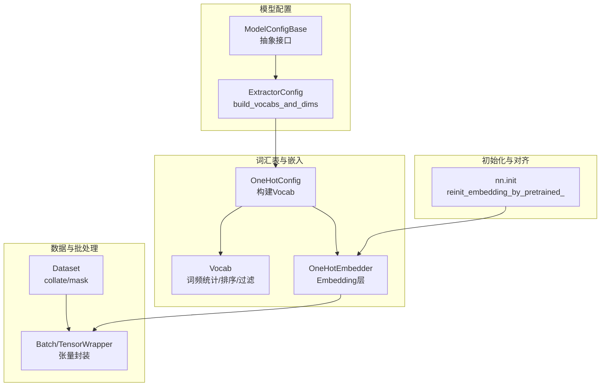
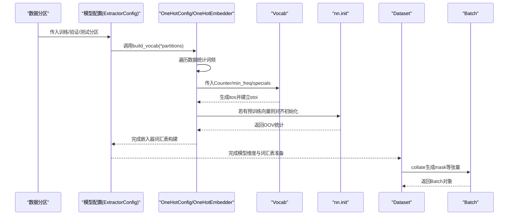
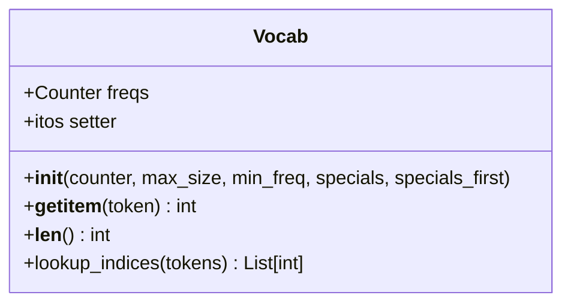
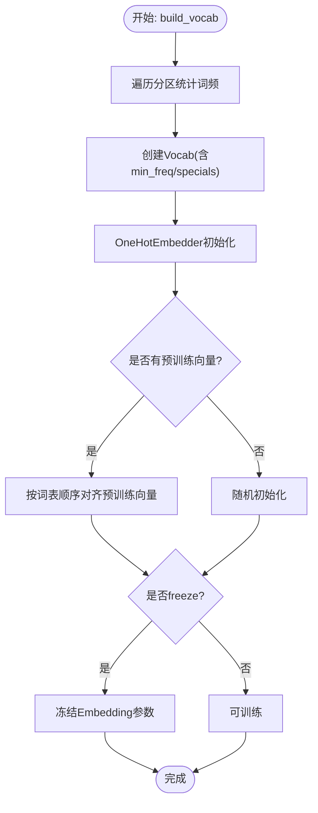
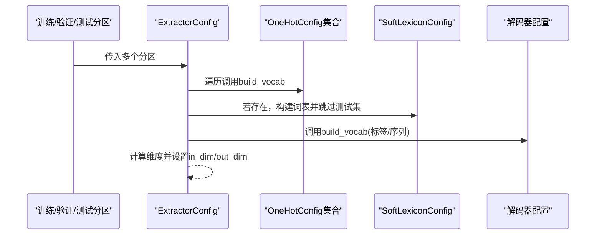
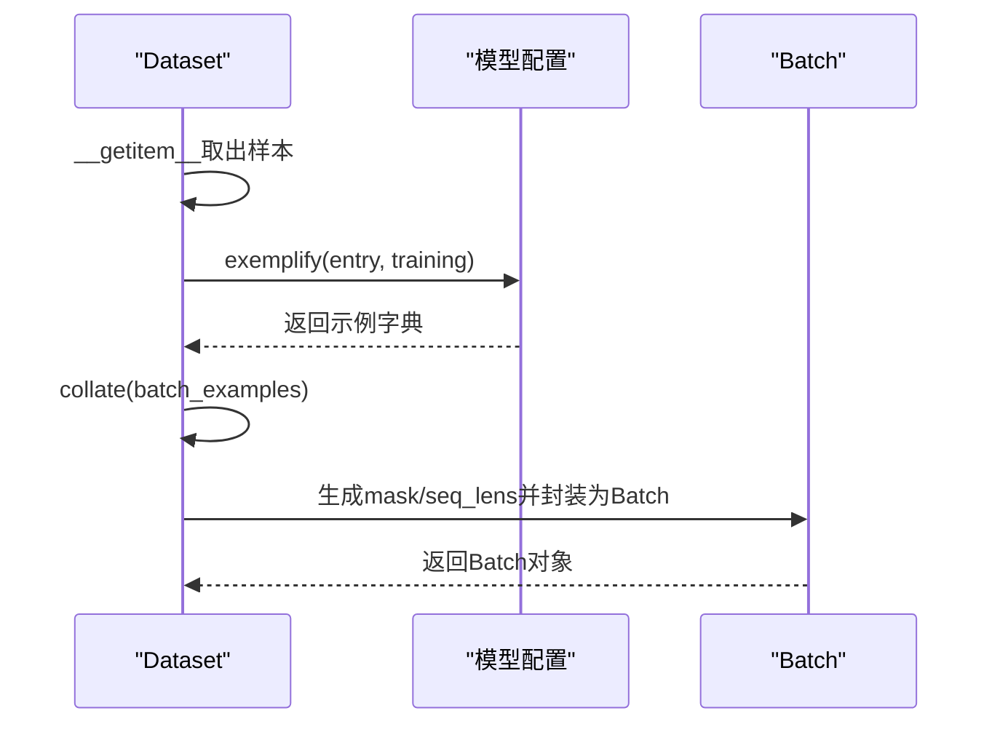
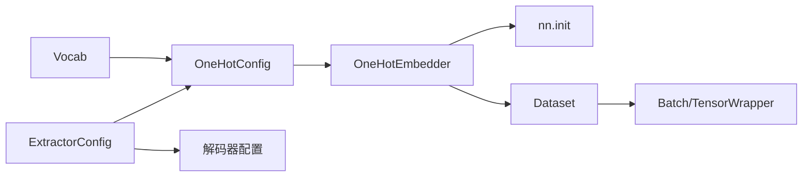

# 词汇表构建与管理

<cite>
**本文引用的文件**
- [vocab.py](file://eznlp/vocab.py)
- [embedder.py](file://eznlp/model/embedder.py)
- [dataset.py](file://eznlp/dataset.py)
- [base.py](file://eznlp/model/model/base.py)
- [extractor.py](file://eznlp/model/model/extractor.py)
- [init.py](file://eznlp/nn/init.py)
- [test_hz_training.py](file://scripts/test_hz_training.py)
- [wrapper.py](file://eznlp/wrapper.py)
</cite>

## 目录
1. [引言](#引言)
2. [项目结构](#项目结构)
3. [核心组件](#核心组件)
4. [架构总览](#架构总览)
5. [详细组件分析](#详细组件分析)
6. [依赖关系分析](#依赖关系分析)
7. [性能考量](#性能考量)
8. [故障排查指南](#故障排查指南)
9. [结论](#结论)
10. [附录](#附录)

## 引言
本文件系统性阐述eznlp中Vocab类的设计与实现，覆盖词项统计、频次过滤、特殊标记（UNK、PAD等）注入、词汇表裁剪等核心能力；解释词汇表与Dataset/Model配置的协同机制，说明在数据迭代过程中如何动态构建或加载预定义词汇表；梳理字符级、词级、子词级词汇表的构建策略及在中文NER任务中的应用差异；给出性能优化建议（min_freq、预训练嵌入对齐、多任务共享词汇表）；并结合test_hz_training.py中的测试用例，展示完整的词汇表构建工作流。

## 项目结构
围绕词汇表构建与使用的关键模块如下：
- 词汇表核心：Vocab类负责词频统计、排序、过滤与映射
- 嵌入与词汇表绑定：OneHotConfig/OneHotEmbedder负责从数据构建Vocab并将其注入嵌入层
- 模型配置与词汇表：ExtractorConfig等模型配置在构建阶段调用各嵌入器的build_vocab，形成统一的词汇表体系
- 数据集与批处理：Dataset在collate阶段生成mask等张量，配合Batch封装
- 初始化与对齐：nn.init提供基于预训练向量的嵌入初始化与OOV处理

图表来源
- [vocab.py](file://eznlp/vocab.py#L1-L66)
- [embedder.py](file://eznlp/model/embedder.py#L112-L161)
- [extractor.py](file://eznlp/model/model/extractor.py#L122-L148)
- [base.py](file://eznlp/model/model/base.py#L51-L62)
- [dataset.py](file://eznlp/dataset.py#L104-L115)
- [wrapper.py](file://eznlp/wrapper.py#L97-L122)
- [init.py](file://eznlp/nn/init.py#L25-L63)

章节来源
- [vocab.py](file://eznlp/vocab.py#L1-L66)
- [embedder.py](file://eznlp/model/embedder.py#L112-L161)
- [extractor.py](file://eznlp/model/model/extractor.py#L122-L148)
- [base.py](file://eznlp/model/model/base.py#L51-L62)
- [dataset.py](file://eznlp/dataset.py#L104-L115)
- [wrapper.py](file://eznlp/wrapper.py#L97-L122)
- [init.py](file://eznlp/nn/init.py#L25-L63)

## 核心组件
- Vocab类
  - 输入：Counter词频统计
  - 关键参数：max_size、min_freq、specials、specials_first
  - 行为：按频次降序、字母升序排序，过滤低于min_freq或超过max_size的词；可选择将特殊标记前置或后置；生成itos并建立stoi映射
  - 查询：支持getitem返回索引，默认UNK；提供lookup_indices批量查询
- OneHotConfig/OneHotEmbedder
  - 从数据分区遍历统计词频，构建Vocab；随后在exemplify中将字段序列映射为ID序列；在batchify中做padding
  - 若提供预训练向量，使用nn.init.reinit_embedding_by_pretrained_进行对齐，支持OOV初始化策略
- 模型配置（ExtractorConfig等）
  - 在build_vocabs_and_dims中依次调用各嵌入器的build_vocab，形成统一的词汇表体系；同时计算维度并为解码器等组件准备输入
- Dataset/Batch
  - Dataset.collate生成mask等张量；Batch封装张量，便于跨模块传递

章节来源
- [vocab.py](file://eznlp/vocab.py#L12-L66)
- [embedder.py](file://eznlp/model/embedder.py#L112-L161)
- [extractor.py](file://eznlp/model/model/extractor.py#L122-L148)
- [dataset.py](file://eznlp/dataset.py#L104-L115)
- [wrapper.py](file://eznlp/wrapper.py#L97-L122)
- [init.py](file://eznlp/nn/init.py#L25-L63)

## 架构总览
词汇表构建贯穿“数据→配置→嵌入→模型”的链路。数据分区作为输入，模型配置在构建阶段触发各嵌入器统计词频并生成Vocab；嵌入器随后将Vocab注入Embedding层；训练/推理时，Dataset负责将样本转换为张量并生成mask，Batch统一封装。

图表来源
- [embedder.py](file://eznlp/model/embedder.py#L112-L161)
- [vocab.py](file://eznlp/vocab.py#L12-L66)
- [init.py](file://eznlp/nn/init.py#L25-L63)
- [extractor.py](file://eznlp/model/model/extractor.py#L122-L148)
- [dataset.py](file://eznlp/dataset.py#L104-L115)
- [wrapper.py](file://eznlp/wrapper.py#L97-L122)

## 详细组件分析

### Vocab类设计与实现
- 词项统计与排序
  - 先按字母序稳定排序，再按频率降序排序，确保稳定性和一致性
- 频次过滤与裁剪
  - 通过min_freq过滤低频词；通过max_size限制最大词表规模
- 特殊标记注入
  - 支持specials（默认UNK、PAD）；specials_first决定是否前置插入；若前置，max_size需相应扩展
- 映射与查询
  - itos/stoi双向映射；getitem默认UNK兜底；lookup_indices批量查询

图表来源
- [vocab.py](file://eznlp/vocab.py#L12-L66)

章节来源
- [vocab.py](file://eznlp/vocab.py#L12-L66)

### 嵌入器与词汇表绑定（OneHotConfig/OneHotEmbedder）
- 构建流程
  - 遍历partitions统计字段序列词频，得到Counter
  - 调用Vocab构造函数，传入min_freq、specials、specials_first
  - 在exemplify中将字段序列映射为ID序列；在batchify中进行padding
- 预训练嵌入对齐
  - 若提供Vectors，使用nn.init.reinit_embedding_by_pretrained_按词表顺序填充向量，支持OOV零向量或均匀初始化
- 冻结策略
  - 可选freeze参数冻结Embedding参数，避免微调阶段更新

图表来源
- [embedder.py](file://eznlp/model/embedder.py#L112-L161)
- [init.py](file://eznlp/nn/init.py#L25-L63)

章节来源
- [embedder.py](file://eznlp/model/embedder.py#L112-L161)
- [init.py](file://eznlp/nn/init.py#L25-L63)

### 模型配置与词汇表协同（ExtractorConfig）
- 构建阶段
  - 遍历ohots/mhots/nested_ohots等嵌入器，逐一调用build_vocab
  - 对于SoftLexiconConfig，跳过测试集构建频率表，仅在训练/验证集上构建
  - 计算全嵌入维度与隐藏维度，为后续编码器/解码器准备输入
- 解码器词汇表
  - 解码器同样需要词汇表（如标签序列），由其自身配置负责构建

图表来源
- [extractor.py](file://eznlp/model/model/extractor.py#L122-L148)

章节来源
- [extractor.py](file://eznlp/model/model/extractor.py#L122-L148)

### 数据集与批处理（Dataset/Batch）
- collate逻辑
  - 当存在tokens字段时，收集tokenized_text并计算seq_lens与mask
  - 调用config.batchify生成Batch对象
- Batch封装
  - TensorWrapper统一管理张量属性，Batch继承该封装，便于跨模块传递

图表来源
- [dataset.py](file://eznlp/dataset.py#L95-L115)
- [wrapper.py](file://eznlp/wrapper.py#L97-L122)

章节来源
- [dataset.py](file://eznlp/dataset.py#L95-L115)
- [wrapper.py](file://eznlp/wrapper.py#L97-L122)

### 词汇表构建工作流（结合test_hz_training.py）
- 测试脚本作用
  - 通过子进程方式运行训练脚本，仅训练2个epoch，验证代码正确性与可运行性
- 与词汇表的关系
  - 训练脚本内部会调用模型配置的build_vocabs_and_dims，从而触发嵌入器构建Vocab
  - 由于训练时间短，可快速验证词汇表构建与对齐流程是否正常

章节来源
- [test_hz_training.py](file://scripts/test_hz_training.py#L1-L37)
- [embedder.py](file://eznlp/model/embedder.py#L112-L161)
- [extractor.py](file://eznlp/model/model/extractor.py#L122-L148)

## 依赖关系分析
- 组件耦合
  - OneHotConfig依赖Vocab；OneHotEmbedder依赖OneHotConfig与nn.init
  - 模型配置（ExtractorConfig）依赖各嵌入器配置，形成“配置→嵌入器→Vocab”的单向依赖
  - Dataset依赖模型配置的exemplify/batchify；Batch依赖TensorWrapper
- 外部依赖
  - torch、collections.Counter、typing等标准库
  - transformers（在预训练嵌入场景中）

图表来源
- [vocab.py](file://eznlp/vocab.py#L12-L66)
- [embedder.py](file://eznlp/model/embedder.py#L112-L161)
- [extractor.py](file://eznlp/model/model/extractor.py#L122-L148)
- [dataset.py](file://eznlp/dataset.py#L104-L115)
- [wrapper.py](file://eznlp/wrapper.py#L97-L122)
- [init.py](file://eznlp/nn/init.py#L25-L63)

章节来源
- [vocab.py](file://eznlp/vocab.py#L12-L66)
- [embedder.py](file://eznlp/model/embedder.py#L112-L161)
- [extractor.py](file://eznlp/model/model/extractor.py#L122-L148)
- [dataset.py](file://eznlp/dataset.py#L104-L115)
- [wrapper.py](file://eznlp/wrapper.py#L97-L122)
- [init.py](file://eznlp/nn/init.py#L25-L63)

## 性能考量
- 控制词汇表规模
  - 合理设置min_freq，过滤低频噪声词，降低嵌入维度与内存占用
  - 通过max_size限制词表上限，避免过度膨胀
- 预训练嵌入对齐
  - 使用预训练向量对齐初始化，减少随机初始化的震荡，提升收敛速度
  - OOV采用零向量或均匀初始化策略，平衡稳定性与泛化
- 冻结策略
  - 对预训练嵌入可选择freeze，减少参数更新开销，适用于固定特征场景
- 批处理与掩码
  - Dataset.collate生成mask，有助于高效处理变长序列，避免不必要的填充计算

章节来源
- [embedder.py](file://eznlp/model/embedder.py#L112-L161)
- [init.py](file://eznlp/nn/init.py#L25-L63)
- [dataset.py](file://eznlp/dataset.py#L104-L115)

## 故障排查指南
- 词汇表不一致
  - 确认各嵌入器的tokens_key与field一致；检查specials是否统一
- OOV比例过高
  - 适当提高min_freq；检查预训练向量覆盖范围；确认OOV初始化策略
- 内存不足
  - 缩小max_size；降低emb_dim；冻结部分嵌入层
- 训练不稳定
  - 使用预训练嵌入对齐；逐步放热冻结策略；检查mask与padding_idx设置

章节来源
- [embedder.py](file://eznlp/model/embedder.py#L112-L161)
- [init.py](file://eznlp/nn/init.py#L25-L63)
- [dataset.py](file://eznlp/dataset.py#L104-L115)

## 结论
Vocab类提供了简洁高效的词表构建能力，结合OneHotConfig/OneHotEmbedder与模型配置的build_vocabs_and_dims，实现了从数据到嵌入再到模型的完整闭环。通过min_freq、max_size、预训练嵌入对齐与冻结策略，可在保证性能的同时有效控制资源消耗。在中文NER任务中，字符级、词级、子词级策略可通过不同field与分词策略灵活切换，满足多样化的建模需求。

## 附录
- 字符级、词级、子词级词汇表构建策略
  - 字符级：field="text"，按字符粒度统计，适合未分词场景
  - 词级：field="words"或自定义字段，按词语统计，适合已有分词
  - 子词级：结合分词器（如BPE/WordPiece），通过嵌入器配置与预训练模型实现
- 多任务共享词汇表
  - 在不同任务配置中复用同一Vocab实例（通过OneHotConfig.vocab传入），确保词表一致
- 测试用例参考
  - test_hz_training.py用于快速验证训练脚本的正确性，间接验证词汇表构建与对齐流程

章节来源
- [embedder.py](file://eznlp/model/embedder.py#L53-L86)
- [test_hz_training.py](file://scripts/test_hz_training.py#L1-L37)