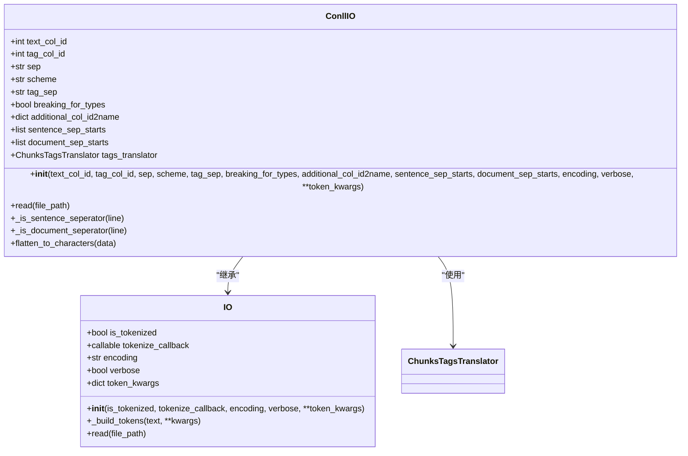
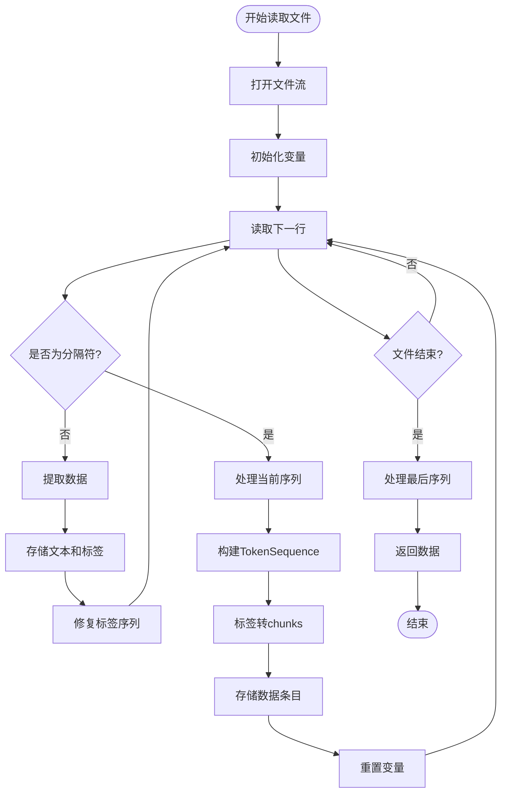
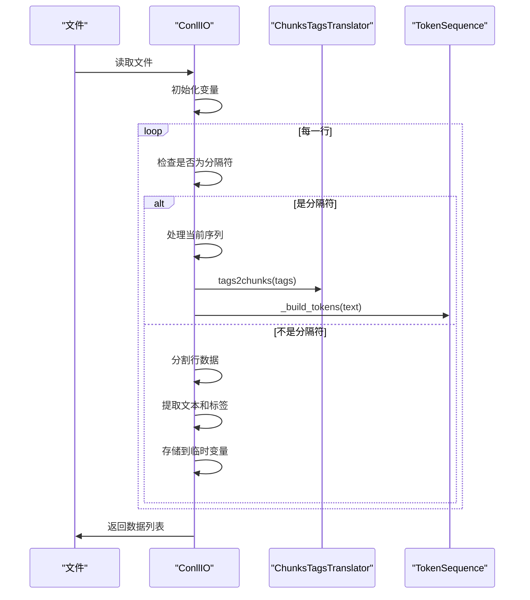
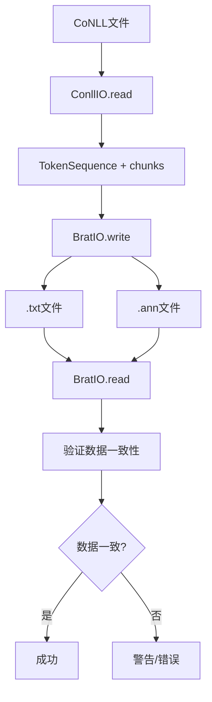

# CoNLL格式数据处理

<cite>
**本文档中引用的文件**  
- [conll.py](file://eznlp/io/conll.py)
- [demo.eng.train](file://data/conll2003/demo.eng.train)
- [demo.eng.train.brat.ann](file://data/conll2003/demo.eng.train.brat.ann)
- [demo.eng.train.brat.txt](file://data/conll2003/demo.eng.train.brat.txt)
- [base.py](file://eznlp/io/base.py)
- [brat.py](file://eznlp/io/brat.py)
- [chunk.py](file://eznlp/utils/chunk.py)
- [transition.py](file://eznlp/utils/transition.py)
- [token.py](file://eznlp/token.py)
</cite>

## 目录
1. [简介](#简介)
2. [ConllIO类核心机制](#conllio类核心机制)
3. [字段解析与内部结构转换](#字段解析与内部结构转换)
4. [示例文件加载流程](#示例文件加载流程)
5. [BRAT标注文件关联读取](#brat标注文件关联读取)
6. [实际使用示例](#实际使用示例)
7. [训练流水线中的作用](#训练流水线中的作用)

## 简介
eznlp.io.conll模块提供了对CoNLL系列格式（如CoNLL-2003）的完整支持，通过ConllIO类实现标准化的CoNLL文件解析。该模块能够处理标准CoNLL文件中的多个字段（token、POS、chunk、NER标签等），并将其转换为内部统一的TokenSequence与标注结构。系统支持多列标签处理、空格分词兼容性以及BRAT标注文件的关联读取，为命名实体识别（NER）任务提供了完整的数据加载解决方案。

## ConllIO类核心机制

ConllIO类继承自IO基类，实现了CoNLL格式文件的读取接口。该类通过配置化的参数支持不同变体的CoNLL格式，包括CoNLL-2003、OntoNotes等。



**图示来源**  
- [conll.py](file://eznlp/io/conll.py#L8-L198)
- [base.py](file://eznlp/io/base.py#L7-L37)

**本节来源**  
- [conll.py](file://eznlp/io/conll.py#L8-L198)
- [base.py](file://eznlp/io/base.py#L7-L37)

## 字段解析与内部结构转换

ConllIO类通过read方法解析CoNLL格式文件，将每行数据分解为token和标签，并转换为内部统一的数据结构。

### 核心参数配置
- **text_col_id**: 文本列的索引，默认为0
- **tag_col_id**: 标签列的索引，默认为1
- **sep**: 列分隔符，默认为None（使用空白字符分割）
- **scheme**: 标签编码方案，支持"BIO1"、"BIO2"、"BIOES"、"BMES"、"BILOU"、"OntoNotes"等
- **tag_sep**: 标签分隔符，默认为"-"
- **breaking_for_types**: 是否根据类型进行分割
- **additional_col_id2name**: 额外列的ID到名称映射
- **sentence_sep_starts**: 句子分隔符起始标记
- **document_sep_starts**: 文档分隔符起始标记

### 数据结构转换流程
1. 读取文件并逐行处理
2. 根据sep分隔符拆分每行数据
3. 提取指定列的文本和标签
4. 使用ChunksTagsTranslator将标签序列转换为chunks结构
5. 构建TokenSequence对象
6. 返回包含tokens和chunks的字典列表



**图示来源**  
- [conll.py](file://eznlp/io/conll.py#L69-L141)

**本节来源**  
- [conll.py](file://eznlp/io/conll.py#L69-L141)
- [transition.py](file://eznlp/utils/transition.py#L12-L133)

## 示例文件加载流程

以CoNLL-2003数据集的demo.eng.train文件为例，展示从文件加载到数据转换的完整流程。

### 示例文件结构
```
-DOCSTART- -X- -X- O

EU NNP I-NP I-ORG
rejects VBZ I-VP O
German JJ I-NP I-MISC
call NN I-NP O
to TO I-VP O
boycott VB I-VP O
British JJ I-NP I-MISC
lamb NN I-NP O
. . O O
```

### 多列标签处理
ConllIO支持处理多列标签，通过additional_col_id2name参数指定额外列的名称映射：

```python
conll_io = ConllIO(
    text_col_id=0,
    tag_col_id=3,
    additional_col_id2name={1: "pos", 2: "chunk"},
    document_sep_starts=["-DOCSTART-"]
)
```

这将把第1列作为POS标签，第2列作为chunk标签，第3列作为NER标签。

### 空格分词兼容性
系统能够正确处理以空格分隔的token，即使token本身包含空格字符。通过sep参数控制分隔方式，None值表示使用空白字符分割（包括空格、制表符等）。



**图示来源**  
- [demo.eng.train](file://data/conll2003/demo.eng.train)
- [conll.py](file://eznlp/io/conll.py#L69-L141)

**本节来源**  
- [demo.eng.train](file://data/conll2003/demo.eng.train)
- [conll.py](file://eznlp/io/conll.py#L69-L141)

## BRAT标注文件关联读取

ConllIO类支持与BRAT标注文件的关联读取，实现CoNLL格式与BRAT格式之间的相互转换。

### BRAT文件结构
BRAT格式使用两个文件：
- .txt文件：原始文本
- .ann文件：标注信息

示例demo.eng.train.brat.ann：
```
T1	ORG 0 2	EU
T2	MISC 11 17	German
T3	MISC 34 41	British
T4	PER 50 65	Peter Blackburn
```

### 关联读取机制
通过BratIO类实现CoNLL数据与BRAT格式的转换：

```python
# 从CoNLL格式读取数据
conll_io = ConllIO(
    text_col_id=0, 
    tag_col_id=3, 
    scheme="BIO1", 
    document_sep_starts=["-DOCSTART-"]
)
data = conll_io.read("data/conll2003/demo.eng.train")

# 写入BRAT格式
brat_io = BratIO(
    tokenize_callback="space",
    max_len=None,
    token_sep=" ",
    line_sep="\r\n",
    sentence_seps=[],
    phrase_seps=[],
    encoding="utf-8",
)
brat_io.write(data, "data/conll2003/demo.eng.train.brat.txt")
```

### 文本一致性检查
系统通过TextChunksTranslator类确保CoNLL格式和BRAT格式之间的文本一致性，处理可能的字符编码差异和空格问题。



**图示来源**  
- [demo.eng.train.brat.ann](file://data/conll2003/demo.eng.train.brat.ann)
- [demo.eng.train.brat.txt](file://data/conll2003/demo.eng.train.brat.txt)
- [brat.py](file://eznlp/io/brat.py#L20-L200)

**本节来源**  
- [demo.eng.train.brat.ann](file://data/conll2003/demo.eng.train.brat.ann)
- [demo.eng.train.brat.txt](file://data/conll2003/demo.eng.train.brat.txt)
- [brat.py](file://eznlp/io/brat.py#L20-L200)
- [test_brat.py](file://tests/io/test_brat.py#L137-L156)

## 实际使用示例

以下是使用ConllIO进行NER任务数据加载的完整代码示例：

```python
from eznlp.io import ConllIO

# 配置ConllIO实例
conll_io = ConllIO(
    text_col_id=0,                    # 第0列为文本
    tag_col_id=3,                     # 第3列为NER标签
    scheme="BIO1",                   # 使用BIO1编码方案
    document_sep_starts=["-DOCSTART-"],  # 文档分隔符
    verbose=True                      # 显示详细信息
)

# 加载CoNLL-2003训练数据
data = conll_io.read("data/conll2003/demo.eng.train")

# 查看数据结构
print(f"加载了 {len(data)} 个文档")
for i, entry in enumerate(data[:2]):  # 打印前两个文档
    print(f"文档 {i}:")
    print(f"  tokens: {entry['tokens']}")
    print(f"  chunks: {entry['chunks']}")
    print(f"  doc_idx: {entry['doc_idx']}")
```

对于包含多个标签列的复杂情况：

```python
# 处理包含POS和chunk标签的CoNLL文件
conll_io = ConllIO(
    text_col_id=0,
    tag_col_id=3,
    additional_col_id2name={
        1: "pos",      # 第1列为POS标签
        2: "chunk"     # 第2列为chunk标签
    },
    scheme="BIO1",
    document_sep_starts=["-DOCSTART-"]
)

data = conll_io.read("data/conll2003/demo.eng.train")
# 现在每个token都有pos和chunk属性
for token in data[0]["tokens"]:
    print(f"Token: {token.text}, POS: {token.pos}, Chunk: {token.chunk}")
```

**本节来源**  
- [conll.py](file://eznlp/io/conll.py#L23-L67)
- [demo.eng.train](file://data/conll2003/demo.eng.train)

## 训练流水线中的作用

ConllIO在NER训练流水线中扮演着关键的数据预处理角色，连接原始数据与模型训练。

### 数据流水线集成


### 与其他组件的协作
- **与Dataset类协作**：ConllIO输出的数据结构可以直接被eznlp.dataset.Dataset使用
- **与模型组件协作**：生成的TokenSequence和chunks结构适合各种序列标注模型
- **与评估组件协作**：保持一致的数据结构便于模型输出与真实标签的比较

### 性能优化特性
- **内存效率**：逐行处理大文件，避免一次性加载全部数据
- **灵活性**：通过参数配置支持多种CoNLL变体
- **可扩展性**：易于扩展支持新的标签编码方案
- **错误处理**：内置对不规范标签序列的修复机制

ConllIO类通过其灵活的配置和稳健的实现，为NER任务提供了可靠的数据加载基础，确保从原始标注数据到模型输入的平滑转换。

**本节来源**  
- [conll.py](file://eznlp/io/conll.py)
- [base.py](file://eznlp/io/base.py)
- [token.py](file://eznlp/token.py)