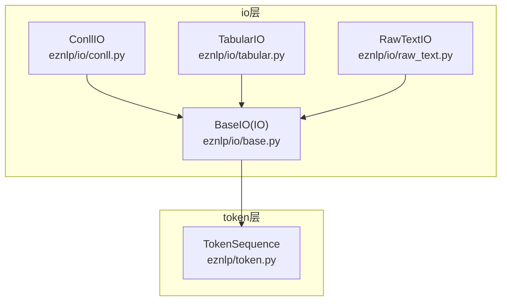
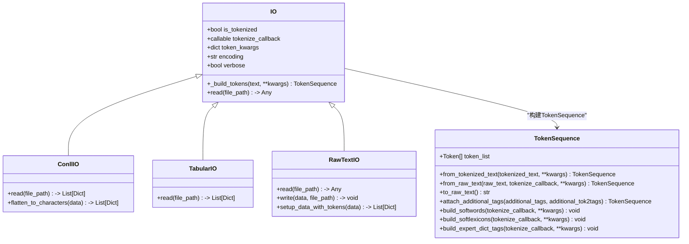
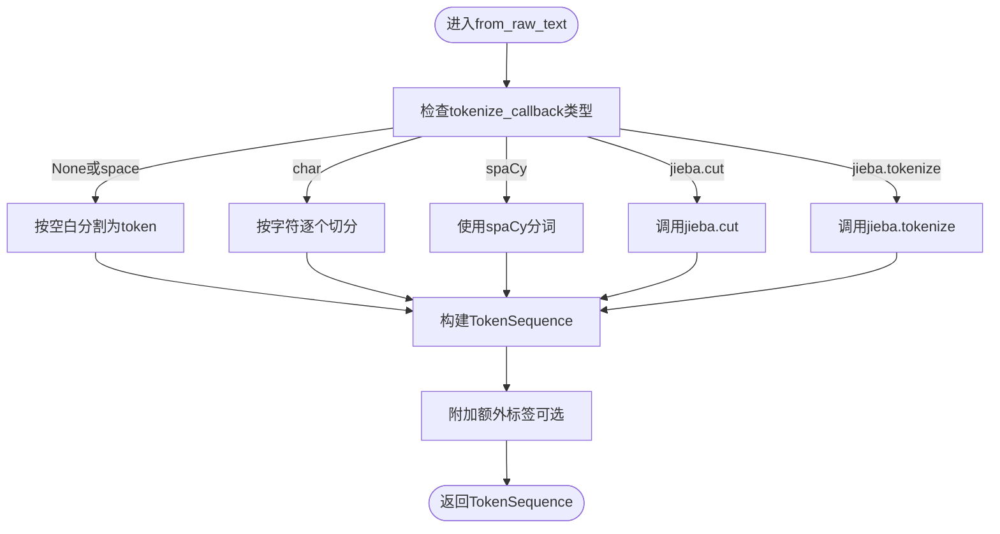
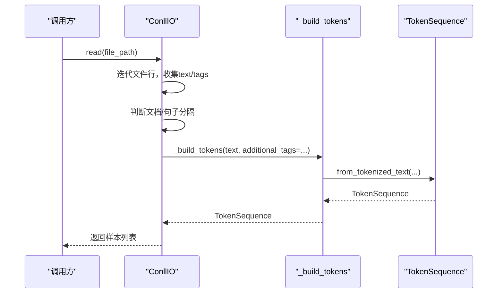
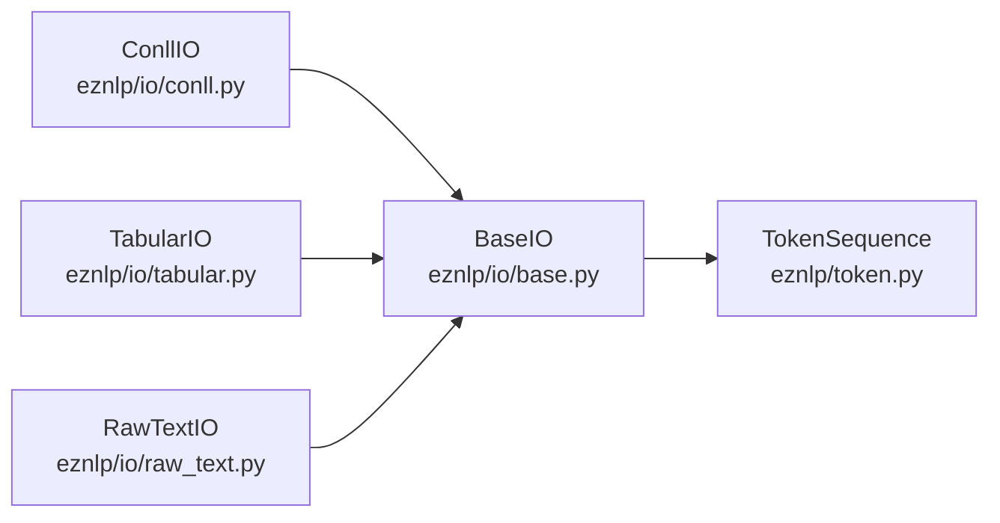

# IO基类设计与架构

<cite>
**本文引用的文件**
- [eznlp/io/base.py](file://eznlp/io/base.py)
- [eznlp/token.py](file://eznlp/token.py)
- [eznlp/io/conll.py](file://eznlp/io/conll.py)
- [eznlp/io/tabular.py](file://eznlp/io/tabular.py)
- [eznlp/io/raw_text.py](file://eznlp/io/raw_text.py)
- [eznlp/io/__init__.py](file://eznlp/io/__init__.py)
- [tests/io/test_tabular.py](file://tests/io/test_tabular.py)
- [tests/io/test_raw_text.py](file://tests/io/test_raw_text.py)
</cite>

## 目录
1. [引言](#引言)
2. [项目结构](#项目结构)
3. [核心组件](#核心组件)
4. [架构总览](#架构总览)
5. [详细组件分析](#详细组件分析)
6. [依赖分析](#依赖分析)
7. [性能考量](#性能考量)
8. [故障排查指南](#故障排查指南)
9. [结论](#结论)
10. [附录](#附录)

## 引言
本文件聚焦于eznlp.io.base模块中的BaseIO类（在源码中命名为IO），系统性解析其作为所有数据输入输出组件的抽象基类的设计理念与实现细节。重点包括：
- 统一接口如何支撑多格式读写（CSV表格、CoNLL序列标注、原始文本等）
- 通过_tokenize_callback机制灵活注入分词策略（空格分词、字符级分词、jieba中文分词、spaCy英文分词、BERT分词器等）
- TokenSequence对象的构建过程，尤其是_build_tokens如何智能处理原始文本与预分词文本的统一表示
- 自定义IO类继承BaseIO的实现方式与扩展路径

## 项目结构
eznlp.io包采用“按功能域分层”的组织方式，BaseIO位于io层，具体IO实现（如ConllIO、TabularIO、RawTextIO）均继承自BaseIO，统一通过_base.build_tokens方法完成文本到TokenSequence的转换。

图表来源
- [eznlp/io/base.py](file://eznlp/io/base.py#L1-L38)
- [eznlp/io/conll.py](file://eznlp/io/conll.py#L1-L198)
- [eznlp/io/tabular.py](file://eznlp/io/tabular.py#L1-L67)
- [eznlp/io/raw_text.py](file://eznlp/io/raw_text.py#L1-L192)
- [eznlp/token.py](file://eznlp/token.py#L492-L920)

章节来源
- [eznlp/io/__init__.py](file://eznlp/io/__init__.py#L1-L26)

## 核心组件
- BaseIO（IO）：提供统一的构造参数与通用方法，核心是_build_tokens，负责将原始文本或已分词列表转换为TokenSequence。
- TokenSequence：对Token列表进行封装，提供统一属性访问、切片、拼接、边界重建、软词典/专家词典标签构建等能力。
- 具体IO实现：ConllIO、TabularIO、RawTextIO等，分别面向不同数据格式，复用BaseIO的统一接口与分词策略注入。

章节来源
- [eznlp/io/base.py](file://eznlp/io/base.py#L1-L38)
- [eznlp/token.py](file://eznlp/token.py#L492-L920)

## 架构总览
BaseIO通过以下关键点实现统一抽象：
- 构造参数
  - is_tokenized：指示输入数据是否已经是分词后的列表
  - tokenize_callback：分词回调，支持字符串标识（如"space"、"char"）与可调用对象（如jieba.cut、spacy.Language、BERT分词器）
  - token_kwargs：传递给TokenSequence的额外参数（如token_sep、pad_token、none_token、case_mode、number_mode等）
- 核心方法
  - _build_tokens：根据is_tokenized选择TokenSequence.from_tokenized_text或TokenSequence.from_raw_text
  - read：约定式接口，由子类实现具体读取逻辑

图表来源
- [eznlp/io/base.py](file://eznlp/io/base.py#L1-L38)
- [eznlp/token.py](file://eznlp/token.py#L492-L920)
- [eznlp/io/conll.py](file://eznlp/io/conll.py#L1-L198)
- [eznlp/io/tabular.py](file://eznlp/io/tabular.py#L1-L67)
- [eznlp/io/raw_text.py](file://eznlp/io/raw_text.py#L1-L192)

## 详细组件分析

### BaseIO（IO）类设计
- 设计要点
  - is_tokenized与tokenize_callback互斥断言，确保要么输入已是分词列表，要么提供分词回调
  - token_kwargs用于透传至TokenSequence，保证分词规范化（大小写、数字归一、全角半角、简繁转换等）与分隔符设置
  - _build_tokens统一入口，屏蔽原始文本与预分词文本差异
- 关键行为
  - 当is_tokenized为真时，直接从分词列表构建TokenSequence
  - 当is_tokenized为假时，基于tokenize_callback对原始文本执行分词并构建TokenSequence

章节来源
- [eznlp/io/base.py](file://eznlp/io/base.py#L1-L38)

### TokenSequence构建与分词策略注入
- from_tokenized_text
  - 输入为已分词的字符串列表，自动计算每个token的起止位置，生成TokenSequence
- from_raw_text
  - 支持多种分词策略：
    - tokenize_callback为None或以"space"开头：按空白分割为token
    - tokenize_callback为以"char"开头：按字符级别切分
    - tokenize_callback为spaCy语言模型：使用其分词结果
    - tokenize_callback为jieba.Tokenizer的cut/tokenize方法：支持两种签名
  - 将分词结果映射为Token对象，记录start/end位置，便于后续边界重建与软词典/专家词典标签构建

图表来源
- [eznlp/token.py](file://eznlp/token.py#L772-L920)

章节来源
- [eznlp/token.py](file://eznlp/token.py#L492-L920)

### ConllIO：统一接口与分词策略的落地
- 特点
  - is_tokenized=True，输入为CoNLL格式的词列表与标签列表
  - 在读取完成后调用_base.build_tokens(text, additional_tags=...)，将词列表与标签统一为TokenSequence与chunks
  - 提供flatten_to_characters方法，将token级标签展开到字符级
- 数据流
  - 读取文件行 -> 解析文本列与标签列 -> 文档/句子分隔判断 -> 构建TokenSequence -> 生成chunks -> 返回样本列表

图表来源
- [eznlp/io/conll.py](file://eznlp/io/conll.py#L69-L141)
- [eznlp/io/base.py](file://eznlp/io/base.py#L26-L34)
- [eznlp/token.py](file://eznlp/token.py#L736-L771)

章节来源
- [eznlp/io/conll.py](file://eznlp/io/conll.py#L1-L198)

### TabularIO：表格数据的统一读取与分词
- 特点
  - is_tokenized=False，默认从原始文本列读取
  - 通过tokenize_callback对每条记录的文本进行分词，再构建TokenSequence
  - 支持sep、header、mapping等参数，适配不同CSV/TXT格式
- 数据流
  - 读取DataFrame -> 迭代行 -> 映射文本 -> 分词 -> 构建TokenSequence -> 附加标签 -> 返回样本列表

章节来源
- [eznlp/io/tabular.py](file://eznlp/io/tabular.py#L1-L67)

### RawTextIO：原始文本的分段与中文分词
- 特点
  - is_tokenized=False，支持从原始文本流中读取
  - 可配置zh_tokenize_callback用于中文细粒度分词，max_len控制文档最大长度
  - 内置WWM（Whole Word Masking）切分逻辑，支持中文词典/专家词典匹配
- 数据流
  - 读取字节行 -> 判断文档分隔 -> 按分词器切分为tokenized_doc -> 分段切分 -> 生成rejoined_text与wwm_cuts -> 返回样本列表

章节来源
- [eznlp/io/raw_text.py](file://eznlp/io/raw_text.py#L1-L192)

### 自定义IO类继承BaseIO的实现方式
- 步骤
  - 继承BaseIO，设置is_tokenized与tokenize_callback
  - 实现read(file_path)，在读取完成后调用_base.build_tokens统一构建TokenSequence
  - 如需额外字段（如标签、关系等），在read中组装字典并返回
- 示例参考
  - TabularIO：从CSV读取文本与标签，调用_base.build_tokens(text)构建TokenSequence
  - ConllIO：从CoNLL文件读取词与标签，调用_base.build_tokens(text, additional_tags=...)构建TokenSequence并转chunks

章节来源
- [eznlp/io/tabular.py](file://eznlp/io/tabular.py#L1-L67)
- [eznlp/io/conll.py](file://eznlp/io/conll.py#L69-L141)

## 依赖分析
- BaseIO依赖TokenSequence完成统一的文本表示
- 具体IO实现依赖BaseIO提供的统一接口与分词策略注入
- TokenSequence内部依赖多种分词器（jieba、spaCy、transformers分词器）与规范化工具

图表来源
- [eznlp/io/base.py](file://eznlp/io/base.py#L1-L38)
- [eznlp/token.py](file://eznlp/token.py#L492-L920)
- [eznlp/io/conll.py](file://eznlp/io/conll.py#L1-L198)
- [eznlp/io/tabular.py](file://eznlp/io/tabular.py#L1-L67)
- [eznlp/io/raw_text.py](file://eznlp/io/raw_text.py#L1-L192)

章节来源
- [eznlp/io/__init__.py](file://eznlp/io/__init__.py#L1-L26)

## 性能考量
- 分词策略选择
  - 空格分词适合已规范化文本，开销低
  - 字符级分词最保守但内存占用高
  - jieba/spaCy分词器在准确率与速度间平衡，建议优先使用
- TokenSequence缓存属性
  - bigram/trigram等属性使用cached_property，避免重复计算
- 大文件读取
  - 使用迭代器与tqdm进度条，减少内存峰值
- 文本切分
  - 对长文本采用segment_text_uniformly按句号/问号/感叹号等断句切分，降低单条样本长度

章节来源
- [eznlp/token.py](file://eznlp/token.py#L673-L711)
- [eznlp/io/raw_text.py](file://eznlp/io/raw_text.py#L100-L143)
- [eznlp/io/tabular.py](file://eznlp/io/tabular.py#L37-L67)

## 故障排查指南
- 常见问题与定位
  - 分词回调类型不匹配：from_raw_text对tokenize_callback有严格类型判断，确保传入正确的回调或字符串标识
  - TokenSequence.from_tokenized_text与from_raw_text混用：BaseIO构造时is_tokenized与tokenize_callback应保持一致
  - 中文分词异常：若使用zh_tokenize_callback，请确认其返回的是（word_text, start, end）元组序列
- 单测参考
  - 表格数据分词：TabularIO使用jieba.cut对中文文本进行分词，验证训练/测试集规模
  - 原始文本分词：RawTextIO使用BERT分词器与jieba.tokenize组合，验证缓存读写一致性

章节来源
- [eznlp/token.py](file://eznlp/token.py#L772-L920)
- [tests/io/test_tabular.py](file://tests/io/test_tabular.py#L100-L157)
- [tests/io/test_raw_text.py](file://tests/io/test_raw_text.py#L1-L25)

## 结论
BaseIO通过统一的构造参数与_build_tokens方法，实现了对多格式数据的抽象与解耦。借助tokenize_callback机制，系统能够灵活注入空格分词、字符级分词、jieba中文分词、spaCy英文分词等多种策略，从而在保持接口一致性的前提下，满足多样化的下游任务需求。TokenSequence进一步提供了丰富的文本表示能力，为序列标注、分类、检索等任务奠定基础。

## 附录
- 分词策略一览
  - 空格分词："space"或None（默认按空白分割）
  - 字符级分词："char"
  - jieba分词：jieba.cut（返回词列表）或jieba.tokenize（返回(词, 起始, 结束)）
  - spaCy分词：传入spacy.Language实例
  - BERT分词器：传入transformers分词器的tokenizer.tokenize
- 扩展新数据格式的步骤
  - 新建类继承BaseIO，设置is_tokenized与tokenize_callback
  - 实现read(file_path)，在读取后调用_base.build_tokens(text, **kwargs)统一构建TokenSequence
  - 如需额外字段，按样本字典形式返回

章节来源
- [eznlp/io/base.py](file://eznlp/io/base.py#L1-L38)
- [eznlp/token.py](file://eznlp/token.py#L772-L920)
- [eznlp/io/conll.py](file://eznlp/io/conll.py#L69-L141)
- [eznlp/io/tabular.py](file://eznlp/io/tabular.py#L1-L67)
- [eznlp/io/raw_text.py](file://eznlp/io/raw_text.py#L1-L192)