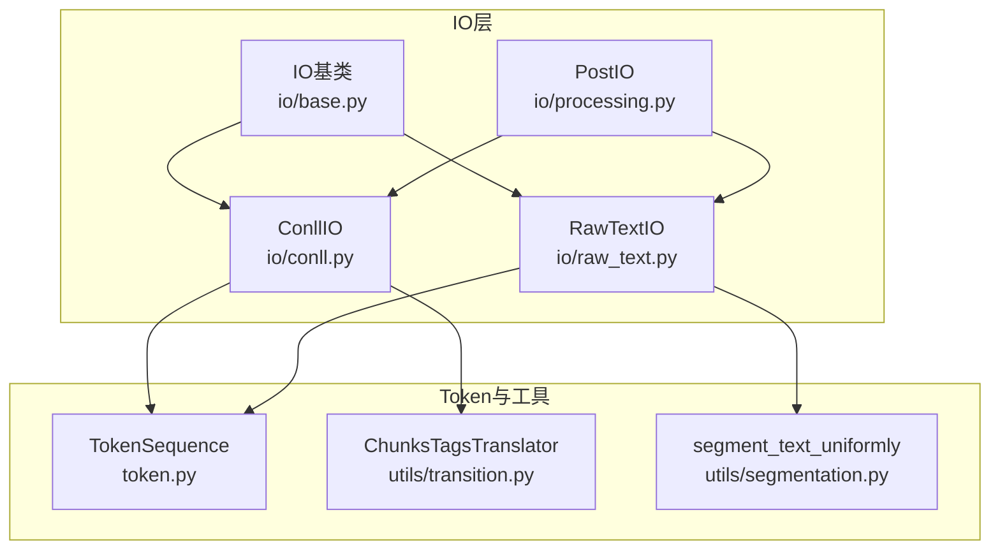
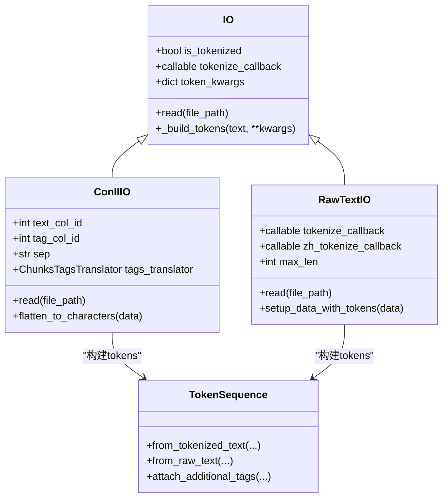
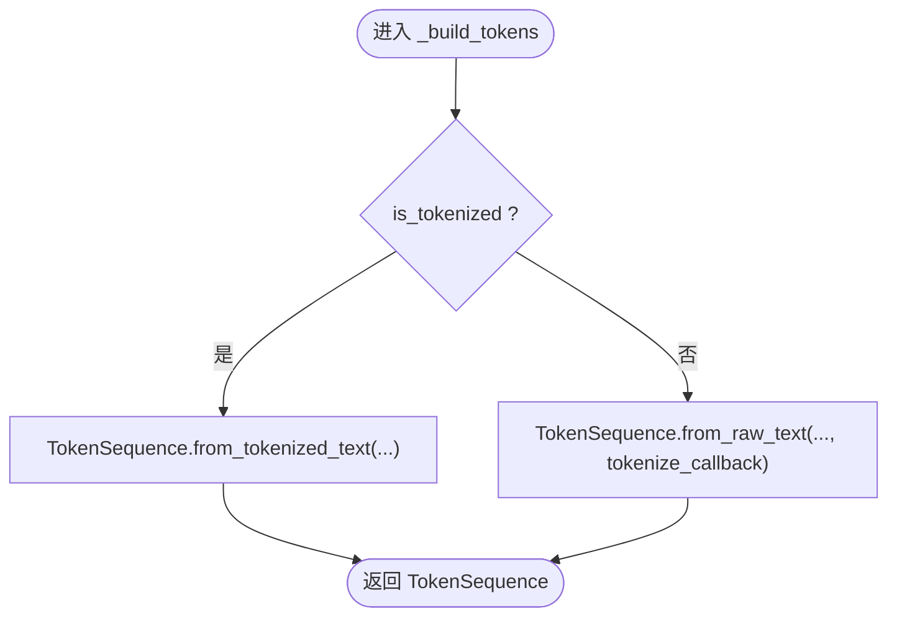
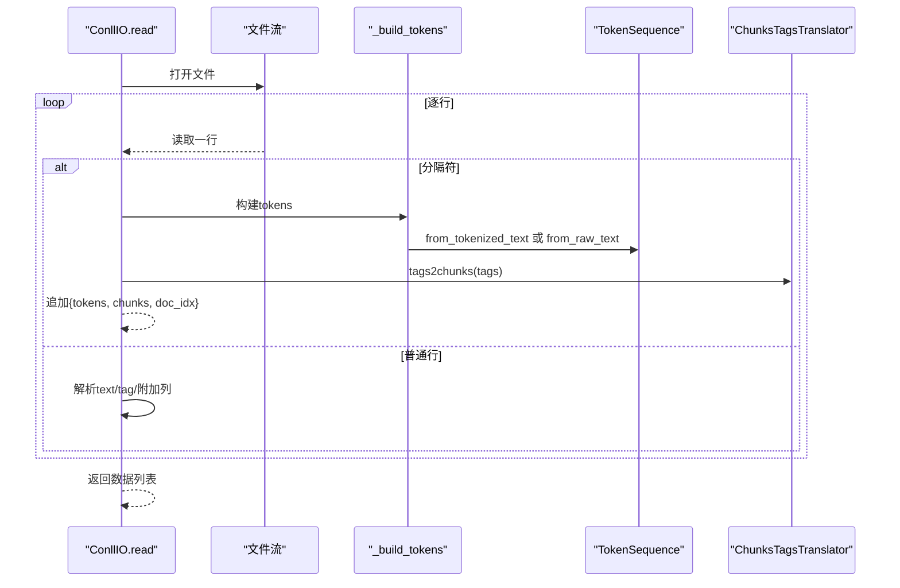
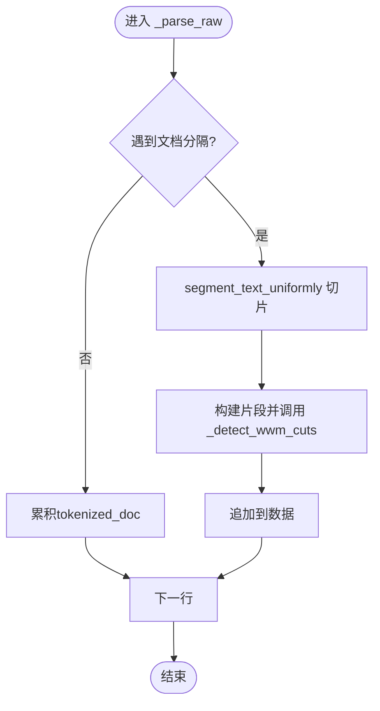
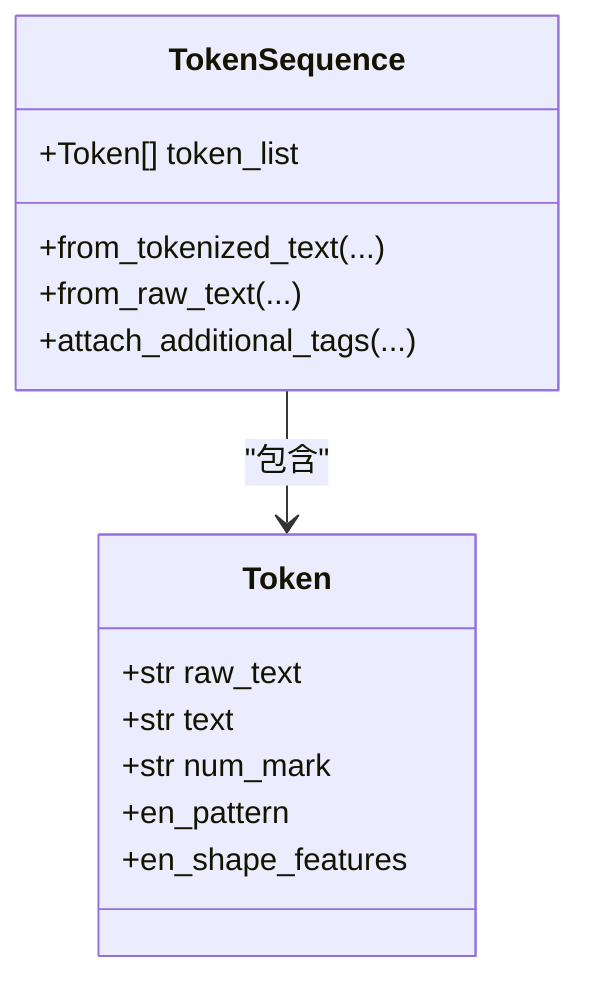
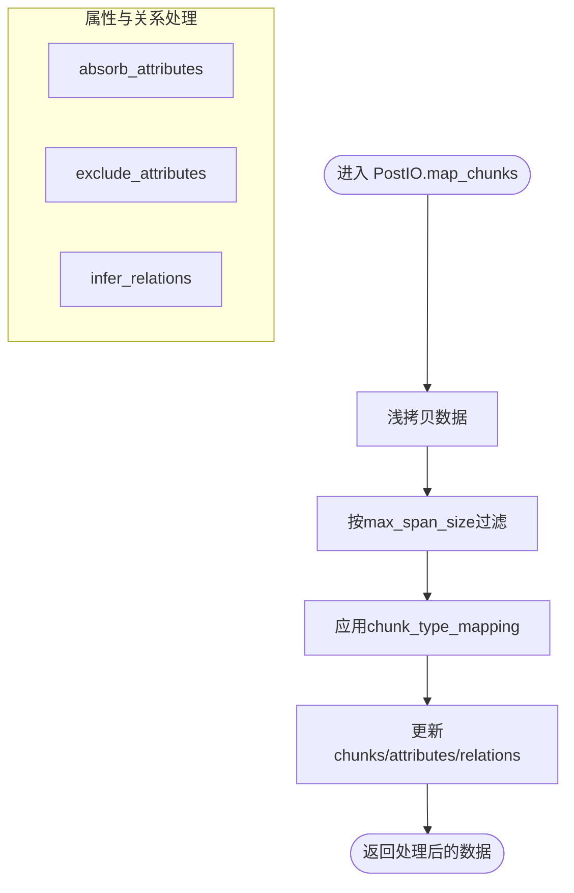
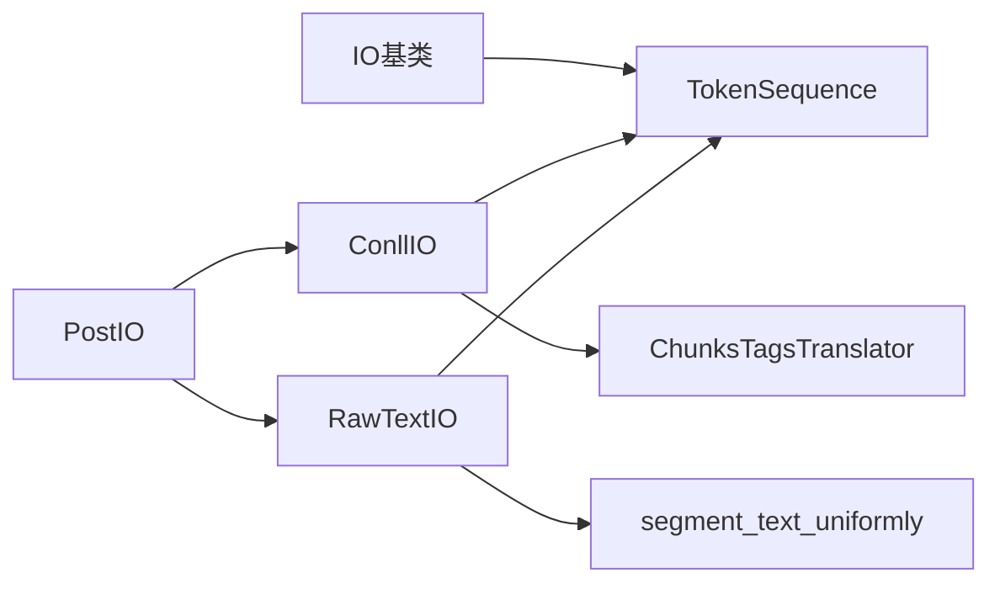

# IO处理与数据转换

<cite>
**本文引用的文件列表**
- [io/base.py](file://eznlp/io/base.py)
- [io/conll.py](file://eznlp/io/conll.py)
- [io/raw_text.py](file://eznlp/io/raw_text.py)
- [io/processing.py](file://eznlp/io/processing.py)
- [token.py](file://eznlp/token.py)
- [utils/transition.py](file://eznlp/utils/transition.py)
- [utils/segmentation.py](file://eznlp/utils/segmentation.py)
- [io/__init__.py](file://eznlp/io/__init__.py)
</cite>

## 目录
1. [引言](#引言)
2. [项目结构](#项目结构)
3. [核心组件](#核心组件)
4. [架构总览](#架构总览)
5. [详细组件分析](#详细组件分析)
6. [依赖关系分析](#依赖关系分析)
7. [性能考量](#性能考量)
8. [故障排查指南](#故障排查指南)
9. [结论](#结论)

## 引言
本文件系统性阐述eznlp中IO基类的设计架构及其在数据处理流程中的核心作用，重点覆盖：
- IO基类如何通过_tokenize_callback参数支持不同粒度的文本分词（空格分词、字符分词、jieba分词等）
- 如何通过_build_tokens方法统一处理已分词与未分词文本的TokenSequence构建
- 结合conll.py的实现，展示从CoNLL格式文件读取数据并转换为TokenSequence对象
- processing.py中提供的数据预处理工具函数（如文本归一化、大小写处理、数字标记化等）及其对模型性能的提升作用

## 项目结构
eznlp的IO层位于eznlp/io目录，围绕IO基类抽象出多种输入输出接口，包括CoNLL、原始文本、表格等。TokenSequence作为统一的序列载体，贯穿于所有IO读取与后续处理流程。

图表来源
- [io/base.py](file://eznlp/io/base.py#L1-L38)
- [io/conll.py](file://eznlp/io/conll.py#L1-L198)
- [io/raw_text.py](file://eznlp/io/raw_text.py#L1-L192)
- [io/processing.py](file://eznlp/io/processing.py#L1-L249)
- [token.py](file://eznlp/token.py#L492-L920)
- [utils/transition.py](file://eznlp/utils/transition.py#L1-L267)
- [utils/segmentation.py](file://eznlp/utils/segmentation.py#L1-L82)

章节来源
- [io/__init__.py](file://eznlp/io/__init__.py#L1-L26)

## 核心组件
- IO基类：提供统一的读取接口与_tokenized与_tokenize_callback配置，封装_token构建逻辑
- ConllIO：面向CoNLL格式文件的读取器，负责按行解析、分句/分段、标签到chunk的转换，并可将token级标注展开为字符级
- RawTextIO：面向原始文本的读取器，支持自定义分词回调、文档切分与WWM跨度检测
- TokenSequence：统一的Token容器，提供from_tokenized_text/from_raw_text两类构建路径，支持附加标签与属性
- ChunksTagsTranslator：标签体系转换器，支持BIO1/BIOES/BMES/BILOU/OntoNotes/wwm等方案
- PostIO：后处理工具集，提供类型映射、长度过滤、属性吸收/排除、关系推断等

章节来源
- [io/base.py](file://eznlp/io/base.py#L1-L38)
- [io/conll.py](file://eznlp/io/conll.py#L1-L198)
- [io/raw_text.py](file://eznlp/io/raw_text.py#L1-L192)
- [io/processing.py](file://eznlp/io/processing.py#L1-L249)
- [token.py](file://eznlp/token.py#L492-L920)
- [utils/transition.py](file://eznlp/utils/transition.py#L1-L267)

## 架构总览
IO基类通过_is_tokenized与_tokenize_callback双参数策略，将“是否已分词”的语义与“如何分词”的策略解耦：
- is_tokenized=True：直接使用TokenSequence.from_tokenized_text，输入为已分词的token列表
- is_tokenized=False：使用TokenSequence.from_raw_text，输入为原始文本，由_tokenize_callback决定分词方式

图表来源
- [io/base.py](file://eznlp/io/base.py#L1-L38)
- [io/conll.py](file://eznlp/io/conll.py#L1-L198)
- [io/raw_text.py](file://eznlp/io/raw_text.py#L1-L192)
- [token.py](file://eznlp/token.py#L736-L920)

## 详细组件分析

### IO基类设计与_token构建
- 双参数策略
  - is_tokenized=True时，禁止传入_tokenize_callback，确保输入为已分词token列表
  - is_tokenized=False时，必须提供_tokenize_callback，用于从原始文本生成TokenSequence
- 统一构建入口
  - _build_tokens根据is_tokenized分支调用TokenSequence.from_tokenized_text或from_raw_text
  - 支持额外的token_kwargs传递给TokenSequence构造过程（如附加标签、分隔符等）

图表来源
- [io/base.py](file://eznlp/io/base.py#L26-L34)
- [token.py](file://eznlp/token.py#L736-L920)

章节来源
- [io/base.py](file://eznlp/io/base.py#L1-L38)
- [token.py](file://eznlp/token.py#L736-L920)

### ConllIO：CoNLL格式读取与TokenSequence构建
- 行级解析
  - 逐行读取，支持句子/文档分隔标记，遇到分隔符即累积当前序列并调用_build_tokens
  - 支持额外列名映射，将每token的附加标签注入TokenSequence
- 标签到chunk转换
  - 使用ChunksTagsTranslator将标签序列转换为chunk三元组，支持多种scheme
- 字符级展开
  - flatten_to_characters将token级标注按字符级重复扩展，同时更新chunk边界

图表来源
- [io/conll.py](file://eznlp/io/conll.py#L69-L141)
- [utils/transition.py](file://eznlp/utils/transition.py#L167-L217)
- [token.py](file://eznlp/token.py#L736-L920)

章节来源
- [io/conll.py](file://eznlp/io/conll.py#L1-L198)
- [utils/transition.py](file://eznlp/utils/transition.py#L1-L267)
- [token.py](file://eznlp/token.py#L736-L920)

### RawTextIO：原始文本读取与分词策略
- 文档切分与片段化
  - 支持自定义文档分隔标记，按min_len阈值切分为多个片段
  - 使用segment_text_uniformly进行均匀切分，避免过长序列
- 分词回调策略
  - tokenize_callback=None：按空格拆分
  - tokenize_callback="char"：按字符拆分
  - tokenize_callback为spacy/jieba实例：按对应分词器拆分
- WWM跨度检测
  - 将分词结果映射为wwm标签，识别中文/英文/其他跨度，必要时进一步细粒度切分
  - 可选zh_tokenize_callback对中文子串进行二次切分

图表来源
- [io/raw_text.py](file://eznlp/io/raw_text.py#L100-L143)
- [utils/segmentation.py](file://eznlp/utils/segmentation.py#L69-L82)

章节来源
- [io/raw_text.py](file://eznlp/io/raw_text.py#L1-L192)
- [utils/segmentation.py](file://eznlp/utils/segmentation.py#L1-L82)

### TokenSequence：统一的Token容器与文本归一化
- 构建路径
  - from_tokenized_text：直接从token列表构建，计算每个token在原文中的起止位置
  - from_raw_text：根据_tokenize_callback选择不同策略（空格、字符、spacy、jieba）
- 文本归一化管线
  - 大小写模式：none/lower/adaptive-lower
  - 数字标记化：none/marks/zeros
  - 全角半角转换、简繁转换等
  - 支持前/后置文本归一化回调
- 附加标签与属性
  - attach_additional_tags支持将外部标签或映射表注入Token属性，便于下游任务使用

图表来源
- [token.py](file://eznlp/token.py#L365-L491)
- [token.py](file://eznlp/token.py#L492-L920)

章节来源
- [token.py](file://eznlp/token.py#L365-L920)

### processing.py：数据预处理工具函数
- 类型映射与长度过滤
  - map_chunks：对chunk/attribute/relations进行类型映射，支持按最大跨度过滤
- 属性吸收/排除
  - absorb_attributes：将指定属性类型吸收进chunk类型字段，形成复合类型
  - exclude_attributes：将chunk类型中的属性部分剥离，恢复原类型并补充新属性
- 关系推断
  - infer_relations：基于分组关系类型，自动推导跨chunk的关系组合，增强图结构完整性

图表来源
- [io/processing.py](file://eznlp/io/processing.py#L41-L249)

章节来源
- [io/processing.py](file://eznlp/io/processing.py#L1-L249)

## 依赖关系分析
- IO基类与TokenSequence
  - IO._build_tokens统一委托TokenSequence两种构建路径，保证上层无需关心底层分词细节
- ConllIO与ChunksTagsTranslator
  - ConllIO依赖translator完成标签到chunk的转换，支持多套scheme
- RawTextIO与segmentation
  - RawTextIO使用segment_text_uniformly进行片段化，避免超长序列
- processing与IO
  - PostIO可对ConllIO/RawTextIO产出的数据进行统一后处理，提升数据质量与模型鲁棒性

图表来源
- [io/base.py](file://eznlp/io/base.py#L1-L38)
- [io/conll.py](file://eznlp/io/conll.py#L1-L198)
- [io/raw_text.py](file://eznlp/io/raw_text.py#L1-L192)
- [io/processing.py](file://eznlp/io/processing.py#L1-L249)
- [utils/transition.py](file://eznlp/utils/transition.py#L1-L267)
- [utils/segmentation.py](file://eznlp/utils/segmentation.py#L1-L82)

章节来源
- [io/base.py](file://eznlp/io/base.py#L1-L38)
- [io/conll.py](file://eznlp/io/conll.py#L1-L198)
- [io/raw_text.py](file://eznlp/io/raw_text.py#L1-L192)
- [io/processing.py](file://eznlp/io/processing.py#L1-L249)
- [utils/transition.py](file://eznlp/utils/transition.py#L1-L267)
- [utils/segmentation.py](file://eznlp/utils/segmentation.py#L1-L82)

## 性能考量
- 分词策略选择
  - 空格分词适合预分词场景，速度最快
  - 字符分词适合中文或需要细粒度控制的任务，但序列更长
  - jieba/spacy分词在复杂语言处理上更优，需权衡CPU与内存
- 序列切分
  - 使用segment_text_uniformly进行均匀切分，避免过长序列导致显存不足
- 标签转换
  - 合理选择scheme（如BIOES/BMES）可减少非法转移，提高训练稳定性
- 归一化成本
  - 文本归一化（大小写、数字标记化、全角半角转换）在大规模数据上建议批量化处理

## 故障排查指南
- 分词回调无效
  - 若is_tokenized=True，请勿提供_tokenize_callback
  - 若is_tokenized=False，请确保_tokenize_callback类型正确（None、"space"、"char"、spacy、jieba）
- CoNLL标签不合法
  - 使用ChunksTagsTranslator.check_transitions_legal检查标签合法性
  - 对于BIO1，注意I标签与前序标签类型一致，必要时修正
- 数据切分异常
  - 当max_len过小且无法找到合适的断句符时，可能抛出异常
  - 建议增大max_len或调整断句策略
- 属性吸收/排除后类型错乱
  - 确认attr_sep分隔符未被误用，避免类型冲突
  - 检查吸收/排除范围是否覆盖全部目标属性

章节来源
- [io/base.py](file://eznlp/io/base.py#L1-L38)
- [io/conll.py](file://eznlp/io/conll.py#L1-L198)
- [utils/transition.py](file://eznlp/utils/transition.py#L58-L110)
- [io/processing.py](file://eznlp/io/processing.py#L133-L249)

## 结论
eznlp的IO层通过IO基类实现了“是否已分词”的语义抽象与“如何分词”的策略解耦，配合TokenSequence的统一构建与归一化能力，使得从CoNLL、原始文本等多种来源的数据能够高效、一致地转换为TokenSequence对象。在此基础上，processing.py提供了丰富的后处理工具，进一步提升数据质量与模型性能。通过合理选择分词策略、序列切分与标签scheme，可在保证精度的同时兼顾效率。