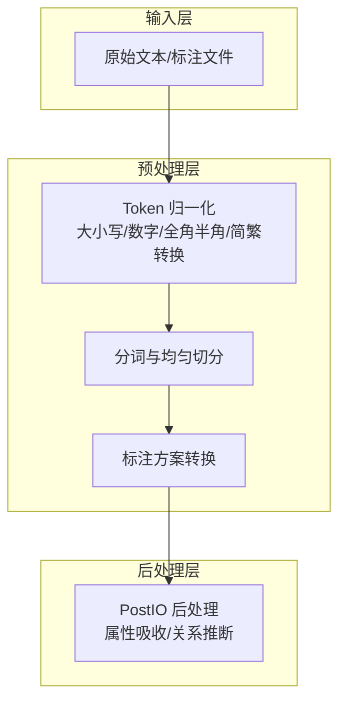
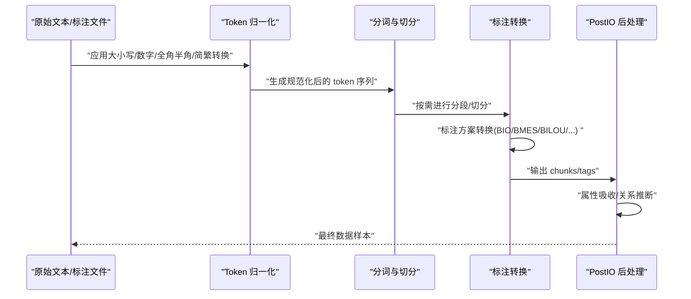
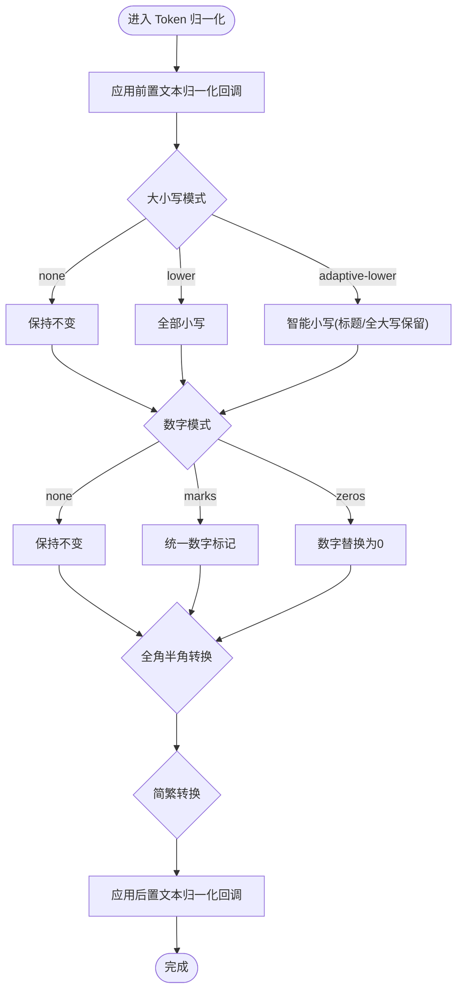
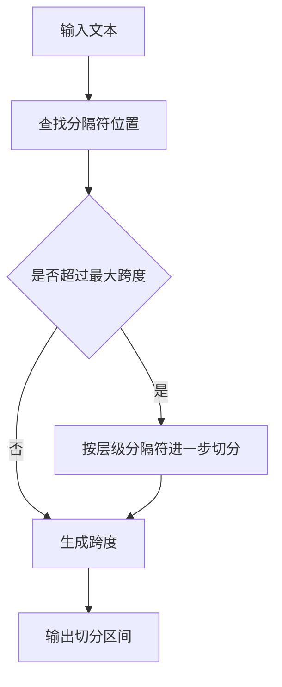
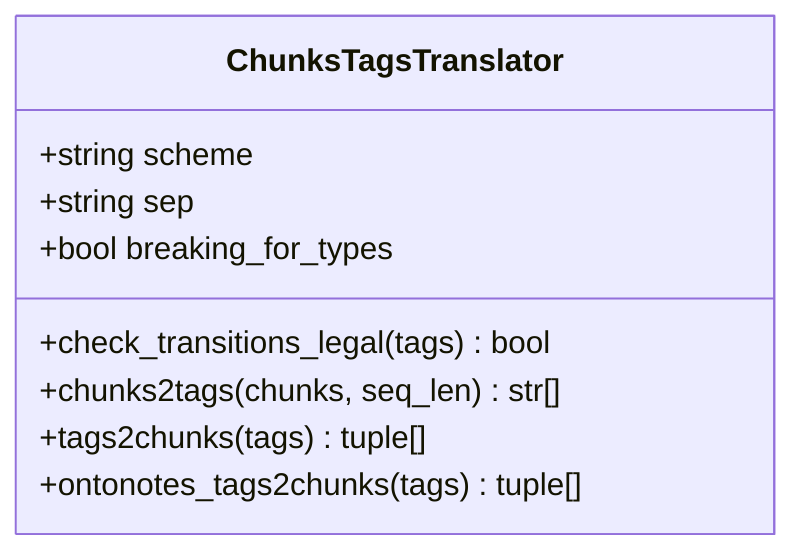
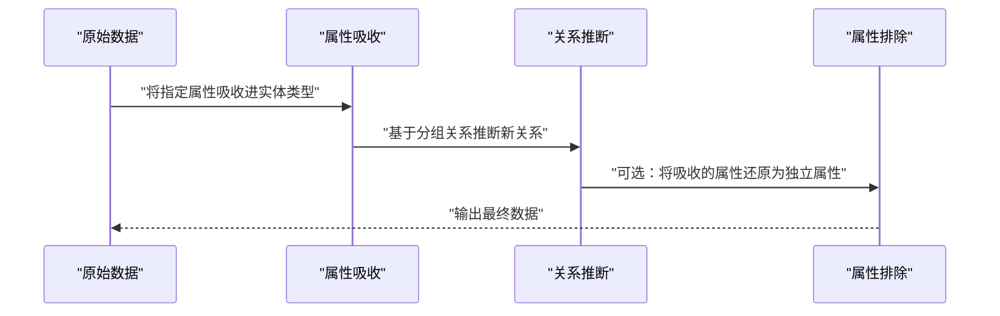
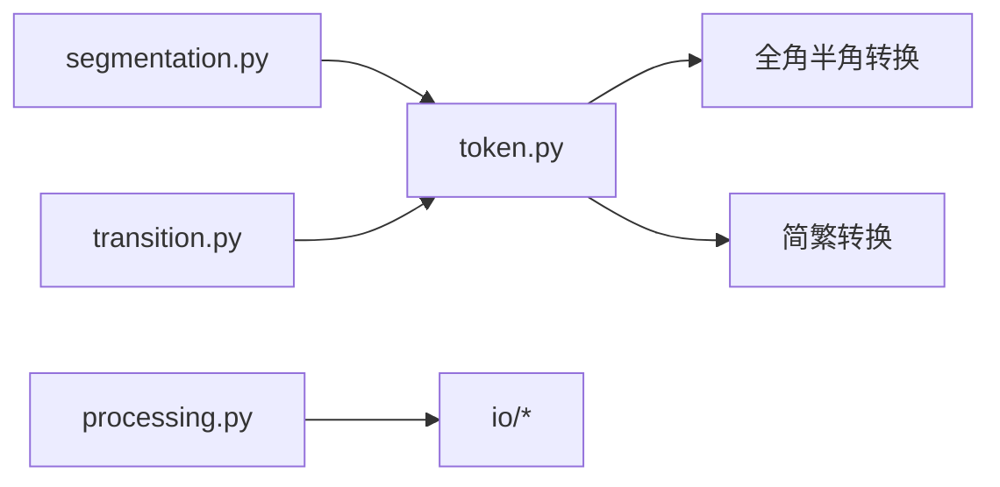

# 数据预处理工具函数

<cite>
**本文引用的文件列表**
- [processing.py](file://eznlp/io/processing.py)
- [token.py](file://eznlp/token.py)
- [segmentation.py](file://eznlp/utils/segmentation.py)
- [transition.py](file://eznlp/utils/transition.py)
- [raw_text.py](file://eznlp/io/raw_text.py)
- [conll.py](file://eznlp/io/conll.py)
- [test_processing.py](file://tests/io/test_processing.py)
- [NER任务完整流程.md](file://docs/NER任务完整流程.md)
</cite>

## 目录
1. [简介](#简介)
2. [项目结构](#项目结构)
3. [核心组件](#核心组件)
4. [架构总览](#架构总览)
5. [详细组件分析](#详细组件分析)
6. [依赖关系分析](#依赖关系分析)
7. [性能考量](#性能考量)
8. [故障排查指南](#故障排查指南)
9. [结论](#结论)
10. [附录](#附录)

## 简介
本文件聚焦于 eznlp.io.processing 模块所提供的数据预处理工具函数集合，系统梳理文本归一化、大小写转换、数字与特殊符号处理、Unicode/全角半角转换、中文简繁转换等能力，并结合 NER 任务场景说明这些预处理步骤对模型泛化能力与性能的影响。同时给出在数据加载流程中链式调用这些预处理函数的配置示例与最佳实践，帮助读者在中文与英文混合语料中取得更稳健的实体识别效果。

## 项目结构
eznlp 将数据预处理能力分布在多个模块中：
- 文本归一化与大小写/数字处理：集中在 token.py 的 Token 类与相关正则、映射表
- 分词与切分策略：segmentation.py 提供多种分段算法
- 标注体系转换：transition.py 提供 BIO/BMES/BILOU/OntoNotes 等标注方案互转
- 原始文本与 CoNLL 文件读取：raw_text.py、conll.py
- 后处理与关系推断：processing.py 的 PostIO 类（用于属性吸收、关系推断等）

**章节来源**
- [processing.py](file://eznlp/io/processing.py#L1-L249)
- [token.py](file://eznlp/token.py#L1-L920)
- [segmentation.py](file://eznlp/utils/segmentation.py#L1-L82)
- [transition.py](file://eznlp/utils/transition.py#L1-L267)
- [raw_text.py](file://eznlp/io/raw_text.py#L1-L192)
- [conll.py](file://eznlp/io/conll.py#L1-L198)

## 核心组件
本节从“文本归一化”“大小写转换”“数字与特殊符号处理”“Unicode/全角半角/简繁转换”四个维度，逐一说明 eznlp 中可用的预处理能力及其实现要点。

- 文本归一化与大小写转换
  - Token 类提供大小写模式选择：none、lower、adaptive-lower
  - adaptive-lower 在特定英文形态（如标题格式、全大写）下保留原样，避免过度小写化导致语义失真
  - 可配合停用词表与英文形态特征进行智能大小写处理
  - 参考路径：[token.py](file://eznlp/token.py#L286-L301)、[token.py](file://eznlp/token.py#L303-L308)

- 数字与特殊符号处理
  - 数字归一化模式：none、marks、zeros
  - marks：将数字序列替换为统一标记（含整数/小数/百分比/符号），提升模型对数值规模的泛化能力
  - zeros：将所有数字替换为“0”，进一步降低数值细节对模型的影响
  - 特殊符号与标点：通过正则与 Unicode 范围进行识别与处理
  - 参考路径：[token.py](file://eznlp/token.py#L313-L347)、[token.py](file://eznlp/token.py#L349-L353)

- Unicode/全角半角/简繁转换
  - 全角半角转换：Full2Half 提供全角到半角的双向转换
  - 中文简繁转换：使用 HanziConv 进行简体/繁体互转
  - 参考路径：[token.py](file://eznlp/token.py#L266-L281)、[token.py](file://eznlp/token.py#L404-L409)

- 分词与切分策略
  - segment_text_uniformly：按最大跨度或均分切分
  - segment_text_with_seps / segment_text_with_hierarchical_seps：基于分隔符的层级切分
  - 参考路径：[segmentation.py](file://eznlp/utils/segmentation.py#L1-L82)

- 标注方案转换
  - ChunksTagsTranslator：支持 BIO1/BIO2/BIOES/BMES/BILOU/OntoNotes/wwm 等方案互转
  - _token2wwm_tag：将子词前缀与字符类型映射为 wwm 标签，辅助跨语言/多语言切分
  - 参考路径：[transition.py](file://eznlp/utils/transition.py#L1-L267)

**章节来源**
- [token.py](file://eznlp/token.py#L266-L413)
- [segmentation.py](file://eznlp/utils/segmentation.py#L1-L82)
- [transition.py](file://eznlp/utils/transition.py#L1-L267)

## 架构总览
下图展示了从原始文本到标注数据的整体预处理与后处理流程，以及各模块之间的交互关系。

**图表来源**
- [token.py](file://eznlp/token.py#L365-L413)
- [segmentation.py](file://eznlp/utils/segmentation.py#L69-L82)
- [transition.py](file://eznlp/utils/transition.py#L167-L217)
- [processing.py](file://eznlp/io/processing.py#L117-L131)

**章节来源**
- [raw_text.py](file://eznlp/io/raw_text.py#L100-L143)
- [conll.py](file://eznlp/io/conll.py#L69-L141)
- [processing.py](file://eznlp/io/processing.py#L117-L131)

## 详细组件分析

### 组件A：Token 归一化与大小写/数字处理
- 设计目的
  - 通过可插拔的归一化管线，减少输入噪声，提升模型对形态变化与数值规模的鲁棒性
  - 在中文与英文混合场景中，避免大小写与全角半角差异导致的词表碎片化
- 关键实现
  - 大小写模式映射：none、lower、adaptive-lower
  - 数字归一化：none、marks、zeros
  - 全角半角/简繁转换：可选开关
  - 前置/后置文本归一化回调：允许用户自定义预处理逻辑
- 应用场景
  - 中文医学文本：统一全角标点、数字与单位，减少实体边界漂移
  - 英文缩写与专有名词：adaptive-lower 保留典型形态，避免误判
- 配置建议
  - 中文为主：case_mode="adaptive-lower"，number_mode="marks"，to_half=True，to_zh_simplified=True
  - 英文为主：case_mode="lower"，number_mode="zeros"，to_half=False
- 链式调用示例（概念性）
  - 在 Token.__init__ 中按序执行：大小写 -> 数字 -> 全角半角 -> 简繁转换 -> 用户后置归一化

**图表来源**
- [token.py](file://eznlp/token.py#L365-L413)
- [token.py](file://eznlp/token.py#L303-L308)
- [token.py](file://eznlp/token.py#L349-L353)

**章节来源**
- [token.py](file://eznlp/token.py#L286-L413)

### 组件B：分词与切分策略
- 设计目的
  - 在长文本与跨语言场景中，将输入切分为适合模型的最大跨度片段，兼顾上下文完整性与内存效率
- 关键实现
  - segment_text_uniformly：按最大跨度均分，保证覆盖全文
  - segment_text_with_seps / segment_text_with_hierarchical_seps：基于分隔符的层级切分，优先满足句末/段落边界
- 应用场景
  - 中文医学报告：按句号/问号/感叹号等断句，再按最大跨度切分
  - 英文段落：按句末标点切分，避免截断关键实体边界
- 配置建议
  - max_span_size：根据模型最大序列长度设置
  - sentence_sep_starts：在 ConllIO 中可配置句子/文档分隔标记

**图表来源**
- [segmentation.py](file://eznlp/utils/segmentation.py#L1-L82)
- [conll.py](file://eznlp/io/conll.py#L143-L160)

**章节来源**
- [segmentation.py](file://eznlp/utils/segmentation.py#L1-L82)
- [conll.py](file://eznlp/io/conll.py#L143-L160)

### 组件C：标注方案转换与标签合法性校验
- 设计目的
  - 在不同标注体系之间进行互转，确保模型训练与推理的一致性
  - 标签合法性校验，避免非法转移引发的边界错误
- 关键实现
  - ChunksTagsTranslator：支持多种标注方案，内置转移规则表
  - tags2chunks / chunks2tags：双向转换
  - check_transitions_legal：对相邻标签转移进行合法性检查
- 应用场景
  - 多数据源标注：统一为模型期望的 BIOES/BMES/BILOU
  - 标注质量控制：提前发现非法转移，减少训练阶段的异常

**图表来源**
- [transition.py](file://eznlp/utils/transition.py#L1-L267)

**章节来源**
- [transition.py](file://eznlp/utils/transition.py#L1-L267)

### 组件D：PostIO 后处理（属性吸收/关系推断）
- 设计目的
  - 对 IO 输出的 chunks/attributes/relations 进行后处理，提升标注一致性与完整性
- 关键实现
  - absorb_attributes：将指定属性类型“吸收”进 chunk 类型，减少属性冗余
  - exclude_attributes：将吸收后的属性还原回独立属性，便于回溯
  - infer_relations：基于分组关系推断新的关系边，增强语义连通性
- 应用场景
  - 医学标注：将“未确认/否定”等属性合并到实体类型，或在评估时还原
  - 关系抽取：通过分组关系推断隐含的共指/组合关系

**图表来源**
- [processing.py](file://eznlp/io/processing.py#L133-L185)
- [processing.py](file://eznlp/io/processing.py#L187-L249)

**章节来源**
- [processing.py](file://eznlp/io/processing.py#L133-L185)
- [processing.py](file://eznlp/io/processing.py#L187-L249)

## 依赖关系分析
- 模块耦合
  - Token 与 Full2Half、hanziconv 存在直接依赖，体现“文本归一化”的集中式设计
  - 分段策略与标注转换相互独立，但都服务于“输入切分与标注一致性”
  - PostIO 依赖于 IO 输出的结构（chunks/attributes/relations），强调“后处理”的可插拔性
- 外部依赖
  - 正则表达式、pandas、numpy、hanziconv、spacy、jieba 等库
- 循环依赖
  - 未见循环导入；模块职责清晰，接口稳定

**图表来源**
- [token.py](file://eznlp/token.py#L266-L413)
- [segmentation.py](file://eznlp/utils/segmentation.py#L1-L82)
- [transition.py](file://eznlp/utils/transition.py#L1-L267)
- [processing.py](file://eznlp/io/processing.py#L117-L131)

**章节来源**
- [token.py](file://eznlp/token.py#L266-L413)
- [segmentation.py](file://eznlp/utils/segmentation.py#L1-L82)
- [transition.py](file://eznlp/utils/transition.py#L1-L267)
- [processing.py](file://eznlp/io/processing.py#L117-L131)

## 性能考量
- 计算复杂度
  - Token 归一化：线性时间，受文本长度与正则匹配次数影响
  - 分段算法：segment_text_uniformly 为 O(n)，segment_text_with_seps 为 O(n + m)，m 为分隔符数量
  - 标注转换：chunks2tags/tags2chunks 为 O(n)，受实体数量与标签长度影响
  - PostIO：map_chunks/map_attributes/map_relations 为 O(N*C)，N 为样本数，C 为实体/属性/关系数量
- 内存占用
  - 大文本切分时，建议设置合理的 max_span_size，避免单次切分过大
  - 标注转换过程中会生成中间标签序列，注意及时释放不再使用的对象
- 并行化
  - IO 层面可并行读取与解析，预处理阶段可考虑多进程分批处理

[本节为通用性能讨论，不直接分析具体代码文件]

## 故障排查指南
- 常见问题
  - 标注非法转移导致实体边界异常：使用 ChunksTagsTranslator.check_transitions_legal 进行检测
  - 中文全角标点导致切分不一致：启用 Full2Half 与 to_zh_simplified
  - 英文大小写影响实体识别：根据领域选择 adaptive-lower 或 lower
  - 属性冗余影响评估：使用 PostIO.absorb_attributes 吸收属性，或使用 exclude_attributes 还原
- 测试验证
  - 单元测试覆盖了属性吸收与关系推断的基本行为，可作为回归测试参考
  - 参考路径：[test_processing.py](file://tests/io/test_processing.py#L1-L88)

**章节来源**
- [test_processing.py](file://tests/io/test_processing.py#L1-L88)
- [transition.py](file://eznlp/utils/transition.py#L58-L70)

## 结论
eznlp 的数据预处理工具以 Token 归一化为核心，辅以分段、标注转换与 PostIO 后处理，形成一套面向中文与英文混合场景的稳健预处理流水线。通过合理配置大小写/数字/全角半角/简繁转换等策略，可在 NER 任务中显著提升模型对形态变化与数值规模的泛化能力；结合 PostIO 的属性吸收与关系推断，能够进一步提升标注一致性与下游任务的稳定性。

[本节为总结性内容，不直接分析具体代码文件]

## 附录

### 配置示例：在数据加载流程中链式调用预处理函数
- 中文医学文本（推荐配置）
  - 大小写：adaptive-lower（保留标题/全大写形态）
  - 数字：marks（统一为占位符，增强泛化）
  - 全角半角：开启（统一标点与数字显示）
  - 简繁转换：开启（统一简体）
  - 参考路径：[token.py](file://eznlp/token.py#L365-L413)
- 英文新闻文本（推荐配置）
  - 大小写：lower（统一为小写）
  - 数字：zeros（消除数值细节）
  - 全角半角：关闭（保留原文）
  - 简繁转换：关闭（英文无需简繁）
  - 参考路径：[token.py](file://eznlp/token.py#L365-L413)
- 数据切分与标注转换
  - 使用 segment_text_uniformly 控制最大跨度
  - 使用 ChunksTagsTranslator 将标注统一为 BIOES/BMES/BILOU
  - 参考路径：[segmentation.py](file://eznlp/utils/segmentation.py#L69-L82)、[transition.py](file://eznlp/utils/transition.py#L167-L217)
- 后处理（可选）
  - 属性吸收：将“未确认/否定”等属性合并到实体类型
  - 关系推断：基于分组关系推断隐含关系
  - 参考路径：[processing.py](file://eznlp/io/processing.py#L133-L185)、[processing.py](file://eznlp/io/processing.py#L187-L249)

**章节来源**
- [token.py](file://eznlp/token.py#L365-L413)
- [segmentation.py](file://eznlp/utils/segmentation.py#L69-L82)
- [transition.py](file://eznlp/utils/transition.py#L167-L217)
- [processing.py](file://eznlp/io/processing.py#L133-L185)
- [processing.py](file://eznlp/io/processing.py#L187-L249)