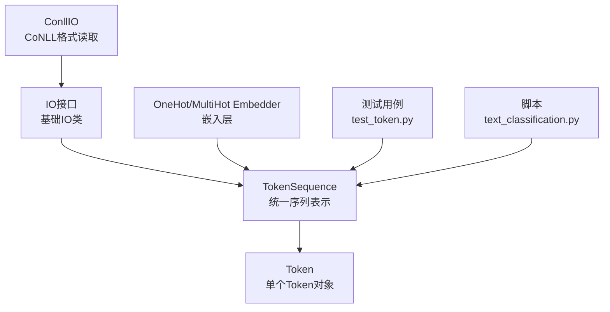
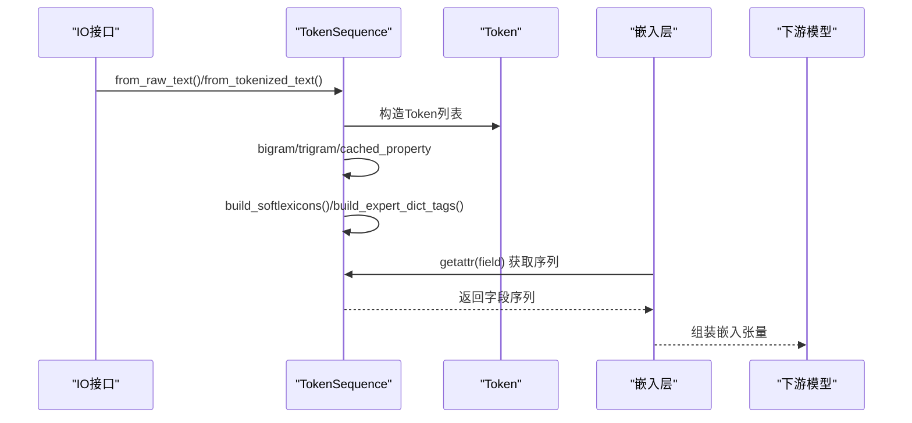
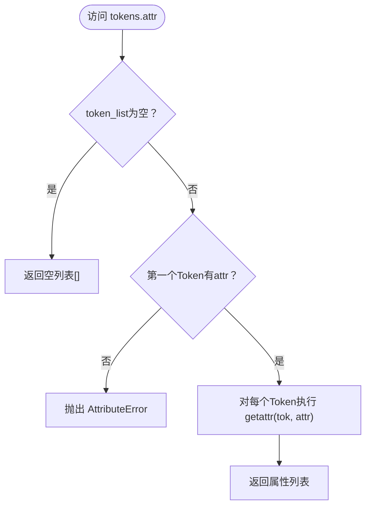
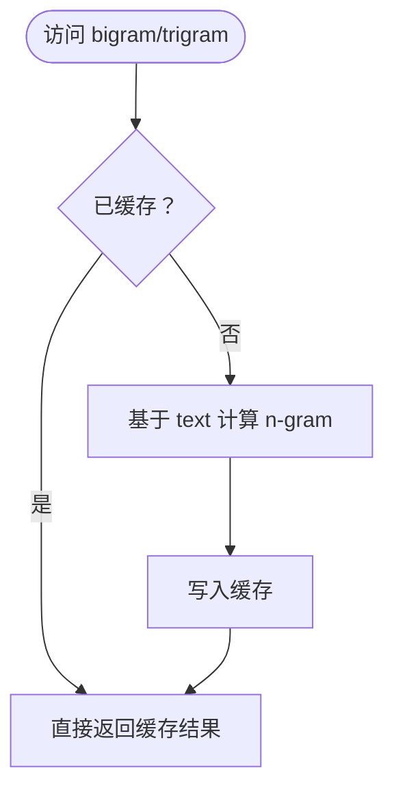
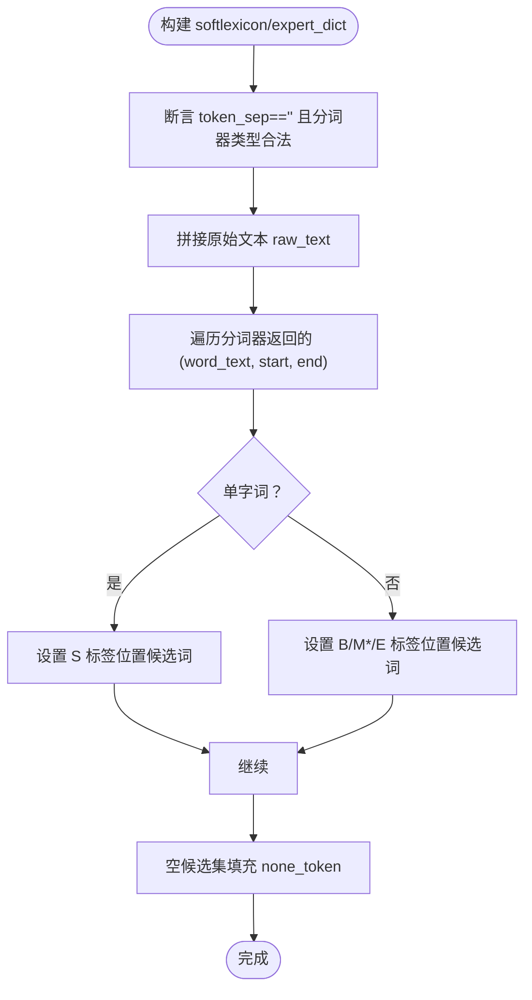
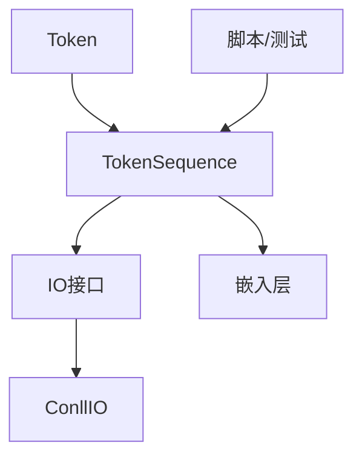

# TokenSequence数据结构

<cite>
**本文引用的文件**
- [token.py](file://eznlp/token.py)
- [base.py](file://eznlp/io/base.py)
- [conll.py](file://eznlp/io/conll.py)
- [embedder.py](file://eznlp/model/embedder.py)
- [test_token.py](file://tests/test_token.py)
- [text_classification.py](file://scripts/text_classification.py)
</cite>

## 目录
1. [引言](#引言)
2. [项目结构](#项目结构)
3. [核心组件](#核心组件)
4. [架构总览](#架构总览)
5. [详细组件分析](#详细组件分析)
6. [依赖分析](#依赖分析)
7. [性能考虑](#性能考虑)
8. [故障排查指南](#故障排查指南)
9. [结论](#结论)
10. [附录](#附录)

## 引言
本文件系统性解析eznlp框架中的TokenSequence类，阐明其作为统一数据表示的核心作用，并深入说明以下要点：
- 如何通过__getattr__魔法方法实现对Token列表属性的序列化访问；
- 如何通过cached_property实现bigram/trigram等特征的惰性计算；
- 结合测试用例展示TokenSequence的创建、切片、拼接等操作；
- 在中文NER任务中如何支持softlexicon与expert_dict等特殊字段的构建；
- 与Token类的协作关系及在数据预处理流程中的关键地位。

## 项目结构
TokenSequence位于eznlp/token.py中，是框架内统一的数据载体，贯穿IO层、嵌入层、模型层与评测脚本。下图给出与之相关的关键模块关系概览。

图表来源
- [token.py](file://eznlp/token.py#L492-L920)
- [base.py](file://eznlp/io/base.py#L1-L38)
- [conll.py](file://eznlp/io/conll.py#L160-L198)
- [embedder.py](file://eznlp/model/embedder.py#L100-L130)
- [test_token.py](file://tests/test_token.py#L228-L340)
- [text_classification.py](file://scripts/text_classification.py#L190-L205)

章节来源
- [token.py](file://eznlp/token.py#L492-L920)
- [base.py](file://eznlp/io/base.py#L1-L38)

## 核心组件
- TokenSequence：封装Token列表，提供统一的序列属性访问、切片、拼接、序列化、边界重建、软词典与专家词典构建、n-gram特征等能力。
- Token：单个Token对象，提供基础文本归一化、前缀/后缀、数字标记、英文形态特征等属性，供TokenSequence批量访问。
- IO接口：负责从原始文本或已分词文本构建TokenSequence，贯穿数据加载流程。
- 嵌入层：通过getattr(tokens, field)直接从TokenSequence上获取字段序列，用于one-hot/multi-hot嵌入。
- 测试与脚本：验证TokenSequence行为、演示拼接与拼装流程。

章节来源
- [token.py](file://eznlp/token.py#L365-L491)
- [token.py](file://eznlp/token.py#L492-L920)
- [base.py](file://eznlp/io/base.py#L1-L38)
- [embedder.py](file://eznlp/model/embedder.py#L100-L130)
- [test_token.py](file://tests/test_token.py#L228-L340)
- [text_classification.py](file://scripts/text_classification.py#L190-L205)

## 架构总览
TokenSequence在eznlp中的位置如下：
- 数据输入阶段：IO接口根据是否已分词调用TokenSequence.from_raw_text或TokenSequence.from_tokenized_text生成统一序列表示；
- 特征构建阶段：TokenSequence提供bigram/trigram、softlexicon、expert_dict等特征；
- 模型接入阶段：嵌入层通过getattr动态访问TokenSequence上的字段序列；
- 输出阶段：可将TokenSequence还原为原始文本或字符级展开。

图表来源
- [base.py](file://eznlp/io/base.py#L26-L35)
- [token.py](file://eznlp/token.py#L737-L920)
- [embedder.py](file://eznlp/model/embedder.py#L100-L130)

## 详细组件分析

### TokenSequence类设计与职责
- 统一序列表示：持有token_list并维护token_sep/pad_token/none_token等上下文参数；
- 序列化访问：通过__getattr__对Token列表属性进行批量访问；
- 切片与拼接：__getitem__返回新的TokenSequence；__add__合并两个TokenSequence；
- 边界重建：build_pseudo_boundaries基于token长度与分隔符重建start/end；
- 软词典与专家词典：build_softlexicons/build_expert_dict_tags按BMES粒度记录候选词集合；
- n-gram特征：bigram/trigram通过cached_property惰性计算并缓存；
- 反序列化：__getstate__/__setstate__支持pickle序列化；
- 文本还原：to_raw_text根据start/end或token_sep还原原始文本。

章节来源
- [token.py](file://eznlp/token.py#L492-L736)
- [token.py](file://eznlp/token.py#L737-L920)

### __getattr__魔法方法：序列化属性访问
- 当访问TokenSequence未显式定义的属性时，若Token列表非空且首个Token存在同名属性，则返回由各Token对应属性组成的列表；
- 否则抛出AttributeError；
- 这使得开发者可以直接通过tokens.field_name获取整句字段序列，无需手动遍历。

图表来源
- [token.py](file://eznlp/token.py#L511-L523)

章节来源
- [token.py](file://eznlp/token.py#L511-L523)

### cached_property：bigram/trigram惰性计算
- bigram：以text为基准，相邻两元组拼接，末尾补pad_token；
- trigram：以text为基准，三元组拼接，末尾补pad_token两次；
- 使用cached_property避免重复计算，提升多次访问同一特征时的性能。

图表来源
- [token.py](file://eznlp/token.py#L673-L691)

章节来源
- [token.py](file://eznlp/token.py#L673-L691)

### 创建、切片与拼接
- 创建：from_raw_text支持多种分词回调（空格、字符、spaCy、jieba.tokenize/cut），from_tokenized_text从已分词列表构造；
- 切片：__getitem__支持整数索引与slice切片，返回新的TokenSequence；
- 拼接：__add__要求两个TokenSequence的上下文参数一致，返回拼接后的TokenSequence。

章节来源
- [token.py](file://eznlp/token.py#L737-L847)
- [token.py](file://eznlp/token.py#L550-L562)

### 中文NER中的softlexicon与expert_dict
- softlexicon：按BMES粒度记录每个token位置可能的候选词集合，空集填充none_token；
- expert_dict：与softlexicon类似，但面向领域专家词典，便于在序列标注中引入外部知识；
- 构建前置条件：token_sep需为空串，且分词器必须来自jieba.Tokenizer或LexiconTokenizer，并以tokenize命名；
- 测试用例验证了softlexicon的正确性与none_token填充逻辑。

图表来源
- [token.py](file://eznlp/token.py#L581-L672)
- [token.py](file://eznlp/token.py#L630-L672)
- [test_token.py](file://tests/test_token.py#L278-L323)

章节来源
- [token.py](file://eznlp/token.py#L581-L672)
- [token.py](file://eznlp/token.py#L630-L672)
- [test_token.py](file://tests/test_token.py#L278-L323)

### 与Token类的协作关系
- Token提供基础属性（如text/raw_text、prefix/suffix、num_mark、en_pattern、en_shape_features等），TokenSequence通过__getattr__批量获取这些属性；
- TokenSequence在from_raw_text/from_tokenized_text中为Token注入start/end等边界信息，便于后续边界重建与字符级展开；
- 嵌入层通过getattr(tokens, field)直接访问TokenSequence上的字段序列，实现解耦与复用。

章节来源
- [token.py](file://eznlp/token.py#L365-L491)
- [token.py](file://eznlp/token.py#L737-L920)
- [embedder.py](file://eznlp/model/embedder.py#L100-L130)

### 在数据预处理流程中的关键地位
- IO层：ConllIO在读取CoNLL文件后，通过_base.py中的_build_tokens生成TokenSequence，并支持将token级标签扩展到字符级；
- 脚本：text_classification.py演示了将两个TokenSequence拼接为一对多输入（如BERT的[SEP]连接）；
- 测试：test_token.py覆盖了TokenSequence的创建、切片、拼接、n-gram、softlexicon等关键行为。

章节来源
- [base.py](file://eznlp/io/base.py#L26-L35)
- [conll.py](file://eznlp/io/conll.py#L160-L198)
- [text_classification.py](file://scripts/text_classification.py#L190-L205)
- [test_token.py](file://tests/test_token.py#L228-L340)

## 依赖分析
- TokenSequence依赖Token类提供的属性与形态特征；
- IO接口依赖TokenSequence的工厂方法；
- 嵌入层依赖TokenSequence的动态属性访问；
- 测试与脚本依赖TokenSequence的创建、切片、拼接与特征构建。

图表来源
- [token.py](file://eznlp/token.py#L365-L491)
- [token.py](file://eznlp/token.py#L492-L920)
- [base.py](file://eznlp/io/base.py#L1-L38)
- [embedder.py](file://eznlp/model/embedder.py#L100-L130)
- [conll.py](file://eznlp/io/conll.py#L160-L198)
- [text_classification.py](file://scripts/text_classification.py#L190-L205)
- [test_token.py](file://tests/test_token.py#L228-L340)

## 性能考虑
- cached_property用于bigram/trigram等特征的惰性计算，避免重复计算，适合多次访问同一特征的场景；
- __getattr__批量访问Token属性时，列表推导的开销与Token数量线性相关，建议在大规模数据上谨慎使用；
- softlexicon/expert_dict构建涉及分词器迭代与候选集填充，注意分词器类型与max_len设置；
- to_raw_text在存在start/end时按间隔重建文本，避免多余字符串拼接。

[本节为通用指导，不直接分析具体文件]

## 故障排查指南
- AttributeError：当访问不存在的属性时会抛出异常，检查字段名是否存在于Token上；
- 断言失败：build_softlexicons/build_expert_dict_tags要求token_sep为空且分词器类型合法，确保传入正确的分词器；
- 拼接错误：__add__要求两个TokenSequence的上下文参数一致，否则会断言失败；
- n-gram异常：确认token_sep与pad_token设置合理，避免边界拼接异常。

章节来源
- [token.py](file://eznlp/token.py#L511-L523)
- [token.py](file://eznlp/token.py#L581-L600)
- [token.py](file://eznlp/token.py#L558-L562)

## 结论
TokenSequence作为eznlp框架的统一数据表示，通过__getattr__实现了对Token列表属性的序列化访问，借助cached_property优化了bigram/trigram等特征的计算效率；在中文NER任务中，softlexicon与expert_dict等特殊字段的构建进一步增强了模型对领域知识的利用。其与Token类紧密协作，并贯穿IO、嵌入与模型层，是数据预处理与下游建模的关键枢纽。

[本节为总结性内容，不直接分析具体文件]

## 附录
- 示例参考路径（不展示具体代码）：
  - TokenSequence创建与n-gram：参见测试用例路径[file://tests/test_token.py#L244-L277]
  - softlexicon构建与断言：参见测试用例路径[file://tests/test_token.py#L278-L323]
  - TokenSequence拼接：参见脚本路径[file://scripts/text_classification.py#L190-L205]
  - IO层构建TokenSequence：参见IO基类路径[file://eznlp/io/base.py#L26-L35]
  - 字符级展开与字段序列访问：参见CoNLL处理路径[file://eznlp/io/conll.py#L160-L198]与嵌入层路径[file://eznlp/model/embedder.py#L100-L130]