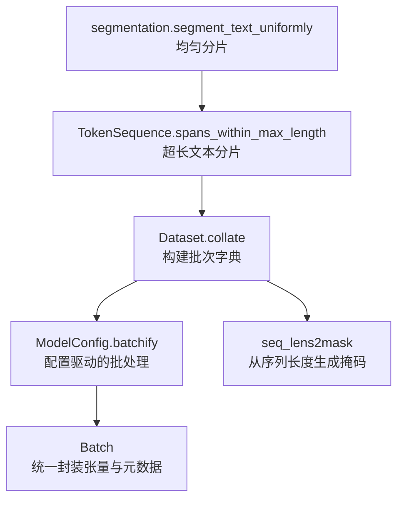
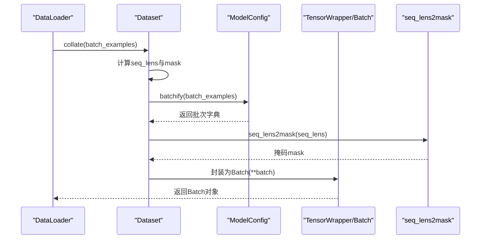
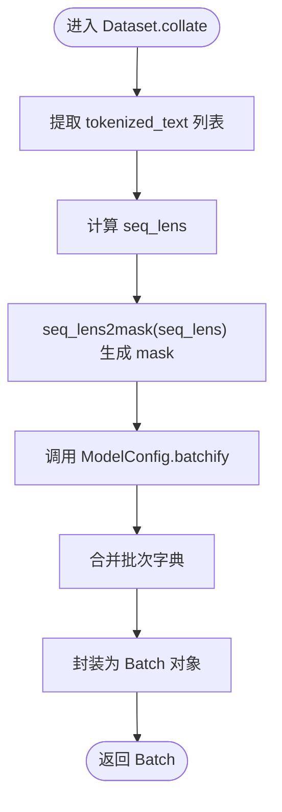
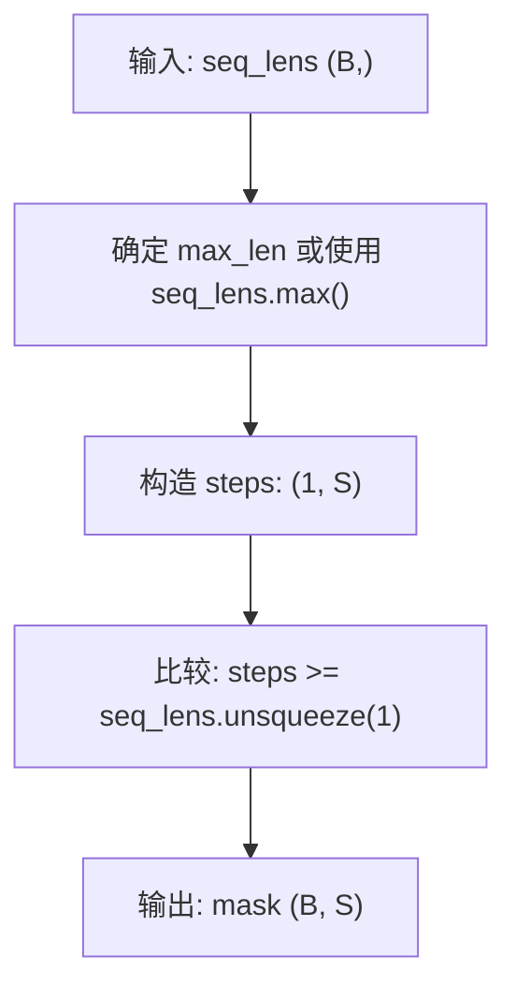
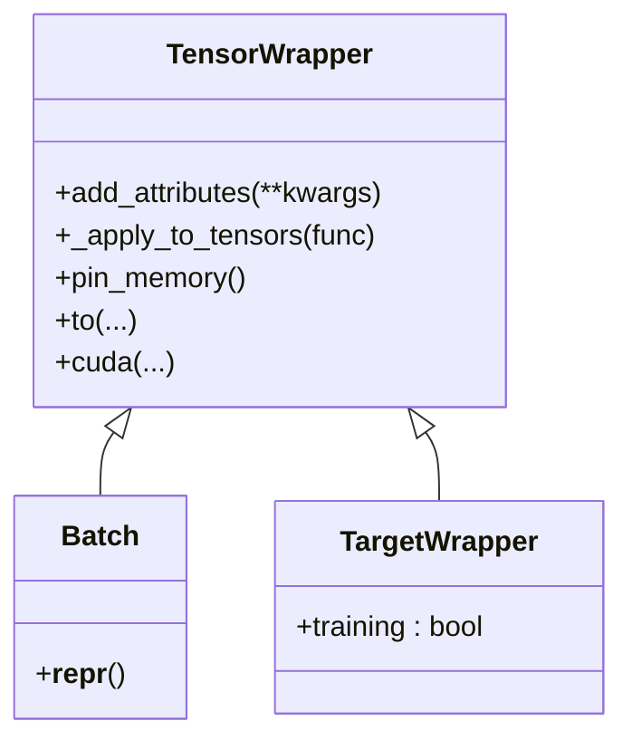
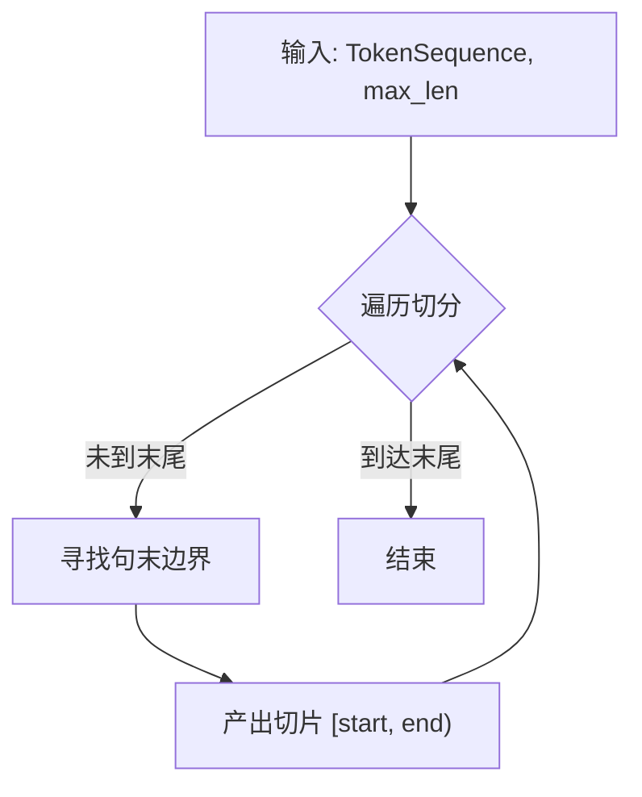
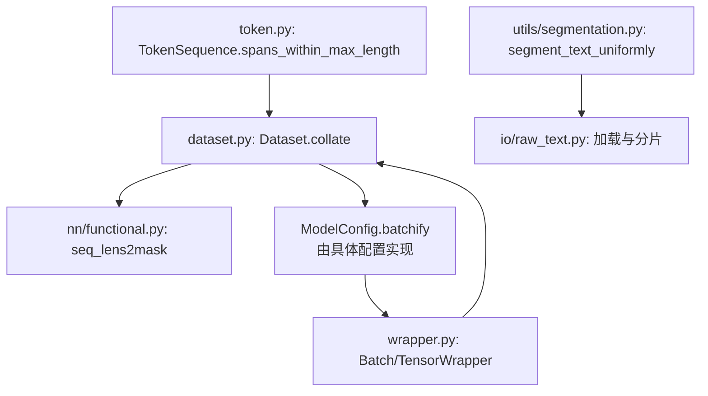

# 批处理组织与张量对齐

<cite>
**本文引用的文件**
- [wrapper.py](file://eznlp/wrapper.py)
- [dataset.py](file://eznlp/dataset.py)
- [functional.py](file://eznlp/nn/functional.py)
- [token.py](file://eznlp/token.py)
- [segmentation.py](file://eznlp/utils/segmentation.py)
- [raw_text.py](file://eznlp/io/raw_text.py)
- [test_dataset.py](file://tests/test_dataset.py)
- [test_functional.py](file://tests/nn/test_functional.py)
- [test_chunk.py](file://tests/utils/test_chunk.py)
- [test_segmentation.py](file://tests/utils/test_segmentation.py)
</cite>

## 目录
1. [引言](#引言)
2. [项目结构](#项目结构)
3. [核心组件](#核心组件)
4. [架构总览](#架构总览)
5. [详细组件分析](#详细组件分析)
6. [依赖关系分析](#依赖关系分析)
7. [性能考量](#性能考量)
8. [故障排查指南](#故障排查指南)
9. [结论](#结论)

## 引言
本文件围绕批处理组织与张量对齐展开，重点解析以下内容：
- collate 方法如何将多个数值化样本组织为批处理张量；
- wrapper.py 中的 batchify 函数在配置类中的实现逻辑；
- 序列填充（padding）策略如何依据最大序列长度对齐 token_ids、mask 等变长张量；
- 如何基于序列长度生成有效的注意力掩码（attention mask）；
- Batch 类作为 TensorWrapper 子类的封装机制，如何统一管理批处理中的各类张量与元数据；
- 结合 dropout.py 中的 seq_lens2mask 实现，说明掩码张量在防止信息泄露中的作用；
- 针对超长文档的分片（spans_within_max_length）策略在批处理优化中的应用。

## 项目结构
本仓库采用模块化设计，批处理相关的关键路径如下：
- 数据集与批处理入口：dataset.py 的 Dataset.collate
- 批处理封装：wrapper.py 的 TensorWrapper/Batch
- 掩码工具：nn/functional.py 的 seq_lens2mask/mask2seq_lens
- 文本分片策略：utils/segmentation.py 与 token.py 的 spans_within_max_length
- 示例与验证：tests 下的单元测试

图表来源
- [dataset.py](file://eznlp/dataset.py#L104-L115)
- [wrapper.py](file://eznlp/wrapper.py#L97-L121)
- [functional.py](file://eznlp/nn/functional.py#L4-L21)
- [token.py](file://eznlp/token.py#L693-L711)
- [segmentation.py](file://eznlp/utils/segmentation.py#L69-L81)

章节来源
- [dataset.py](file://eznlp/dataset.py#L104-L115)
- [wrapper.py](file://eznlp/wrapper.py#L97-L121)
- [functional.py](file://eznlp/nn/functional.py#L4-L21)
- [token.py](file://eznlp/token.py#L693-L711)
- [segmentation.py](file://eznlp/utils/segmentation.py#L69-L81)

## 核心组件
- TensorWrapper/Batch：统一管理批内张量与元数据，提供 to/cuda/pin_memory 等通用操作。
- Dataset.collate：从样本列表构造批次字典，计算序列长度与掩码，并调用配置的 batchify。
- ModelConfig.batchify：由具体模型配置实现，负责将示例级字段批量化（如 one-hot、multi-hot、标签等）。
- seq_lens2mask/mask2seq_lens：序列长度与掩码之间的双向转换，用于注意力掩码与池化等场景。
- TokenSequence.spans_within_max_length：面向超长文档的分片策略，确保切分点落在句末等语义边界。
- segmentation.segment_text_uniformly：均匀分片辅助工具，常用于预处理阶段。

章节来源
- [wrapper.py](file://eznlp/wrapper.py#L39-L121)
- [dataset.py](file://eznlp/dataset.py#L104-L115)
- [functional.py](file://eznlp/nn/functional.py#L4-L21)
- [token.py](file://eznlp/token.py#L693-L711)
- [segmentation.py](file://eznlp/utils/segmentation.py#L69-L81)

## 架构总览
下图展示了从数据加载到模型输入的整体流程，强调 collate 与 batchify 的协作关系，以及掩码生成与张量封装的关键节点。

图表来源
- [dataset.py](file://eznlp/dataset.py#L104-L115)
- [wrapper.py](file://eznlp/wrapper.py#L97-L121)
- [functional.py](file://eznlp/nn/functional.py#L4-L21)

## 详细组件分析

### 组件一：collate 与 batchify 的协作
- Dataset.collate 负责：
  - 从样本中提取 tokenized_text 并统计每条序列长度 seq_lens；
  - 基于 seq_lens 生成布尔掩码 mask；
  - 调用配置的 batchify，将示例级字段批量化；
  - 最终封装为 Batch 对象返回。
- ModelConfig.batchify（由具体配置实现）负责：
  - 将 one-hot/multi-hot 等嵌入特征批量化；
  - 将标签、块、关系等结构化字段按批次维度组织；
  - 在重分词场景下更新 mask 与 seq_lens。

图表来源
- [dataset.py](file://eznlp/dataset.py#L104-L115)
- [functional.py](file://eznlp/nn/functional.py#L4-L21)
- [wrapper.py](file://eznlp/wrapper.py#L97-L121)

章节来源
- [dataset.py](file://eznlp/dataset.py#L104-L115)
- [test_dataset.py](file://tests/test_dataset.py#L1-L53)

### 组件二：掩码生成与注意力掩码
- seq_lens2mask 将每个样本的有效长度转换为布尔掩码，掩码为 True 的位置代表需要屏蔽的位置；
- mask2seq_lens 可逆地从掩码恢复序列长度；
- 在注意力机制中，掩码通常用于阻止模型关注填充位置，避免信息泄露。

图表来源
- [functional.py](file://eznlp/nn/functional.py#L4-L21)

章节来源
- [functional.py](file://eznlp/nn/functional.py#L4-L21)
- [test_functional.py](file://tests/nn/test_functional.py#L1-L19)

### 组件三：Batch 封装与张量迁移
- Batch 继承自 TensorWrapper，提供统一的张量操作接口（to/cuda/pin_memory），并对内部所有张量递归应用；
- 这保证了在 GPU/CPU 设备切换与内存固定（pin memory）时的一致性。

图表来源
- [wrapper.py](file://eznlp/wrapper.py#L39-L121)

章节来源
- [wrapper.py](file://eznlp/wrapper.py#L39-L121)
- [test_dataset.py](file://tests/test_dataset.py#L1-L53)

### 组件四：超长文档分片策略
- TokenSequence.spans_within_max_length 提供面向超长文档的分片迭代器，确保切分点落在句末等语义边界，避免截断句子；
- utils/segmentation.segment_text_uniformly 提供均匀分片策略，常用于预处理阶段；
- io/raw_text.py 在加载原始文本时，利用均匀分片将长文档切分为不超过 max_len 的片段，再进行后续 tokenization。

图表来源
- [token.py](file://eznlp/token.py#L693-L711)
- [segmentation.py](file://eznlp/utils/segmentation.py#L69-L81)
- [raw_text.py](file://eznlp/io/raw_text.py#L110-L140)

章节来源
- [token.py](file://eznlp/token.py#L693-L711)
- [segmentation.py](file://eznlp/utils/segmentation.py#L1-L81)
- [raw_text.py](file://eznlp/io/raw_text.py#L110-L140)
- [test_chunk.py](file://tests/utils/test_chunk.py#L42-L69)
- [test_segmentation.py](file://tests/utils/test_segmentation.py#L1-L28)

## 依赖关系分析
- Dataset.collate 依赖 seq_lens2mask 生成 mask；
- ModelConfig.batchify 由具体配置实现，负责将示例级字段批量化；
- Batch 统一封装张量，便于后续模型前向传播；
- TokenSequence.spans_within_max_length 与 segmentation.segment_text_uniformly 为超长文档分片提供支撑。

图表来源
- [dataset.py](file://eznlp/dataset.py#L104-L115)
- [functional.py](file://eznlp/nn/functional.py#L4-L21)
- [wrapper.py](file://eznlp/wrapper.py#L97-L121)
- [token.py](file://eznlp/token.py#L693-L711)
- [segmentation.py](file://eznlp/utils/segmentation.py#L69-L81)
- [raw_text.py](file://eznlp/io/raw_text.py#L110-L140)

章节来源
- [dataset.py](file://eznlp/dataset.py#L104-L115)
- [wrapper.py](file://eznlp/wrapper.py#L97-L121)
- [functional.py](file://eznlp/nn/functional.py#L4-L21)
- [token.py](file://eznlp/token.py#L693-L711)
- [segmentation.py](file://eznlp/utils/segmentation.py#L69-L81)
- [raw_text.py](file://eznlp/io/raw_text.py#L110-L140)

## 性能考量
- 批处理对齐与掩码生成：
  - 使用广播比较生成掩码，避免 Python 循环，提升效率；
  - 在注意力与池化中使用掩码填充/屏蔽，减少无效计算。
- 设备迁移与内存固定：
  - Batch 提供 to/cuda/pin_memory，便于在 GPU 上加速与减少数据传输开销；
  - DataLoader 的 pin_memory 选项可与 Batch 的 pin_memory 协同使用。
- 超长文档分片：
  - 通过语义边界切分，避免截断导致的语义不完整；
  - 均匀分片策略可降低极端长度差异带来的显存浪费。

[本节为通用指导，无需特定文件引用]

## 故障排查指南
- 掩码与序列长度不一致：
  - 使用测试用例验证 seq_lens2mask 与 mask2seq_lens 的互逆性；
  - 确认掩码 True 位置覆盖填充区域，False 位置覆盖有效 token。
- 批次张量设备与内存状态：
  - 使用测试用例验证 Batch.to 与 pin_memory 行为；
  - 确保在 CUDA 环境下正确迁移张量。
- 超长文档切分异常：
  - 当找不到合适的句末边界时会抛出异常，需检查分片长度与文本结构；
  - 使用均匀分片作为兜底策略，确保最终覆盖全文。

章节来源
- [test_functional.py](file://tests/nn/test_functional.py#L1-L19)
- [test_dataset.py](file://tests/test_dataset.py#L1-L53)
- [token.py](file://eznlp/token.py#L693-L711)
- [segmentation.py](file://eznlp/utils/segmentation.py#L69-L81)

## 结论
- collate 与 batchify 协作完成从样本到批次的标准化组织，其中掩码生成是关键环节；
- Batch 封装统一了张量管理，简化了设备迁移与内存固定；
- 掩码在防止信息泄露方面至关重要，应与注意力机制严格配合；
- 面向超长文档的分片策略提升了批处理的稳定性与可扩展性。