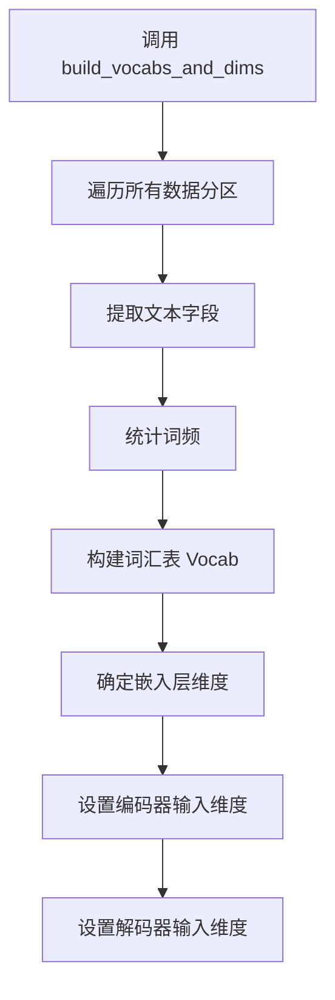
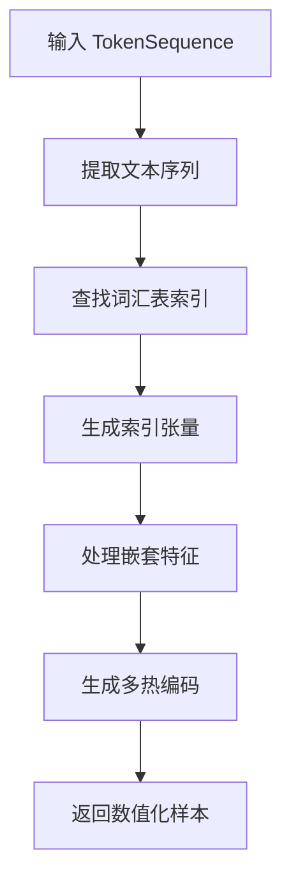
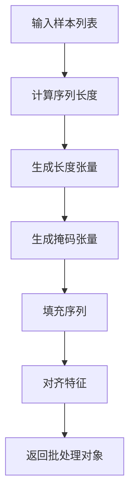
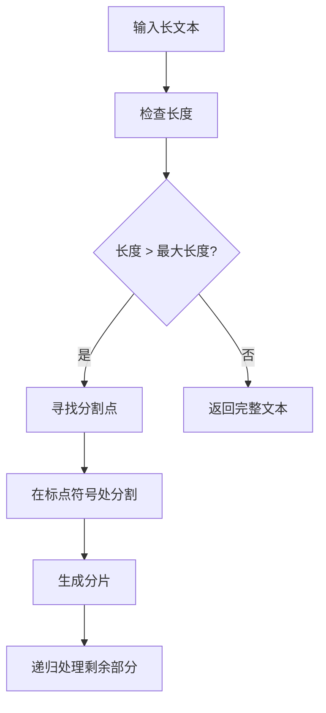
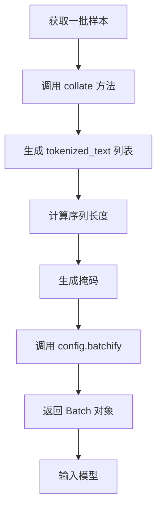

# 数据批处理与模型输入

<cite>
**本文档引用的文件**
- [dataset.py](file://eznlp/dataset.py)
- [wrapper.py](file://eznlp/wrapper.py)
- [NER任务完整流程.md](file://docs/NER任务完整流程.md)
- [vocab.py](file://eznlp/vocab.py)
- [config.py](file://eznlp/config.py)
- [token.py](file://eznlp/token.py)
</cite>

## 目录
1. [引言](#引言)
2. [词汇表构建与维度确定](#词汇表构建与维度确定)
3. [样本数值化转换](#样本数值化转换)
4. [批处理张量组织](#批处理张量组织)
5. [长文本分片策略](#长文本分片策略)
6. [训练循环中的数据批处理](#训练循环中的数据批处理)
7. [总结](#总结)

## 引言

在eznlp框架中，从原始文本到模型输入张量的转换是一个系统化的过程，涉及多个关键组件的协同工作。本文档将详细阐述这一完整流程，重点解析`Dataset`类如何通过`build_vocabs_and_dims`方法构建词汇表并确定模型维度，以及如何通过`exemplify`方法将`TokenSequence`转换为数值化样本。同时，我们将深入探讨`wrapper.py`中提供的`batchify`函数如何将多个样本组织成批处理张量，包括序列填充、掩码生成和特征对齐等关键技术细节。结合`NER任务完整流程.md`中的流程图，说明数据批处理在训练循环中的具体应用，以及如何处理长文本的分片（spans_within_max_length）策略。

## 词汇表构建与维度确定

`Dataset`类中的`build_vocabs_and_dims`方法是数据预处理的关键步骤，负责构建词汇表并确定模型各组件的输入维度。该方法通过调用配置对象的`build_vocabs_and_dims`方法来实现。

**图来源**
- [dataset.py](file://eznlp/dataset.py#L89-L90)
- [config.py](file://eznlp/config.py#L51-L61)

`Vocab`类是词汇表的核心实现，它基于`collections.Counter`统计词频，并根据最小频率阈值和特殊标记（如`<unk>`和`<pad>`）构建词汇表。词汇表的构建过程确保了模型能够处理训练数据中出现的所有词汇，并为未知词汇和填充位置分配特殊标记。

**章节来源**
- [vocab.py](file://eznlp/vocab.py#L6-L66)
- [dataset.py](file://eznlp/dataset.py#L89-L90)

## 样本数值化转换

`exemplify`方法负责将`TokenSequence`对象转换为模型可接受的数值化样本。这个过程涉及将文本序列中的每个标记（token）映射到其在词汇表中的索引，并生成相应的特征向量。

**图来源**
- [dataset.py](file://eznlp/dataset.py#L101-L102)
- [embedder.py](file://eznlp/model/embedder.py#L125-L126)

`exemplify`方法的实现依赖于配置对象中定义的各种嵌入器（embedder），如`OneHotConfig`、`CharConfig`和`SoftLexiconConfig`。这些嵌入器负责将文本特征转换为数值表示，为后续的模型处理提供输入。

**章节来源**
- [dataset.py](file://eznlp/dataset.py#L101-L102)
- [embedder.py](file://eznlp/model/embedder.py#L125-L126)

## 批处理张量组织

`wrapper.py`中的`batchify`函数是批处理的核心，它将多个数值化样本组织成一个批处理张量。这个过程包括序列填充、掩码生成和特征对齐。

**图来源**
- [wrapper.py](file://eznlp/wrapper.py#L39-L95)
- [dataset.py](file://eznlp/dataset.py#L104-L114)

`Batch`类是批处理对象的封装，它继承自`TensorWrapper`，提供了对张量的统一管理和操作接口。`seq_lens2mask`函数用于根据序列长度生成掩码张量，这对于处理变长序列至关重要。

**章节来源**
- [wrapper.py](file://eznlp/wrapper.py#L39-L95)
- [dataset.py](file://eznlp/dataset.py#L104-L114)

## 长文本分片策略

对于超过模型最大输入长度的长文本，eznlp提供了`spans_within_max_length`策略进行分片处理。该策略确保文本在合理的边界（如句号、问号、感叹号或分号）处进行分割，以保持语义完整性。

**图来源**
- [token.py](file://eznlp/token.py#L693-L711)
- [test_chunk.py](file://tests/utils/test_chunk.py#L53-L59)

`spans_within_max_length`方法通过迭代查找合适的分割点，确保每个分片的长度不超过指定的最大长度，并在可能的情况下保持句子的完整性。这种策略对于处理长文档或段落非常有效。

**章节来源**
- [token.py](file://eznlp/token.py#L693-L711)
- [test_chunk.py](file://tests/utils/test_chunk.py#L53-L59)

## 训练循环中的数据批处理

在训练循环中，数据批处理是连接数据集和模型的关键环节。`Dataset`类的`collate`方法负责将一批样本组织成模型输入格式。

**图来源**
- [dataset.py](file://eznlp/dataset.py#L104-L114)
- [NER任务完整流程.md](file://docs/NER任务完整流程.md#L213-L223)

训练脚本通过`DataLoader`加载数据，并利用`collate_fn`参数指定`collate`方法，确保数据在加载过程中自动完成批处理转换。这种设计使得训练过程高效且易于管理。

**章节来源**
- [dataset.py](file://eznlp/dataset.py#L104-L114)
- [NER任务完整流程.md](file://docs/NER任务完整流程.md#L213-L223)

## 总结

eznlp框架通过一系列精心设计的组件和方法，实现了从`TokenSequence`到模型输入张量的完整转换流程。`Dataset`类的`build_vocabs_and_dims`方法确保了词汇表的正确构建和模型维度的准确设置，而`exemplify`方法则完成了样本的数值化转换。`wrapper.py`中的`batchify`函数和`Batch`类提供了强大的批处理能力，支持序列填充、掩码生成和特征对齐。对于长文本，`spans_within_max_length`策略确保了文本在合理边界处进行分片，保持了语义的完整性。这些组件的协同工作，使得eznlp能够高效地处理各种自然语言处理任务，特别是在命名实体识别（NER）等需要精细文本处理的场景中表现出色。