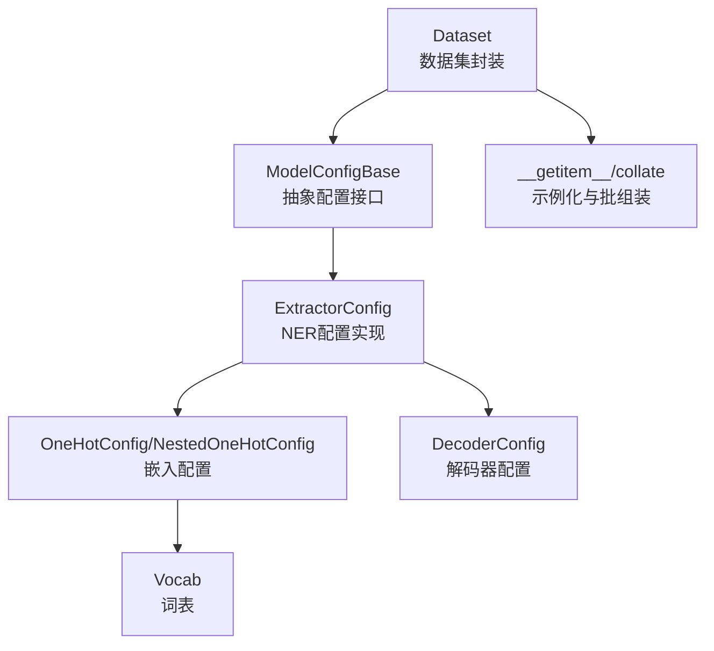
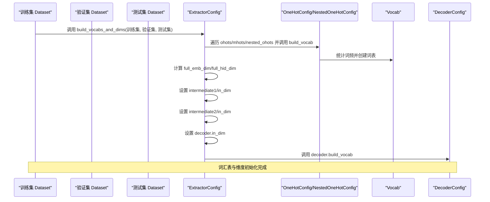
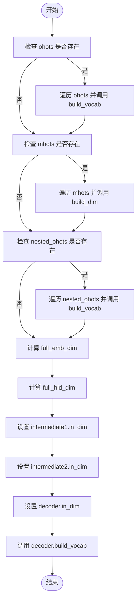
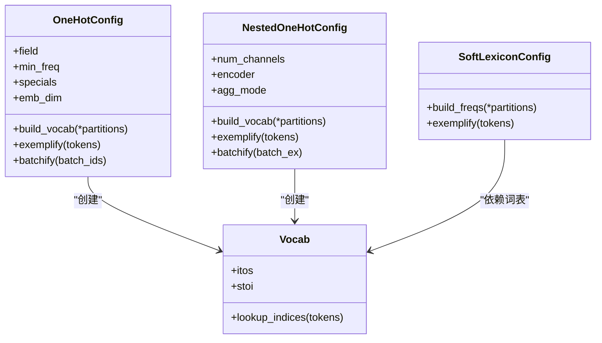
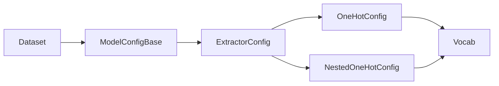

# 词汇表构建与维度初始化

<cite>
**本文引用的文件列表**
- [dataset.py](file://eznlp/dataset.py)
- [base.py](file://eznlp/model/model/base.py)
- [extractor.py](file://eznlp/model/model/extractor.py)
- [embedder.py](file://eznlp/model/embedder.py)
- [nested_embedder.py](file://eznlp/model/nested_embedder.py)
- [vocab.py](file://eznlp/vocab.py)
- [NER任务完整流程.md](file://docs/NER任务完整流程.md)
</cite>

## 目录
1. [引言](#引言)
2. [项目结构](#项目结构)
3. [核心组件](#核心组件)
4. [架构总览](#架构总览)
5. [详细组件分析](#详细组件分析)
6. [依赖关系分析](#依赖关系分析)
7. [性能考量](#性能考量)
8. [故障排查指南](#故障排查指南)
9. [结论](#结论)

## 引言
本文围绕 Dataset 类中的 build_vocabs_and_dims 方法展开，系统阐述其如何遍历训练、验证与测试数据集中的 TokenSequence 对象，提取文本、实体、关系等特征字段，并调用 ModelConfigBase 的相应方法构建词汇表（如 token_vocab、chunk_vocab 等）。同时解释该过程如何确定模型各组件的输入输出维度，包括嵌入层维度、标签空间大小等关键参数。结合 NER 任务完整流程文档中的配置示例，说明词汇表构建在模型配置传递中的作用，以及多数据集协同构建词汇表对模型泛化能力的影响。

## 项目结构
- 数据集封装：Dataset 将数据样本包装为可迭代的数据集对象，并在 __getitem__ 中调用 config.exemplify 生成示例，collate 中调用 config.batchify 组装批次。
- 配置与构建：ModelConfigBase 抽象出 build_vocabs_and_dims、exemplify、batchify 等接口；ExtractorConfig 实现了具体的词汇表构建与维度初始化逻辑。
- 词汇表与嵌入：OneHotConfig/NestedOneHotConfig 等嵌入配置通过 build_vocab 统计词频并创建 Vocab；随后通过 instantiate 构建嵌入层，决定嵌入维度与词表大小。
- 多数据集协同：训练集、验证集、测试集共同参与词汇表构建，有助于提升模型在未见数据上的泛化能力。

图表来源
- [dataset.py](file://eznlp/dataset.py#L89-L115)
- [base.py](file://eznlp/model/model/base.py#L51-L62)
- [extractor.py](file://eznlp/model/model/extractor.py#L122-L148)
- [embedder.py](file://eznlp/model/embedder.py#L112-L136)
- [vocab.py](file://eznlp/vocab.py#L12-L66)

章节来源
- [dataset.py](file://eznlp/dataset.py#L89-L115)
- [base.py](file://eznlp/model/model/base.py#L51-L62)
- [extractor.py](file://eznlp/model/model/extractor.py#L122-L148)
- [embedder.py](file://eznlp/model/embedder.py#L112-L136)
- [vocab.py](file://eznlp/vocab.py#L12-L66)

## 核心组件
- Dataset.build_vocabs_and_dims：委托给 config.build_vocabs_and_dims，将训练、验证、测试三份数据作为分区传入，驱动整个词汇表与维度初始化流程。
- ModelConfigBase.build_vocabs_and_dims：抽象接口，由具体配置类实现。
- ExtractorConfig.build_vocabs_and_dims：实现多组件协同构建，包括 ohots、mhots、nested_ohots、中间编码器与解码器的维度设置。
- OneHotConfig/NestedOneHotConfig.build_vocab：基于多数据集统计词频，构建 Vocab，并记录最大序列长度等元信息。
- Vocab：维护词表映射、特殊符号索引及最小频率过滤。

章节来源
- [dataset.py](file://eznlp/dataset.py#L89-L91)
- [base.py](file://eznlp/model/model/base.py#L51-L53)
- [extractor.py](file://eznlp/model/model/extractor.py#L122-L148)
- [embedder.py](file://eznlp/model/embedder.py#L112-L136)
- [vocab.py](file://eznlp/vocab.py#L12-L66)

## 架构总览
下图展示了从数据集到模型配置、再到词汇表与维度初始化的整体流程，以及数据在 Dataset 与 ModelConfigBase 之间的交互。

图表来源
- [dataset.py](file://eznlp/dataset.py#L89-L91)
- [extractor.py](file://eznlp/model/model/extractor.py#L122-L148)
- [embedder.py](file://eznlp/model/embedder.py#L112-L136)
- [vocab.py](file://eznlp/vocab.py#L12-L66)

## 详细组件分析

### Dataset.build_vocabs_and_dims 方法
- 角色定位：作为数据集侧的入口，负责将训练、验证、测试三份数据作为分区传入配置层，触发统一的词汇表与维度初始化流程。
- 关键行为：
  - 将自身 config 与 others（通常为 dev_data, test_data）合并为分区，调用 config.build_vocabs_and_dims。
  - 该方法不直接操作数据，而是委托给配置层，确保构建逻辑集中在配置类中，便于扩展与复用。
- 与训练流程的关系：在 NER 任务完整流程文档中，训练脚本先创建训练集，再调用 build_vocabs_and_dims 同时传入验证与测试数据，随后基于同一 config 创建验证集与测试集，保证三者共享一致的词汇表与维度。

章节来源
- [dataset.py](file://eznlp/dataset.py#L89-L91)
- [NER任务完整流程.md](file://docs/NER任务完整流程.md#L230-L241)

### ModelConfigBase 抽象接口
- 定义了 build_vocabs_and_dims、exemplify、batchify 等抽象方法，要求子类实现以完成词汇表构建、示例化与批组装。
- 该抽象确保 Dataset 与具体配置类之间通过统一接口交互，降低耦合度。

章节来源
- [base.py](file://eznlp/model/model/base.py#L51-L62)

### ExtractorConfig.build_vocabs_and_dims 实现机制
- 词汇表构建链路：
  - ohots：遍历 ohots 配置项，逐个调用 build_vocab，统计词频并创建 Vocab。
  - mhots：遍历 mhots 配置项，调用 build_dim，基于示例 TokenSequence 初始化维度信息。
  - nested_ohots：遍历 nested_ohots 配置项，调用 build_vocab；若为 SoftLexiconConfig，则额外调用 build_freqs，使用除测试集外的分区统计词频。
- 维度初始化链路：
  - 计算 full_emb_dim：ohots/mhots/nested_ohots 输出维度之和。
  - 计算 full_hid_dim：若存在 intermediate1，则以 intermediate1.out_dim 为起点，否则等于 full_emb_dim；再累加预训练模块的 out_dim。
  - 设置 intermediate1.in_dim = full_emb_dim。
  - 设置 intermediate2.in_dim = full_hid_dim；若存在 intermediate2，则 decoder.in_dim = intermediate2.out_dim；否则 decoder.in_dim = full_hid_dim。
  - 调用 decoder.build_vocab，完成标签空间等解码器相关维度的初始化。
- 与 TokenSequence 的关系：
  - mhots 的 build_dim 会读取示例中的 tokens 字段，从而确定多热特征的维度。
  - nested_ohots 的 build_vocab 会遍历 tokens 的嵌套序列（如软词典、专家词典等），统计内部子序列词频。

图表来源
- [extractor.py](file://eznlp/model/model/extractor.py#L122-L148)

章节来源
- [extractor.py](file://eznlp/model/model/extractor.py#L122-L148)

### 嵌入层配置与词汇表构建
- OneHotConfig.build_vocab：
  - 遍历各分区中的样本，提取指定 field 的序列（如 tokens.text），统计词频并更新 max_len。
  - 基于 Counter、min_freq、specials 构建 Vocab。
  - exemplify 返回对应字段的整数索引序列，batchify 使用 pad_sequence 进行填充。
- NestedOneHotConfig.build_vocab：
  - 针对嵌套序列（如软词典、专家词典），遍历 inner_seq 并统计词频，同样构建 Vocab。
- SoftLexiconConfig.build_freqs：
  - 仅使用训练与验证分区统计词频，跳过测试集，避免数据泄漏；并将词频映射保存在 freqs 中，供后续示例化使用。

图表来源
- [embedder.py](file://eznlp/model/embedder.py#L112-L136)
- [nested_embedder.py](file://eznlp/model/nested_embedder.py#L60-L94)
- [nested_embedder.py](file://eznlp/model/nested_embedder.py#L175-L191)
- [vocab.py](file://eznlp/vocab.py#L12-L66)

章节来源
- [embedder.py](file://eznlp/model/embedder.py#L112-L136)
- [nested_embedder.py](file://eznlp/model/nested_embedder.py#L60-L94)
- [nested_embedder.py](file://eznlp/model/nested_embedder.py#L175-L191)
- [vocab.py](file://eznlp/vocab.py#L12-L66)

### 示例化与批组装（Dataset.__getitem__/collate）
- __getitem__：当存在 tokens 字段时，将 tokens.text 提取为 tokenized_text，并调用 config.exemplify(entry, training=...) 生成示例字典。
- collate：当存在 tokens 字段时，计算 seq_lens 与 mask，并调用 config.batchify 将多个示例组装为 Batch。
- 该流程确保词汇表与维度在构建阶段已就绪，示例化与批组装阶段可直接使用已初始化的嵌入层与解码器。

章节来源
- [dataset.py](file://eznlp/dataset.py#L95-L115)

### 多数据集协同构建词汇表对泛化的影响
- 协同策略：训练集、验证集、测试集共同参与词汇表构建，可使模型在训练期间就覆盖更广泛的词汇分布，减少 OOV（未登录词）带来的影响。
- 注意事项：对于 SoftLexiconConfig，build_freqs 会跳过测试集，避免数据泄漏，确保评估指标的公正性。
- 实践建议：在 NER 任务中，将 dev/test 与 train 同时传入 build_vocabs_and_dims，有助于稳定标签空间与嵌入层维度，提升跨数据集的泛化能力。

章节来源
- [NER任务完整流程.md](file://docs/NER任务完整流程.md#L230-L241)
- [extractor.py](file://eznlp/model/model/extractor.py#L131-L137)

## 依赖关系分析
- Dataset 依赖 ModelConfigBase 的接口，通过 build_vocabs_and_dims 将多数据集传递给配置层。
- ExtractorConfig 依赖 OneHotConfig/NestedOneHotConfig/Vectors/Vocab 等组件，完成词表构建与维度计算。
- 词表与嵌入层的耦合体现在：Vocab 的大小决定 Embedding 层的词表维度；嵌入维度由配置中的 emb_dim 决定；最终通过 instantiate 构建实际的嵌入模块。

图表来源
- [dataset.py](file://eznlp/dataset.py#L89-L91)
- [base.py](file://eznlp/model/model/base.py#L51-L62)
- [extractor.py](file://eznlp/model/model/extractor.py#L122-L148)
- [embedder.py](file://eznlp/model/embedder.py#L112-L136)
- [nested_embedder.py](file://eznlp/model/nested_embedder.py#L60-L94)
- [vocab.py](file://eznlp/vocab.py#L12-L66)

章节来源
- [dataset.py](file://eznlp/dataset.py#L89-L91)
- [base.py](file://eznlp/model/model/base.py#L51-L62)
- [extractor.py](file://eznlp/model/model/extractor.py#L122-L148)
- [embedder.py](file://eznlp/model/embedder.py#L112-L136)
- [nested_embedder.py](file://eznlp/model/nested_embedder.py#L60-L94)
- [vocab.py](file://eznlp/vocab.py#L12-L66)

## 性能考量
- 词表构建复杂度：build_vocab 遍历多数据集样本，时间复杂度近似 O(N)，其中 N 为样本总数；max_len 的更新与 Counter 统计为主要开销。
- 嵌套序列处理：nested_ohots 的 inner_seq 遍历可能带来额外开销，建议合理设置 num_channels 与 agg_mode，避免过度嵌套。
- 维度计算：full_emb_dim/full_hid_dim 的计算为线性求和，开销较小；但需注意预训练模块的 out_dim 变化对整体维度的影响。
- 批组装：pad_sequence 的填充操作与 mask 计算为 O(T)，T 为序列长度；应控制最大序列长度以平衡内存与速度。

## 故障排查指南
- 词表为空或维度异常：
  - 检查 tokens_key 与 field 是否正确指向 TokenSequence 的属性。
  - 确认 min_freq 设置是否过高导致词被过滤。
- OOV 频率过高：
  - 适当降低 min_freq 或引入 SoftLexiconConfig，利用外部词典增强覆盖。
- 维度不匹配：
  - 确认 intermediate1/intermediate2 的 in_dim 与 full_emb_dim/full_hid_dim 的设置顺序正确。
  - 检查预训练模块（如 bert_like/flair）的 out_dim 是否与配置一致。
- 数据泄漏风险：
  - 对于 SoftLexiconConfig，确认 build_freqs 仅使用训练与验证集，跳过测试集。

章节来源
- [embedder.py](file://eznlp/model/embedder.py#L112-L136)
- [nested_embedder.py](file://eznlp/model/nested_embedder.py#L175-L191)
- [extractor.py](file://eznlp/model/model/extractor.py#L131-L146)

## 结论
Dataset.build_vocabs_and_dims 通过将训练、验证、测试三份数据作为分区传递给 ModelConfigBase 的实现类，实现了统一的词汇表构建与维度初始化流程。ExtractorConfig 在该流程中承担核心职责：对 ohots/mhots/nested_ohots 进行词表构建，计算 full_emb_dim/full_hid_dim，并设置中间编码器与解码器的输入维度。配合多数据集协同构建与 SoftLexicon 的频率统计策略，能够有效提升模型在未见数据上的泛化能力。在实际使用中，应关注词表大小、嵌入维度与预训练模块的兼容性，确保配置与数据的一致性。