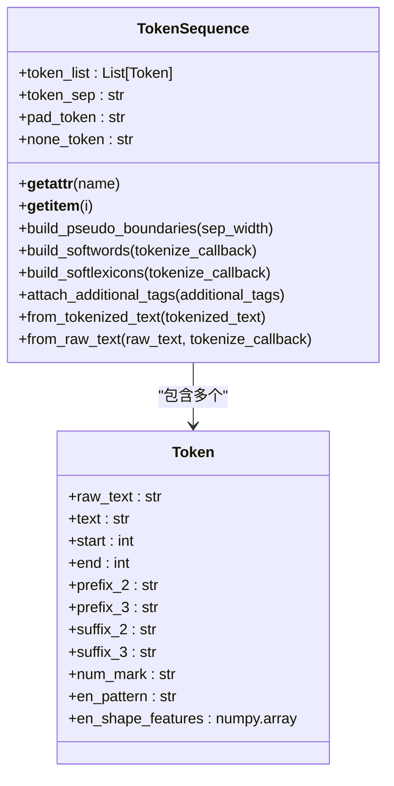
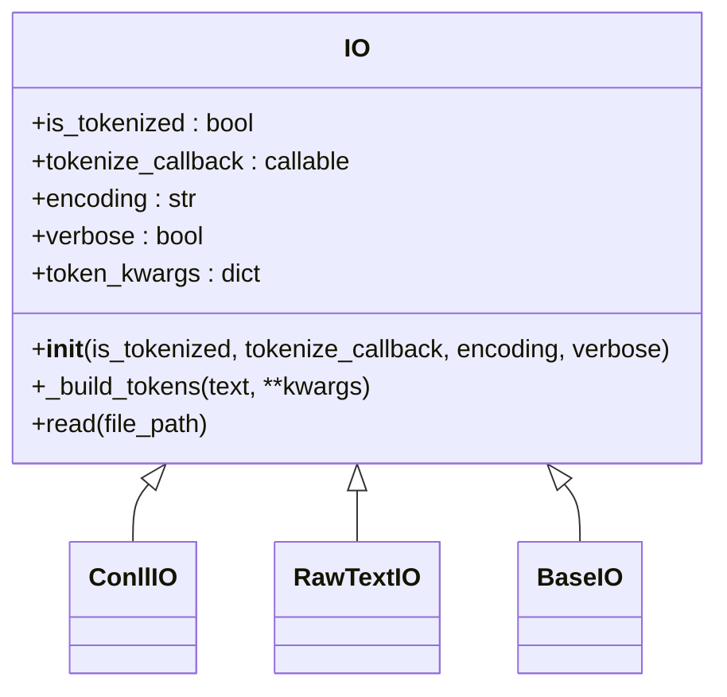
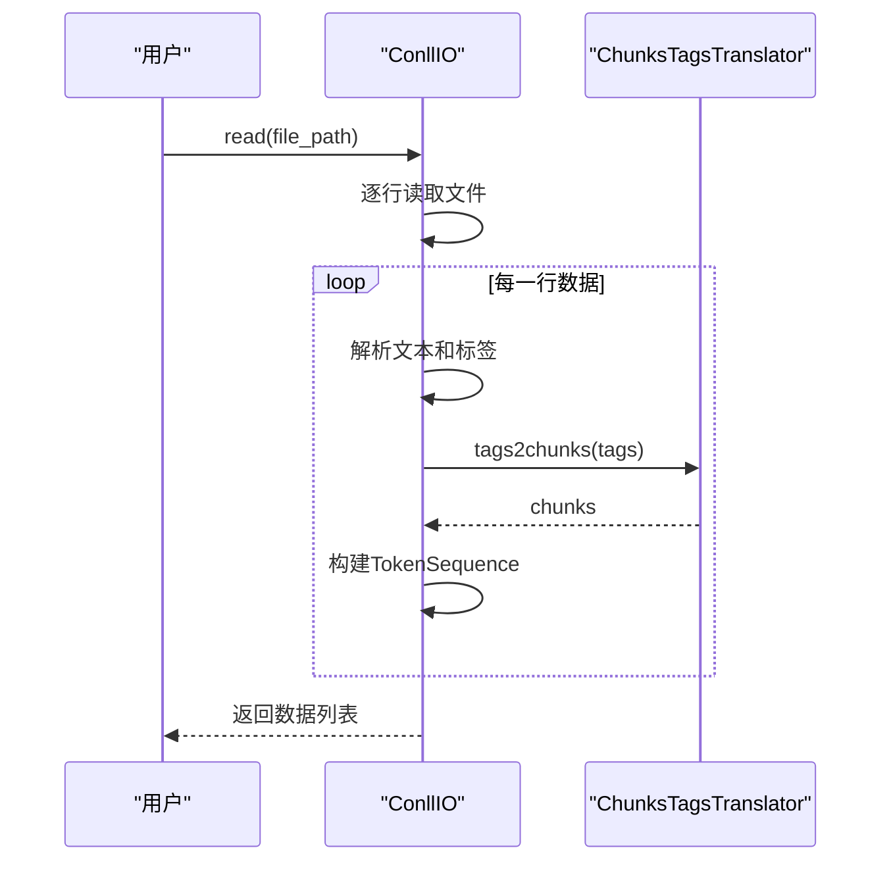
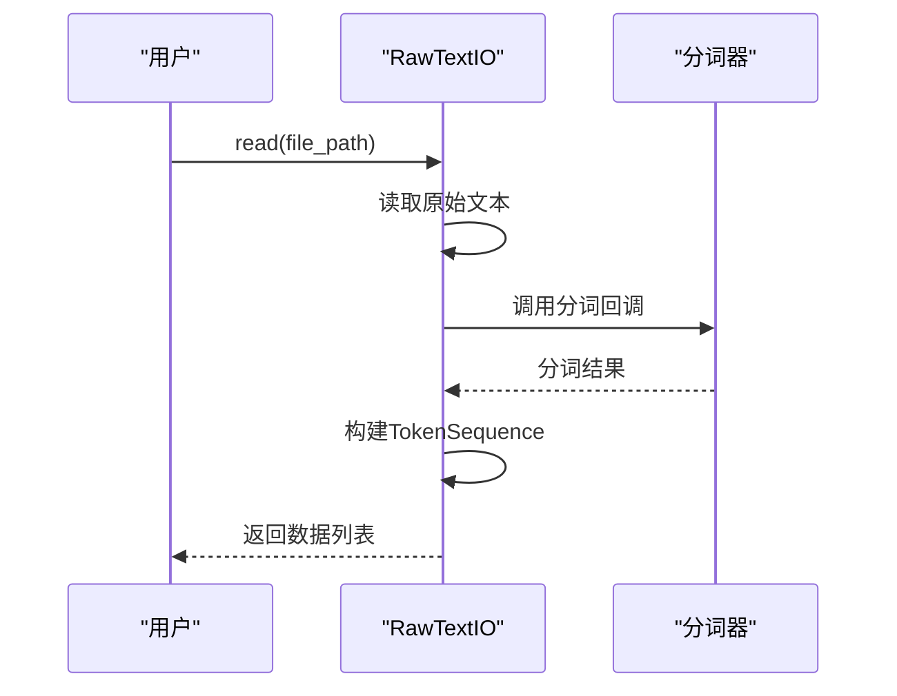
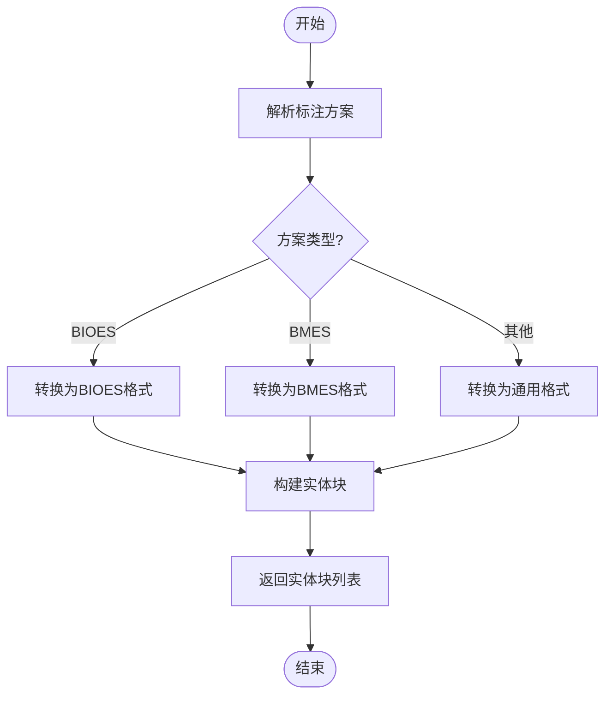
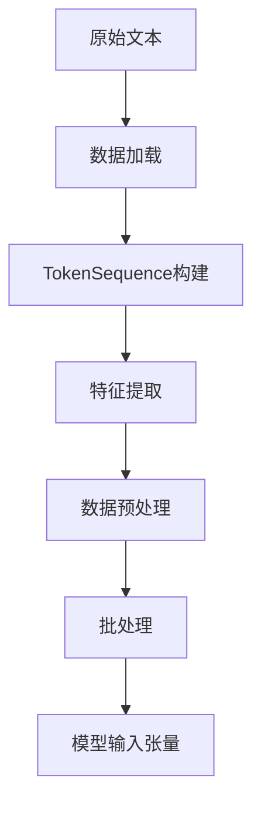
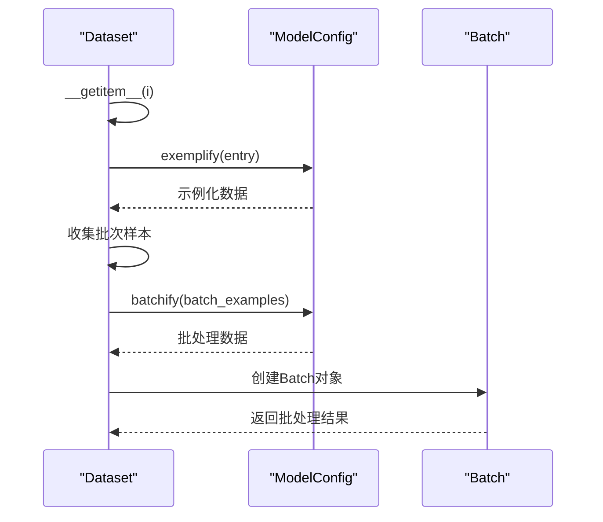

# 数据流

<cite>
**本文档中引用的文件**   
- [token.py](file://eznlp/token.py)
- [dataset.py](file://eznlp/dataset.py)
- [base.py](file://eznlp/io/base.py)
- [conll.py](file://eznlp/io/conll.py)
- [raw_text.py](file://eznlp/io/raw_text.py)
- [transition.py](file://eznlp/utils/transition.py)
- [NER任务完整流程.md](file://docs/NER任务完整流程.md)
- [base.py](file://eznlp/model/model/base.py)
- [extractor.py](file://eznlp/model/model/extractor.py)
</cite>

## 目录
1. [引言](#引言)
2. [TokenSequence类设计与作用](#tokensequence类设计与作用)
3. [IO基类职责与数据格式读取](#io基类职责与数据格式读取)
4. [数据处理完整流程](#数据处理完整流程)
5. [代码示例](#代码示例)
6. [总结](#总结)

## 引言

eznlp框架提供了一套完整的命名实体识别(NER)任务解决方案，从原始文本输入到模型可处理的张量输出形成了一个完整的数据处理链条。本文档将详细解析eznlp框架中的数据处理流程，重点阐述TokenSequence类的设计理念、IO基类的职责以及数据从加载、预处理到模型输入的转换过程。

## TokenSequence类设计与作用

TokenSequence类是eznlp框架中用于统一管理文本、实体标注和其他特征字段的核心数据结构。该类设计精巧，能够灵活处理各种文本特征和标注信息。

### 核心设计特点

TokenSequence类通过组合Token对象来构建序列，每个Token对象不仅包含原始文本(raw_text)和规范化文本(text)，还提供了丰富的属性访问接口。这种设计使得TokenSequence能够统一管理多种文本特征：



**类来源**
- [token.py](file://eznlp/token.py#L492-L847)

### 统一管理机制

TokenSequence类通过`__getattr__`方法实现了对Token对象属性的统一访问。当访问TokenSequence的某个属性时，该方法会自动遍历所有Token对象并收集相应属性值，形成一个列表。这种设计使得用户可以像操作普通列表一样操作TokenSequence对象的各个特征字段。

此外，TokenSequence类提供了多种构建方法，包括`from_tokenized_text`和`from_raw_text`，能够从不同格式的输入数据创建TokenSequence实例。这些方法内部会自动处理文本分词、边界计算等复杂操作。

**代码来源**
- [token.py](file://eznlp/token.py#L511-L522)
- [token.py](file://eznlp/token.py#L736-L847)

## IO基类职责与数据格式读取

IO基类是eznlp框架中数据读取功能的核心抽象，定义了统一的数据读取接口，并通过子类实现不同数据格式的解析。

### IO基类设计

IO基类作为所有数据读取器的基类，定义了基本的数据处理流程和配置参数：



**类来源**
- [base.py](file://eznlp/io/base.py#L7-L38)

### 子类实现与数据格式支持

IO基类通过多个子类实现了对不同数据格式的支持，其中最重要的包括ConllIO和RawTextIO。

#### ConllIO实现

ConllIO类专门用于处理CoNLL格式的数据文件。该类能够解析标准的CoNLL格式，并将标签序列转换为实体块(chunk)表示：



**代码来源**
- [conll.py](file://eznlp/io/conll.py#L8-L141)

#### RawTextIO实现

RawTextIO类用于处理原始文本文件，支持将未分词的文本转换为TokenSequence对象。该类特别适用于需要在运行时进行动态分词的场景：



**代码来源**
- [raw_text.py](file://eznlp/io/raw_text.py#L15-L157)

### 标签转换机制

eznlp框架通过ChunksTagsTranslator类实现了标签与实体块之间的相互转换。该类支持多种标注方案，包括BIO1、BIO2、BIOES、BMES等：



**代码来源**
- [transition.py](file://eznlp/utils/transition.py#L12-L217)

## 数据处理完整流程

结合NER任务完整流程文档中的描述，我们可以梳理出从原始文本到模型输入的完整数据处理链条。

### 整体流程架构



**图表来源**
- [NER任务完整流程.md](file://docs/NER任务完整流程.md)

### 详细处理步骤

#### 数据加载阶段

数据加载阶段主要由IO子类完成，根据数据格式的不同采用相应的解析策略。对于CoNLL格式数据，ConllIO类会逐行解析文本和标签，并使用ChunksTagsTranslator将标签序列转换为实体块表示。

#### TokenSequence构建

在数据加载完成后，框架会创建TokenSequence对象来统一管理文本序列和相关特征。这一过程包括：
1. 文本分词或直接使用已分词文本
2. 计算每个token在原始文本中的位置边界
3. 构建各种文本特征（前缀、后缀、数字标记等）

#### 特征提取与预处理

TokenSequence类提供了多种方法来提取和构建额外特征：
- `build_softwords`: 构建软词边界特征
- `build_softlexicons`: 构建软词典特征
- `build_expert_dict_tags`: 构建专家词典匹配标签

这些特征对于中文NER任务尤为重要，能够有效提升模型性能。

#### 批处理与模型输入

最终，数据通过Dataset类的collate方法进行批处理，转换为模型可接受的张量格式：



**代码来源**
- [dataset.py](file://eznlp/dataset.py#L95-L114)

## 代码示例

以下代码示例展示了如何在eznlp框架中创建和操作TokenSequence对象，以及如何通过exemplify和batchify方法将原始数据转换为模型输入格式。

### 创建TokenSequence对象

```python
# 从已分词文本创建TokenSequence
tokens = TokenSequence.from_tokenized_text(
    ["中", "国", "石", "化", "集", "团"],
    additional_tags={"ner_tags": ["B-ORG", "I-ORG", "I-ORG", "I-ORG", "I-ORG", "I-ORG"]}
)

# 从原始文本创建TokenSequence
tokens = TokenSequence.from_raw_text(
    "中国石化集团",
    tokenize_callback=jieba.cut
)
```

### 使用exemplify和batchify方法

```python
# 假设config是已配置的ModelConfig对象
example = config.exemplify(entry, training=True)
batch = config.batchify(batch_examples)
```

**代码来源**
- [token.py](file://eznlp/token.py#L736-L847)
- [dataset.py](file://eznlp/dataset.py#L101-L113)

## 总结

eznlp框架通过精心设计的TokenSequence类和IO基类，构建了一个灵活而强大的数据处理系统。TokenSequence类作为核心数据结构，统一管理文本、实体标注和其他特征字段，提供了丰富的特征提取方法。IO基类及其子类实现了对多种数据格式的支持，确保了框架的通用性和扩展性。整个数据处理流程从原始文本输入到模型可处理的张量输出，形成了一个完整而高效的链条，为NER任务提供了坚实的基础。