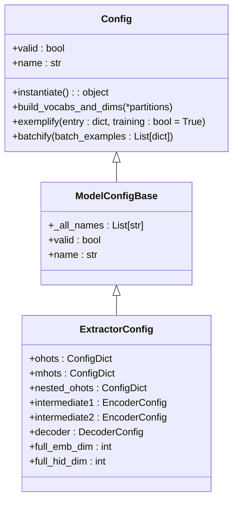
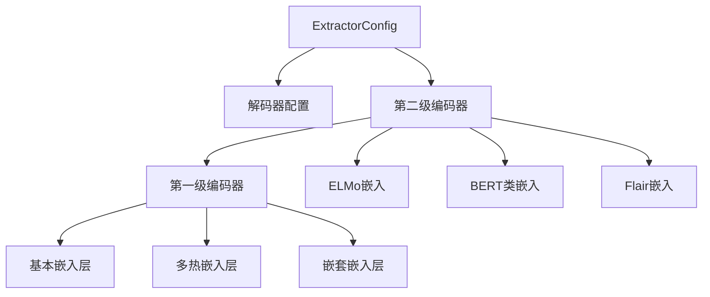
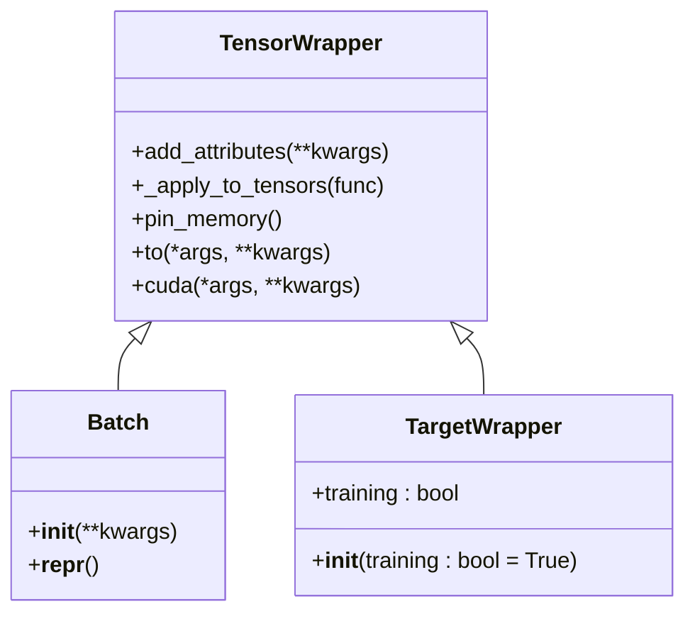
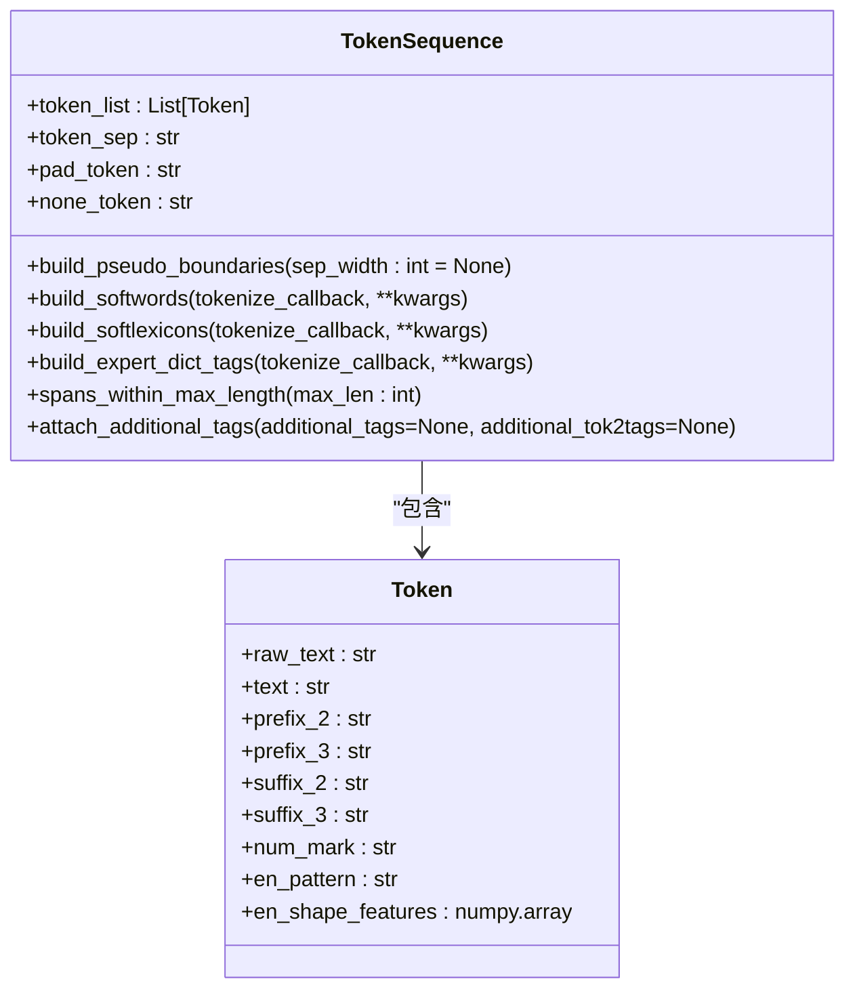
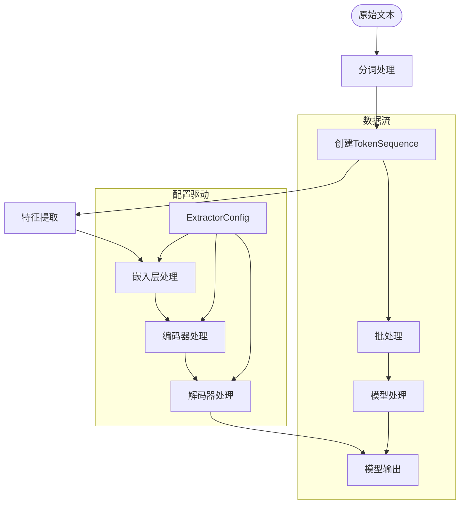

# 核心概念

<cite>
**本文档中引用的文件**  
- [config.py](file://eznlp/config.py)
- [wrapper.py](file://eznlp/wrapper.py)
- [token.py](file://eznlp/token.py)
- [extractor.py](file://eznlp/model/model/extractor.py)
- [base.py](file://eznlp/model/model/base.py)
- [NER任务完整流程.md](file://docs/NER任务完整流程.md)
</cite>

## 目录
1. [引言](#引言)
2. [配置驱动架构](#配置驱动架构)
3. [核心抽象概念](#核心抽象概念)
4. [数据结构设计](#数据结构设计)
5. [NER任务完整流程](#ner任务完整流程)
6. [配置示例](#配置示例)
7. [总结](#总结)

## 引言

eznlp框架是一个专为中文自然语言处理任务设计的深度学习框架，其核心设计理念是通过配置驱动的架构来实现模型定义与实现的解耦。本文档将深入解释eznlp框架中的关键抽象概念，包括ExtractorConfig、ModelWrapper和Config类的作用，以及TokenSequence、Batch等核心数据结构的设计原理。通过这些概念的组合，用户可以灵活地构建自定义模型，满足不同的NER任务需求。

## 配置驱动架构

eznlp框架采用配置驱动的架构设计，通过将模型配置与实现分离，实现了高度的灵活性和可扩展性。这种架构的核心是Config类体系，它允许用户通过组合不同的编码器、解码器和嵌入层来构建自定义模型。

### 配置类层次结构

配置驱动架构的基础是Config类的继承体系。`Config`类作为所有配置类的基类，定义了配置存储、验证和实例化的基本方法。`ModelConfigBase`类继承自`Config`，为模型配置提供了更具体的接口。



**图解来源**  
- [config.py](file://eznlp/config.py#L20-L173)
- [base.py](file://eznlp/model/model/base.py#L10-L62)
- [extractor.py](file://eznlp/model/model/extractor.py#L23-L208)

**配置类的作用**  
- `Config`：提供配置存储和验证的基础功能
- `ModelConfigBase`：定义模型配置的通用接口
- `ExtractorConfig`：NER任务专用的配置类，管理嵌入层、编码器和解码器的配置

## 核心抽象概念

### ExtractorConfig类

`ExtractorConfig`类是eznlp框架中NER任务的核心配置类，负责管理模型的各个组件配置。它通过分层的配置结构，实现了模型组件的灵活组合。

#### 配置组件

`ExtractorConfig`类包含多个配置组件，每个组件负责模型的不同部分：



**图解来源**  
- [extractor.py](file://eznlp/model/model/extractor.py#L23-L48)

#### 配置方法

`ExtractorConfig`类提供了多个关键方法来管理配置：

- `build_vocabs_and_dims`：构建词汇表和维度
- `exemplify`：将数据条目转换为模型示例
- `batchify`：将示例批处理为模型输入
- `instantiate`：实例化配置对应的模型

这些方法实现了从原始数据到模型输入的转换流程，确保了数据处理的一致性和高效性。

### Config类

`Config`类是eznlp框架配置系统的基础，它提供了配置存储、验证和实例化的核心功能。

#### 配置验证

`Config`类通过`valid`属性实现配置验证，确保所有必需的配置项都已正确设置：

```python
@property
def valid(self):
    for name, attr in self.__dict__.items():
        if attr is None:
            return False
        elif isinstance(attr, Config) and not attr.valid:
            return False
    return True
```

这种递归验证机制确保了复杂配置结构的完整性，防止了因配置缺失导致的运行时错误。

#### 配置实例化

`Config`类的`instantiate`方法是创建模型实例的推荐方式。通过配置实例化，可以确保模型创建过程的一致性和可重复性。

### ModelWrapper类

虽然在代码库中未直接找到`ModelWrapper`类，但`TensorWrapper`类提供了类似的功能，作为张量的包装器，为模型组件提供了统一的接口。

#### TensorWrapper功能

`TensorWrapper`类的主要功能包括：

- 张量属性管理
- 张量操作应用
- 内存优化



**图解来源**  
- [wrapper.py](file://eznlp/wrapper.py#L39-L122)

`Batch`类继承自`TensorWrapper`，用于包装批处理数据，提供了统一的数据访问接口。`TargetWrapper`类用于包装模型目标，支持训练和推理模式的切换。

## 数据结构设计

### TokenSequence类

`TokenSequence`类是eznlp框架中处理文本数据的核心数据结构，它提供了对token序列的封装和操作。

#### 类设计

`TokenSequence`类的设计考虑了多种文本处理需求：



**图解来源**  
- [token.py](file://eznlp/token.py#L365-L859)

#### 核心功能

`TokenSequence`类提供了以下核心功能：

1. **基础属性访问**：通过`__getattr__`方法实现对token属性的序列化访问
2. **文本预处理**：支持大小写归一化、数字标记化、全角半角转换等
3. **特征提取**：提供前缀、后缀、数字标记、英文模式等特征
4. **软词典构建**：支持基于词典的softword和softlexicon构建
5. **专家词典匹配**：支持领域特定专家词典的匹配和标记

### Batch类

`Batch`类是`TensorWrapper`的子类，用于包装批处理数据，确保数据在GPU和CPU之间的正确传输。

#### 批处理设计

`Batch`类的设计考虑了深度学习训练的需求：

- 统一的数据包装接口
- 支持pin_memory操作
- 支持设备迁移（to、cuda方法）
- 递归应用张量操作

这种设计使得批处理数据可以在不同的设备和内存类型之间高效传输，提高了训练效率。

## NER任务完整流程

结合NER任务完整流程.md中的流程图，我们可以清晰地看到从原始文本到模型输出的完整处理链条。

### 处理流程



**图解来源**  
- [NER任务完整流程.md](file://docs/NER任务完整流程.md)
- [extractor.py](file://eznlp/model/model/extractor.py#L149-L203)

### 流程详解

1. **数据准备**：从原始文本开始，通过`TokenSequence.from_raw_text`或`from_tokenized_text`创建token序列
2. **特征提取**：根据配置提取各种特征，如前缀、后缀、数字标记等
3. **批处理**：将多个示例组合成批处理数据，通过`batchify`方法转换为模型输入
4. **嵌入处理**：通过配置的嵌入层将token转换为向量表示
5. **编码处理**：通过编码器提取上下文信息
6. **解码输出**：通过解码器生成最终的NER标签

这个流程体现了eznlp框架配置驱动的设计理念，每个步骤都由相应的配置类控制，实现了高度的灵活性和可定制性。

## 配置示例

### 基本NER配置

```python
# 基本词嵌入配置
ohots_config = {
    "text": OneHotConfig(
        field="text",
        emb_dim=100,
        vectors=pretrained_vectors,
        freeze=False
    )
}

# 字符级嵌入配置
char_config = CharConfig(
    field="raw_text",
    emb_dim=16,
    encoder=EncoderConfig(
        arch="LSTM",
        hid_dim=128,
        num_layers=1,
        in_drop_rates=(0.5, 0.0, 0.0)
    )
)

# 解码器配置
decoder_config = SequenceTaggingDecoderConfig(
    scheme="BIOES",
    use_crf=True,
    fl_gamma=2.0
)

# 完整配置
config = ExtractorConfig(
    ohots=ohots_config,
    nested_ohots={"char": char_config},
    decoder=decoder_config,
    intermediate2=EncoderConfig(arch="LSTM", hid_dim=256, num_layers=2)
)
```

**配置来源**  
- [extractor.py](file://eznlp/model/model/extractor.py#L57-L88)
- [NER任务完整流程.md](file://docs/NER任务完整流程.md#L111-L171)

### 中文NER优化配置

```python
# 软词典嵌入配置（中文NER优化）
softlexicon_config = SoftLexiconConfig(
    vectors=ctb_vectors,
    emb_dim=50,
    agg_mode="wtd_mean_pooling"
)

# 完整中文NER配置
config = ExtractorConfig(
    ohots=ohots_config,
    nested_ohots={"softlexicon": softlexicon_config},
    decoder=decoder_config,
    intermediate2=EncoderConfig(arch="Transformer", hid_dim=256, num_layers=6)
)
```

**配置来源**  
- [NER任务完整流程.md](file://docs/NER任务完整流程.md#L140-L148)

## 总结

eznlp框架通过精心设计的配置驱动架构，实现了模型定义与实现的完全解耦。`ExtractorConfig`、`Config`等核心抽象概念为用户提供了灵活的模型构建能力，而`TokenSequence`、`Batch`等数据结构则确保了数据处理的高效性和一致性。

这种架构设计的主要优势包括：

1. **高度灵活性**：用户可以通过组合不同的编码器、解码器和嵌入层来构建自定义模型
2. **易于扩展**：新的模型组件可以通过继承和实现相应的配置类来添加
3. **配置一致性**：通过统一的配置接口，确保了不同模型组件之间的兼容性
4. **可重复性**：配置驱动的设计使得实验结果更容易复现

通过深入理解这些核心概念，用户可以充分利用eznlp框架的强大功能，快速构建和实验各种NER模型，满足不同的应用需求。