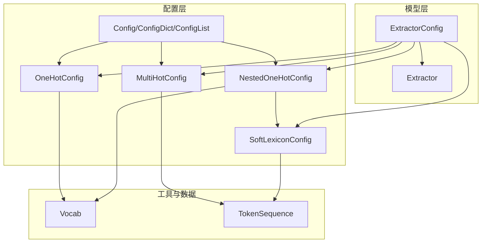
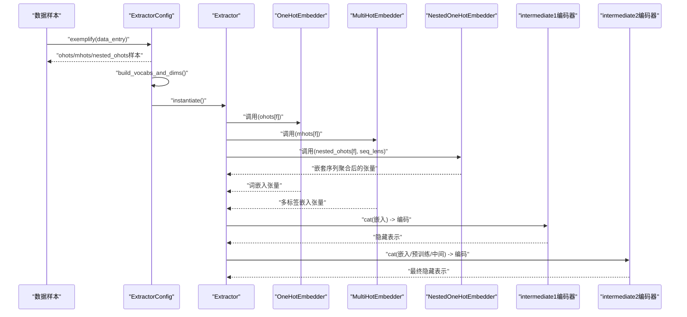
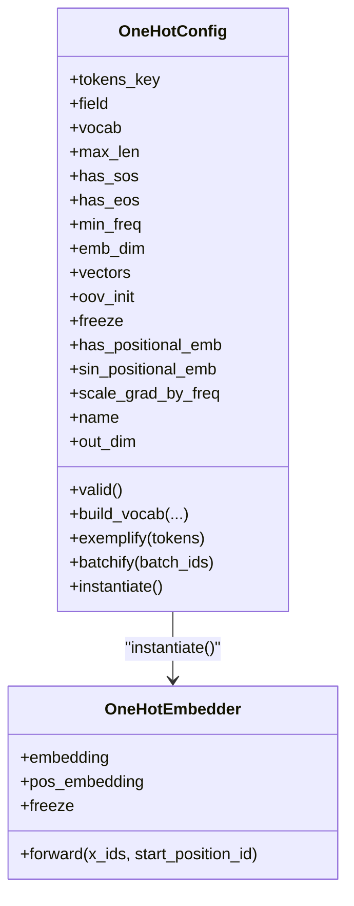
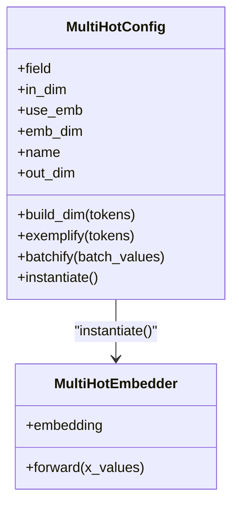
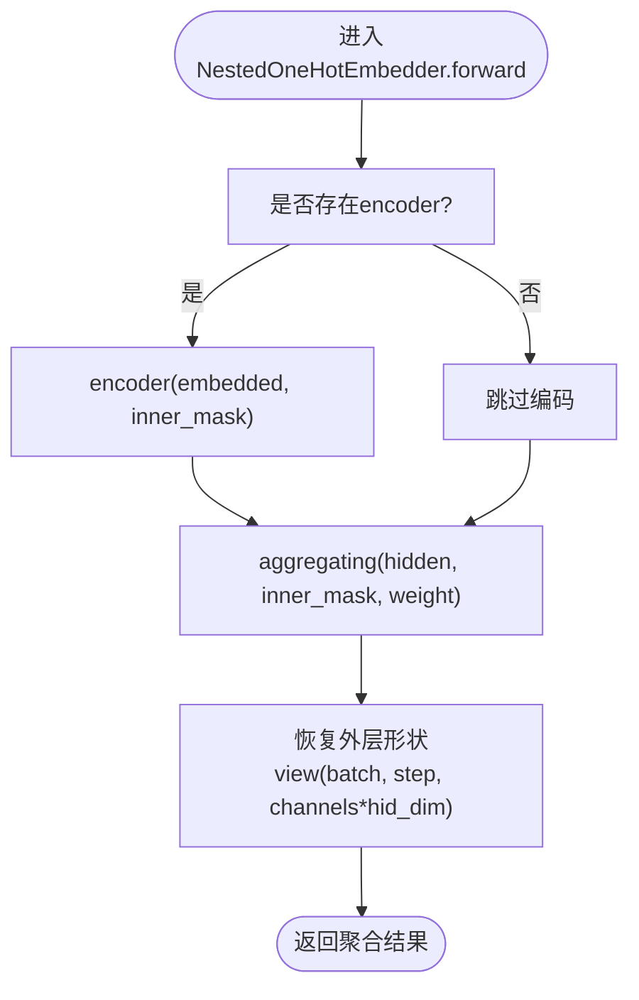
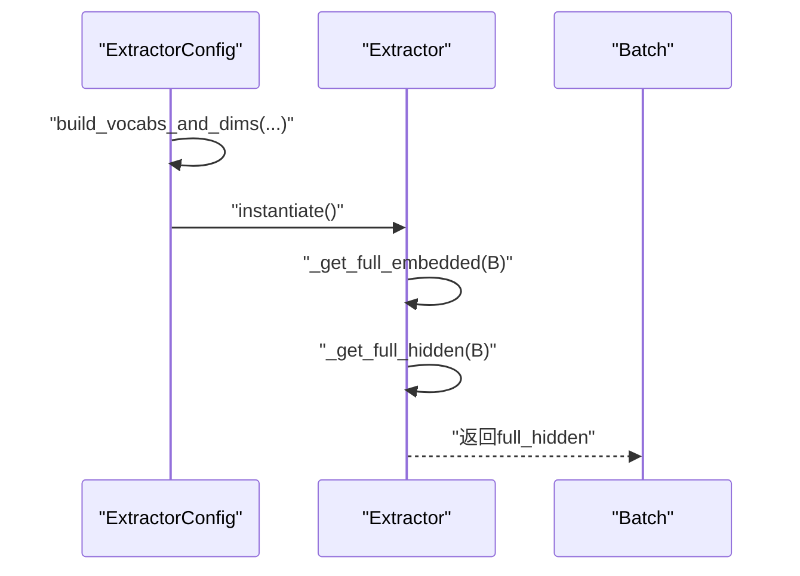
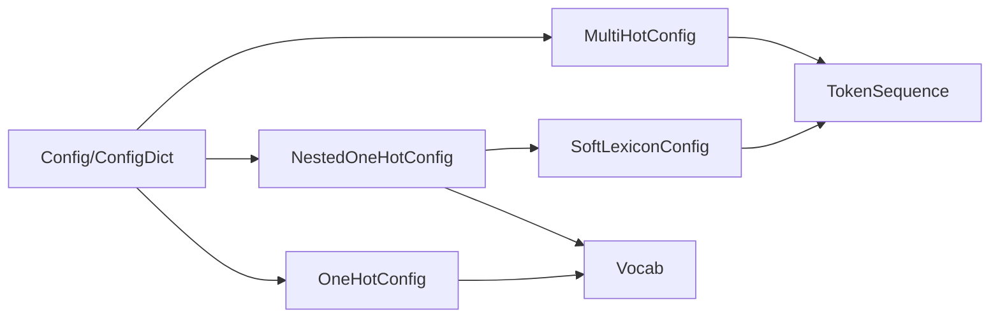

# 嵌入层管理

<cite>
**本文引用的文件列表**
- [config.py](file://eznlp/config.py)
- [embedder.py](file://eznlp/model/embedder.py)
- [nested_embedder.py](file://eznlp/model/nested_embedder.py)
- [extractor.py](file://eznlp/model/model/extractor.py)
- [base.py](file://eznlp/model/model/base.py)
- [vocab.py](file://eznlp/vocab.py)
- [token.py](file://eznlp/token.py)
- [test_nested_embedder.py](file://tests/model/test_nested_embedder.py)
- [NER任务完整流程.md](file://docs/NER任务完整流程.md)
</cite>

## 目录
1. [简介](#简介)
2. [项目结构与嵌入层组织](#项目结构与嵌入层组织)
3. [核心组件](#核心组件)
4. [架构总览](#架构总览)
5. [关键组件详解](#关键组件详解)
6. [依赖关系分析](#依赖关系分析)
7. [性能与优化建议](#性能与优化建议)
8. [故障排查指南](#故障排查指南)
9. [结论](#结论)
10. [附录](#附录)

## 简介
本节聚焦于eznlp中嵌入层的管理机制，系统性解析ExtractorConfig如何配置与管理ohots、mhots与nested_ohots三类嵌入组件；深入剖析OneHotConfig与SoftLexiconConfig的实现原理，尤其是软词典嵌入在中文命名实体识别（NER）中的优化作用；阐明build_vocabs_and_dims如何为不同嵌入层构建词汇表与维度；说明exemplify与batchify如何分别处理单样本与批量数据的嵌入表示；并结合配置字典展示如何灵活组合多种嵌入方式；最后解释full_emb_dim属性如何计算总嵌入维度，以及嵌入层输出如何作为intermediate1编码器的输入进行后续处理。

## 项目结构与嵌入层组织
- 嵌入层配置与实例化由Config体系统一管理，包括Config、ConfigList、ConfigDict等容器类，用于有序、可索引地组织嵌入配置。
- 一阶嵌入（ohots/mhots）与嵌套嵌入（nested_ohots）分别由OneHotConfig/MultiHotConfig与NestedOneHotConfig/SoftLexiconConfig等实现。
- ExtractorConfig将上述嵌入层与中间编码器、解码器串联，形成完整的序列标注流水线。

图表来源
- [config.py](file://eznlp/config.py#L121-L173)
- [embedder.py](file://eznlp/model/embedder.py#L51-L161)
- [nested_embedder.py](file://eznlp/model/nested_embedder.py#L15-L114)
- [extractor.py](file://eznlp/model/model/extractor.py#L23-L121)
- [vocab.py](file://eznlp/vocab.py#L6-L66)
- [token.py](file://eznlp/token.py#L492-L673)

章节来源
- [config.py](file://eznlp/config.py#L121-L173)
- [embedder.py](file://eznlp/model/embedder.py#L51-L161)
- [nested_embedder.py](file://eznlp/model/nested_embedder.py#L15-L114)
- [extractor.py](file://eznlp/model/model/extractor.py#L23-L121)

## 核心组件
- OneHotConfig：负责基于词表的一次性嵌入，支持可选的SOS/EOS、位置嵌入（Sinusoid或Embedding）、OOV初始化策略、冻结参数与按词频缩放梯度等。
- MultiHotConfig：多标签特征的数值向量嵌入，可选择是否映射到低维嵌入空间。
- NestedOneHotConfig：面向嵌套序列（如每个token有多个子序列，如软词典四象限BMES），支持通道数、聚合模式（池化/RNN末态）与可选内部编码器。
- SoftLexiconConfig：基于软词典的嵌套嵌入，引入词频权重进行加权平均池化，专门优化中文NER边界与覆盖。
- ExtractorConfig：统一装配ohots、mhots、nested_ohots、intermediate1/2、预训练嵌入与解码器，提供build_vocabs_and_dims、exemplify、batchify与instantiate等关键流程。

章节来源
- [embedder.py](file://eznlp/model/embedder.py#L51-L161)
- [embedder.py](file://eznlp/model/embedder.py#L197-L248)
- [nested_embedder.py](file://eznlp/model/nested_embedder.py#L15-L114)
- [nested_embedder.py](file://eznlp/model/nested_embedder.py#L152-L214)
- [nested_embedder.py](file://eznlp/model/nested_embedder.py#L215-L309)
- [extractor.py](file://eznlp/model/model/extractor.py#L23-L121)

## 架构总览
下图展示了从数据样本到嵌入输出再到中间编码器的端到端流程，体现ExtractorConfig如何协调各类嵌入层与编码器。

图表来源
- [extractor.py](file://eznlp/model/model/extractor.py#L149-L204)
- [extractor.py](file://eznlp/model/model/extractor.py#L215-L255)
- [embedder.py](file://eznlp/model/embedder.py#L141-L195)
- [embedder.py](file://eznlp/model/embedder.py#L233-L248)
- [nested_embedder.py](file://eznlp/model/nested_embedder.py#L99-L150)

## 关键组件详解

### 1) OneHotConfig与OneHotEmbedder
- 配置要点
  - tokens_key：指定样本中TokenSequence对象的键名，默认"tokens"。
  - field：要嵌入的字段名（如"text"、"prefix_2"等）。
  - vocab/min_freq/specials：词表构建参数；specials根据是否启用has_sos/has_eos动态生成。
  - max_len：序列最大长度，用于位置编码。
  - has_positional_emb/sin_positional_emb：是否加入位置信息及采用正弦编码。
  - vectors/oov_init/freeze：预训练向量注入、OOV初始化策略、是否冻结参数。
  - scale_grad_by_freq：按词频缩放梯度。
- 单样本与批量处理
  - exemplify：从TokenSequence中提取field序列，按需插入<sos>/<eos>，返回长整型ID张量。
  - batchify：对一批ID张量进行padding，padding值为pad_idx。
- 输出维度与位置编码
  - out_dim = emb_dim；若开启位置编码，则在forward中叠加位置嵌入或正弦编码。

图表来源
- [embedder.py](file://eznlp/model/embedder.py#L51-L161)
- [embedder.py](file://eznlp/model/embedder.py#L141-L195)

章节来源
- [embedder.py](file://eznlp/model/embedder.py#L51-L161)
- [embedder.py](file://eznlp/model/embedder.py#L141-L195)

### 2) MultiHotConfig与MultiHotEmbedder
- 配置要点
  - field：数值型多标签特征（如en_shape_features）。
  - in_dim：输入维度（可通过build_dim自动推断）。
  - use_emb：是否映射到emb_dim的线性层；否则直接使用原特征。
  - emb_dim：映射后的嵌入维度。
- 处理逻辑
  - exemplify：返回浮点型张量。
  - batchify：对一批特征进行padding。
  - forward：若use_emb为真，经线性层映射；否则直接返回原特征。

图表来源
- [embedder.py](file://eznlp/model/embedder.py#L197-L248)

章节来源
- [embedder.py](file://eznlp/model/embedder.py#L197-L248)

### 3) NestedOneHotConfig、SoftLexiconConfig与嵌套嵌入流程
- NestedOneHotConfig
  - 面向每个token存在多个子序列（如软词典的BMES四象限），共享同一词表与嵌入层。
  - 支持num_channels、squeeze、encoder（可选）与agg_mode（池化/RNN末态）。
  - build_vocab：遍历inner_sequences统计词频并构建词表；更新max_len。
  - exemplify/batchify：返回inner_ids列表与inner_mask；SoftLexiconConfig在此基础上附加inner_freqs作为权重。
- SoftLexiconConfig（中文NER优化）
  - 默认num_channels=4（BMES），agg_mode="wtd_mean_pooling"，使用加权平均池化。
  - build_freqs：基于训练+开发集统计词频，避免被更大子序列覆盖时频率不增，保证OOV不会被忽略。
  - exemplify/batchify：在父类基础上追加inner_freqs作为权重张量，用于加权池化。
- 嵌套嵌入forward流程
  - 将inner_ids映射为嵌入，若配置了encoder则先编码再聚合；否则直接聚合。
  - 恢复外层形状（token级步长），得到(batch, step, channels*emb_dim)。

图表来源
- [nested_embedder.py](file://eznlp/model/nested_embedder.py#L99-L150)

章节来源
- [nested_embedder.py](file://eznlp/model/nested_embedder.py#L15-L114)
- [nested_embedder.py](file://eznlp/model/nested_embedder.py#L152-L214)
- [nested_embedder.py](file://eznlp/model/nested_embedder.py#L215-L309)

### 4) ExtractorConfig：配置、构建与装配
- 组织结构
  - ohots/mhots/nested_ohots：嵌入层集合（ConfigDict/ConfigList）。
  - intermediate1/intermediate2：两阶段编码器。
  - elmo/bert_like/flair_fw/flair_bw：预训练嵌入模块。
  - decoder：解码器配置。
- 维度与词表构建
  - build_vocabs_and_dims：
    - 对ohots/mhots/nested_ohots分别构建词表/维度；
    - 若为SoftLexiconConfig，使用除测试集之外的数据构建词频；
    - 设置intermediate1/2的in_dim与decoder的in_dim。
- 数据管线
  - exemplify：对ohots/mhots/nested_ohots分别exemplify，再合并到example字典。
  - batchify：对ohots/mhots/nested_ohots分别batchify，再合并到batch字典。
- 嵌入拼接与编码
  - _get_full_embedded：按顺序调用各嵌入层，拼接为full_embedded。
  - _get_full_hidden：若配置intermediate1则先编码，否则直接使用full_embedded；随后拼接预训练嵌入，再经intermediate2编码（若存在）。

图表来源
- [extractor.py](file://eznlp/model/model/extractor.py#L122-L204)
- [extractor.py](file://eznlp/model/model/extractor.py#L215-L255)

章节来源
- [extractor.py](file://eznlp/model/model/extractor.py#L23-L121)
- [extractor.py](file://eznlp/model/model/extractor.py#L122-L204)
- [extractor.py](file://eznlp/model/model/extractor.py#L215-L255)

### 5) full_emb_dim与full_hid_dim
- full_emb_dim：ohots、mhots、nested_ohots三类嵌入层out_dim之和。
- full_hid_dim：若配置intermediate1，则为intermediate1.out_dim；否则为full_emb_dim；再累加预训练嵌入的out_dim后作为下游编码器的in_dim。

章节来源
- [extractor.py](file://eznlp/model/model/extractor.py#L98-L121)

### 6) 配置字典灵活组合示例
- 文档示例展示了如何通过ConfigDict灵活组合多种嵌入方式，包括词嵌入、字符嵌入与软词典嵌入，并在中文NER场景中强调软词典的加权平均池化优势。
- 测试用例验证了SoftLexiconConfig在构建词表与词频统计后的正确性，以及嵌套嵌入在不同编码器架构下的批一致性。

章节来源
- [NER任务完整流程.md](file://docs/NER任务完整流程.md#L109-L173)
- [test_nested_embedder.py](file://tests/model/test_nested_embedder.py#L52-L72)

## 依赖关系分析
- 配置容器
  - ConfigList/ConfigDict：统一管理嵌入配置的有序与命名索引，保证instantiate顺序与forward一致。
- 词表与特殊符号
  - Vocab：构建词表，支持specials_first策略与最小频率过滤。
  - VocabMixin：提供pad_idx/unk_idx/sos_idx/eos_idx与specials集合。
- TokenSequence
  - 提供动态属性访问（getattr族），支持softlexicon/expert_dict等软词典字段的构建，为SoftLexiconConfig提供数据基础。

图表来源
- [config.py](file://eznlp/config.py#L121-L173)
- [embedder.py](file://eznlp/model/embedder.py#L51-L161)
- [embedder.py](file://eznlp/model/embedder.py#L197-L248)
- [nested_embedder.py](file://eznlp/model/nested_embedder.py#L152-L214)
- [vocab.py](file://eznlp/vocab.py#L6-L66)
- [token.py](file://eznlp/token.py#L492-L673)

章节来源
- [config.py](file://eznlp/config.py#L121-L173)
- [vocab.py](file://eznlp/vocab.py#L6-L66)
- [token.py](file://eznlp/token.py#L492-L673)

## 性能与优化建议
- 词表规模控制：通过min_freq与specials_first策略减少稀有词对内存与计算的影响。
- 位置编码选择：对于LSTM/GRU，建议关闭显式位置嵌入，利用RNN天然顺序建模；Transformer可启用正弦位置编码。
- 冻结预训练嵌入：在资源受限或迁移学习场景，可冻结预训练词向量以稳定训练。
- 批处理与padding：确保batchify使用pad_idx与mask，避免无效信息参与梯度更新。
- 嵌套序列聚合：在SoftLexiconConfig中使用加权平均池化，可提升边界与覆盖的稳定性；注意inner_mask与weight的正确构造。

## 故障排查指南
- 词表未构建或为空：检查build_vocabs_and_dims是否被调用，确认partitions包含有效数据。
- out_dim不匹配：核对full_emb_dim/full_hid_dim计算链路，确保intermediate1/2与预训练嵌入in_dim设置正确。
- 嵌套嵌入形状异常：检查seq_lens与num_channels乘积是否等于inner_ids长度，确保restore外层形状逻辑正确。
- SoftLexiconConfig词频缺失：确认build_freqs仅使用除测试集之外的数据，且词表中保留特殊符号。

章节来源
- [extractor.py](file://eznlp/model/model/extractor.py#L122-L204)
- [nested_embedder.py](file://eznlp/model/nested_embedder.py#L99-L150)
- [test_nested_embedder.py](file://tests/model/test_nested_embedder.py#L52-L72)

## 结论
eznlp通过Config体系与ExtractorConfig实现了对ohots、mhots与nested_ohots的统一管理与灵活组合。OneHotConfig提供了稳健的一次性嵌入能力，MultiHotConfig适配多标签数值特征，NestedOneHotConfig与SoftLexiconConfig则针对中文NER的边界与覆盖问题进行了专门优化。build_vocabs_and_dims、exemplify与batchify构成了从数据到嵌入的完整流水线，而full_emb_dim/full_hid_dim与嵌套嵌入的拼接与编码流程确保了下游任务的有效特征表达。

## 附录
- 术语说明
  - ohots：基于词表的一次性嵌入集合。
  - mhots：多标签数值特征嵌入集合。
  - nested_ohots：嵌套序列（如软词典）的嵌入集合。
  - full_emb_dim：所有嵌入层输出维度之和。
  - full_hid_dim：考虑中间编码器与预训练嵌入后的总维度。