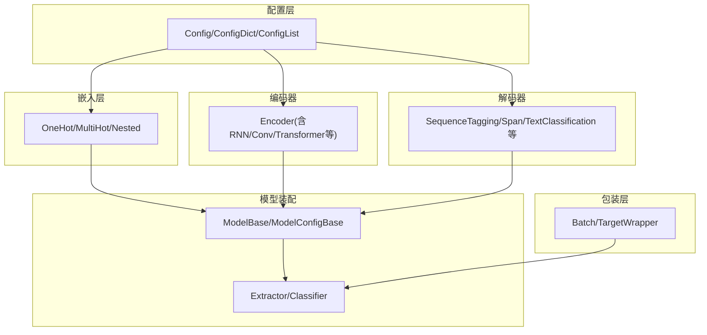
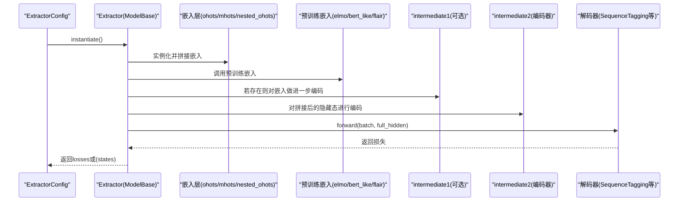
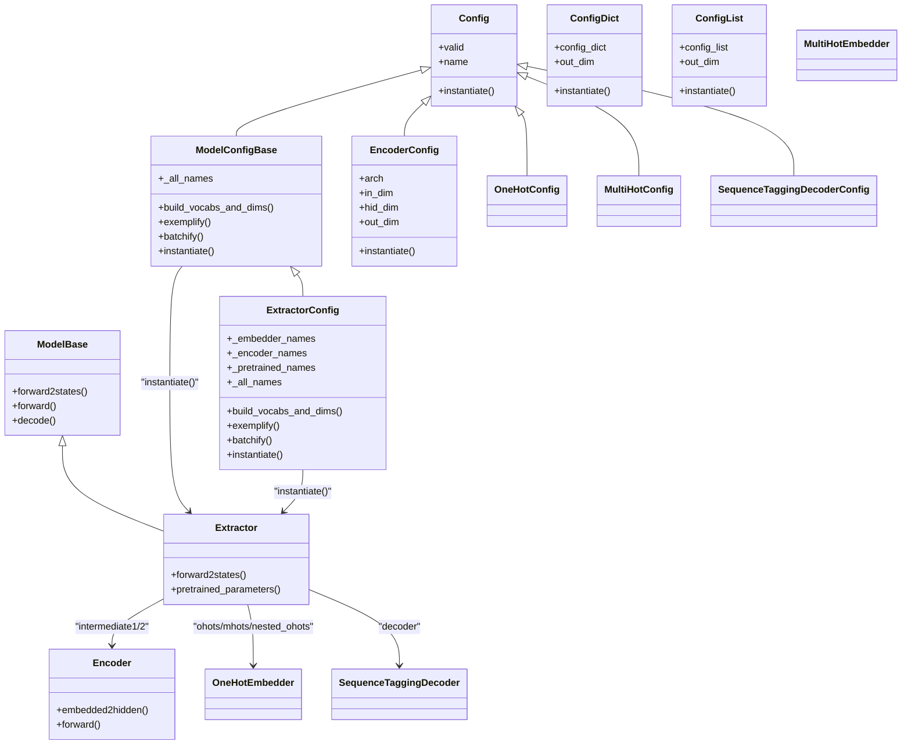
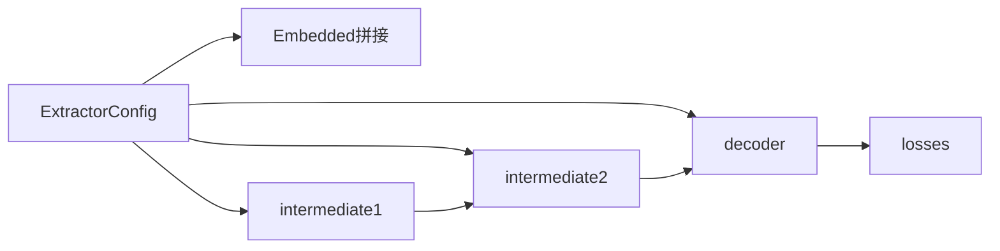

# 模型组件管理

<cite>
**本文引用的文件列表**
- [eznlp/config.py](file://eznlp/config.py)
- [eznlp/wrapper.py](file://eznlp/wrapper.py)
- [eznlp/model/model/base.py](file://eznlp/model/model/base.py)
- [eznlp/model/model/extractor.py](file://eznlp/model/model/extractor.py)
- [eznlp/model/model/classifier.py](file://eznlp/model/model/classifier.py)
- [eznlp/model/encoder.py](file://eznlp/model/encoder.py)
- [eznlp/model/embedder.py](file://eznlp/model/embedder.py)
- [eznlp/model/nested_embedder.py](file://eznlp/model/nested_embedder.py)
- [eznlp/model/decoder/base.py](file://eznlp/model/decoder/base.py)
- [eznlp/model/decoder/sequence_tagging.py](file://eznlp/model/decoder/sequence_tagging.py)
- [tests/model/test_text_classification.py](file://tests/model/test_text_classification.py)
- [scripts/text_classification.py](file://scripts/text_classification.py)
</cite>

## 目录
1. [引言](#引言)
2. [项目结构](#项目结构)
3. [核心组件](#核心组件)
4. [架构总览](#架构总览)
5. [详细组件分析](#详细组件分析)
6. [依赖关系分析](#依赖关系分析)
7. [性能考量](#性能考量)
8. [故障排查指南](#故障排查指南)
9. [结论](#结论)
10. [附录：配置与替换示例路径](#附录配置与替换示例路径)

## 引言
本文件系统性解析eznlp中模型组件的管理机制，重点围绕ExtractorConfig如何作为中心枢纽协调嵌入层、编码器与解码器的配置与实例化；阐述ModelWrapper在封装训练、评估与预测通用逻辑中的作用；梳理组件间依赖关系与调用流程（编码器输出作为解码器输入）；并结合测试与脚本示例，展示如何通过配置文件灵活替换不同类型的编码器（如LSTM与Transformer）或解码器（如序列标注与Span分类），实现模型架构的快速迭代与参数传递机制。

## 项目结构
eznlp采用“配置驱动”的模块化设计：
- 配置层：以Config/ConfigDict/ConfigList为核心，统一描述组件的参数、维度与实例化入口
- 组件层：嵌入层（OneHot/MultiHot/Nested）、编码器（RNN/Conv/Transformer等）、解码器（序列标注、分类、关系抽取等）
- 模型层：Extractor/Classifier等高层装配器，负责将组件按拓扑顺序组合，并提供forward/decode接口
- 包装层：Batch/TargetWrapper等，统一数据与目标的组织方式

图表来源
- [eznlp/config.py](file://eznlp/config.py#L20-L173)
- [eznlp/model/model/base.py](file://eznlp/model/model/base.py#L10-L99)
- [eznlp/model/embedder.py](file://eznlp/model/embedder.py#L51-L248)
- [eznlp/model/encoder.py](file://eznlp/model/encoder.py#L15-L375)
- [eznlp/model/decoder/base.py](file://eznlp/model/decoder/base.py#L52-L114)
- [eznlp/model/model/extractor.py](file://eznlp/model/model/extractor.py#L23-L274)
- [eznlp/model/model/classifier.py](file://eznlp/model/model/classifier.py#L16-L249)
- [eznlp/wrapper.py](file://eznlp/wrapper.py#L39-L122)

章节来源
- [eznlp/config.py](file://eznlp/config.py#L20-L173)
- [eznlp/model/model/base.py](file://eznlp/model/model/base.py#L10-L99)
- [eznlp/model/model/extractor.py](file://eznlp/model/model/extractor.py#L23-L110)
- [eznlp/model/model/classifier.py](file://eznlp/model/model/classifier.py#L16-L91)

## 核心组件
- 配置基类与容器
  - Config：抽象配置基类，提供valid/name/instantiate等约定
  - ConfigDict/ConfigList：有序字典/列表式配置容器，支持批量实例化
- 模型配置与装配
  - ModelConfigBase：定义模型装配的命名规范与维度计算
  - ModelBase：根据配置动态构建子模块（嵌入、编码、解码），并提供forward/decode
- 典型装配器
  - ExtractorConfig/Extractor：面向抽取任务（序列标注、Span分类等）
  - ClassifierConfig/Classifier：面向文本分类任务
- 编码器
  - EncoderConfig/Encoder族：统一支持Identity/FFN/LSTM/GRU/Conv/Gehring/Transformer等
- 嵌入层
  - OneHot/MultiHot/Nested嵌入器及其配置
- 解码器
  - DecoderBase/SingleDecoderConfigBase及具体实现（序列标注、分类等）

章节来源
- [eznlp/config.py](file://eznlp/config.py#L20-L173)
- [eznlp/model/model/base.py](file://eznlp/model/model/base.py#L10-L99)
- [eznlp/model/model/extractor.py](file://eznlp/model/model/extractor.py#L23-L110)
- [eznlp/model/model/classifier.py](file://eznlp/model/model/classifier.py#L16-L91)
- [eznlp/model/encoder.py](file://eznlp/model/encoder.py#L15-L90)
- [eznlp/model/embedder.py](file://eznlp/model/embedder.py#L51-L140)
- [eznlp/model/decoder/base.py](file://eznlp/model/decoder/base.py#L52-L114)

## 架构总览
下图展示了Extractor装配器从配置到实例化的整体流程，以及forward/decode的调用链路。

图表来源
- [eznlp/model/model/extractor.py](file://eznlp/model/model/extractor.py#L111-L209)
- [eznlp/model/model/base.py](file://eznlp/model/model/base.py#L64-L99)
- [eznlp/model/decoder/sequence_tagging.py](file://eznlp/model/decoder/sequence_tagging.py#L143-L198)

章节来源
- [eznlp/model/model/extractor.py](file://eznlp/model/model/extractor.py#L111-L209)
- [eznlp/model/model/base.py](file://eznlp/model/model/base.py#L64-L99)
- [eznlp/model/decoder/sequence_tagging.py](file://eznlp/model/decoder/sequence_tagging.py#L143-L198)

## 详细组件分析

### ExtractorConfig：中心枢纽
- 角色定位
  - 定义Extractor装配器的配置拓扑：嵌入层（ohots/mhots/nested_ohots）、预训练嵌入（elmo/bert_like/flair_fw/flair_bw）、中间编码器（intermediate1/intermediate2）、解码器（decoder）
  - 提供维度计算（full_emb_dim/full_hid_dim）、数据示例化（exemplify/batchify）与实例化入口（instantiate）
- 关键能力
  - 维度衔接：在build_vocabs_and_dims中设置intermediate1/intermediate2/in_dim与decoder.in_dim，确保前后一致
  - 数据桥接：exemplify/batchify将嵌入、预训练特征与解码目标统一为batch字典
  - 灵活解码器：支持字符串到具体解码器配置的映射（如sequence_tagging/span_classification等）
- 与ModelBase协作
  - ModelBase依据ExtractorConfig._all_names自动实例化各子模块，并在forward中先调用forward2states获取states，再交由decoder执行损失计算

章节来源
- [eznlp/model/model/extractor.py](file://eznlp/model/model/extractor.py#L23-L110)
- [eznlp/model/model/extractor.py](file://eznlp/model/model/extractor.py#L111-L209)
- [eznlp/model/model/base.py](file://eznlp/model/model/base.py#L64-L99)

### ModelWrapper：数据与目标包装
- Batch/TargetWrapper/TensorWrapper
  - 将张量与属性统一封装，支持递归to/cuda/pin_memory等操作
  - TargetWrapper区分训练/推理场景，避免在解码时暴露不应使用的黄金信息
- 在Extractor装配中的作用
  - Extractor.forward2states返回包含full_hidden的状态字典，供decoder使用
  - decode阶段可直接复用已计算的states，避免重复计算

章节来源
- [eznlp/wrapper.py](file://eznlp/wrapper.py#L39-L122)
- [eznlp/model/model/base.py](file://eznlp/model/model/base.py#L81-L99)

### 编码器：统一接口与多架构支持
- EncoderConfig
  - 支持arch：identity/ffn/lstm/gru/conv/gehring/transformer
  - 统一in_dim/hid_dim/层数/丢弃率等参数，out_dim考虑shortcut
- Encoder族
  - Identity/FFN：线性变换与前馈堆叠
  - RNN（LSTM/GRU）：双向、打包/解包序列、可学习初始隐状态
  - Conv/Gehring：卷积堆叠，Gehring带GLU与残差缩放
  - Transformer：多头注意力与前馈堆叠，可选emb->hid初始化
- 与Extractor的衔接
  - Extractor在_get_full_hidden中将嵌入与预训练特征拼接后送入intermediate2（若存在），得到full_hidden供解码器使用

章节来源
- [eznlp/model/encoder.py](file://eznlp/model/encoder.py#L15-L90)
- [eznlp/model/encoder.py](file://eznlp/model/encoder.py#L91-L375)
- [eznlp/model/model/extractor.py](file://eznlp/model/model/extractor.py#L211-L274)

### 嵌入层：多形态特征融合
- OneHotConfig/OneHotEmbedder
  - 支持特殊符号、可选位置编码、冻结/重初始化策略
- MultiHotConfig/MultiHotEmbedder
  - 数值型特征可选线性映射
- Nested嵌入（NestedOneHotConfig/SoftLexiconConfig/CharConfig）
  - 支持通道化内序列（如字符、软词典），可选内部编码器与聚合模式（池化/RNN最后步等）
- 与Extractor的衔接
  - Extractor将ohots/mhots/nested_ohots拼接为embedded，再进入intermediate1（若存在）

章节来源
- [eznlp/model/embedder.py](file://eznlp/model/embedder.py#L51-L140)
- [eznlp/model/embedder.py](file://eznlp/model/embedder.py#L141-L248)
- [eznlp/model/nested_embedder.py](file://eznlp/model/nested_embedder.py#L15-L151)
- [eznlp/model/nested_embedder.py](file://eznlp/model/nested_embedder.py#L152-L309)
- [eznlp/model/model/extractor.py](file://eznlp/model/model/extractor.py#L211-L249)

### 解码器：序列标注与分类
- DecoderBase/SingleDecoderConfigBase
  - 统一损失函数选择（交叉熵/BCE/焦点损失/标签平滑），支持多标签与置信阈值
- SequenceTaggingDecoderConfig/Decoder
  - 支持CRF或交叉熵，提供tags->chunks转换工具，返回微平均F1等指标
- 与Extractor的衔接
  - Extractor.forward2states返回states（含full_hidden），解码器在forward中计算损失，在decode中生成实体边界

章节来源
- [eznlp/model/decoder/base.py](file://eznlp/model/decoder/base.py#L52-L114)
- [eznlp/model/decoder/sequence_tagging.py](file://eznlp/model/decoder/sequence_tagging.py#L93-L198)
- [eznlp/model/model/extractor.py](file://eznlp/model/model/extractor.py#L272-L274)

### 类关系图（代码级）

图表来源
- [eznlp/config.py](file://eznlp/config.py#L20-L173)
- [eznlp/model/model/base.py](file://eznlp/model/model/base.py#L10-L99)
- [eznlp/model/model/extractor.py](file://eznlp/model/model/extractor.py#L23-L110)
- [eznlp/model/encoder.py](file://eznlp/model/encoder.py#L15-L90)
- [eznlp/model/embedder.py](file://eznlp/model/embedder.py#L51-L140)
- [eznlp/model/decoder/sequence_tagging.py](file://eznlp/model/decoder/sequence_tagging.py#L93-L198)

## 依赖关系分析
- 组件耦合与内聚
  - ExtractorConfig高内聚地管理嵌入、编码、解码三类组件的配置与维度衔接，降低上层调用复杂度
  - ModelBase通过反射式遍历_config._all_names，实现低耦合的装配
- 外部依赖
  - 编码器依赖nn.modules（RNN/Conv/Transformer等模块）
  - 解码器依赖metrics/nn.utils等工具模块
- 参数传递链路
  - Embedding维度通过ExtractorConfig.build_vocabs_and_dims设置intermediate1/intermediate2/in_dim
  - intermediate2的out_dim传给decoder.in_dim，形成端到端的维度一致性

图表来源
- [eznlp/model/model/extractor.py](file://eznlp/model/model/extractor.py#L111-L209)
- [eznlp/model/model/base.py](file://eznlp/model/model/base.py#L81-L99)

章节来源
- [eznlp/model/model/extractor.py](file://eznlp/model/model/extractor.py#L111-L209)
- [eznlp/model/model/base.py](file://eznlp/model/model/base.py#L81-L99)

## 性能考量
- 计算复用
  - ModelBase.forward返回states供decode复用，避免重复编码
- 序列处理
  - RNN编码器使用pack/pad策略处理变长序列，减少填充开销
- 参数共享
  - 预训练嵌入参数可通过pretrained_parameters单独优化，便于冻结/热启策略
- 内存与设备迁移
  - TensorWrapper/Batch支持to/cuda/pin_memory，便于分布式与GPU加速

章节来源
- [eznlp/model/model/base.py](file://eznlp/model/model/base.py#L81-L99)
- [eznlp/model/encoder.py](file://eznlp/model/encoder.py#L188-L252)
- [eznlp/wrapper.py](file://eznlp/wrapper.py#L39-L122)

## 故障排查指南
- 配置有效性
  - 使用Config.valid与ModelConfigBase.valid检查各子配置是否完备
- 维度不匹配
  - 确认ExtractorConfig.build_vocabs_and_dims正确设置了in_dim/out_dim链路
- 解码器不兼容
  - 确保decoder.in_dim与intermediate2.out_dim一致
- 预训练嵌入与分词
  - 若bert_like.from_tokenized=False，需确保输入mask/seq_lens被替换为subword级别
- 训练/推理一致性
  - 使用tests中的断言方法验证batch滑窗一致性与预测一致性

章节来源
- [eznlp/config.py](file://eznlp/config.py#L20-L173)
- [eznlp/model/model/classifier.py](file://eznlp/model/model/classifier.py#L60-L91)
- [tests/model/test_text_classification.py](file://tests/model/test_text_classification.py#L1-L105)

## 结论
ExtractorConfig作为中心枢纽，通过统一的配置容器、维度计算与实例化流程，将嵌入层、编码器与解码器有机串联。ModelBase提供稳定的装配与调用框架，配合Batch/TargetWrapper实现训练、评估与预测的通用逻辑。借助ConfigDict/ConfigList与多架构编码器/解码器，用户可快速替换不同编码器（LSTM/Transformer）或解码器（序列标注/Span分类），实现模型架构的敏捷迭代。

## 附录：配置与替换示例路径
- 替换编码器架构（LSTM/Transformer）
  - 示例路径：[scripts/text_classification.py](file://scripts/text_classification.py#L92-L100)
  - 示例路径：[tests/model/test_text_classification.py](file://tests/model/test_text_classification.py#L53-L79)
- 替换解码器类型（序列标注/Span分类）
  - 示例路径：[eznlp/model/model/extractor.py](file://eznlp/model/model/extractor.py#L50-L89)
  - 示例路径：[eznlp/model/decoder/sequence_tagging.py](file://eznlp/model/decoder/sequence_tagging.py#L93-L141)
- 预训练嵌入接入（BERT-like）
  - 示例路径：[tests/model/test_text_classification.py](file://tests/model/test_text_classification.py#L80-L95)
- 批次一致性与预测
  - 示例路径：[tests/model/test_text_classification.py](file://tests/model/test_text_classification.py#L15-L52)