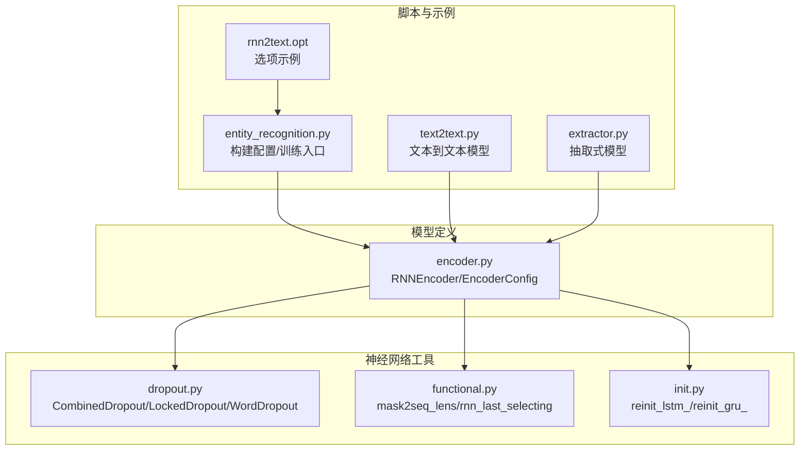
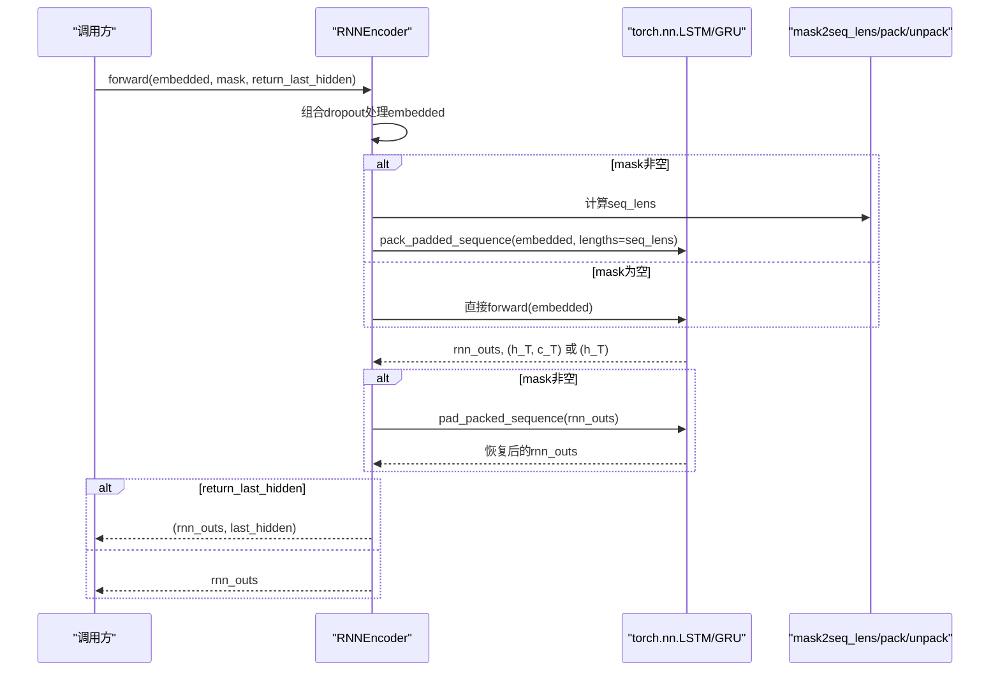
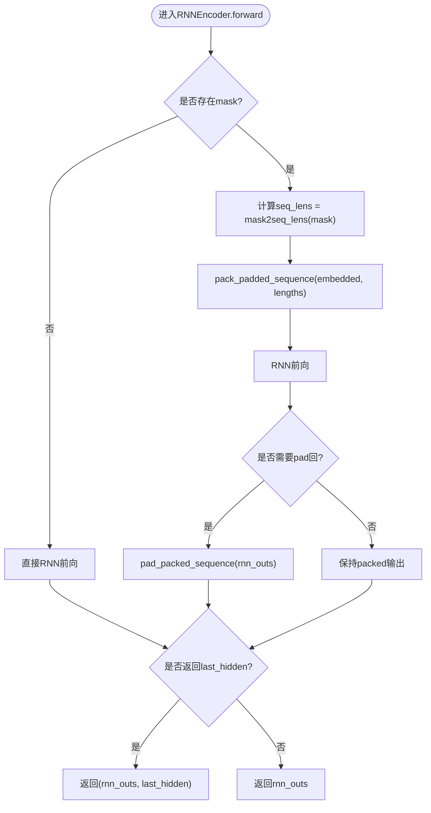
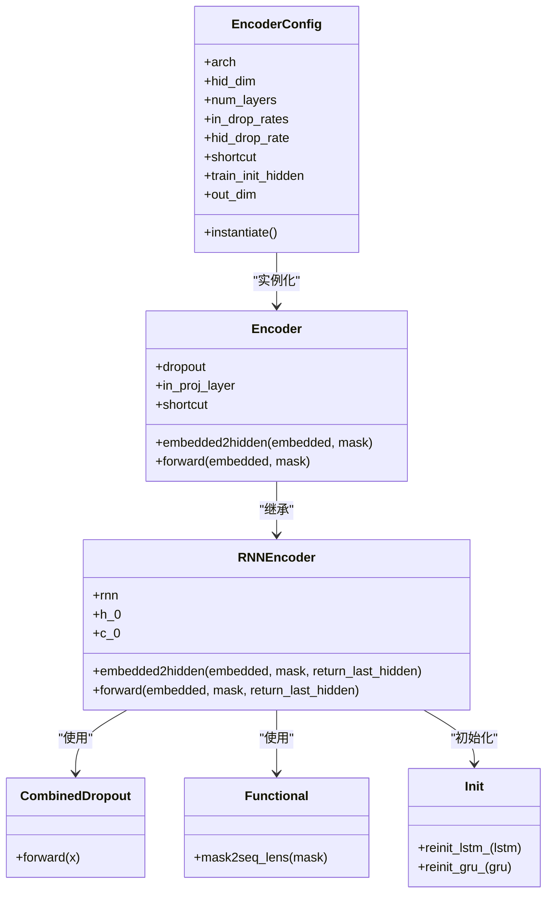

# LSTM/GRU编码器

<cite>
**本文引用的文件列表**
- [encoder.py](file://eznlp/model/encoder.py)
- [dropout.py](file://eznlp/nn/modules/dropout.py)
- [functional.py](file://eznlp/nn/functional.py)
- [init.py](file://eznlp/nn/init.py)
- [entity_recognition.py](file://scripts/entity_recognition.py)
- [text2text.py](file://eznlp/model/model/text2text.py)
- [extractor.py](file://eznlp/model/model/extractor.py)
- [rnn2text.opt](file://scripts/options/rnn2text.opt)
</cite>

## 目录
1. [简介](#简介)
2. [项目结构](#项目结构)
3. [核心组件](#核心组件)
4. [架构总览](#架构总览)
5. [组件详解](#组件详解)
6. [依赖关系分析](#依赖关系分析)
7. [性能考量](#性能考量)
8. [故障排查指南](#故障排查指南)
9. [结论](#结论)

## 简介
本文件系统性解析eznlp中RNNEncoder的实现机制，聚焦于LSTM与GRU两类循环神经网络的配置参数（如train_init_hidden、num_layers、in_drop_rates、hid_drop_rate）的作用；解释双向RNN的隐藏状态初始化策略；阐述pack_padded_sequence在变长序列处理中的性能优化原理；并结合配置示例说明如何灵活构建深层双向RNN模型。同时，深入讨论dropout在输入层与隐藏层的不同应用策略，RNN输出与shortcut连接的融合方式，以及last_hidden状态返回机制在下游任务中的典型应用场景。

## 项目结构
与RNNEncoder直接相关的核心文件位于eznlp/model/encoder.py，配套的dropout模块位于eznlp/nn/modules/dropout.py，序列长度转换工具位于eznlp/nn/functional.py，权重重初始化工具位于eznlp/nn/init.py。脚本层面的使用示例可见scripts/entity_recognition.py与eznlp/model/model/text2text.py、eznlp/model/model/extractor.py等。

图表来源
- [encoder.py](file://eznlp/model/encoder.py#L1-L252)
- [dropout.py](file://eznlp/nn/modules/dropout.py#L1-L92)
- [functional.py](file://eznlp/nn/functional.py#L1-L120)
- [init.py](file://eznlp/nn/init.py#L103-L169)
- [entity_recognition.py](file://scripts/entity_recognition.py#L333-L501)
- [text2text.py](file://eznlp/model/model/text2text.py#L1-L94)
- [extractor.py](file://eznlp/model/model/extractor.py#L1-L274)
- [rnn2text.opt](file://scripts/options/rnn2text.opt#L1-L14)

章节来源
- [encoder.py](file://eznlp/model/encoder.py#L1-L252)
- [dropout.py](file://eznlp/nn/modules/dropout.py#L1-L92)
- [functional.py](file://eznlp/nn/functional.py#L1-L120)
- [init.py](file://eznlp/nn/init.py#L103-L169)
- [entity_recognition.py](file://scripts/entity_recognition.py#L333-L501)
- [text2text.py](file://eznlp/model/model/text2text.py#L1-L94)
- [extractor.py](file://eznlp/model/model/extractor.py#L1-L274)
- [rnn2text.opt](file://scripts/options/rnn2text.opt#L1-L14)

## 核心组件
- EncoderConfig：统一管理编码器配置，包括arch、hid_dim、num_layers、in_drop_rates、hid_drop_rate、shortcut、train_init_hidden等；对LSTM/GRU分支设置双向、隐藏维度为hid_dim的一半、根据层数决定是否启用隐藏层dropout。
- RNNEncoder：基于torch.nn.LSTM或torch.nn.GRU实现双向RNN；支持可学习的初始隐藏状态（h_0/c_0），并在mask存在时使用pack_padded_sequence进行高效处理；提供返回last_hidden的能力。
- CombinedDropout：组合多种dropout策略（标准dropout、locked dropout、word dropout），用于输入层与中间层的正则化。
- functional.mask2seq_lens：将mask转换为有效长度，供pack/unpack使用。
- init.reinit_lstm_/reinit_gru_：针对LSTM/GRU的偏置与权重进行特定初始化，提升训练稳定性。

章节来源
- [encoder.py](file://eznlp/model/encoder.py#L15-L75)
- [encoder.py](file://eznlp/model/encoder.py#L158-L252)
- [dropout.py](file://eznlp/nn/modules/dropout.py#L1-L92)
- [functional.py](file://eznlp/nn/functional.py#L22-L26)
- [init.py](file://eznlp/nn/init.py#L103-L169)

## 架构总览
RNNEncoder作为通用Encoder的子类，遵循“嵌入→Dropout→RNN→可选shortcut”的通用流程。其内部以双向LSTM/GRU为核心，隐藏维度为hid_dim的一半（双向拼接后恢复为hid_dim）。当配置了train_init_hidden时，会学习初始隐藏状态；当传入mask时，先pack再forward，再pad回原形状，确保变长序列的高效处理。

图表来源
- [encoder.py](file://eznlp/model/encoder.py#L188-L251)
- [functional.py](file://eznlp/nn/functional.py#L22-L26)

章节来源
- [encoder.py](file://eznlp/model/encoder.py#L188-L251)
- [functional.py](file://eznlp/nn/functional.py#L22-L26)

## 组件详解

### 配置参数与作用
- arch：选择LSTM或GRU；RNNEncoder仅在arch为"lstm"/"gru"时实例化。
- hid_dim：RNN隐藏维度；RNNEncoder内部以hidden_size=hid_dim//2创建双向RNN，最终输出维度为hid_dim。
- num_layers：RNN层数；当num_layers<=1时不启用隐藏层dropout，否则使用hid_drop_rate。
- in_drop_rates：输入层dropout策略，由CombinedDropout组合实现，包含标准dropout、locked dropout、word dropout三者之一或组合。
- hid_drop_rate：隐藏层dropout率，仅在num_layers>1时生效。
- shortcut：是否将RNN输出与原始嵌入拼接作为最终输出。
- train_init_hidden：是否学习初始隐藏状态h_0（及LSTM的c_0）；若开启，则参数维度为(num_layers*2, 1, hid_dim//2)，并通过expand广播到批次大小。

章节来源
- [encoder.py](file://eznlp/model/encoder.py#L15-L75)
- [encoder.py](file://eznlp/model/encoder.py#L158-L207)
- [dropout.py](file://eznlp/nn/modules/dropout.py#L1-L92)

### 双向RNN隐藏状态初始化
- 当train_init_hidden为True时，RNNEncoder会创建可学习的h_0（及LSTM的c_0），形状为(num_layers*2, 1, hid_dim//2)。在forward阶段，这些参数会被扩展为(batch, hid_dim//2)的形状，然后作为初始状态传入RNN。
- 对于LSTM，同时初始化h_0与c_0；对于GRU，仅初始化h_0。
- 这种设计允许模型从可学习的初始状态开始，有助于稳定深层双向RNN的训练。

章节来源
- [encoder.py](file://eznlp/model/encoder.py#L177-L186)

### 变长序列处理与pack_padded_sequence优化
- RNNEncoder在mask非空时，先将embedded按有效长度进行pack，避免填充部分的无效计算，显著减少时间复杂度与内存占用。
- 使用mask2seq_lens从mask推导真实长度，确保pack/unpack的正确性。
- 在RNN前向结束后，若需要，再将rnn_outs pad回原形状，以便后续层使用。

图表来源
- [encoder.py](file://eznlp/model/encoder.py#L201-L219)
- [functional.py](file://eznlp/nn/functional.py#L22-L26)

章节来源
- [encoder.py](file://eznlp/model/encoder.py#L201-L219)
- [functional.py](file://eznlp/nn/functional.py#L22-L26)

### 输入层与隐藏层dropout策略
- 输入层dropout：通过CombinedDropout对embedded进行组合dropout，支持标准dropout、locked dropout与word dropout。该策略在Encoder基类中统一应用，随后进入RNN。
- 隐藏层dropout：仅在num_layers>1时启用，且dropout值来自hid_drop_rate。RNNEncoder在构造RNN时将dropout设为0或hid_drop_rate，从而在深层RNN中引入隐藏状态正则化。
- 该分层策略兼顾了输入噪声注入与隐藏状态稳定性，有助于缓解过拟合并提升泛化能力。

章节来源
- [encoder.py](file://eznlp/model/encoder.py#L91-L121)
- [encoder.py](file://eznlp/model/encoder.py#L158-L176)
- [dropout.py](file://eznlp/nn/modules/dropout.py#L1-L92)

### RNN输出与shortcut连接
- 若shortcut为True，RNNEncoder会在forward中将RNN输出与原始embedded在最后一维拼接，输出维度为hid_dim+in_dim。
- 当return_last_hidden为True时，shortcut逻辑会将返回元组的第一个元素（rnn_outs）与embedded拼接，第二个元素（last_hidden）保持不变，便于下游任务获取last_hidden。

章节来源
- [encoder.py](file://eznlp/model/encoder.py#L117-L121)
- [encoder.py](file://eznlp/model/encoder.py#L245-L249)

### last_hidden状态返回机制
- 当return_last_hidden为True时，RNNEncoder会返回(rnn_outs, last_hidden)二元组；否则仅返回rnn_outs。
- last_hidden通常用于下游分类或生成任务，例如在序列标注中作为全局表示，在文本生成中作为上下文编码的起点。
- 在某些场景下，last_hidden可由rnn_last_selecting辅助提取双向RNN的首尾状态拼接，作为句子级表征。

章节来源
- [encoder.py](file://eznlp/model/encoder.py#L220-L224)
- [encoder.py](file://eznlp/model/encoder.py#L246-L249)
- [functional.py](file://eznlp/nn/functional.py#L82-L97)

### LSTM/GRU权重初始化
- reinit_lstm_与reinit_gru_分别对LSTM/GRU的偏置与权重进行特定初始化，以改善梯度流动与收敛速度。
- LSTM对forget gate偏置进行特殊初始化，GRU对各门控与候选状态采用不同非线性激活对应的增益初始化。

章节来源
- [init.py](file://eznlp/nn/init.py#L103-L169)

### 配置示例与灵活构建深层双向RNN
- 在脚本中可通过命令行参数或配置字典设置RNNEncoder参数，如hid_dim、num_layers、enc_arch等。
- 示例：在entity_recognition.py中，通过collect_IE_assembly_config与build_ER_config构建包含intermediate1/intermediate2的编码器链路，其中intermediate2可配置为RNNEncoder（arch="LSTM"/"GRU"），并设置hid_dim、num_layers、in_drop_rates等。
- 文本到文本模型text2text.py中，也可直接将encoder配置为RNNEncoder，实现端到端的序列建模。

章节来源
- [entity_recognition.py](file://scripts/entity_recognition.py#L333-L501)
- [text2text.py](file://eznlp/model/model/text2text.py#L1-L94)
- [rnn2text.opt](file://scripts/options/rnn2text.opt#L1-L14)

## 依赖关系分析
RNNEncoder依赖于以下模块：
- torch.nn.LSTM/GRU：核心循环单元。
- CombinedDropout：输入层正则化。
- mask2seq_lens：变长序列长度转换。
- reinit_lstm_/reinit_gru_：权重初始化。
- EncoderConfig：统一配置入口。

图表来源
- [encoder.py](file://eznlp/model/encoder.py#L15-L75)
- [encoder.py](file://eznlp/model/encoder.py#L91-L121)
- [encoder.py](file://eznlp/model/encoder.py#L158-L252)
- [dropout.py](file://eznlp/nn/modules/dropout.py#L1-L92)
- [functional.py](file://eznlp/nn/functional.py#L22-L26)
- [init.py](file://eznlp/nn/init.py#L103-L169)

章节来源
- [encoder.py](file://eznlp/model/encoder.py#L15-L75)
- [encoder.py](file://eznlp/model/encoder.py#L91-L121)
- [encoder.py](file://eznlp/model/encoder.py#L158-L252)
- [dropout.py](file://eznlp/nn/modules/dropout.py#L1-L92)
- [functional.py](file://eznlp/nn/functional.py#L22-L26)
- [init.py](file://eznlp/nn/init.py#L103-L169)

## 性能考量
- pack_padded_sequence显著降低无效填充的计算开销，尤其在长序列与大批量场景下收益明显。
- 双向RNN输出维度为hid_dim，但内部以hid_dim//2存储，避免重复参数规模，同时保留双向信息。
- hid_drop_rate仅在多层时启用，避免单层RNN引入不必要的正则化。
- train_init_hidden会增加少量参数，但通常带来更好的收敛稳定性，适合深层双向RNN。

[本节为通用指导，不直接分析具体文件]

## 故障排查指南
- 变长序列未传入mask：若数据存在padding但未提供mask，RNNEncoder仍可正常运行，但无法利用pack优化，建议始终提供正确的mask。
- 返回last_hidden的下游使用：当return_last_hidden=True时，需注意下游解码器或分类器接收的是二元组，应正确解包使用。
- shortcut与out_dim：开启shortcut会改变输出维度，需确保下游模块的in_dim与out_dim一致。
- 初始化问题：若遇到训练不稳定，可检查是否使用了reinit_lstm_/reinit_gru_，或适当调整in_drop_rates与hid_drop_rate。

章节来源
- [encoder.py](file://eznlp/model/encoder.py#L220-L224)
- [encoder.py](file://eznlp/model/encoder.py#L245-L249)
- [encoder.py](file://eznlp/model/encoder.py#L66-L75)

## 结论
eznlp的RNNEncoder以简洁而稳健的方式实现了双向LSTM/GRU编码器，通过train_init_hidden、in_drop_rates、hid_drop_rate与shortcut等配置，提供了灵活的深度双向RNN建模能力。配合pack_padded_sequence与mask2seq_lens，RNNEncoder在变长序列上实现了高效的前向传播。结合脚本与模型封装，RNNEncoder可无缝融入抽取式与生成式任务，为下游应用提供高质量的序列表征与last_hidden状态。