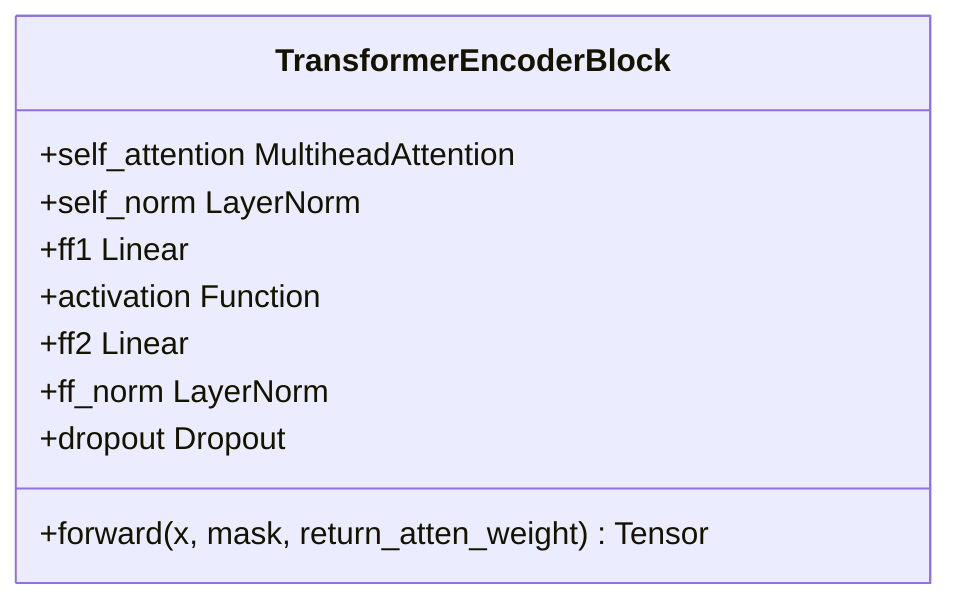
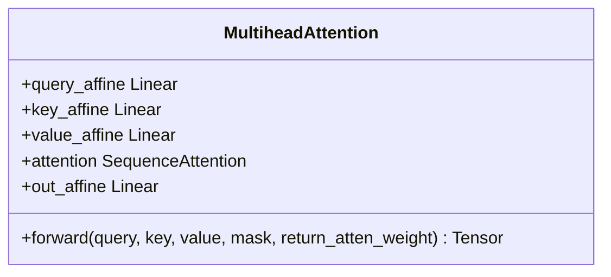
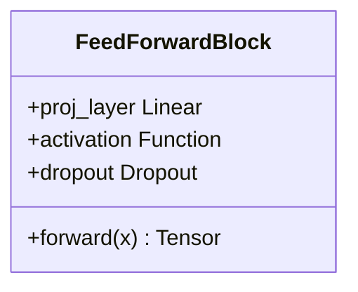
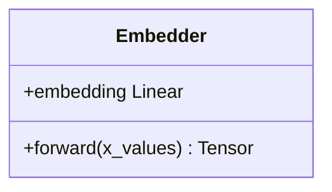
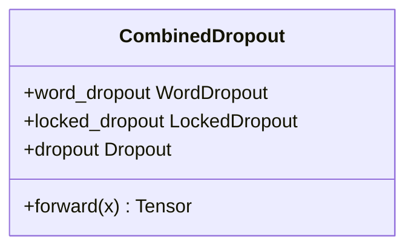

# Transformer编码器

<cite>
**本文档引用的文件**   
- [block.py](file://eznlp/nn/modules/block.py)
- [attention.py](file://eznlp/nn/modules/attention.py)
- [embedder.py](file://eznlp/model/embedder.py)
- [config.py](file://eznlp/config.py)
- [encoder.py](file://eznlp/model/encoder.py)
</cite>

## 目录
1. [引言](#引言)
2. [Transformer编码器架构](#transformer编码器架构)
3. [TransformerEncoderBlock实现细节](#transformerencoderblock实现细节)
4. [多头注意力机制](#多头注意力机制)
5. [前馈网络配置](#前馈网络配置)
6. [维度映射与use_emb2init_hid参数](#维度映射与use_emb2init_hid参数)
7. [dropout策略与hid_drop_rate应用](#dropout策略与hid_drop_rate应用)
8. [关键参数对模型容量的影响](#关键参数对模型容量的影响)
9. [自注意力掩码在序列建模中的作用](#自注意力掩码在序列建模中的作用)
10. [长距离依赖建模优势](#长距离依赖建模优势)
11. [与RNN、CNN架构的性能权衡](#与rnn、cnn架构的性能权衡)

## 引言
Transformer编码器作为一种先进的神经网络架构，在自然语言处理领域展现出卓越的性能。本文将深入剖析Transformer编码器的实现细节，重点解析其核心组件TransformerEncoderBlock的堆叠结构、多头注意力机制和前馈网络配置。我们将探讨use_emb2init_hid参数在维度映射中的作用，以及hid_drop_rate在各层间的差异化应用策略。通过分析num_heads、ff_dim等关键参数对模型容量的影响，揭示自注意力掩码在序列建模中的重要性，并比较Transformer编码器与传统RNN、CNN架构在长距离依赖建模中的性能差异。

## Transformer编码器架构
Transformer编码器采用堆叠式架构，由多个TransformerEncoderBlock组成，每个块包含自注意力机制和前馈网络两个核心组件。这种堆叠结构允许模型在不同抽象层次上捕获序列信息，通过多层处理逐步提取更复杂的特征表示。编码器接收输入序列的嵌入表示，经过多层变换后输出上下文感知的隐藏状态序列。整个架构通过残差连接和层归一化确保训练稳定性，同时利用位置编码保留序列的顺序信息。

**Section sources**
- [block.py](file://eznlp/nn/modules/block.py#L104-L151)

## TransformerEncoderBlock实现细节
TransformerEncoderBlock是Transformer编码器的基本构建单元，包含自注意力子层和前馈网络子层。每个子层都采用残差连接和层归一化，确保信息流动和训练稳定性。在前向传播过程中，输入首先通过自注意力机制计算序列内各位置之间的相关性，然后将输出传递给前馈网络进行非线性变换。两个子层都应用dropout以防止过拟合，同时通过掩码机制处理变长序列的填充位置。

**Diagram sources**
- [block.py](file://eznlp/nn/modules/block.py#L104-L151)

**Section sources**
- [block.py](file://eznlp/nn/modules/block.py#L104-L151)

## 多头注意力机制
多头注意力机制通过并行计算多个注意力头来捕获不同子空间的语义信息。每个注意力头独立计算查询、键和值之间的相关性，然后将所有头的输出拼接并线性变换为最终结果。这种机制允许模型同时关注序列的不同位置和特征维度，增强了表示能力。在实现中，输入首先通过线性变换投影到查询、键和值空间，然后计算注意力分数并加权求和得到输出。

**Diagram sources**
- [attention.py](file://eznlp/nn/modules/attention.py#L235-L297)

**Section sources**
- [attention.py](file://eznlp/nn/modules/attention.py#L235-L297)

## 前馈网络配置
前馈网络由两个线性变换层和一个非线性激活函数组成，用于对自注意力输出进行非线性变换。第一个线性层将输入维度扩展到更高的隐藏维度（ff_dim），第二个线性层将其映射回原始维度。这种"升维-降维"结构增加了模型的表达能力，同时通过残差连接保持信息流动。前馈网络在每个位置独立应用，不共享跨位置的参数，使其能够学习位置特定的特征变换。

**Diagram sources**
- [block.py](file://eznlp/nn/modules/block.py#L9-L25)

**Section sources**
- [block.py](file://eznlp/nn/modules/block.py#L9-L25)

## 维度映射与use_emb2init_hid参数
维度映射在Transformer编码器中起着关键作用，特别是在嵌入层与隐藏层之间的转换。use_emb2init_hid参数控制是否使用嵌入层的线性变换来初始化隐藏状态的维度。当启用时，输入特征通过线性层从in_dim映射到emb_dim，为后续的编码器层提供合适的输入维度。这种映射不仅调整了数据的表示空间，还通过可学习的参数增强了模型的适应能力，使其能够处理不同维度的输入特征。

**Diagram sources**
- [embedder.py](file://eznlp/model/embedder.py#L235-L247)

**Section sources**
- [embedder.py](file://eznlp/model/embedder.py#L235-L247)

## dropout策略与hid_drop_rate应用
dropout策略在Transformer编码器中采用分层应用的方式，hid_drop_rate参数控制隐藏层的dropout率。在实现中，dropout被应用于自注意力的输入、注意力输出和前馈网络的激活值，形成多点正则化。这种策略有效防止了过拟合，同时保持了模型的表达能力。不同层可能应用不同的dropout率，例如在输入嵌入层使用锁定dropout，在隐藏层使用标准dropout，形成差异化的正则化效果。

**Diagram sources**
- [block.py](file://eznlp/nn/modules/block.py#L128-L129)
- [dropout.py](file://eznlp/nn/modules/dropout.py#L41-L91)

**Section sources**
- [block.py](file://eznlp/nn/modules/block.py#L128-L129)
- [dropout.py](file://eznlp/nn/modules/dropout.py#L41-L91)

## 关键参数对模型容量的影响
关键参数如num_heads和ff_dim直接影响Transformer编码器的模型容量。num_heads决定了注意力机制的并行头数，更多的头允许模型捕获更丰富的特征交互，但也会增加计算复杂度。ff_dim控制前馈网络的隐藏维度，较大的ff_dim增强了模型的非线性变换能力，但可能导致过拟合。这些参数的选择需要在模型表达能力和计算效率之间进行权衡，通常根据任务复杂度和数据规模进行调整。

**Section sources**
- [block.py](file://eznlp/nn/modules/block.py#L106-L113)

## 自注意力掩码在序列建模中的作用
自注意力掩码在序列建模中起着至关重要的作用，主要用于处理变长序列和防止信息泄露。对于填充位置，掩码将对应位置的注意力分数设置为负无穷，确保这些位置不会影响有效位置的计算。在解码器中，还使用因果掩码防止未来信息泄露，确保每个位置只能关注其之前的位置。这种掩码机制使模型能够灵活处理不同长度的序列，同时保持自回归性质。

**Section sources**
- [block.py](file://eznlp/nn/modules/block.py#L136-L141)

## 长距离依赖建模优势
Transformer编码器在长距离依赖建模方面具有显著优势，主要得益于自注意力机制的全局感受野。与RNN的顺序处理不同，自注意力可以直接计算任意两个位置之间的相关性，无论它们的距离有多远。这种并行计算方式不仅提高了效率，还避免了RNN中梯度消失的问题。通过多层堆叠，Transformer能够建立复杂的层次化依赖关系，有效捕捉长距离的语义关联。

**Section sources**
- [block.py](file://eznlp/nn/modules/block.py#L136-L142)

## 与RNN、CNN架构的性能权衡
与RNN和CNN相比，Transformer编码器在性能上展现出独特的权衡。相对于RNN，Transformer具有并行计算优势，训练速度更快，且能更好地处理长距离依赖，但内存消耗更大。与CNN相比，Transformer不需要滑动窗口的局部感受野假设，能够捕获全局依赖，但对短距离模式的捕捉可能不如CNN高效。在实际应用中，选择哪种架构取决于具体任务的需求，如序列长度、计算资源和精度要求等因素。

**Section sources**
- [block.py](file://eznlp/nn/modules/block.py#L104-L151)
- [attention.py](file://eznlp/nn/modules/attention.py#L235-L297)