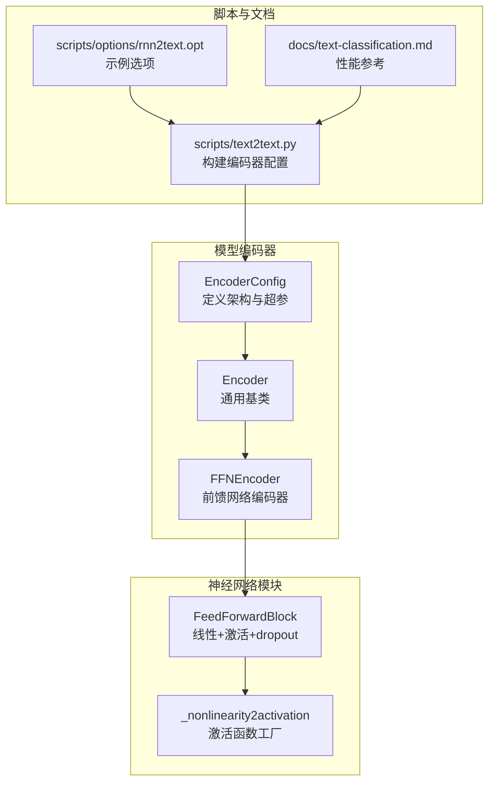
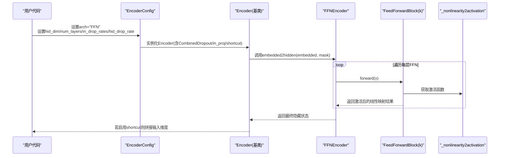
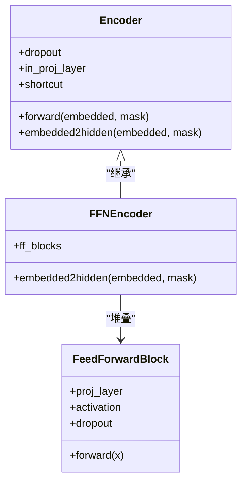

# 前馈网络编码器

<cite>
**本文引用的文件列表**
- [encoder.py](file://eznlp/model/encoder.py)
- [block.py](file://eznlp/nn/modules/block.py)
- [utils.py](file://eznlp/nn/utils.py)
- [text-classification.md](file://docs/text-classification.md)
- [text2text.py](file://scripts/text2text.py)
- [rnn2text.opt](file://scripts/options/rnn2text.opt)
</cite>

## 目录
1. [引言](#引言)
2. [项目结构](#项目结构)
3. [核心组件](#核心组件)
4. [架构总览](#架构总览)
5. [详细组件分析](#详细组件分析)
6. [依赖分析](#依赖分析)
7. [性能考量](#性能考量)
8. [故障排查指南](#故障排查指南)
9. [结论](#结论)
10. [附录](#附录)

## 引言
本文件围绕FFNEncoder（前馈网络编码器）的设计原理进行系统化解析，重点覆盖以下方面：
- FeedForwardBlock的堆叠机制与维度变换规则
- in_dim到hid_dim的映射过程
- 多层FFN中首层与后续层drop_rate的差异化配置策略
- 通过num_layers参数控制网络深度的方式
- in_proj投影层与shortcut连接在前馈架构中的协同作用
- FFN编码器在非序列建模任务中的优势与局限性，以及与RNN、Transformer架构的性能对比场景

## 项目结构
FFNEncoder位于模型编码器模块中，配合通用Encoder基类提供统一的输入输出接口；FeedForwardBlock定义于神经网络模块中，作为FFN堆叠的基本单元；激活函数工具由utils提供；脚本与文档展示了FFN在文本分类等任务中的配置与性能参考。



图表来源
- [encoder.py](file://eznlp/model/encoder.py#L1-L120)
- [block.py](file://eznlp/nn/modules/block.py#L1-L40)
- [utils.py](file://eznlp/nn/utils.py#L35-L50)
- [text2text.py](file://scripts/text2text.py#L87-L130)
- [rnn2text.opt](file://scripts/options/rnn2text.opt#L1-L14)
- [text-classification.md](file://docs/text-classification.md#L1-L93)

章节来源
- [encoder.py](file://eznlp/model/encoder.py#L1-L120)
- [block.py](file://eznlp/nn/modules/block.py#L1-L40)
- [utils.py](file://eznlp/nn/utils.py#L35-L50)
- [text2text.py](file://scripts/text2text.py#L87-L130)
- [rnn2text.opt](file://scripts/options/rnn2text.opt#L1-L14)
- [text-classification.md](file://docs/text-classification.md#L1-L93)

## 核心组件
- EncoderConfig：集中管理编码器架构类型、输入维度、隐藏维度、层数、dropout率等配置项，并根据arch选择具体编码器实例化。
- Encoder：通用基类，负责dropout组合、可选的in_proj线性投影、以及shortcut拼接输出。
- FFNEncoder：基于FeedForwardBlock的堆叠式前馈编码器，支持通过num_layers控制深度，首层与后续层采用不同的dropout率策略。
- FeedForwardBlock：单层前馈子模块，包含线性映射、激活函数与dropout，是FFN堆叠的基本构件。
- _nonlinearity2activation：将字符串形式的非线性名称映射为对应的激活函数对象。

章节来源
- [encoder.py](file://eznlp/model/encoder.py#L15-L121)
- [encoder.py](file://eznlp/model/encoder.py#L133-L156)
- [block.py](file://eznlp/nn/modules/block.py#L9-L25)
- [utils.py](file://eznlp/nn/utils.py#L35-L50)

## 架构总览
FFNEncoder在Encoder基类之上，通过ModuleList按层数堆叠FeedForwardBlock，形成深度前馈网络。首层对输入进行投影并以较低dropout率处理，后续层使用统一的hid_drop_rate，从而在保持表征能力的同时降低过拟合风险。in_proj与shortcut分别用于维度匹配与残差增强，提升整体表达力与稳定性。



图表来源
- [encoder.py](file://eznlp/model/encoder.py#L91-L121)
- [encoder.py](file://eznlp/model/encoder.py#L133-L156)
- [block.py](file://eznlp/nn/modules/block.py#L9-L25)
- [utils.py](file://eznlp/nn/utils.py#L35-L50)

## 详细组件分析

### FeedForwardBlock堆叠与维度变换
- 维度变换规则
  - 首层：in_dim映射至hid_dim，drop_rate设为0.0（或in_drop_rates中首值），确保初始特征变换稳定。
  - 后续层：从hid_dim映射至hid_dim，drop_rate为hid_drop_rate，维持通道一致并施加正则化。
- 激活与dropout
  - 使用非线性激活函数（如ReLU、GLU等），并在线性层后应用dropout，防止过拟合。
- 代码路径
  - 堆叠逻辑：[FFNEncoder.__init__](file://eznlp/model/encoder.py#L133-L156)
  - 单层实现：[FeedForwardBlock.forward](file://eznlp/nn/modules/block.py#L23-L24)
  - 激活函数映射：[utils._nonlinearity2activation](file://eznlp/nn/utils.py#L35-L50)

```mermaid
flowchart TD
Start(["进入FFNEncoder.forward"]) --> Init["初始化hidden=embedded"]
Init --> Loop{"遍历每层FFN"}
Loop --> |首层(k==0)| First["in_dim->hid_dim<br/>drop_rate=0.0"]
Loop --> |后续层(k>0)| Next["hid_dim->hid_dim<br/>drop_rate=hid_drop_rate"]
First --> ApplyAct["激活函数"]
Next --> ApplyAct
ApplyAct --> Update["更新hidden"]
Update --> Loop
Loop --> |完成| End(["返回hidden"])
```

图表来源
- [encoder.py](file://eznlp/model/encoder.py#L133-L156)
- [block.py](file://eznlp/nn/modules/block.py#L9-L25)
- [utils.py](file://eznlp/nn/utils.py#L35-L50)

章节来源
- [encoder.py](file://eznlp/model/encoder.py#L133-L156)
- [block.py](file://eznlp/nn/modules/block.py#L9-L25)
- [utils.py](file://eznlp/nn/utils.py#L35-L50)

### in_dim到hid_dim映射过程
- 首层映射：当k==0时，FeedForwardBlock的in_dim取自config.in_dim，out_dim为config.hid_dim，drop_rate为0.0，保证初始变换的稳定性。
- 后续映射：当k>0时，in_dim/out_dim均为config.hid_dim，drop_rate为config.hid_drop_rate，保持通道一致性。
- 代码路径
  - [FFNEncoder.__init__中FFB构造](file://eznlp/model/encoder.py#L133-L156)

章节来源
- [encoder.py](file://eznlp/model/encoder.py#L133-L156)

### 多层FFN中首层与后续层drop_rate差异化配置
- 首层drop_rate=0.0：减少初始阶段的随机扰动，有利于稳定训练初期的梯度流动。
- 后续层drop_rate=hid_drop_rate：在深层堆叠中引入正则化，抑制过拟合。
- 配置来源
  - [EncoderConfig中FFN分支默认值](file://eznlp/model/encoder.py#L29-L33)
  - [FFNEncoder中drop_rate条件分支](file://eznlp/model/encoder.py#L133-L156)

章节来源
- [encoder.py](file://eznlp/model/encoder.py#L29-L33)
- [encoder.py](file://eznlp/model/encoder.py#L133-L156)

### 通过num_layers控制网络深度
- num_layers决定FFN堆叠层数，每层均执行线性映射+激活+dropout，最终得到深度前馈表示。
- 配置入口
  - [EncoderConfig构造与num_layers设置](file://eznlp/model/encoder.py#L29-L33)
  - [FFNEncoder中ModuleList按num_layers生成FFB](file://eznlp/model/encoder.py#L133-L156)

章节来源
- [encoder.py](file://eznlp/model/encoder.py#L29-L33)
- [encoder.py](file://eznlp/model/encoder.py#L133-L156)

### in_proj投影层与shortcut连接的协同作用
- in_proj：在Encoder基类中可选地对embedded进行线性投影，使输入维度与hid_dim对齐，便于后续FFN堆叠。
- shortcut：若启用，则将FFN输出与原始embedded在通道维拼接，形成残差式增强，有助于保留原始语义信息并缓解梯度消失。
- 代码路径
  - [Encoder.forward中in_proj与shortcut拼接](file://eznlp/model/encoder.py#L91-L121)



图表来源
- [encoder.py](file://eznlp/model/encoder.py#L91-L121)
- [encoder.py](file://eznlp/model/encoder.py#L133-L156)
- [block.py](file://eznlp/nn/modules/block.py#L9-L25)

章节来源
- [encoder.py](file://eznlp/model/encoder.py#L91-L121)
- [encoder.py](file://eznlp/model/encoder.py#L133-L156)
- [block.py](file://eznlp/nn/modules/block.py#L9-L25)

### FFN编码器在非序列建模任务中的优势与局限性
- 优势
  - 结构简单、易于并行化，适合静态特征提取与分类任务。
  - 通过堆叠层数与激活函数可灵活调整非线性表达能力。
- 局限性
  - 缺乏显式的长程依赖建模能力，对序列上下文敏感的任务可能不如RNN/Transformer。
  - 在长序列上计算开销与内存占用随层数线性增长。
- 性能对比参考
  - 文档提供了文本分类任务中不同模型的实验设置与指标，可用于理解FFN在该任务上的定位与表现趋势。

章节来源
- [text-classification.md](file://docs/text-classification.md#L1-L93)

### 与RNN、Transformer架构的性能对比场景
- RNN（LSTM/GRU）
  - 适合序列建模，具备记忆能力；在相同层数下通常对序列依赖更优，但训练复杂度较高。
  - 参考：[RNNEncoder实现](file://eznlp/model/encoder.py#L158-L251)
- Transformer
  - 具备自注意力机制，擅长捕获全局依赖；首层可选嵌入到隐藏态映射，后续层统一dropout。
  - 参考：[TransformerEncoder实现](file://eznlp/model/encoder.py#L329-L375)
- FFN
  - 结构轻量、易扩展，适合非序列或弱序列任务；在深层堆叠时需注意过拟合，可通过hid_drop_rate控制。
  - 参考：[FFNEncoder实现](file://eznlp/model/encoder.py#L133-L156)

章节来源
- [encoder.py](file://eznlp/model/encoder.py#L158-L251)
- [encoder.py](file://eznlp/model/encoder.py#L329-L375)
- [encoder.py](file://eznlp/model/encoder.py#L133-L156)

## 依赖分析
- FFNEncoder依赖FeedForwardBlock与激活函数工厂，后者将字符串映射为具体激活对象。
- Encoder基类提供dropout组合、in_proj与shortcut通用逻辑，屏蔽具体架构差异。
- 脚本层通过EncoderConfig传入hid_dim、num_layers、drop_rate等参数，驱动FFN深度与正则化强度。


图表来源
- [encoder.py](file://eznlp/model/encoder.py#L1-L121)
- [block.py](file://eznlp/nn/modules/block.py#L9-L25)
- [utils.py](file://eznlp/nn/utils.py#L35-L50)
- [text2text.py](file://scripts/text2text.py#L87-L130)

章节来源
- [encoder.py](file://eznlp/model/encoder.py#L1-L121)
- [block.py](file://eznlp/nn/modules/block.py#L9-L25)
- [utils.py](file://eznlp/nn/utils.py#L35-L50)
- [text2text.py](file://scripts/text2text.py#L87-L130)

## 性能考量
- 深度与正则化
  - 增大num_layers可提升表达能力，但需同步提高hid_drop_rate以避免过拟合。
- 投影与残差
  - in_proj确保输入维度与hid_dim一致；shortcut在深层网络中可提升收敛稳定性与泛化能力。
- 计算效率
  - FFN为纯前馈结构，易于并行；在大规模数据集上建议结合批量大小与硬件资源调优。

## 故障排查指南
- 维度不匹配
  - 确认EncoderConfig的in_dim与实际输入维度一致，必要时启用in_proj进行对齐。
- 过拟合
  - 提高hid_drop_rate或减少num_layers；检查是否启用了shortcut以增强正则。
- 激活函数无效
  - 确认nonlinearity字符串正确，参考激活函数工厂映射。

章节来源
- [encoder.py](file://eznlp/model/encoder.py#L91-L121)
- [encoder.py](file://eznlp/model/encoder.py#L133-L156)
- [utils.py](file://eznlp/nn/utils.py#L35-L50)

## 结论
FFNEncoder通过FeedForwardBlock的堆叠实现了简洁而强大的前馈特征变换，首层与后续层在drop_rate上的差异化设计平衡了训练稳定性与正则化效果。in_proj与shortcut进一步增强了维度适配与残差表达。在非序列或弱序列任务中，FFN具有良好的实用价值；而在需要强序列建模的场景，应考虑RNN或Transformer架构以获得更好的上下文建模能力。

## 附录
- 示例配置与使用
  - 文本到文本任务中通过EncoderConfig设置arch="FFN"、hid_dim、num_layers、in_drop_rates、hid_drop_rate等参数，见：[scripts/text2text.py](file://scripts/text2text.py#L87-L130)
  - 示例选项文件展示了常见超参设置，见：[scripts/options/rnn2text.opt](file://scripts/options/rnn2text.opt#L1-L14)

章节来源
- [text2text.py](file://scripts/text2text.py#L87-L130)
- [rnn2text.opt](file://scripts/options/rnn2text.opt#L1-L14)