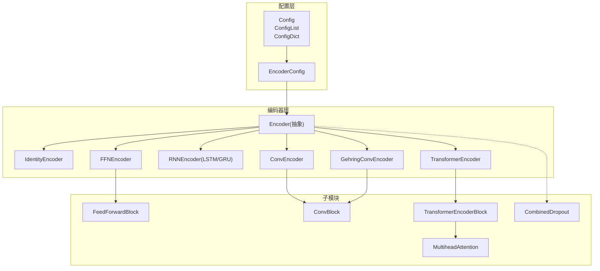
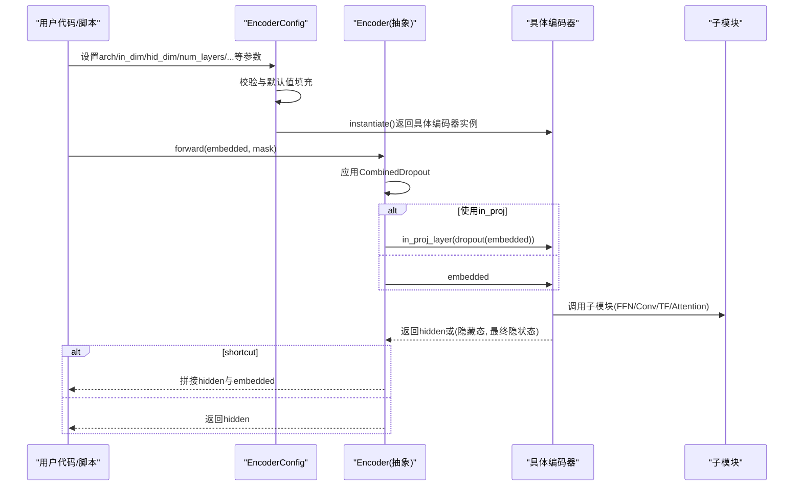
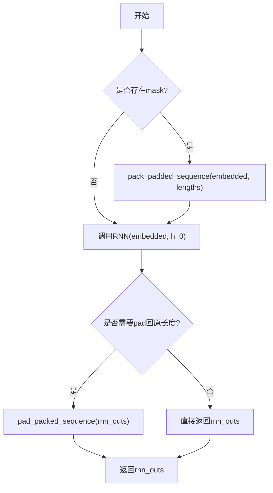
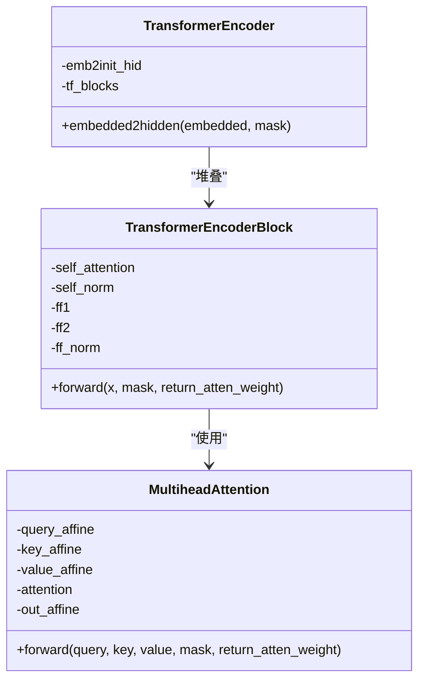
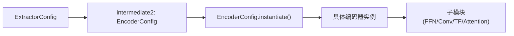

# 基础编码器

<cite>
**本文引用的文件列表**
- [eznlp/model/encoder.py](file://eznlp/model/encoder.py)
- [eznlp/nn/modules/block.py](file://eznlp/nn/modules/block.py)
- [eznlp/nn/modules/attention.py](file://eznlp/nn/modules/attention.py)
- [eznlp/nn/modules/dropout.py](file://eznlp/nn/modules/dropout.py)
- [eznlp/nn/init.py](file://eznlp/nn/init.py)
- [eznlp/config.py](file://eznlp/config.py)
- [eznlp/model/model/extractor.py](file://eznlp/model/model/extractor.py)
- [tests/model/test_sequence_tagging.py](file://tests/model/test_sequence_tagging.py)
- [scripts/text_classification.py](file://scripts/text_classification.py)
- [scripts/options/rnn2text.opt](file://scripts/options/rnn2text.opt)
- [scripts/options/tf2text.opt](file://scripts/options/tf2text.opt)
- [scripts/options/conv2text.opt](file://scripts/options/conv2text.opt)
</cite>

## 目录
1. [引言](#引言)
2. [项目结构与定位](#项目结构与定位)
3. [核心组件总览](#核心组件总览)
4. [架构概览](#架构概览)
5. [详细组件解析](#详细组件解析)
6. [依赖关系分析](#依赖关系分析)
7. [性能与优化要点](#性能与优化要点)
8. [故障排查指南](#故障排查指南)
9. [结论](#结论)
10. [附录：常见配置与用法示例](#附录常见配置与用法示例)

## 引言
本篇文档系统性阐述eznlp中“基础编码器”的实现机制，聚焦于EncoderConfig的多架构支持（LSTM、GRU、FFN、Conv、Gehring/Conv、Transformer），解释关键参数in_dim、hid_dim、num_layers、in_drop_rates、hid_drop_rate在不同架构中的作用与差异；剖析shortcut连接与in_proj投影层的设计动机；深入讲解RNNEncoder中pack_padded_sequence的使用场景与性能影响；并详解TransformerEncoder中多头注意力的实现细节与初始化策略。同时提供通过配置灵活构建不同编码器的实践路径与最佳实践建议。

## 项目结构与定位
- 编码器核心位于模型层，统一由EncoderConfig驱动，按架构类型实例化为具体编码器模块。
- 编码器模块复用通用子模块：FFN/Conv块、TransformerEncoderBlock、MultiheadAttention等。
- 配置体系采用Config基类与ConfigList/ConfigDict组合，确保可组合、可扩展、可序列化。
- 测试与脚本展示了多种架构的典型配置与使用方式。

图表来源
- [eznlp/model/encoder.py](file://eznlp/model/encoder.py#L14-L375)
- [eznlp/nn/modules/block.py](file://eznlp/nn/modules/block.py#L1-L263)
- [eznlp/nn/modules/attention.py](file://eznlp/nn/modules/attention.py#L235-L297)
- [eznlp/nn/modules/dropout.py](file://eznlp/nn/modules/dropout.py#L1-L91)
- [eznlp/config.py](file://eznlp/config.py#L20-L173)

章节来源
- [eznlp/model/encoder.py](file://eznlp/model/encoder.py#L14-L375)
- [eznlp/config.py](file://eznlp/config.py#L20-L173)

## 核心组件总览
- EncoderConfig：集中定义架构选择、维度与层数、丢弃率、投影与shortcut等配置项，并负责实例化对应编码器。
- Encoder：抽象基类，统一处理输入dropout、in_proj投影、shortcut拼接与forward流程。
- 各具体编码器：
  - FFNEncoder：堆叠FeedForwardBlock，首层与中间/末层丢弃率不同。
  - RNNEncoder：LSTM/GRU双向RNN，支持可训练初始隐状态，mask下使用pack_padded_sequence。
  - ConvEncoder：1D卷积堆叠，注意通道与步长的维度转换。
  - GehringConvEncoder：GLU卷积与残差缩放，适合长序列建模。
  - TransformerEncoder：堆叠TransformerEncoderBlock，支持可选嵌入到隐藏态的映射。
- 子模块：
  - FeedForwardBlock/ConvBlock：线性+激活+Dropout，ConvBlock支持GLU与padding裁剪。
  - TransformerEncoderBlock：自注意力+前馈网络+两处LayerNorm残差。
  - MultiheadAttention：Q/K/V仿射+多头注意力+输出仿射。
  - CombinedDropout：常规Dropout、Word Dropout、Locked Dropout三者组合。

章节来源
- [eznlp/model/encoder.py](file://eznlp/model/encoder.py#L14-L375)
- [eznlp/nn/modules/block.py](file://eznlp/nn/modules/block.py#L1-L263)
- [eznlp/nn/modules/attention.py](file://eznlp/nn/modules/attention.py#L235-L297)
- [eznlp/nn/modules/dropout.py](file://eznlp/nn/modules/dropout.py#L1-L91)

## 架构概览
以下序列图展示EncoderConfig到具体编码器的实例化与forward调用链路，以及各架构在forward中的差异化处理（如RNN的pack/unpack、Transformer的掩码传播）。

图表来源
- [eznlp/model/encoder.py](file://eznlp/model/encoder.py#L90-L121)
- [eznlp/nn/modules/dropout.py](file://eznlp/nn/modules/dropout.py#L1-L23)
- [eznlp/nn/modules/block.py](file://eznlp/nn/modules/block.py#L104-L151)
- [eznlp/nn/modules/attention.py](file://eznlp/nn/modules/attention.py#L235-L297)

## 详细组件解析

### 1) EncoderConfig：架构与参数体系
- 架构选择：支持"Identity"、"FFN"、"LSTM"、"GRU"、"Conv"、"Gehring"、"Transformer"。
- 关键参数：
  - in_dim：输入维度（嵌入维或上一层输出维）
  - hid_dim：隐藏维度（除Identity外，out_dim通常等于hid_dim）
  - num_layers：层数（对FFN/Conv/Gehring/Transformer为堆叠层数；对RNN为RNN层数）
  - in_drop_rates：三元组(p, word_p, locked_p)，分别对应常规Dropout、Word Dropout、Locked Dropout
  - hid_drop_rate：中间/隐藏态丢弃率（RNN dropout在多层时生效）
  - in_proj：是否在forward前对输入做线性投影
  - shortcut：是否将输入与输出拼接作为最终输出
  - 其他特定参数：
    - FFN：num_layers、in_drop_rates、hid_drop_rate
    - LSTM/GRU：train_init_hidden（可训练初始隐状态）、num_layers、in_drop_rates、hid_drop_rate
    - Conv/Gehring：kernel_size、scale（Gehring缩放因子）、num_layers、in_drop_rates、hid_drop_rate
    - Transformer：use_emb2init_hid（是否从嵌入映射到隐藏态）、num_heads、ff_dim、num_layers、in_drop_rates、hid_drop_rate
- 输出维度计算：Identity/out_dim=in_dim；其他架构/out_dim=hid_dim；若shortcut则加回in_dim。

章节来源
- [eznlp/model/encoder.py](file://eznlp/model/encoder.py#L15-L90)
- [eznlp/model/encoder.py](file://eznlp/model/encoder.py#L64-L74)

### 2) Encoder抽象基类：统一流程与设计原则
- 统一处理：
  - dropout：CombinedDropout按in_drop_rates组合应用
  - in_proj：可选线性层，用于维度适配或特征变换
  - shortcut：在forward末尾将hidden与embedded按通道拼接
- embedded2hidden：抽象方法，由各具体编码器实现
- forward：先dropout，再in_proj（如有），再调用embedded2hidden，最后根据shortcut决定输出

章节来源
- [eznlp/model/encoder.py](file://eznlp/model/encoder.py#L91-L121)

### 3) FFNEncoder：全连接堆叠
- 结构：ModuleList堆叠多个FeedForwardBlock，首层与中间/末层丢弃率不同
- 输入/输出：保持序列长度不变，仅改变通道维度
- 适用场景：轻量特征变换、作为简单非线性映射

章节来源
- [eznlp/model/encoder.py](file://eznlp/model/encoder.py#L133-L156)
- [eznlp/nn/modules/block.py](file://eznlp/nn/modules/block.py#L9-L25)

### 4) RNNEncoder：LSTM/GRU双向序列编码
- 参数要点：
  - bidirectional=True，hidden_size=hid_dim/2
  - 多层时才启用hid_drop_rate（单层不dropout）
  - train_init_hidden：可学习初始h_0/c_0（LSTM时同时有c_0）
- 掩码与pack/unpack：
  - mask存在时，先将embedded转为PackedSequence，再RNN，最后pad回原长度
  - 使用mask2seq_lens(mask)获取有效长度
- 性能与优化：
  - pack_padded_sequence减少无效计算，提升吞吐
  - 双向RNN输出维度为hid_dim（拼接前后向）

图表来源
- [eznlp/model/encoder.py](file://eznlp/model/encoder.py#L158-L251)

章节来源
- [eznlp/model/encoder.py](file://eznlp/model/encoder.py#L158-L251)
- [eznlp/nn/init.py](file://eznlp/nn/init.py#L114-L136)

### 5) ConvEncoder与GehringConvEncoder：卷积序列编码
- ConvEncoder：
  - 将(batch, step, in_dim)转为(batch, in_dim, step)，逐层1D卷积，再转回(batch, step, hid_dim)
  - 注意padding模式与裁剪策略，避免padding位置对输出产生敏感影响
- GehringConvEncoder：
  - 以GLU通道分裂的方式进行卷积，首层将embedded映射到双倍通道后经GLU分解
  - 残差+缩放：每层残差与scale缩放，有助于深层稳定训练
  - 支持use_emb2init_hid（与Transformer一致的初始化策略）

章节来源
- [eznlp/model/encoder.py](file://eznlp/model/encoder.py#L253-L327)
- [eznlp/nn/modules/block.py](file://eznlp/nn/modules/block.py#L27-L102)

### 6) TransformerEncoder：多头注意力堆叠
- 初始化策略：
  - use_emb2init_hid时，从嵌入映射到隐藏态并经ReLU；否则要求hid_dim==in_dim
  - 首层可选择不应用hid_drop_rate（当未使用emb映射时）
- 子模块：
  - TransformerEncoderBlock包含：
    - MultiheadAttention（Q/K/V仿射+多头注意力）
    - 前馈网络（ff1/ff2+激活）
    - 两处LayerNorm与残差
- 掩码传播：mask逐层传递给注意力与子模块，保证padding不影响注意力权重

图表来源
- [eznlp/model/encoder.py](file://eznlp/model/encoder.py#L328-L375)
- [eznlp/nn/modules/block.py](file://eznlp/nn/modules/block.py#L104-L151)
- [eznlp/nn/modules/attention.py](file://eznlp/nn/modules/attention.py#L235-L297)

章节来源
- [eznlp/model/encoder.py](file://eznlp/model/encoder.py#L328-L375)
- [eznlp/nn/modules/block.py](file://eznlp/nn/modules/block.py#L104-L151)
- [eznlp/nn/modules/attention.py](file://eznlp/nn/modules/attention.py#L235-L297)

### 7) 投影层与shortcut连接
- in_proj：
  - 在Encoder基类中，若配置in_proj=True，则在dropout之后对embedded做线性映射，再传入具体编码器
  - 适用于输入维度与hid_dim不一致或需要特征变换的场景
- shortcut：
  - 若开启shortcut，则在embedded2hidden返回后，将hidden与embedded按通道拼接
  - out_dim会额外加上in_dim，便于下游解码器利用原始特征

章节来源
- [eznlp/model/encoder.py](file://eznlp/model/encoder.py#L91-L121)
- [eznlp/model/encoder.py](file://eznlp/model/encoder.py#L64-L74)

### 8) 丢弃率与初始化策略
- in_drop_rates三元组：
  - p：常规Dropout
  - word_p：按词（序列步）整体置零的Dropout
  - locked_p：按通道锁定的Dropout，对同一维度在整段序列上一致失活
- 各架构初始化：
  - LSTM/GRU：重初始化门控偏置（遗忘门偏置置1），权重采用Xavier/He初始化
  - TransformerEncoderLayer：对norm/sigmoid/linear等参数采用不同初始化策略
  - 线性层/卷积层：依据非线性激活选择合适的初始化方式

章节来源
- [eznlp/nn/modules/dropout.py](file://eznlp/nn/modules/dropout.py#L1-L91)
- [eznlp/nn/init.py](file://eznlp/nn/init.py#L74-L136)
- [eznlp/nn/init.py](file://eznlp/nn/init.py#L98-L112)

## 依赖关系分析
- 配置层：
  - Config/ConfigList/ConfigDict提供统一的配置对象与实例化接口
  - ExtractorConfig将intermediate1/intermediate2等模块化装配，其中intermediate2默认为EncoderConfig(arch="LSTM")
- 编码器层：
  - EncoderConfig根据arch选择具体编码器类
  - 各编码器内部依赖子模块（FFN/Conv/TransformerBlock/MultiheadAttention）
- 训练与脚本：
  - 脚本通过命令行参数构造EncoderConfig并注入ExtractorConfig
  - 测试覆盖了多种架构与shortcut开关的组合

图表来源
- [eznlp/model/model/extractor.py](file://eznlp/model/model/extractor.py#L23-L70)
- [eznlp/model/encoder.py](file://eznlp/model/encoder.py#L76-L89)

章节来源
- [eznlp/model/model/extractor.py](file://eznlp/model/model/extractor.py#L23-L70)
- [eznlp/config.py](file://eznlp/config.py#L20-L173)

## 性能与优化要点
- RNN序列优化：
  - 使用pack_padded_sequence显著减少无效计算，尤其在batch内序列长度差异较大时收益明显
  - 双向RNN输出维度为hid_dim，注意下游维度匹配
- 卷积序列：
  - ConvEncoder需关注padding与裁剪策略，避免padding对卷积输出造成偏差
  - GehringConvEncoder的GLU与残差缩放有助于深层稳定训练
- Transformer：
  - 多头注意力的Q/K/V仿射与输出仿射可共享参数（取决于外部配置），注意内存占用
  - 掩码传播确保注意力不会关注padding位置
- 丢弃策略：
  - CombinedDropout的三类丢弃在不同场景下互补：常规Dropout抑制过拟合，Word Dropout增强鲁棒性，Locked Dropout稳定梯度

章节来源
- [eznlp/model/encoder.py](file://eznlp/model/encoder.py#L158-L251)
- [eznlp/nn/modules/block.py](file://eznlp/nn/modules/block.py#L27-L102)
- [eznlp/nn/modules/attention.py](file://eznlp/nn/modules/attention.py#L235-L297)
- [eznlp/nn/modules/dropout.py](file://eznlp/nn/modules/dropout.py#L1-L91)

## 故障排查指南
- 常见问题与定位：
  - out_dim不匹配：检查EncoderConfig的arch与shortcut设置，确认下游解码器in_dim是否与编码器out_dim一致
  - RNN报错长度不一致：确认mask与embedded形状一致，且mask2seq_lens计算正确
  - Transformer维度不匹配：若use_emb2init_hid=False，需确保hid_dim==in_dim
  - 初始化异常：检查LSTM/GRU/TransformerEncoderLayer的参数名是否符合预期
- 快速验证：
  - 使用测试用例覆盖多架构与shortcut组合，观察forward输出形状与loss是否正常
  - 在脚本中打印EncoderConfig的name与out_dim，核对配置是否按预期生效

章节来源
- [tests/model/test_sequence_tagging.py](file://tests/model/test_sequence_tagging.py#L60-L120)
- [eznlp/model/encoder.py](file://eznlp/model/encoder.py#L64-L74)
- [eznlp/nn/init.py](file://eznlp/nn/init.py#L114-L136)

## 结论
eznlp的基础编码器以EncoderConfig为核心，围绕统一的forward流程与子模块化设计，实现了对LSTM/GRU、FFN、Conv、Gehring、Transformer等多种架构的灵活支持。通过in_dim/hid_dim/num_layers等参数与in_drop_rates/hid_drop_rate的差异化配置，结合in_proj与shortcut连接，既保证了表达能力，也兼顾了工程可用性。RNNEncoder的pack_padded_sequence与TransformerEncoder的多头注意力实现体现了对序列长度变化与全局依赖建模的针对性优化。

## 附录：常见配置与用法示例
- 通过命令行参数构建EncoderConfig并注入ExtractorConfig：
  - RNN文本分类：参考脚本与选项文件，设置enc_arch、hid_dim、num_layers、in_drop_rates等
  - Transformer文本分类：设置enc_arch=Transformer、num_heads、ff_dim等
  - Conv/Gehring文本分类：设置enc_arch=Conv/Gehring、kernel_size、num_layers等
- 在测试中批量验证不同架构与shortcut组合：
  - 测试用例覆盖FFN/Conv/Gehring/LSTM/GRU/Transformer与shortcut开关
- 在ExtractorConfig中指定intermediate2为EncoderConfig，默认使用LSTM架构

章节来源
- [scripts/text_classification.py](file://scripts/text_classification.py#L94-L137)
- [scripts/options/rnn2text.opt](file://scripts/options/rnn2text.opt#L1-L15)
- [scripts/options/tf2text.opt](file://scripts/options/tf2text.opt#L1-L29)
- [scripts/options/conv2text.opt](file://scripts/options/conv2text.opt#L1-L23)
- [tests/model/test_sequence_tagging.py](file://tests/model/test_sequence_tagging.py#L60-L120)
- [eznlp/model/model/extractor.py](file://eznlp/model/model/extractor.py#L23-L70)