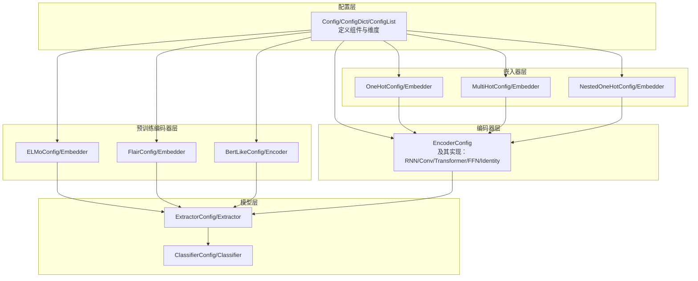
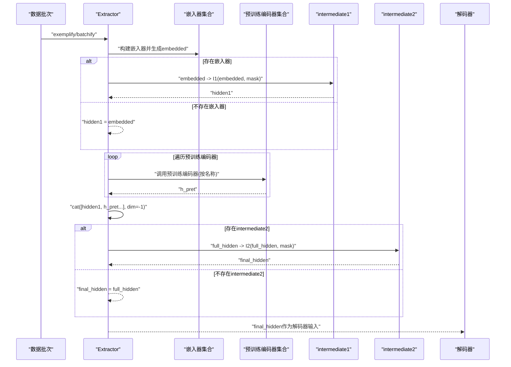
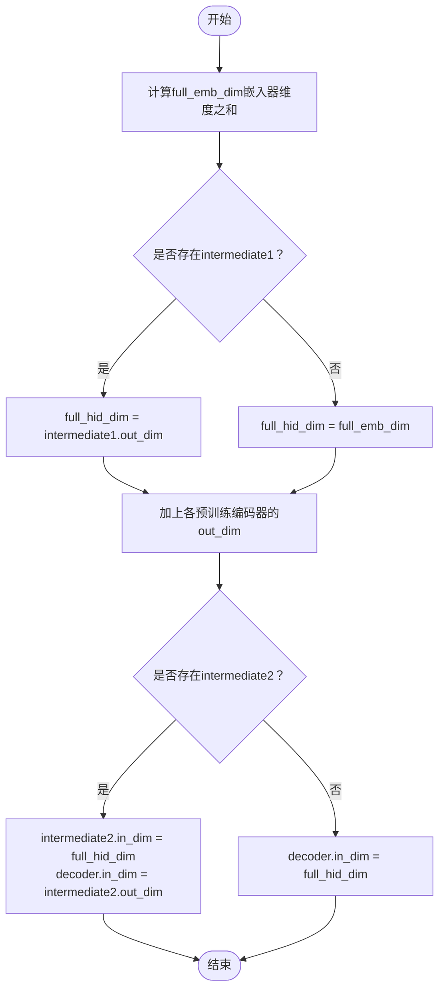
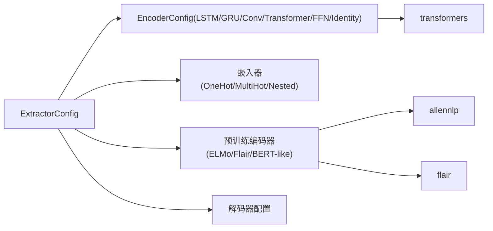
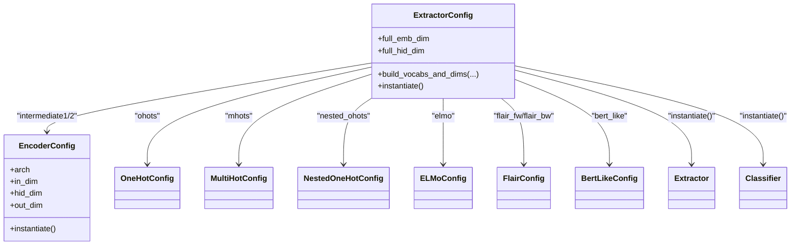

# 编码器集成

<cite>
**本文引用的文件**
- [eznlp/model/model/extractor.py](file://eznlp/model/model/extractor.py)
- [eznlp/model/encoder.py](file://eznlp/model/encoder.py)
- [eznlp/model/embedder.py](file://eznlp/model/embedder.py)
- [eznlp/model/elmo.py](file://eznlp/model/elmo.py)
- [eznlp/model/flair.py](file://eznlp/model/flair.py)
- [eznlp/model/masked_span_bert_like.py](file://eznlp/model/masked_span_bert_like.py)
- [eznlp/model/span_bert_like.py](file://eznlp/model/span_bert_like.py)
- [eznlp/model/nested_embedder.py](file://eznlp/model/nested_embedder.py)
- [eznlp/config.py](file://eznlp/config.py)
- [tests/model/test_joint_extraction.py](file://tests/model/test_joint_extraction.py)
- [scripts/text_classification.py](file://scripts/text_classification.py)
</cite>

## 目录
1. [引言](#引言)
2. [项目结构](#项目结构)
3. [核心组件](#核心组件)
4. [架构总览](#架构总览)
5. [详细组件分析](#详细组件分析)
6. [依赖分析](#依赖分析)
7. [性能考虑](#性能考虑)
8. [故障排查指南](#故障排查指南)
9. [结论](#结论)
10. [附录](#附录)

## 引言
本文件系统性阐述eznlp中“提取器”（Extractor）的编码器集成架构，重点解析以下方面：
- intermediate1、intermediate2与预训练编码器（ELMo、BERT-like、Flair）的协同工作机制
- ExtractorConfig中full_hid_dim属性如何计算中间编码器的输入维度
- intermediate1与intermediate2的级联设计模式
- 预训练编码器（以BERT为例）的配置要点：output_hidden_states要求与from_tokenized的处理逻辑
- 如何通过配置灵活替换不同架构的编码器（如LSTM与Transformer）
- pretrained_parameters方法如何正确识别和管理预训练模型的可训练参数
- 编码器输出如何作为解码器的输入进行特征传递

## 项目结构
eznlp采用“配置驱动”的模块化设计，核心由以下层次构成：
- 配置层：Config/ConfigDict/ConfigList等，负责声明式地定义组件及其维度
- 组件层：嵌入器（OneHot/MultiHot/Nested）、编码器（RNN/Conv/Transformer/FFN/Identity）、预训练编码器（ELMo/Flair/BERT-like）
- 模型层：Extractor/Classifier/JointExtractor等，负责数据流编排与维度衔接

图表来源
- [eznlp/config.py](file://eznlp/config.py#L1-L173)
- [eznlp/model/embedder.py](file://eznlp/model/embedder.py#L1-L248)
- [eznlp/model/encoder.py](file://eznlp/model/encoder.py#L1-L375)
- [eznlp/model/elmo.py](file://eznlp/model/elmo.py#L1-L108)
- [eznlp/model/flair.py](file://eznlp/model/flair.py#L1-L130)
- [eznlp/model/masked_span_bert_like.py](file://eznlp/model/masked_span_bert_like.py#L1-L236)
- [eznlp/model/span_bert_like.py](file://eznlp/model/span_bert_like.py#L1-L181)
- [eznlp/model/model/extractor.py](file://eznlp/model/model/extractor.py#L1-L274)

章节来源
- [eznlp/config.py](file://eznlp/config.py#L1-L173)
- [eznlp/model/embedder.py](file://eznlp/model/embedder.py#L1-L248)
- [eznlp/model/encoder.py](file://eznlp/model/encoder.py#L1-L375)
- [eznlp/model/elmo.py](file://eznlp/model/elmo.py#L1-L108)
- [eznlp/model/flair.py](file://eznlp/model/flair.py#L1-L130)
- [eznlp/model/masked_span_bert_like.py](file://eznlp/model/masked_span_bert_like.py#L1-L236)
- [eznlp/model/span_bert_like.py](file://eznlp/model/span_bert_like.py#L1-L181)
- [eznlp/model/model/extractor.py](file://eznlp/model/model/extractor.py#L1-L274)

## 核心组件
- ExtractorConfig：统一管理嵌入器、中间编码器、预训练编码器与解码器，并负责维度推导与实例化
- EncoderConfig：统一定义RNN/Conv/Transformer/FFN/Identity等编码器架构与超参
- 预训练编码器：ELMo、Flair、BERT-like（含SpanBERT-like变体）
- 嵌入器：OneHot/MultiHot/Nested（支持在通道内再套用编码器）

章节来源
- [eznlp/model/model/extractor.py](file://eznlp/model/model/extractor.py#L23-L146)
- [eznlp/model/encoder.py](file://eznlp/model/encoder.py#L15-L90)
- [eznlp/model/embedder.py](file://eznlp/model/embedder.py#L51-L248)
- [eznlp/model/elmo.py](file://eznlp/model/elmo.py#L10-L108)
- [eznlp/model/flair.py](file://eznlp/model/flair.py#L11-L130)
- [eznlp/model/masked_span_bert_like.py](file://eznlp/model/masked_span_bert_like.py#L13-L54)
- [eznlp/model/span_bert_like.py](file://eznlp/model/span_bert_like.py#L13-L55)

## 架构总览
ExtractorConfig将多源特征（嵌入器输出、预训练编码器输出）拼接为“全隐藏表示”，随后经由intermediate2进一步编码，最终作为解码器输入。其核心流程如下：

图表来源
- [eznlp/model/model/extractor.py](file://eznlp/model/model/extractor.py#L211-L274)

章节来源
- [eznlp/model/model/extractor.py](file://eznlp/model/model/extractor.py#L211-L274)

## 详细组件分析

### ExtractorConfig与维度计算（full_hid_dim）
- full_emb_dim：来自嵌入器（OneHot/MultiHot/Nested）的输出维度之和
- full_hid_dim：若存在intermediate1，则取其out_dim；否则取full_emb_dim；再累加所有预训练编码器的out_dim
- build_vocabs_and_dims：
  - 若存在intermediate1：设置其in_dim = full_emb_dim
  - 若存在intermediate2：设置其in_dim = full_hid_dim，并设置decoder.in_dim = intermediate2.out_dim
  - 否则：decoder.in_dim = full_hid_dim

图表来源
- [eznlp/model/model/extractor.py](file://eznlp/model/model/extractor.py#L98-L146)

章节来源
- [eznlp/model/model/extractor.py](file://eznlp/model/model/extractor.py#L98-L146)

### intermediate1与intermediate2的级联设计
- intermediate1：对嵌入器输出进行一次编码，作为后续融合的中间表示
- intermediate2：对“嵌入器+预训练编码器”的拼接结果进行二次编码，或直接作为解码器输入
- 支持shortcut与in_proj等增强能力，提升特征表达能力

章节来源
- [eznlp/model/encoder.py](file://eznlp/model/encoder.py#L91-L121)
- [eznlp/model/encoder.py](file://eznlp/model/encoder.py#L158-L252)
- [eznlp/model/encoder.py](file://eznlp/model/encoder.py#L254-L326)
- [eznlp/model/encoder.py](file://eznlp/model/encoder.py#L329-L375)
- [eznlp/model/model/extractor.py](file://eznlp/model/model/extractor.py#L138-L146)

### 预训练编码器（ELMo、Flair、BERT-like）
- ELMoConfig/Embedder：基于字符级CNN-LSTM的上下文表征，支持冻结与混合层权重
- FlairConfig/Embedder：双向语言模型，支持聚合策略（如last）与可选缩放因子
- BertLikeConfig/Encoder：基于transformers库的预训练模型，支持冻结与共享权重

章节来源
- [eznlp/model/elmo.py](file://eznlp/model/elmo.py#L10-L108)
- [eznlp/model/flair.py](file://eznlp/model/flair.py#L11-L130)
- [eznlp/model/masked_span_bert_like.py](file://eznlp/model/masked_span_bert_like.py#L13-L54)
- [eznlp/model/span_bert_like.py](file://eznlp/model/span_bert_like.py#L13-L55)

### BERT-like配置要点：output_hidden_states与from_tokenized
- output_hidden_states：用于SpanBertLike/MaskedSpanBertLike等需要多层隐藏状态的任务
- from_tokenized：当预训练模型未从原始文本分词时，ExtractorConfig会校验并重写mask/seq_lens，确保下游一致

章节来源
- [eznlp/model/model/extractor.py](file://eznlp/model/model/extractor.py#L92-L96)
- [eznlp/model/model/extractor.py](file://eznlp/model/model/extractor.py#L172-L178)
- [tests/model/test_joint_extraction.py](file://tests/model/test_joint_extraction.py#L108-L169)

### 如何通过配置灵活替换编码器架构（LSTM vs Transformer）
- 在ExtractorConfig中设置intermediate1/intermediate2的arch即可切换
- 示例脚本展示了如何在命令行参数中选择RNN/Transformer等架构，并自动设置in_proj等

章节来源
- [eznlp/model/encoder.py](file://eznlp/model/encoder.py#L15-L90)
- [scripts/text_classification.py](file://scripts/text_classification.py#L94-L137)

### pretrained_parameters方法：识别与管理预训练参数
- 提供统一接口，返回ELMo、BERT-like、Flair（前向/后向）的可训练参数集合
- 便于优化器仅更新需要微调的部分

章节来源
- [eznlp/model/model/extractor.py](file://eznlp/model/model/extractor.py#L256-L271)

### 编码器输出到解码器的特征传递
- Extractor.forward2states返回“full_hidden”，即最终编码后的特征
- 解码器根据decoder.in_dim接收该特征，完成下游任务（序列标注、关系抽取等）

章节来源
- [eznlp/model/model/extractor.py](file://eznlp/model/model/extractor.py#L272-L274)

## 依赖分析
- 组件耦合与内聚
  - ExtractorConfig将嵌入器、预训练编码器、中间编码器与解码器解耦，通过ConfigDict/ConfigList统一管理
  - EncoderConfig提供统一的架构与维度接口，便于在不同场景间切换
- 外部依赖
  - transformers（BERT-like）
  - allennlp（ELMo）
  - flair（Flair LM）
- 潜在循环依赖
  - 通过Config层抽象避免直接循环引用，实际依赖在forward阶段按需调用

图表来源
- [eznlp/model/model/extractor.py](file://eznlp/model/model/extractor.py#L23-L91)
- [eznlp/model/encoder.py](file://eznlp/model/encoder.py#L15-L90)
- [eznlp/model/elmo.py](file://eznlp/model/elmo.py#L10-L44)
- [eznlp/model/flair.py](file://eznlp/model/flair.py#L11-L41)
- [eznlp/model/masked_span_bert_like.py](file://eznlp/model/masked_span_bert_like.py#L13-L20)

章节来源
- [eznlp/model/model/extractor.py](file://eznlp/model/model/extractor.py#L23-L91)
- [eznlp/model/encoder.py](file://eznlp/model/encoder.py#L15-L90)
- [eznlp/model/elmo.py](file://eznlp/model/elmo.py#L10-L44)
- [eznlp/model/flair.py](file://eznlp/model/flair.py#L11-L41)
- [eznlp/model/masked_span_bert_like.py](file://eznlp/model/masked_span_bert_like.py#L13-L20)

## 性能考虑
- 计算开销
  - RNN/Conv/Transformer在长序列上计算复杂度较高，建议合理设置num_layers与hid_dim
  - BERT-like在output_hidden_states开启时会增加显存占用
- 内存与显存
  - ELMo/Flair通常较轻量，但需注意批量大小与padding策略
  - 使用in_proj/shortcut等可减少额外投影层带来的开销
- 训练稳定性
  - 冻结预训练参数可稳定初始梯度，微调时逐步解冻
  - 注意mask/seq_lens一致性，避免跨组件不匹配导致的NaN

## 故障排查指南
- 预训练模型未从原始文本分词
  - 现象：from_tokenized为False且存在嵌入器/嵌入器维度非零
  - 处理：ExtractorConfig会强制校验，必要时重写mask/seq_lens
  章节来源
  - [eznlp/model/model/extractor.py](file://eznlp/model/model/extractor.py#L92-L96)
  - [eznlp/model/model/extractor.py](file://eznlp/model/model/extractor.py#L172-L178)
- BERT-like未开启output_hidden_states
  - 现象：SpanBertLike/MaskedSpanBertLike需要多层隐藏状态
  - 处理：在配置中启用output_hidden_states
  章节来源
  - [tests/model/test_joint_extraction.py](file://tests/model/test_joint_extraction.py#L136-L200)
- 维度不匹配
  - 现象：intermediate1/intermediate2/in_dim/out_dim不一致
  - 处理：检查ExtractorConfig.build_vocabs_and_dims的调用顺序与嵌入器/预训练编码器out_dim
  章节来源
  - [eznlp/model/model/extractor.py](file://eznlp/model/model/extractor.py#L138-L146)
- 预训练参数未被优化器识别
  - 现象：微调失败或无梯度
  - 处理：确认pretrained_parameters返回集合包含对应模块参数
  章节来源
  - [eznlp/model/model/extractor.py](file://eznlp/model/model/extractor.py#L256-L271)

## 结论
eznlp的Extractor通过“嵌入器+预训练编码器+两级中间编码器”的流水线式设计，实现了多源特征的统一建模与灵活替换。ExtractorConfig以full_hid_dim为核心枢纽，串联起嵌入器、预训练编码器与解码器；同时通过Config体系与模块化实现，支持在LSTM/GRU/Conv/Transformer等架构之间快速切换，并对BERT-like的output_hidden_states与from_tokenized进行了严格约束，确保下游任务的稳定性与一致性。

## 附录
- 配置示例路径
  - [tests/model/test_joint_extraction.py](file://tests/model/test_joint_extraction.py#L108-L169)：展示BERT-like与SpanBertLike组合使用
  - [scripts/text_classification.py](file://scripts/text_classification.py#L94-L137)：展示如何在脚本中动态选择编码器架构与预训练编码器
- 关键类关系图

图表来源
- [eznlp/model/model/extractor.py](file://eznlp/model/model/extractor.py#L23-L91)
- [eznlp/model/encoder.py](file://eznlp/model/encoder.py#L15-L90)
- [eznlp/model/embedder.py](file://eznlp/model/embedder.py#L51-L248)
- [eznlp/model/elmo.py](file://eznlp/model/elmo.py#L10-L44)
- [eznlp/model/flair.py](file://eznlp/model/flair.py#L11-L41)
- [eznlp/model/masked_span_bert_like.py](file://eznlp/model/masked_span_bert_like.py#L13-L20)
- [eznlp/model/span_bert_like.py](file://eznlp/model/span_bert_like.py#L13-L20)