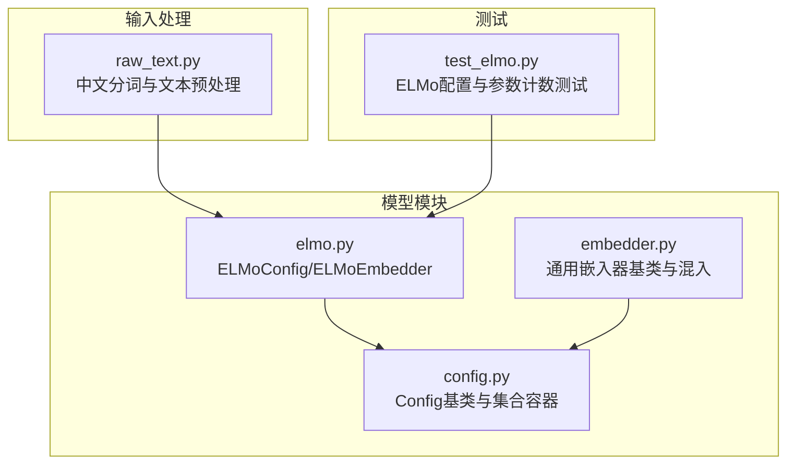
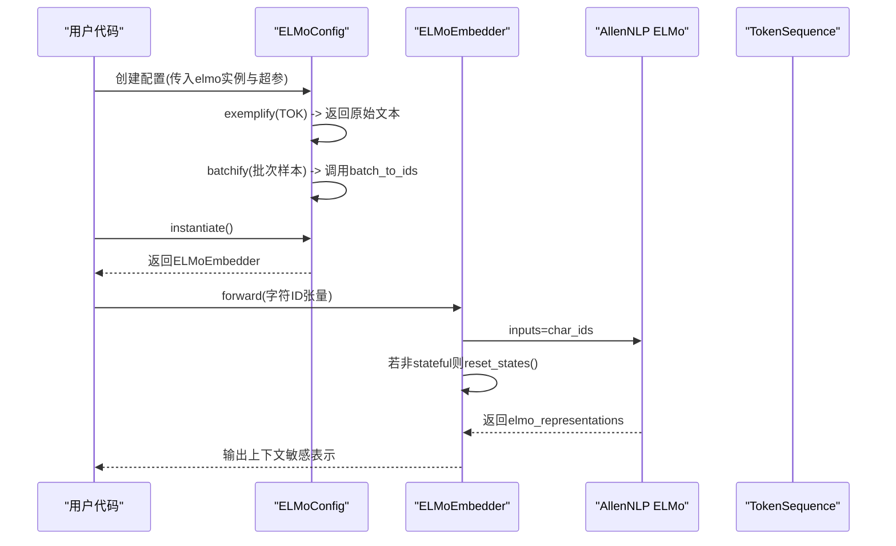
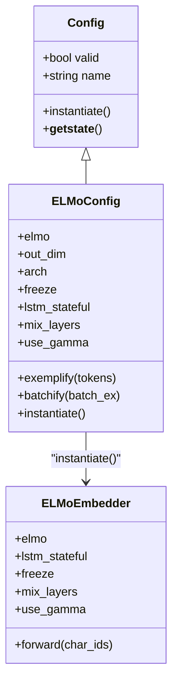
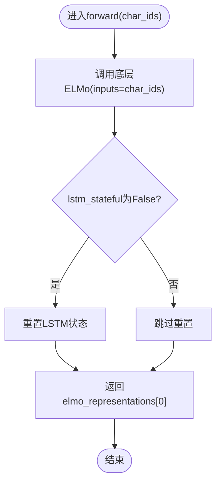

# ELMo编码器

<cite>
**本文引用的文件列表**
- [elmo.py](file://eznlp/model/elmo.py)
- [embedder.py](file://eznlp/model/embedder.py)
- [test_elmo.py](file://tests/model/test_elmo.py)
- [config.py](file://eznlp/config.py)
- [raw_text.py](file://eznlp/io/raw_text.py)
</cite>

## 目录
1. [简介](#简介)
2. [项目结构](#项目结构)
3. [核心组件](#核心组件)
4. [架构总览](#架构总览)
5. [组件详解](#组件详解)
6. [依赖关系分析](#依赖关系分析)
7. [性能与实践建议](#性能与实践建议)
8. [故障排查](#故障排查)
9. [结论](#结论)
10. [附录](#附录)

## 简介
本文件围绕ELMo编码器在eznlp中的集成方案进行系统化说明，重点解析以下关键点：
- lstm_stateful参数对序列建模一致性的影响
- mix_layers（trainable、top）在层混合策略中的选择依据
- use_gamma参数在缩放输出表示中的作用
- batch_to_ids函数在字符ID批量转换中的实现细节
- forward方法中重置LSTM状态的时机与必要性
- 结合中文分词场景，给出配置ELMo编码器以获得上下文敏感词向量表示的实操建议

## 项目结构
ELMo相关的核心代码位于模型模块中，采用“配置类 + 可实例化嵌入器”的设计模式，配合通用的Config基类完成参数校验、序列化与批处理等通用能力。

图表来源
- [elmo.py](file://eznlp/model/elmo.py#L1-L107)
- [embedder.py](file://eznlp/model/embedder.py#L1-L248)
- [config.py](file://eznlp/config.py#L1-L173)
- [raw_text.py](file://eznlp/io/raw_text.py#L44-L74)
- [test_elmo.py](file://tests/model/test_elmo.py#L1-L39)

章节来源
- [elmo.py](file://eznlp/model/elmo.py#L1-L107)
- [config.py](file://eznlp/config.py#L1-L173)

## 核心组件
- ELMoConfig：负责接收外部预训练ELMo实例，注册超参（freeze、lstm_stateful、mix_layers、use_gamma），并提供exemplify/batchify/instantiate等数据处理与实例化接口。
- ELMoEmbedder：封装AllenNLP的ELMo模型，设置状态一致性、层混合权重可训练性与缩放系数可训练性，并在前向传播时按需重置LSTM状态。

章节来源
- [elmo.py](file://eznlp/model/elmo.py#L10-L44)
- [elmo.py](file://eznlp/model/elmo.py#L46-L107)

## 架构总览
ELMo在eznlp中的集成遵循“配置驱动 + 模块化嵌入器”的思路：上层模型通过ELMoConfig定义参数，ELMoEmbedder在构造时读取这些参数并对底层ELMo进行细粒度控制；数据侧由Config的exemplify/batchify负责从TokenSequence到字符ID张量的转换。

图表来源
- [elmo.py](file://eznlp/model/elmo.py#L33-L41)
- [elmo.py](file://eznlp/model/elmo.py#L99-L107)

## 组件详解

### ELMoConfig：参数注册与批处理
- 参数要点
  - freeze：控制是否冻结底层ELMo的字符级LSTM子模块梯度
  - lstm_stateful：控制是否保留LSTM隐藏状态，影响序列建模一致性
  - mix_layers：层混合策略，支持trainable与top两种模式
  - use_gamma：控制缩放系数gamma是否参与训练
- 数据处理
  - exemplify：从TokenSequence提取原始文本字段
  - batchify：调用AllenNLP的batch_to_ids将一批原始文本转为字符ID张量

章节来源
- [elmo.py](file://eznlp/model/elmo.py#L10-L44)
- [elmo.py](file://eznlp/model/elmo.py#L33-L41)

### ELMoEmbedder：状态管理与层混合
- 状态一致性
  - 在构造阶段将底层ELMo的双向LSTM设置为stateful或非stateful
  - 在forward中，若非stateful，则在每次前向计算后重置LSTM状态，确保不同批次或独立片段的表示一致
- 层混合策略
  - trainable：允许学习各层混合权重（scalar_mix_0的scalar_parameters可训练）
  - top：固定仅使用顶层表示，其他层权重置极小值
- 缩放系数
  - use_gamma=True时，允许训练缩放系数gamma；否则冻结gamma
- 冻结策略
  - freeze=True时，冻结ELMo的字符级LSTM子模块；freeze=False时允许其参与反向传播

章节来源
- [elmo.py](file://eznlp/model/elmo.py#L46-L107)

### batch_to_ids：字符ID批量转换
- 实现细节
  - 由ELMoConfig的batchify调用AllenNLP的elmo.batch_to_ids，将一批原始文本（字符串列表）转换为字符级ID张量
  - 该函数负责字符切分、字典映射与形状规整，返回可用于ELMo前向的inputs
- 与中文分词的关系
  - 中文分词通常在上游数据管线中完成，ELMoConfig期望接收“已分词”的原始文本序列
  - 若上游未做分词，可在exemplify阶段先进行分词（例如jieba），再交给batch_to_ids

章节来源
- [elmo.py](file://eznlp/model/elmo.py#L33-L41)
- [raw_text.py](file://eznlp/io/raw_text.py#L44-L74)

### forward：重置LSTM状态的时机与必要性
- 时机
  - 每次前向计算结束后，若lstm_stateful为False，则调用reset_states重置LSTM内部状态
- 必要性
  - 非stateful模式下，LSTM会携带上一次序列的状态，导致相同输入在不同批次或不同时间调用时产生不一致的表示
  - 通过重置状态，可保证相同输入在任何上下文中得到一致的ELMo表示，便于下游任务稳定训练

章节来源
- [elmo.py](file://eznlp/model/elmo.py#L99-L107)

### mix_layers选择依据与use_gamma作用
- mix_layers
  - trainable：适合需要自适应融合多层表示的任务，能学习到更优的层组合权重
  - top：当任务对高层语义更敏感且希望减少训练负担时，可固定仅使用顶层表示
- use_gamma
  - 控制输出表示的缩放因子是否可训练
  - 在某些任务中，固定缩放可提升稳定性；在需要精细调节尺度时可开启训练

章节来源
- [elmo.py](file://eznlp/model/elmo.py#L78-L89)

### 中文分词场景下的ELMo配置建议
- 分词前置
  - 使用中文分词器（如jieba）在exemplify阶段对原始文本进行分词，确保ELMo输入为合理的词序列
- 字符ID生成
  - 将分词后的文本交由ELMoConfig的batchify，内部调用batch_to_ids生成字符ID张量
- 状态一致性
  - 若追求跨批次/跨片段的一致性，建议将lstm_stateful设为False，并依赖forward中的状态重置
- 层混合与缩放
  - 初期可尝试trainable以让模型自适应层权重；若发现不稳定或过拟合，可切换至top并冻结其他层权重
  - use_gamma可根据下游任务的尺度需求决定是否训练

章节来源
- [raw_text.py](file://eznlp/io/raw_text.py#L44-L74)
- [elmo.py](file://eznlp/model/elmo.py#L33-L41)
- [elmo.py](file://eznlp/model/elmo.py#L78-L89)

## 依赖关系分析
ELMoConfig与ELMoEmbedder均继承自通用Config基类，具备统一的参数校验、序列化与批处理接口；ELMoEmbedder依赖底层ELMo实例，通过属性设置与requires_grad控制实现灵活的训练策略。

图表来源
- [config.py](file://eznlp/config.py#L20-L73)
- [elmo.py](file://eznlp/model/elmo.py#L10-L44)
- [elmo.py](file://eznlp/model/elmo.py#L46-L107)

章节来源
- [config.py](file://eznlp/config.py#L20-L73)
- [elmo.py](file://eznlp/model/elmo.py#L10-L107)

## 性能与实践建议
- 训练开销
  - freeze=True可显著降低训练开销，适合资源受限场景
  - mix_layers=trainable会引入额外可训练参数，注意监控参数数量与显存占用
- 稳定性
  - use_gamma=False有助于稳定输出尺度，避免训练初期的剧烈波动
  - lstm_stateful=False可消除跨批次状态漂移，提高实验可重复性
- 中文分词
  - 建议在exemplify阶段完成分词，确保batch_to_ids输入的文本粒度合理
  - 对长文本可考虑分段处理，避免单次输入过长导致内存压力

[本节为通用建议，不直接分析具体文件]

## 故障排查
- 表示不一致
  - 症状：相同输入在不同批次得到不同ELMo表示
  - 排查：确认lstm_stateful=False并在forward中触发reset_states
- 层混合异常
  - 症状：mix_layers=top但其他层权重仍被更新
  - 排查：检查构造阶段对scalar_parameters的requires_grad设置与数据填充逻辑
- 缩放不稳定
  - 症状：use_gamma=True时输出尺度波动大
  - 排查：尝试use_gamma=False，或在优化器中设置合适的权重衰减
- 参数计数不符
  - 症状：训练参数数量与预期不一致
  - 排查：参考测试用例中的参数计数逻辑，核对freeze、mix_layers、use_gamma三者的开关

章节来源
- [test_elmo.py](file://tests/model/test_elmo.py#L11-L31)
- [elmo.py](file://eznlp/model/elmo.py#L78-L89)
- [elmo.py](file://eznlp/model/elmo.py#L99-L107)

## 结论
ELMo在eznlp中的集成通过ELMoConfig与ELMoEmbedder实现了参数化、可复用与可控的上下文敏感词向量生成。通过合理设置lstm_stateful、mix_layers与use_gamma，可以在一致性、灵活性与稳定性之间取得平衡；结合中文分词的前置处理，可为下游序列标注与抽取任务提供高质量的输入表示。

[本节为总结性内容，不直接分析具体文件]

## 附录

### 关键流程图：ELMo前向与状态重置

图表来源
- [elmo.py](file://eznlp/model/elmo.py#L99-L107)